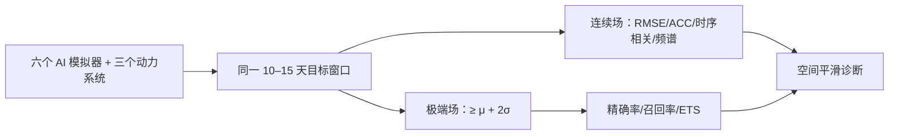

# 10–15 天极端高温评测：为什么低 RMSE 不等于有效预警

> Cas Decancq、Thomas Mortier、Jessica Keune、Diego G. Miralles，*Weather Emulators at the Frontier of Heat Extremes Predictability*，[arXiv:2607.28220v1，2026-07-30](https://arxiv.org/html/2607.28220v1)；[63 页全文/补充材料 PDF](https://arxiv.org/pdf/2607.28220v1)。本篇是**多模型评测研究**，不是发布新预报器；2026-09-25 复核补充 Tables S2–S9 与 Figures S1–S21。

## 研究设计与科学问题

作者把 Pangu-Weather、FuXi、ArchesWeather、AIFS、GraphCast、Aurora 六个确定性 AI 天气模拟器，与 ECMWF-IFS、NCEP、CMA 等动力系统及气候态/持续性基线并列，询问 **10–15 天**时能否有效预测全球近地面高温，尤其是灾害高温。极端阈值为当地 ERA5 1990–2019 气候平均加 **2 个标准差**；论文同时统计全球格点、六个实际热事件区域、连续 T2m 误差和二分类检测。作者明确指出，这些模拟器多数是确定性场；研究不能替代集合概率预报的可靠性评估。[原文引言、方法与图 1–4](https://arxiv.org/html/2607.28220)

图按论文问题设置重绘。ERA5 作为 AI 模型验证基准，动力模式常以各自 0h 分析作为真值，因此跨体系的**真值不完全同源**；异常气候态又统一来自 ERA5。这一设计是阅读排名前必须注意的比较口径。[原文结果 2.1](https://arxiv.org/html/2607.28220)

### 数据对齐、模型版本与样本数

这是一篇**固定公开权重的再评测**，没有训练新天气模型，也没有在高温样本上微调任何被测网络，因此不能为本文杜撰学习率、优化器或微调阶段。六个 AI 模拟器的大多数公开版本以 ERA5 训练；Aurora 是异构资料预训练，但在此采用 ERA5 输入配置。作者称所选版本没有用 2020 年以后资料训练，所研究近年事件对它们是年份外样本；这只保证原模型**训练年份外**，并未消除近年资料与 ERA5/业务系统分布差异。[方法 §4.2](https://arxiv.org/html/2607.28220v1)

补充 Table S3 列出本次**实际调用的版本、用户准备的输入字段数和预测步长**，不能把其他仓库版本的技巧自动归给这些模型。表中“损失”是作者对**已有权重原训练目标**的概括，不是 Decancq 等在本文执行的新训练；若研究底座的优化器、epoch、微调，应再查各自原论文与配置。[全文 PDF 补充 Table S3](https://arxiv.org/pdf/2607.28220v1)

| 被测公开版本 | 输入字段/状态 | 原生滚动步长与网格 | 补充表列出的原训练目标 |
|---|---|---|---|
| Pangu-Weather v1.0 | 69 字段、单时刻 `t` | 24/12/6 h 组合；0.25° | 纬度加权 MSE |
| FuXi demo（三阶段） | 69 字段，`t−6h,t` | 6 h；0.25° | 纬度加权 MAE |
| ArchesWeather-M×4 v1.0 | 72 字段，`t−24h,t`；四个随机种子微集合 | 24 h；1.5° | 纬度加权 MSE |
| AIFS Single v0.2.1 | 90 字段，`t−6h,t` | 6 h；0.25° | 纬度加权 MSE |
| GraphCast v0.1.1 | 229 字段，`t−6h,t` | 6 h；0.25° | 纬度加权 MSE |
| Aurora v1.7.0 | 72 字段，`t−6h,t`；本评测用 ERA5 输入 | 6 h；0.25° | 纬度加权 MSE |

这些字段数是使用者要准备的输入变量数，不包含推理时内部可能生成的特征。ArchesWeather 的四个随机种子模型虽然原称 microensemble，本研究仍以其确定性输出参与评测，**不是**在这里进行了高温事件概率校准；其他被测者同样是确定性预报。FuXi 的三阶段分别负责 0–5、5–10、10–15 天，因而第 10→11 天的频谱跳变有明确架构切换背景。[正文 §2.2](https://arxiv.org/html/2607.28220v1)；[补充 Table S3](https://arxiv.org/pdf/2607.28220v1)

| 组别 | 网格与时间步长 | 本次评测的初值/验证资料 |
|---|---|---|
| Pangu、FuXi、AIFS、GraphCast、Aurora | 0.25°、6 小时 | 每日 00/06/12/18 UTC 初值；每个事件逐 lead 对齐；全部共 392 个 AI 预报序列 |
| ArchesWeather | 1.5°、24 小时 | ERA5 插到模型网格后核验；分辨率较粗，极端面积不应与 0.25° 直接等价 |
| IFS 49r1、CMA GRAPES | TIGGE 提供 0.5°、6 小时 | 只在 00/12 UTC 起报，故 196 条预报序列；各自有效时刻的 0h 分析作参照 |
| NCEP GEFS v12 控制场 | TIGGE 提供 0.5°、6 小时 | 与 AI 的初值数量口径更接近，但同样不是同一分辨率和真值 |

对每个事件日，研究构造恰好提前 10、11、12、13、14、15 天起报并在同一有效时刻核验的预测；这是**从相邻起报中抽取相同 lead 的轨迹，再拼成固定 lead 时间序列**，不是对单次起报的连续 10–15 天片段做时间相关。六事件有效日合计 68 天，逐事件向前扩展 5 天的起报窗口共 98 个不同日期，四时次得到 392 个独立起报序列；IFS/CMA 两时次为 196。全球连续场只取 ERA5 陆地掩码≥0.5 的网格；事件局地评测则限定事件框内曾至少三天出现极端高温的位置，原文此处未要求三天连续。事件样本与常态全球样本不是一个分布，图 3 的两类排名须分开读。[方法 §4.2–4.5](https://arxiv.org/html/2607.28220v1)；[补充 Figure S2](https://arxiv.org/pdf/2607.28220v1)

补充 Table S2 的事件定义如下；日期均是**验证有效日窗口**而非训练期，跨赤道/跨 0° 经线的框按 0–360° 经度约定读取。Figure 5 仅在所列城市抽取 **提前整 14 天**的 T2m 时间序列，不能把城市个例当全球平均技巧。[补充 Table S2](https://arxiv.org/pdf/2607.28220v1)

| 热事件 | 有效日（UTC） | 事件区域 | Figure 5 城市 |
|---|---|---|---|
| 北美西北部 heat dome | 2021-06-25 至 07-07 | 35–65°N、230–300°E | Vancouver |
| 欧洲 | 2022-07-10 至 07-20 | 35–60°N、348–17.5°E（跨 0°） | London |
| 印巴 | 2022-04-10 至 04-20 | 20–37.5°N、62–89.5°E | Islamabad |
| 东南亚 | 2023-04-08 至 04-19 | 5–37.5°N、90.5–120°E | Luang Prabang |
| 非洲 | 2024-03-28 至 04-06 | 10°S–22°N、340–40°E（跨 0°） | Bamako |
| 拉丁美洲 | 2024-03-11 至 03-21 | 35°S–12.25°N、279–320.5°E | Georgetown |

### 阈值与指标究竟怎样计算

当地气候态从 1990–2019 ERA5 小时资料中取 **00/06/12/18 UTC 四个时次**的 T2m，按地点、时次和年内日分别由 30 个历史年份求均值/标准差，再用 31 天、离中心日越远线性递减权重的移动窗口平滑；超过 `μ+2σ` 记为极端。其隐含近似正态假设对应单尾约 2.3%，但六个特意选取的热事件里全球陆地真实高温频率在补充 Figure S3 为 **2.39%–8.75%**，所以这个阈值不能简单译成“固定 2.3% 事件”。持续性基线把起报时 ERA5 场直接延用到有效时刻。所有异常均减 ERA5 气候态，但动力模式的连续误差相对各自有效时刻 0h 分析，不是同一个 ERA5 真值；这影响跨体系严格排序。[方法 §4.4–4.6](https://arxiv.org/html/2607.28220v1)；[补充 S3/S5](https://arxiv.org/pdf/2607.28220v1)

连续场的 RMSE 和 R² 用原始温度，ACC、时间相关和谱指标用气候态异常；空间均值按球面格点面积加权。RMSE 的具体实现是**先在每个格点沿事件时间轴求 RMSE，再按面积平均各格点 RMSE**，不同于把所有时空残差合在一起后开平方。ACC 是每个验证时刻的空间异常型相关再沿时间平均；时间相关反过来是每格点的固定 lead 异常时间序列相关再沿空间平均，两者回答不同问题。谱指标对每条纬线作 DFT，再把波数换成随纬度变化的真实波长、按波长分箱，逐箱计算预测/真值功率比的 `|log10|` 偏差再取 `1−平均偏差`；**只有这一项不作陆地掩膜**，因为经向傅里叶需连续全经度数据。高谱分表示尺度能量更匹配，不意味着灾害定位正确。[方法 §4.5](https://arxiv.org/html/2607.28220v1)

极端分类先以各自场超过 ERA5 `μ+2σ` 转成二值，再按面积加权求 TP/FP/FN。召回=`TP/(TP+FN)`，精确率=`TP/(TP+FP)`，ETS 从命中和并集同时扣除随机命中 `A_true×A_forecast/A_total`，因此不会像单看召回那样奖励无节制的过报。Figure 4 右侧所谓“可靠性”不是概率预报的校准曲线：它在**模型已经确定性报极端**的格点上，算实况至少达到 `μ`、`μ+σ`、`μ+2σ` 三个阈值的条件频率。它能评估“红色警报有多常真的偏热”，却不能证明集合概率校准。[方法 §4.6](https://arxiv.org/html/2607.28220v1)

## 图表证据与反直觉结论

| 图表 | 原文可直接核对的结果 | 含义 |
| --- | --- | --- |
| 图 3：10–15 天全球 T2m | FuXi 与 ArchesWeather 的 RMSE 平均较气候态低 **8.0%** 和 **5.3%**；FuXi 到 15 天仍低 **3.0%** | 均值误差优势不能直接变成高温事件召回优势 |
| 图 3 频谱 | AIFS 更能保留温度异常的空间变率；FuXi/ArchesWeather 场偏平滑 | FuXi 第 10→11 天的频谱保真度骤降与其级联换段有关 |
| 图 4 二分类 | FuXi/ArchesWeather 的总体 accuracy 约 **95%/96%**，但多数 lead 的极端召回 **<10%** | 稀有事件中“高准确率”几乎无意义；全报非极端的气候态也可到 95% |
| 图 4 动力系统 | IFS 的极端召回仍高于全部被测 AI；其自身极端面积在 10/15 天也低估约 **15%/20%** | IFS 不是完美，但在预警漏报上更强 |
| 区域热事件 | AIFS 的事件尺度连续场更均衡；FuXi 的区域 RMSE 相对常态增长约 **30%** | 全球排名不能代替具体事件技巧 |

作者对 NCEP 的补充观察也重要：10 天可找回较多高温，但全球高温面积过报约 40%，所以只看召回会奖励“报太多”的系统。高温预警应并列精确率、召回率、ETS、可靠性和不同成本阈值，不能依单一 RMSE 选模型。[原文结果 2.3–2.5](https://arxiv.org/html/2607.28220)

### 补充表原始数字：均值误差与谱形不能合并成一个冠军

以下转录[补充 Table S6](https://arxiv.org/pdf/2607.28220v1)在**全球陆地**的第 10/15 天 RMSE（温差单位 K）和谱得分。数值是六个事件评分的均值，原表另给跨事件标准差；ArchesWeather 为 1.5°，动力模式与 AI 模型真值来源又不同，故此表用于看**同一模型随 lead 的变化**和反例，不宜做无条件横向排行榜。气候态的 RMSE 在两天均为 3.56 K。

| 模型 | RMSE 第 10→15 天（K） | 谱得分第 10→15 天 | 关键读法 |
|---|---:|---:|---|
| FuXi | 3.09→3.45 | **0.34→0.09** | RMSE 到第 15 天仍略优气候态，但谱形急剧变差；不能凭最低 RMSE 宣称高温峰值最好 |
| ArchesWeather-M×4 | 3.09→3.58 | 0.44→0.32 | 第 15 天 RMSE 略差于气候态，且分辨率不同 |
| AIFS Single | 3.48→4.32 | 0.81→0.81 | 谱保真相对稳定，绝对 RMSE 后期上升 |
| Aurora | 3.42→4.36 | 0.52→0.65 | 谱得分随 lead 反而提高，不能泛称所有模型均单调模糊 |
| GraphCast | 3.64→4.54 | 0.76→0.74 | 谱较 FuXi 好但点误差更高 |
| Pangu-Weather | 3.78→4.59 | 0.71→0.71 | 同上，且第 15 天 RMSE 高于气候态 |
| ECMWF-IFS | 3.83→4.55 | 0.90→0.89 | 动力系统使用自身 fc0 真值，不能把数值差全归因模型本体 |

### 补充表原始数字：漏报与面积偏差如何同时出现

[补充 Tables S4、S8](https://arxiv.org/pdf/2607.28220v1)提供第 10/15 天全球陆地极端高温的面积比 `预报面积/其自身参考面积`、召回和 ETS。后两列按百分数展示（例如 17.7 即 17.7%），不是温度准确率；不同动力中心自身 fc0 真值、不同空间分辨率与事件天数不可忽略。第 15 天部分 AI 模型的面积比很低，直接解释了“总体 accuracy 仍高却几乎不报灾害”的矛盾。

| 模型 | 面积比 10→15 天 | 召回 10→15 天 | ETS 10→15 天 |
|---|---:|---:|---:|
| ECMWF-IFS | 0.84→0.80 | 23.3%→14.0% | 11.7%→6.0% |
| NCEP | 1.39→1.39 | 36.7%→26.7% | 14.7%→9.17% |
| AIFS | 0.64→0.66 | 17.7%→11.2% | 10.5%→5.67% |
| FuXi | 0.47→0.24 | 12.7%→4.0% | 8.0%→2.5% |
| ArchesWeather | 0.26→0.05 | 8.83%→1.17% | 6.67%→1.0% |
| Pangu-Weather | 0.56→0.50 | 12.3%→5.33% | 7.0%→2.0% |
| GraphCast | 0.23→0.15 | 7.0%→2.5% | 5.17%→1.67% |
| Aurora | 0.20→0.75 | 5.67%→9.67% | 3.83%→3.5% |

Aurora 的面积比从 0.20 升至 0.75、召回从 5.67% 升至 9.67%，是“所有 AI 随 lead 单调减少热极端面积”的直接反例；不过其 ETS 没有同步上升，面积增长不代表定位更准。NCEP 虽召回最高，却以约 **39%–40%** 面积过报换来；IFS 仍少报 **16%–20%**，但在同一主图 Figure 4 上召回高于任一 AI 模型。补充 Table S9 的最后一列表头误标 **JACCARD**，正文及表题称 ETS；读该表须以指标定义核对，不把 Jaccard 与机会校正 ETS 混用。[补充 Tables S4/S8/S9](https://arxiv.org/pdf/2607.28220v1)

Figure 5 的六城市 14 天定时效个例中，AIFS 的 RMSE 相对气候态下降分别为 Vancouver **26.1%**、London **22.8%**、Islamabad **55.4%**、Luang Prabang **44.1%**、Bamako **50.0%**、Georgetown **50.4%**；六城平均 **41.5%**，但在 Vancouver 与 London 仍漏掉温度峰值。城市样本是**已知发生热事件**的选定点，不能向全球任意城市或灾前未知事件直接外推；六城平均也不是 Figure 3 的全球 RMSE。[正文 Figure 5](https://arxiv.org/html/2607.28220v1)

## 解读与复核

本文有力说明“较低 RMSE”可能来自空间平滑和接近气候平均，而这会抹去灾害峰值。由于模型训练年份、业务初值与验证真值不完全一致，研究结论是对该固定设置下的模型行为诊断，不是当今所有版本的实时业务排名。复核应先统一 0h 分析/独立观测真值，再按季节、区域、阈值与连续高温持续日数拆分；还需比较 GenCast/AIFS ENS 等概率模型的阈值可靠性。[原文方法和结论](https://arxiv.org/html/2607.28220)

[返回首页](../../README.md)
