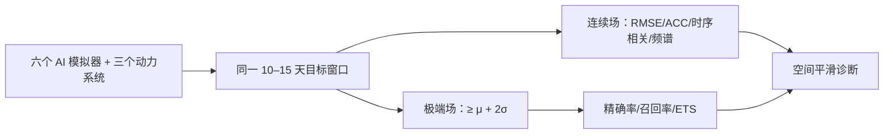

# 10–15 天极端高温评测：为什么低 RMSE 不等于有效预警

> Cas Decancq、Thomas Mortier、Jessica Keune、Diego G. Miralles，*Weather Emulators at the Frontier of Heat Extremes Predictability*，[arXiv:2607.28220v1，2026-07-30](https://arxiv.org/html/2607.28220)。本篇是**多模型评测研究**，不是发布新预报器；2026-09-24 精读。

## 研究设计与科学问题

作者把 Pangu-Weather、FuXi、ArchesWeather、AIFS、GraphCast、Aurora 六个确定性 AI 天气模拟器，与 ECMWF-IFS、NCEP、CMA 等动力系统及气候态/持续性基线并列，询问 **10–15 天**时能否有效预测全球近地面高温，尤其是灾害高温。极端阈值为当地 ERA5 1990–2019 气候平均加 **2 个标准差**；论文同时统计全球格点、六个实际热事件区域、连续 T2m 误差和二分类检测。作者明确指出，这些模拟器多数是确定性场；研究不能替代集合概率预报的可靠性评估。[原文引言、方法与图 1–4](https://arxiv.org/html/2607.28220)

图按论文问题设置重绘。ERA5 作为 AI 模型验证基准，动力模式常以各自 0h 分析作为真值，因此跨体系的**真值不完全同源**；异常气候态又统一来自 ERA5。这一设计是阅读排名前必须注意的比较口径。[原文结果 2.1](https://arxiv.org/html/2607.28220)

### 数据对齐、模型版本与样本数

这是一篇**固定公开权重的再评测**，没有训练新天气模型，也没有在高温样本上微调任何被测网络，因此不能为本文杜撰学习率、优化器或微调阶段。六个 AI 模拟器的大多数公开版本以 ERA5 训练；Aurora 是异构资料预训练，但在此采用 ERA5 输入配置。作者称所选版本没有用 2020 年以后资料训练，所研究近年事件对它们是年份外样本。[方法 §4.2](https://arxiv.org/html/2607.28220v1)

| 组别 | 网格与时间步长 | 本次评测的初值/验证资料 |
|---|---|---|
| Pangu、FuXi、AIFS、GraphCast、Aurora | 0.25°、6 小时 | 每日 00/06/12/18 UTC 初值；每个事件逐 lead 对齐；全部共 392 个 AI 预报序列 |
| ArchesWeather | 1.5°、24 小时 | ERA5 插到模型网格后核验；分辨率较粗，极端面积不应与 0.25° 直接等价 |
| IFS 49r1、CMA GRAPES | TIGGE 提供 0.5°、6 小时 | 只在 00/12 UTC 起报，故 196 条预报序列；各自有效时刻的 0h 分析作参照 |
| NCEP GEFS v12 控制场 | TIGGE 提供 0.5°、6 小时 | 与 AI 的初值数量口径更接近，但同样不是同一分辨率和真值 |

对每个事件日，研究构造恰好提前 10、11、12、13、14、15 天起报并在同一有效时刻核验的预测。全球连续场只取 ERA5 陆地掩码≥0.5 的网格；事件局地评测则限定事件框内曾至少三天出现极端高温的位置，原文此处未要求三天连续。事件样本与常态全球样本不是一个分布，图 3 的两类排名须分开读。[方法 §4.2–4.5](https://arxiv.org/html/2607.28220v1)

### 阈值与指标究竟怎样计算

当地气候态用 1990–2019 ERA5 **小时** T2m，按地点、时刻和年内日估计均值/标准差，再用 31 天按距离线性递减权重的移动窗口平滑；超过 `μ+2σ` 记为极端。持续性基线是把起报时 ERA5 场直接延用到有效时刻。所有异常均减这份 ERA5 气候态，但动力模式的连续误差是相对各自 0h 分析，不是同一个 ERA5 真值；这会影响跨体系严格排序。[方法 §4.4–4.6](https://arxiv.org/html/2607.28220v1)

连续场的 RMSE 和 R² 用原始温度，ACC、时间相关和谱指标用气候态异常；空间均值按球面格点面积加权。RMSE 的具体实现是**先在每个格点沿事件时间轴求 RMSE，再按面积平均各格点 RMSE**，不同于把所有时空残差合在一起后开平方。谱指标对每条纬线作 DFT，再把波数换成随纬度变化的真实波长、按波长分箱并比较预测/真值功率；其高分表示空间尺度能量更匹配，不意味着灾害定位正确。极端事件用精确率、召回率及机会校正的 ETS 并列，不能由约 95% 的总体 accuracy 推导出预警能力。[方法 §4.5–4.6](https://arxiv.org/html/2607.28220v1)

## 图表证据与反直觉结论

| 图表 | 原文可直接核对的结果 | 含义 |
| --- | --- | --- |
| 图 3：10–15 天全球 T2m | FuXi 与 ArchesWeather 的 RMSE 平均较气候态低 **8.0%** 和 **5.3%**；FuXi 到 15 天仍低 **3.0%** | 均值误差优势不能直接变成高温事件召回优势 |
| 图 3 频谱 | AIFS 更能保留温度异常的空间变率；FuXi/ArchesWeather 场偏平滑 | FuXi 第 10→11 天的频谱保真度骤降与其级联换段有关 |
| 图 4 二分类 | FuXi/ArchesWeather 的总体 accuracy 约 **95%/96%**，但多数 lead 的极端召回 **<10%** | 稀有事件中“高准确率”几乎无意义；全报非极端的气候态也可到 95% |
| 图 4 动力系统 | IFS 的极端召回仍高于全部被测 AI；其自身极端面积在 10/15 天也低估约 **15%/20%** | IFS 不是完美，但在预警漏报上更强 |
| 区域热事件 | AIFS 的事件尺度连续场更均衡；FuXi 的区域 RMSE 相对常态增长约 **30%** | 全球排名不能代替具体事件技巧 |

作者对 NCEP 的补充观察也重要：10 天可找回较多高温，但全球高温面积过报约 40%，所以只看召回会奖励“报太多”的系统。高温预警应并列精确率、召回率、ETS、可靠性和不同成本阈值，不能依单一 RMSE 选模型。[原文结果 2.3–2.5](https://arxiv.org/html/2607.28220)

## 解读与复核

本文有力说明“较低 RMSE”可能来自空间平滑和接近气候平均，而这会抹去灾害峰值。由于模型训练年份、业务初值与验证真值不完全一致，研究结论是对该固定设置下的模型行为诊断，不是当今所有版本的实时业务排名。复核应先统一 0h 分析/独立观测真值，再按季节、区域、阈值与连续高温持续日数拆分；还需比较 GenCast/AIFS ENS 等概率模型的阈值可靠性。[原文方法和结论](https://arxiv.org/html/2607.28220)

[返回首页](../../README.md)
