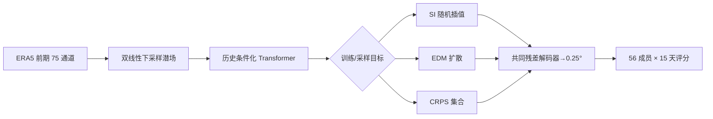

# ATLAS：潜空间中期概率预报的三种生成目标到底有何差异

> Jean Kossaifi、Nikola Kovachki、Morteza Mardani、Daniel Leibovici、Suman Ravuri、Ira Shokar、Edoardo Calvello、Mohammad Shoaib Abbas、Peter Harrington、Ashay Subramaniam、Noah Brenowitz、Boris Bonev、Wonmin Byeon、Karsten Kreis、Dale Durran、Arash Vahdat、Mike Pritchard、Jan Kautz，*Demystifying Data-Driven Probabilistic Medium-Range Weather Forecasting*，[arXiv:2601.18111v1，2026-01-26](https://arxiv.org/abs/2601.18111)，NVIDIA 团队；按[开放全文](https://arxiv.org/html/2601.18111v1)复核于 2026-09-25。当前 arXiv 记录仅有 v1；本笔记不把预印本写成已正式发表。

## 问题与核心结论

15 天概率模型常将技巧归因于复杂扩散设计，但网络表示、潜空间和历史条件化也可能同样重要。ATLAS 统一底座、比较 stochastic interpolant（SI）、EDM 扩散和 CRPS 三种训练路线。其关键设计是**双线性下采样作可控潜空间 + 训练解码器还原高分辨率残差**，避免 VAE 在强压缩时混合异质天气变量并产生不自然的高频尾。结果比摘要式“胜出”复杂：对 IFS ENS，多数变量至 15 天有优势；相对 GenCast，SI 的显著优势主要在约前 **7 天**，之后多为统计不可区分，EDM 的 Z500 可更差，CRPS 版前两天可更差且有欠离散。[原文第 2、4 节](https://arxiv.org/html/2601.18111)

## 架构、数据与实验

作者使用 ERA5 1980–2019 的 6 小时数据训练、2020 测试，原网格 721×1440，75 个输入/输出通道（高空 5 变量×13 层，另有地表量）。先双线性缩小物理场，再在潜格点预测残差；解码器利用太阳天顶角、地形、陆海与 SST 掩码，将潜预测映回 0.25°。三种概率头共用该解码器；评估是 56 成员集合，并将对照方法也统一到相同成员数。报告了按变量、层和 lead 的 CRPS、集合均值 RMSE、spread–skill ratio 与配对显著性，而非只给平均分。[原文第 2–3 节](https://arxiv.org/html/2601.18111)

图依原文第 2 节自行重绘。解码器还原误差通常比真正预报误差小一个量级，说明潜压缩在作者设置下不是主要瓶颈；但不意味着所有高频极端都完美恢复。[原文 2.2、5 节](https://arxiv.org/html/2601.18111)

## 数据处理和可复现的训练流程

原文 Table 1 与 §3.1 明确了 75 个预报通道：5 种高空变量（Z/T/U/V/Q）×13 个气压层、7 种基本地表变量（U10、V10、U100、V100、T2m、MSLP、TCWV），再加 SST 和总降水 TP。ERA5 输入为 1980–2019 年、6 小时间隔的 0.25° 全球格点（721×1440）；2020 年既是论文称的 test 年，也是正文后文称的 validation 年，不能误当作另有独立验证年。陆地 SST 设 0。每个字段分别用**训练年份全像素**计算均值/标准差，输入状态和目标残差各有自己的统计量；评分前反标准化。状态以双线性插值降到 1°（181×360），预测目标是低分辨率的相邻 6 小时**差分**，不是绝对场。[§2.2、§3.1](https://arxiv.org/html/2601.18111)

**通道计数需特别审计**：原文 §3.1 明写“75”，但公开的 Table 1 五种高空变量×13 层 = 65，加七种地表 = 72，再加 SST 与 TP = **74**。这不等于能确定哪一个通道真的缺席；可能是表格漏列、文字多计或含未明示常量。复现者需查作者实际数据配置/张量维度，不能凭经验自补 1 个变量。论文没有在此处列出具体 13 个气压层，亦不应照搬别的 13 层模型配置。[Table 1、§3.1](https://arxiv.org/html/2601.18111v1)

高分辨率解码器另学 `D(低分辨率差分, 当前高分辨率场) ≈ 下一状态 − 当前状态`，以 L1 损失预训练 3 个训练 cycle。其当前场输入再拼上太阳天顶角余弦、地形位势、海陆掩膜、SST 掩膜（这四项映射至 [-1,1]），故解码器当前状态侧为 79 通道。局部注意力窗口 3×3；当前高分辨率场先用 4×4 步长卷积变成 181×360 token，再与 1×1 映射的低分辨率残差拼接。解码器 16 层 DiT、12 头、总宽 2496，约 1.8B 参数；这一阶段不是对预报主干的长期滚动微调。[§2.3、§3.1](https://arxiv.org/html/2601.18111)

三种预测主干共享两帧历史条件化 DiT，patch 为 2×3，使潜 token 网格约 91×120；12 层、13 头、宽 3328。SI 与 EDM 约 2.4B 参数；CRPS 模型加入噪声条件化后约 3.3B。SI、EDM、CRPS **分别训练**各自的概率目标，不是同一模型把三个损失相加。共用预训练解码器，训练中没有作者声称的自回归微调；论文把“无需 autoregressive fine-tuning”列为方法特点。这一点与 FuXi-S2S/TianXing-S2S 的渐增长滚动训练形成清晰对照。[§2.3–2.4、§3.1](https://arxiv.org/html/2601.18111)

### 三种目标在训练、采样和校准上的真正区别

| 变体 | 所学对象与训练损失 | 单步 6h 样本如何生成 | 复现与结果注意 |
|---|---|---|---|
| ATLAS-SI | 条件随机插值桥 $I_t=\alpha(t)z_0+\beta(t)r_1+\sigma(t)W_t$ 的漂移；对时间 $t\sim U(0,1)$ 与噪声抽样的漂移回归 MSE，端点从历史潜态走向未来残差。 | 以历史潜态为起点，按学得的漂移/噪声积分到目标残差；原文写一阶随机 Runge–Kutta 数值求解。 | 不能写成“预测一张确定图再加独立噪声”；历史与目标间的随机桥是训练对象。 |
| ATLAS-EDM | 固定历史条件、对目标残差加多级噪声，学习条件 score/等价去噪目标；训练时从 $t\sim U(0,T)$ 与高斯噪声采样。 | 从终端高斯分布做反向随机过程，使用 predictor–corrector 离散化。 | 相同 2.4B 主干与解码器不等于相同概率目标，也没有长期轨迹微调。 |
| ATLAS-CRPS | 潜状态与高维高斯噪声直接映成残差，用**两个独立噪声样本**组成样本对的绝对误差减成员间距，并对球谐系数**模长**再加谱项。 | 一次主干前向产生一个残差，不需 SI/EDM 多步随机积分；新增噪声调制使主干约 3.3B。 | 原文未在正文给出 $\lambda_{\rm spec}$ 的具体最终值；图 5 的 spread–skill 仍欠离散，谱项不等于校准证明。 |

上述是原文 §2.4 式 (1)–(8) 的中文拆解，不把三种方法混作一个 ensemble 训练过程。特别是 CRPS 训练损失作用在**潜残差**且加谱项，而评估使用**原网格反标准化后的 56 成员 fair CRPS**；训练损失与报告指标并非同一个对象。[方法 §2.4、评分 §3.2](https://arxiv.org/html/2601.18111v1)

| 主干训练项目 | 原文公开值 | 应如何理解 |
|---|---|---|
| 计算/批量 | 32 张 80GB A100 或 H100，总 batch 32，elastic averaged SGD 训练框架 | 不是每个概率模型只用 1 张卡；硬件型号存在两种。 |
| 优化器 | `optimi` 库的 StableAdamW 默认设置 | 论文未在正文逐项重写 β/weight decay，不能另填常见 AdamW 默认值。 |
| 学习率 | `1.28×10^-4`，前 2000 step 线性 warm-up，再 100000 step 余弦衰减作为一个 cycle；下一 cycle 的起点为前者的 0.8 倍 | 训练总步数按 cycle，而非由 2020 评分次数推断。 |
| 训练长度 | SI、EDM 各 3 cycle；CRPS 6 cycle；共同解码器 3 cycle | CRPS 训练预算较大，比较不能说完全同等计算成本。 |
| 评估 | 2020 年 28 个共同起报日期，6 小时验证至 15 天（60 步），56 成员 | 初值分布为每月 2/16 日 00 UTC，另加 1–4 月的 8 日；并非全年每天起报。 |

论文通过配对检验估计 28 个共同初值上的差异，但同一天附近误差的空间相关和单年份取样仍限制了外推。若重训，需先核实论文**声明的 75 通道**与公开变量明细 74 项之间的差异，再固定 ERA5 提取/残差标准化、解码器预训练权重、三个主干的不同训练预算，以及共同初值；不能将三种配置合并成一套超参数。[§3.1–3.2](https://arxiv.org/html/2601.18111)

评测真值为反标准化的 ERA5，纬度格面积权重用于各变量/层的 fair CRPS、集合均值 RMSE 和 spread–skill ratio；后者小于 1 表示欠离散，大于 1 表示过离散。GenCast 使用公开 0.25° 非业务 checkpoint，与 ATLAS 同为 56 成员，但 **GenCast 12h 步长、ATLAS 6h 步长**，并非单步成本/误差完全相同。对 28 个同日初值逐 lead 做配对 t 检验，以 $p<0.05$ 标注图 4；原文未见对多变量×多 lead 反复比较的多重检验调整，因此不能把每个零星绿色格都视为稳健的全局胜出。[§3.1–3.2、Fig. 4](https://arxiv.org/html/2601.18111v1)

单张 A100 上作者报告**单时间步预报**约 GenCast **140 s/12h**、ATLAS-SI **94 s/6h**、ATLAS-EDM **88 s/6h**、ATLAS-CRPS **3.3 s/6h**。ATLAS 的 15 天要 60 次 6h 滚动，GenCast 为 30 次 12h 滚动，且完整 56 成员是否并行、读写开销与硬件利用率未由这些单步数值定义；不能把 3.3 s 写成 15 天 56 成员的总推理时间。CRPS 变体单步很快，但训练用了 6 cycle、参数 3.3B 且短 lead/离散度有反例，速度不代表它在全部技巧维度占优。[§3.1](https://arxiv.org/html/2601.18111v1)

## 定量与负面结果

| 比较/原文图 | 观察 | 限制 |
| --- | --- | --- |
| 图 3，相对 IFS ENS | u10m/v10m 的 CRPS 初期提升峰值接近 **50%**，前 6 天仍 **>10%**；多数变量至 15 天优势持续 | 初期百分比很大，不能当作第 15 天同等幅度 |
| 图 3，Z500 | 与 IFS 的优势约 **12 天后收敛** | 关键大尺度中期变量并非一直领先 |
| 图 4，相对 GenCast | SI 版 CRPS 与集合均值 RMSE 约前 **7 天**显著较好 | 长 lead 差异不显著；EDM 的 Z500 可落后 |
| 图 4–5，CRPS 版 | 第 8–10 天有部分可检测增益 | 前 2 天可落后，spread–skill ratio 显示**欠离散** |

CRPS 是边际概率分数，不能充分约束空间联合样本的物理形态；图 5 的欠离散表明“直接用 proper score 训练”也未自动解决校准。论文只用 2020 单一年份测主实验，虽然做显著性检验，跨季节与年代漂移仍需要再检验。复核应固定成员数、同初值和训练期，输出第 8/10/12/15 天 Z500、降水与热带气旋的空间谱、可靠性和极端阈值技巧；不要把 SI、EDM 与 CRPS 三版的优点合并成一套不存在的模型。[原文结果第 4–5 节](https://arxiv.org/html/2601.18111)

### 图 6–12：个例、台风及潜空间反证的分母

| 原文证据 | 样本/口径 | 读出的正负结果 |
|---|---|---|
| Fig. 6，Storm Dennis | **2020-02-11 00 UTC** 单次起报、2–5 天两个成员与 ERA5；与主评分的每月 2/16 日 28 起报**不同**。 | 850hPa 风和 Z500 的空间结构合理，谱在波数 >200 略欠能量；第 5 天威尔士/大西洋风速略低。不能用一个个例替代 2020 年总体概率验证。 |
| Fig. 7，IBTrACS 台风 | 2020 年 118 场中只保留持续至少 7 天、每场仅首次报告时次的 **46 场**；ATLAS-SI 与 GenCast 各 **32 成员**，非主评分 56 成员；TempestExtremes 跟踪器按各自 **6h/12h** 采样协议设参数。 | ATLAS-SI 路径误差约 **80h 后**优于 GenCast、之前相近；强度 MAE 至 **144h** 接近，之后略差。不同 tracker 参数虽必要，仍非完全同轨迹抽样。 |
| Figs. 8–10，Eta/Damien/Krovanh | 三场展示路线的 spaghetti plots，属于有选择的个例。 | Eta 的东转、Damien 的东偏较轻和 Krovanh 的存活时长对 ATLAS-SI 有利；不能推导 15 天全台风概率校准。 |
| Fig. 11，学习型 VAE 潜变量对照 | 作者特调的 16× 空间压缩，8 层编码/8 层解码 DiT；短期重建或 6/12h 预报可竞争。 | 长期自回归误差较双线性下采样/训练解码器路线更快积累；残差自编码重建更好也未保证滚动预报更好。 |
| Fig. 12，解码器消融 | 比较直接双线性上采样与局部 DiT 残差解码。 | 只用双线性反投影重建误差高；受当前高分辨率状态条件化的解码器显著降低重建/滚动误差。 |

[原文 Figs. 6–12、§4.2–5](https://arxiv.org/html/2601.18111v1)仅给图示/曲线而无以上多数精确点值；本笔记只记录文字可核的时间、样本数与相对关系，不把像素读数伪装为公布的 m/km 数字。尤其 Storm Dennis 与台风验证是两条**独立于主 28 起报**的分析，不可把 46 场台风误写成 28 起报上的子样本。

[返回首页](../../README.md)
