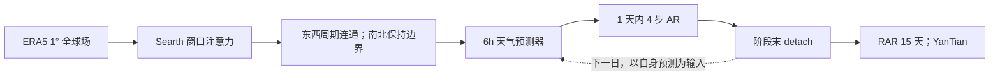

# Searth Transformer / YanTian：球面边界先验与接力式长滚动训练

> Tianye Li、Qi Liu、Hao Li、Lei Chen、Wencong Cheng、Fei Zheng、Xiangao Xia、Ya Wang、Gang Huang、Weiwei Wang、Xuan Tong、Ziqing Zu、Yi Fang、Shenming Fu、Jiang Jiang、Haochen Li、Mingxing Li、Jiangjiang Xia，*Searth Transformer: A Transformer Architecture Incorporating Earth's Geospheric Physical Priors for Global Mid-Range Weather Forecasting*，[arXiv:2601.09467v1，2026-01-14](https://arxiv.org/abs/2601.09467)。2026-09-25 逐页复核 16 页 v1 PDF；这是预印本，YanTian 是由 Searth 架构和 RAR 策略组成的全球模型。

## 研究问题与方法

常规 Swin Transformer 把球面经纬场当平面图像，错误地阻断 0°/360° 经度相邻窗口，却把南北边界处理得近似一般图像边缘。Searth 的 asymmetric shift-and-mask 对东西边界开放周期连接、对南北边界保持遮罩，令窗口注意力更符合地球经向边界与纬向周期。第二项贡献 RAR（Relay Autoregressive）把 15 天长序列切成 **15 个每天 4 步的短阶段**，阶段之间 detach 梯度，让训练看到长期自身误差而无需跨全部 60 步反向传播。[原文第 II–III 节](https://arxiv.org/pdf/2601.09467)

图为原文方法的原创重绘。detach 使显存近似取决于单个子阶段长度，但不等于 15 天梯度真实贯穿全轨迹；长时效误差反馈是通过接力输入而非完整 BPTT。[原文 III 节](https://arxiv.org/pdf/2601.09467)

## 数据、预处理和模型容量

原始 ERA5 是 0.25°、721×1440 的 6 小时场。作者先舍去纬向无法被 4 整除的**南极末行**，再对非重叠 4×4 网格取 16 点均值，得到 1°、180×360；这不是通常的双线性重网格。69 通道=Z/T/U/V/相对湿度 R 各 13 气压层（50–1000 hPa，共 65）+ MSL/T2M/U10/V10 四个地面量。1987–2016 年四个日时次训练，2017–2019 验证，2020 测试。论文正文没有提供逐通道标准化均值/方差或具体缺测填充规则，复现不可自行当作既定论文参数。[原文 §IV-A](https://arxiv.org/pdf/2601.09467)

编码器—核心—解码器约 **6 亿参数**，输出下一 6 小时的状态增量，再与当前场残差相加。原文 Figure 1 可分解为局部/移窗 Searth 注意力、降分辨率编码、多层核心、升分辨率解码及跳连；东西经度跨边界开放，南北边界继续遮罩。注意**训练前的 4×4 物理场均值降采样**和**网络内部的 token 降采样**是两回事，不能混为一步。[原文 §III 与 Figure 1](https://arxiv.org/pdf/2601.09467)

### 图 1：从输入到输出的精确尺寸

| 路径 | 原文层级与张量形状 | 作用 |
| --- | --- | --- |
| 输入 | `(X[t-6h], X[t])`，`2×69×180×360` | 两个连续分析时刻作为条件，预测 `X[t+6h]`。 |
| Embedding + Encoder | 3D 卷积联合编码时间/空间→`768×90×180`；6 个 Searth block；patch merging→`1536×45×90` | 第一次空间降采样发生在 embedding；第二次是 Transformer 内部 token 合并。 |
| Core | 20 个 Searth block，维持 `1536×45×90` | 深层大尺度场演化建模。 |
| Decoder + Unembedding | patch expanding→`768×90×180`；6 个 Searth block；2D 转置卷积与全连接层→`69×180×360` | 预测的是下一步**增量**，而非直接预测绝对场。 |
| 跳连与输出 | `X[t] + ΔX` → `X[t+6h]` | 图 1 有各段残差/跳连，最外侧跳连承载当前物理场。 |

每一对 Searth block 的第一个 E-MSA 与标准窗口注意力 W-MSA 算法等同，第二个 SE-MSA 才在循环平移后删除**东西接缝**的掩码、保留**南北边缘**的掩码。原文未在方法正文给出窗口大小、注意力头数、MLP 扩展比、卷积核与完整 layer-by-layer 配置；不能凭图中的 `×6/×20/×6` 反推出这些值。图 1 的“球面先验”只针对经度周期/纬度边界，不代表等面积球面网格、极点动力学或物理守恒已被建模。[原文 Fig. 1、§III-A–B](https://arxiv.org/pdf/2601.09467)

## 两阶段训练与 RAR 微调的具体执行

| 项目 | 论文公开设置 | 对结果的意义 |
|---|---|---|
| 共同损失/设备 | 纬度加权 MAE，`L(i)=Nlat cos(phi_i)/Σ cos(phi)`；8× A800；PyTorch 混合 FP32/FP16 + gradient checkpointing | 优化目标强调各纬带面积权重；模型性能不能和只用未加权 MSE 的实验直接归因于架构。 |
| 单步预训练 | 前两个 6h 场→下一 6h 场；`1×10^5` 次更新；AdamW β=(0.9,0.95)、weight decay 0.1；总 batch 32（每卡 4）；初始 LR `2.5×10^-4` 余弦降至 `1×10^-7`；DropPath 0.2；约 3 天 | 得到共享初始化权重，验证 2017–2019，而非直接从随机权重学 15 天。指数已按 PDF 原页面核验，避免网页抽取乱码。 |
| 15 天 RAR 微调 | 在**预训练权重**上继续优化；60 个 6h 步划为 15 段×4 步，每段内多步误差反传、段末预测 detach 再传下一段；每卡 batch 1；每卡 1000 条独立 15 天序列，共 8000；恒定 LR `1×10^-7`；约 8 小时 | 同一 69 通道 ERA5 序列，不是换任务/换资料的迁移学习；长滚动见到自己的误差，但梯度不跨日边界。峰值显存 <25GB。 |

预训练和微调都使用同一类**按纬度加权 MAE**：在 batch、rollout 步、69 通道、180×360 网格上平均绝对误差，纬度权重为 `180 cos(φᵢ)/Σⱼcos(φⱼ)`。这意味着高纬网格点不会因为经纬度网格面积缩小而拥有不成比例的权重；但原文没有说明各通道是否在计算损失前按方差归一，故不能推断九类物理变量的相对贡献。RAR 每段积累 4 步损失并回传，参数更新后把最后一帧预测 `detach` 送入下一段；跨段没有完整的 60 步 BPTT，且论文没有单独报告具体数据加载顺序。[原文 Eq. 1、Fig. 2、§III-C/IV-B](https://arxiv.org/pdf/2601.09467)

原文另以**标准 5 天 20 步 AR 微调**对照 5 天 RAR，确保比较相同可见时间长度。验证时作者用 1993–2019 ERA5 构建异常气候态；跨模型比较仍有 HRES 真值不一致问题。[原文 §IV-B–E、Table I](https://arxiv.org/pdf/2601.09467)

| Table I：同一预训练 Searth 权重出发 | 峰值 GPU 显存 | 微调耗时 | Z500 ACC=0.6 的时效 |
| --- | ---: | ---: | ---: |
| Baseline，仅单步预训练 | — | — | 约 8.7 天 |
| AR5d，标准 20 步反传 | 约 80 GB | 约 200 小时 | 约 9.7 天 |
| RAR5d，接力 20 步 | <25 GB | 约 3 小时 | 约 9.6 天 |
| RAR10d，接力 40 步 | <25 GB | 约 5 小时 | 约 10.2 天 |
| RAR15d，接力 60 步 | <25 GB | 约 8 小时 | 约 10.3 天 |

按原文的**耗时×峰值显存**估算，AR5d 与 RAR5d 的比值大于 `200×80/(3×25)≈213`，所以“约 1/200”仅是**微调阶段资源代理指标**；它不是测量过的 GPU 能耗、FLOPs、预训练加微调总成本，更不是推理速度。RAR5d 在第 5 天后 RMSE 略逊于 AR5d，但以接近技巧换取大幅压低微调成本；延长至 RAR10d/15d 则改善中长 lead、短 lead 可能轻微退化。[原文 Fig. 5、Table I](https://arxiv.org/pdf/2601.09467)

## 资料与比较口径

模型训练在 1° ERA5；主图 3 用 2020 年 00/12 UTC 起报、对照 Pangu、GraphCast、FuXi 与 HRES，后者原始 0.25° 后聚合到 1°。**AI 模型对 ERA5 验证，HRES 对 HRES-fc0 验证**，并非完全同真值。论文主图的跨模型比较是 **0–10 天**；15 天主要出现在 RAR 消融，不能把主图同档比较延伸到 15 天。ACC>0.6 的 Z500 有技巧时效被作者报告为 YanTian **10.3 天**、HRES **9 天**，读这个插值阈值时须结合图和不同真值口径。[原文图 3、实验段](https://arxiv.org/pdf/2601.09467)

| 图表 | 原文展示了什么 | 可引用的结论与边界 |
| --- | --- | --- |
| 图 1，模型结构 | 2×69 输入、768/1536 双尺度、6/20/6 blocks、增量输出、东西去 mask/南北留 mask | 结构尺寸已按正文核对；没有给出头数/窗口等配置。 |
| 图 2，RAR 流程 | 子阶段内 4 步 AR 与局部回传，阶段末 detach、预测接力 | 长时间窗进入训练样本，但梯度并非贯穿整段 15 天。 |
| 图 3，2020/八变量 | U10、V10、T2M、MSL 与 Z500、T500、U500、V500 的 RMSE/ACC 曲线 | YanTian/FuXi 在第 5–10 天较强；1° 模型早期细尺度不足；主比较最多 10 天。图像为曲线，论文未提供逐日机器可读数表，不能编造单点值。 |
| 图 4，边界消融 | 预训练 Searth vs Swin，及各自标准 AR5d 版 | 同训练口径下 Searth 版普遍低 RMSE、高 ACC；部分 lead 单步 Searth 甚至优于已微调 Swin，但不能推为严格物理守恒。 |
| 图 5 / 表 I，RAR 消融 | Baseline、AR5d、RAR5d/10d/15d 的 Z500、T500、U10、MSL 曲线与资源/阈值表 | 精确可转录数字见上表；图 5 还包括相对 Baseline 的归一化 RMSE/ACC 差。短 lead 存在退化，不能只报 10.3 天。 |
| 图 6，输出降尺度 | 把 YanTian 1° 输出**双线性插值**至 0.25° 再画八变量对比 | 不是重新训练的 0.25° 模型，也不是独立学得的超分辨率；作者指出 T2M 等变量可能略降。 |

原文在训练效率与跨边界信息交换上的贡献明确，但性能结论须和分辨率、同真值问题并列。复核应补 2021–2025 年份、统一探空验证、同分辨率 Swin/Pangu/FuXi 训练预算与 10/12/15 天逐 lead 曲线；观察图 4 的消融增益是否在极区、经度拼接处和高温/降水事件上成立。[原文 IV 节](https://arxiv.org/pdf/2601.09467)

[返回首页](../../README.md)
