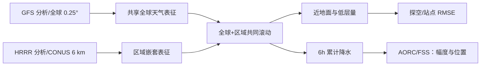

# Nested-EAGLE：把全球中期背景与美国 6 km 区域网格接成一个模型

> Timothy A. Smith、Mariah Pope、Sergey Frolov、Brett Basarab、Daniel Abdi、Paul Madden、Isidora Jankov，*Bridging short- and medium-range weather forecasting with machine learning*，[arXiv:2608.26822v1，2026-08-27](https://arxiv.org/abs/2608.26822)，NOAA 团队；按 [v1 正文和 Supporting Information](https://arxiv.org/html/2608.26822v1)复核于 2026-09-25。模型配置、评测脚本及权重见[作者代码仓库](https://github.com/NOAA-PSL/nested-eagle)和论文 §7。以下图表是依据原文独立重绘/整理，不是直接复制论文插图。

## 核心问题与机制

NOAA 的 HRRR 主攻美国短期强天气，GFS 主攻全球较长 lead；两者边界条件/网格/同化资料各异。Nested-EAGLE（Experimental AI Global and Limited-area Ensemble）提出 0.25° 全球网格 + 美国本土 **6 km 嵌套区域**的统一天气模型，用 GFS 分析和 HRRR 高分辨率分析同时训练。这里名称虽含 Ensemble，论文当前主要结果仍是**确定性 MSE 预报**，不能误列为概率集合技巧。嵌套的关键收益是模型学到区域分析所包含的地面信息，而不是纯粹将同一全球输出简单插值放大。[原文引言、方法第 5 节](https://arxiv.org/html/2608.26822)

图按原文方法独立重绘。训练 2015-02 至 2023-01，验证 2023-02 至 2024-01，测试 2024-02 至 2025-01；高空 12 个气压层，地面和 6h 降水另设输出。近地面主评分使用 **293 次**预报；降水 FSS 使用 **1426 次**起报并与 AORC 验证，不能把这两套样本数混合。[原文方法 5.1、表 1、结果第 3 节](https://arxiv.org/html/2608.26822v1)

## 数据处理：GFS、HRRR 的接缝与变量定义

模型每 6 小时取两帧状态预测下一帧。GFS 0.25° 全球分析与 HRRR 覆盖美国本土的 3 km Lambert 网格分析构成目标；HRRR 用**守恒式重网格**降至 6 km，在 CONUS 嵌套区**删除重叠的 GFS 网格节点**，因此不是两层都保留后简单平均。除降水外，目标量取模式预报 0h（分析）场；6h 累积降水则取前 6h 初值预报的累计量。必须保持这一时间对齐，否则降水标签会用到未来信息。[原文 §5.1、Table 1](https://arxiv.org/html/2608.26822)

预报状态有 **100、150、200、250、300、400、500、600、700、850、925、1000 hPa** 这 12 层的位势高度、U/V 风、垂直速度、温度、比湿，加地面气压、10m 风、地表/2m 温度、2m 比湿。静态/时变强迫包括海陆掩膜、地形、日照及纬经、年内日、地方时的正余弦；诊断输出为 6h 降水与 80m 风。**诊断量不是下一步输入**，因此不能把降水反馈当成模型的自回归状态。一般变量按 `(x-μ)/σ` 标准化，三种非负变量——高空比湿、2m 比湿、6h 降水——仅除以标准差，并以 ReLU 限非负；地形除以最大值，其余强迫不标准化。这些不同变换不能由统一 z-score 代替。[原文 Fig. 1、Table 1](https://arxiv.org/html/2608.26822v1)

GFS 历史训练档案主要来自 NCAR Research Data Archive，2021 年 1 月以后的 GFS 使用 NOAA NODD/AWS 开放资料；HRRR 来自 NOAA NODD/AWS。训练监督依赖**两套数值模式分析场**而非直接原始卫星/站点观测。独立站点、探空、飞机与下投探空等 NNJA 观测只在评测端使用；AORC v1.1 是降水评测参考。由此，“观测直达预报”和“联合分析场训练”必须分开归类。[原文 §5.1、§5.4–6](https://arxiv.org/html/2608.26822v1)

编码器/解码器为图 Transformer，处理器在混合分辨率潜网格上用滑窗 Transformer。潜网格是全球 O96 约 100 km / 40,320 节点加 CONUS 区域约 24 km 节点；相对数据网格每个水平维度约缩小四倍，最终注意力窗口含 **8168** 个节点。早期的多面体 multimesh + 图 Transformer 在全球/区域接缝出现伪迹；[Fig. 8](https://arxiv.org/html/2608.26822v1)比较的是 **1° GFS / 15 km HRRR 的早期原型**，滑窗版本在 10 天图像里消除了该伪迹，报告总计算成本约少 **33%**；不能将这张早期图当最终 0.25°/6 km 模型的直接消融。作者指出两套资料×两帧的 I/O、连续窗口的访存局部性和 FlashAttention 共同影响速度，不能把 33% 全归功于注意力理论复杂度。[原文 §5.1、Fig. 8](https://arxiv.org/html/2608.26822v1)

只用 GFS 的 **ML-GFS-Base** 保留 0.25° 单一全球网格和同类编码—处理—解码路线，潜网格仅 O96，窗口减至 **2250** 节点；因节点数不同，它不是完全参数量匹配的“只移除 HRRR 数据”实验。两种模型先按 Voronoi 格点面积加权，Nested-EAGLE 再把 CONUS 的损失重加权到**总损失的 10%**，ML-GFS-Base 不加此项。作者另用仅推理期交换分析初值的实验辅助区分训练资料与初值作用，而不能仅靠两模型直接差值归因。[原文 §5.1–5.2、Fig. 4、S2.1](https://arxiv.org/html/2608.26822v1)

## 训练日程：并非先 ERA5 预训练再微调

作者**明确没有 ERA5 预训练**：这版直接用 2015-02 至 2023-01 的 GFS+HRRR 8 年档案。所谓 B/C 阶段是沿用 A 阶段权重作更长滚动继续训练；不应写成外部基础模型迁移。三阶段均用 AdamW β=(0.9,0.95)、有效 batch 16、面积/区域加权 MSE，最低 LR `3×10^-7`。[原文 §5.1 Table 2](https://arxiv.org/html/2608.26822)

| 阶段 | 更新次数 / 约 epoch | 线性暖启动 | 最大学习率 | 自回归步数 | 目标 |
|---|---:|---:|---:|---|---|
| A | 60,000 / 约 82 | 1000 步 | `1×10^-3` | 1 | 先学 6h 一步映射。 |
| B | 5760 / 8 | 100 步 | `1×10^-4` | 2 | 用自身第 1 步输出衔接下一步，缓解滚动分布偏移。 |
| C | 5760 / 8 | 100 步 | `1×10^-5` | 2→4 | 将优化窗口扩到 12–24h；并非直接以 15 天梯度训练。 |

每阶段余弦衰减至上述最低 LR；约 11,616 个训练样本/epoch，阶段 A 每 epoch 约 726 批。训练报告约 45 小时，NERSC Perlmutter 16 节点×4 A100 40GB；每个模型实例跨一个节点 4 卡，不能把 64 卡理解为单模型数据并行规模而不看原文并发安排。论文没有给出阶段之间冻结层的策略，合理记录为**权重延续的滚动训练，冻结细节未说明**。论文正文也未直接列最终模型参数总量；复现时应以[公开配置/权重](https://github.com/NOAA-PSL/nested-eagle)核算，而不是据早期 512/1024 通道消融猜测。[原文 Table 2、§7](https://arxiv.org/html/2608.26822v1)

## 评测协议：为何 293、1426 和两套聚合不能混用

**连续变量 / 图 2–5**：2024-02 至 2025-01 每隔 **30 小时**起报，共 **293** 轨迹，能轮换覆盖昼夜和季节；以 6 小时步长滚动至 **15 天**。NNJA 的站点、探空、机载和下投资料按有效时刻 **±30 分钟**选取，模式先落到相同验证网格，再双线性插到实际观测点；每个起报/lead 对该时刻观测求一个 RMSE，然后跨 293 起报取**中位数**。作者用中位数是为降低 2m 比湿少数异常对均值置信带的放大。CONUS 主图 2 先重网格至共同 **6 km Lambert**，欧洲主图 3 在共同 **0.25°** 经纬网格；附录 S2 的 CONUS 却按 **0.25°** 算，不应与图 2 的绝对 RMSE 直接拼表。[原文 §2.1–2.2、§5.4、Fig. S2](https://arxiv.org/html/2608.26822v1)

**降水 / 图 6–7**：每 **6 小时**起报共 **1426** 条轨迹；用 AORC v1.1 约 **800 m** 逐小时参考雨量累计成 6h，并将各系统**守恒重网格至 6 km**。FSS 先对半径 **25 km** 的正方形邻域形成超阈值面积分数，在 6 km 网格上对应边长 **54 km**；再计算 `1 − Σ(预报分数−参考分数)² / Σ(预报分数²＋参考分数²)`，**跨起报取均值**而非前述中位数。图 6 用共同绝对雨量阈值，位置和幅度一起评；图 7 为每个预报/参考场分别以全域**正雨格点**的各自百分位作门槛，再对所有有效格点评分，刻意去掉幅度偏差的影响，不能称为定量雨量准确度。[原文 §3、§5.5](https://arxiv.org/html/2608.26822v1)

两类图的阴影均是对“**起报时次**”非参数重采样 **1000** 次取得的 2.5%–97.5% bootstrap 区间；作者以**两模型区间不重叠**作为保守显著性判据。不是对站点或网格逐点 bootstrap，也没有说明多重检验校正。业务基线为 HRRR **v4**（仅区域短时效）及 GFS **v16**，ML 基线为前述 ML-GFS-Base。[原文 §5.3–5.5](https://arxiv.org/html/2608.26822v1)

## 性能图表：收益位置、时间以及反例

原文定义的“技巧时间差”满足 `Nested-EAGLE 在 (t+Δ) 的中位 RMSE ≈ 基线在 t 的中位 RMSE`；`Δ>0` 表示同样误差水平下可多预报的小时数，**不是 RMSE 降幅百分比**。下表从 [Table S1](https://arxiv.org/html/2608.26822v1) 摘取近地面三量的数值，单位小时；附录 HTML 会丢失原表灰色的“不显著”字色，因而**所有数值只作点估计**，显著区间另按作者正文陈述。`>+120` 是超过表格可比较时效，不是精确 120 小时。

| 基准 lead | 10m 风：对 ML-GFS / GFS | 2m 温度：对 ML-GFS / GFS | 2m 比湿：对 ML-GFS / GFS |
|---:|---:|---:|---:|
| 24h | +54 / +78 | +66 / +78 | +42 / +60 |
| 120h | +24 / +48 | +24 / +30 | +6 / +24 |
| 240h | +78 / >+120 | 0 / +18 | −12 / +42 |

**图 2（CONUS，独立观测）**：0h 的 HRRR 分析相对 GFS 分析在 10m 风、2m 温、2m 比湿的误差分别约低 **30%、48%、45%**，已提示训练目标质量差别。作者正文明确称：相对 GFS，10m 风优势至少 **48h** 并贯穿 15 天；2m 温和比湿差别的显著性分别持续至约 **7.5 天**、**2 天**。相对 ML-GFS-Base，10m 风及 2m 温的显著领先约到 **6.5 天**；比湿虽然早期点估计很大，显著区间只约到 **12h**。850 hPa 早期相对 GFS 约领先 24h、至第 4 天后多系统高空 RMSE 大多不可区分；500 hPa 位势和 250 hPa 风在主图上相近。因此不可把“15 天有轨迹”偷换为“所有变量在第 15 天显著更优”。[原文 §2.1、Figs. 2/S2、Tables S1–S2](https://arxiv.org/html/2608.26822v1)

**图 3（欧洲负控制）**：欧洲 35–75°N、25°W–65°E 不在高分辨率嵌套区。Nested-EAGLE 与 ML-GFS-Base 的技巧基本统计等价，10m 风、2m/850 hPa 温度相对 GFS 有一些改善，其余量多不可区分。作者将其解释为“HRRR 训练信息不外溢”的负控制，不是已证实的全球迁移。[原文 §2.2、Fig. 3/S3](https://arxiv.org/html/2608.26822v1)

**图 4–5（交换初值、归因）**：Nested-EAGLE(GFS IC) 在 CONUS 把 GFS 分析及**GFS 静态地形**守恒插到 6 km，ML-GFS-Base(G+H IC) 则把 HRRR 分析粗化到 0.25°。二者刚起报时沿用输入分析的误差，却迅速回到各自**训练过的模型**的误差水平：10m 风约首个 **6h** 步便收敛；大平原/海岸的图像误差也快速消失，至 **30h** 主要剩高地 2m 温差。这比仅看模型对比更有力地表明区域资料作用已写入权重；但静态地形未随时间“修正”，所以不能声称初值差异完全无影响。附录 Fig. S15 把两种配置的 **2m 温度平均偏差**对 HRRR–GFS 高差回归，约一天后 Pearson `r²≈0.9`、三天后 Spearman `ρ²≈0.6`，斜率约 **−6 K/km**；这是空间相关归因证据，不是随机化因果实验。[原文 §2.3、Figs. 4–5、S15](https://arxiv.org/html/2608.26822v1)

**图 6–7（雨量与落区必须分开）**：绝对门槛 FSS 在 6、24、48h 比较，HRRR 除 **1–2 mm/6h** 低阈值外通常最好；Nested-EAGLE 在 6h 仅略胜 GFS，较大雨强被确定性 MSE 平滑。改成各场正雨格点百分位门槛后，Nested-EAGLE 在超过 6h 的**空间位置**分数表现最好，但这一协议恰好把雨量幅度差异排除。Fig. S16–S17 的 2023 年 3/8 月验证集月均降水图和 S5 个例能说明局部落区，但既非 2024–25 测试集定量结论，也不能代替 10–15 天强降水技巧。[原文 §3、Figs. 6–7/S16–S17](https://arxiv.org/html/2608.26822v1)

## 模型选择消融：实验网格不是最终网格

[附录 S2/Figs. S9–S14](https://arxiv.org/html/2608.26822v1)的研发模型使用 **1° GFS / 15 km HRRR**，大多只训 **30,000 次单步更新**；验证集 **158** 条轨迹每 54h 起报，部分图以 HRRR 分析而非独立观测为真值。作者明确把这些趋势外推到最终 0.25°/6 km 模型视为假设。因此下列选择解释“为何选此超参”，不作为最终模型的独立性能证明：

| 消融图 | 候选与作者观察 | 最终选择/边界 |
|---|---|---|
| S9：LAM 损失 | 不额外加权时按面积约 **3.4%**；10% 与 30% 的 RMSE 接近；50% 太高 | 选 **10%**，并非 10% 对任何变量显著压倒 30%。 |
| S10：注意力窗口 | **1080** 太窄；比它更大的窗口之间差异大多不显著 | 研发按 `潜节点数÷处理阶段数÷2` 的经验式选 **3564**，最终高分辨率用 **8168**；数字不在同一网格上直接比较。 |
| S11：训练长度 | 15k 太少，30k 到 60k 多数变化不显著 | 最终 A 训练 **60k**，并继续 B/C 滚动阶段。 |
| S12：潜通道 | **512 vs 1024** 差别不显著，大网络耗费更高 | 研发选择较省的 512；论文正文未直接报告最终模型参数量。 |
| S13：气压层权重 | 对低层加线性压力权重并未稳定提升近地量，中/高层反可能退步 | 最终各气压层**等权**，但这不是普适性结论。 |
| S14：输入状态 | 一帧 vs 两帧多变量差距不显著，500 hPa 位势高度两帧较有益 | 最终用 `t−6h,t` 两帧，承担额外 I/O 成本。 |

## 如何理解这篇论文的中期价值

这是一条“**业务全球分析＋区域分析共同训练**”而非 ERA5 基础模型先验微调、原始卫星直达预报或概率集合生成的路线。真正验证至第 15 天的是站点/探空等连续变量的滚动评分；HRRR 雨量对照只到短期，降水 FSS 的强项是**落区而非强度**，且 CONUS 以外没有区域训练收益。论文名称里的 *Ensemble* 不能误解为本文已发布的多成员概率技巧。若复现或应用，应记录 GFS/HRRR 的版本和接缝、6h 标签对齐、损失面积权重，分别重做独立观测 RMSE、绝对雨强 FSS、位置百分位 FSS，并在地形差异和欧洲负控制中检验泛化；日后加入观测直达输入或概率/扩散头属于新的研究，不是本文已经做过的微调。[原文 §4–7](https://arxiv.org/html/2608.26822v1)

[返回首页](../../README.md)
