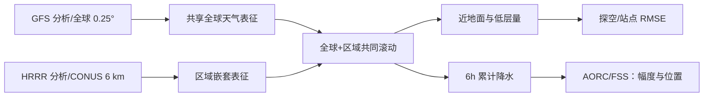

# Nested-EAGLE：把全球中期背景与美国 6 km 区域网格接成一个模型

> Timothy A. Smith、Mariah Pope、Sergey Frolov、Brett Basarab 等，*Bridging short- and medium-range weather forecasting with machine learning*，[arXiv:2608.26822v1，2026-08-27](https://arxiv.org/html/2608.26822)，NOAA 团队；阅读于 2026-09-24。

## 核心问题与机制

NOAA 的 HRRR 主攻美国短期强天气，GFS 主攻全球较长 lead；两者边界条件/网格/同化资料各异。Nested-EAGLE（Experimental AI Global and Limited-area Ensemble）提出 0.25° 全球网格 + 美国本土 **6 km 嵌套区域**的统一天气模型，用 GFS 分析和 HRRR 高分辨率分析同时训练。这里名称虽含 Ensemble，论文当前主要结果仍是**确定性 MSE 预报**，不能误列为概率集合技巧。嵌套的关键收益是模型学到区域分析所包含的地面信息，而不是纯粹将同一全球输出简单插值放大。[原文引言、方法第 5 节](https://arxiv.org/html/2608.26822)

图按原文方法独立重绘。训练 2015-02 至 2023-01，验证 2023-02 至 2024-01，测试 2024-02 至 2025-01；高空 12 个气压层，地面和 6h 降水另设输出。近地面主评分使用 **293 次**预报；降水 FSS 使用 **1426 次**起报并与 AORC 验证，不能把这两套样本数混合。[原文方法 5.1、表 1、结果第 3 节](https://arxiv.org/html/2608.26822)

## 数据处理：GFS、HRRR 的接缝与变量定义

模型每 6 小时取两帧状态预测下一帧。GFS 0.25° 全球分析与 HRRR 覆盖美国本土的 3 km Lambert 网格分析构成目标；HRRR 用**守恒式重网格**降至 6 km，在 CONUS 嵌套区**删除重叠的 GFS 网格节点**，因此不是两层都保留后简单平均。除降水外，目标量取模式预报 0h（分析）场；6h 累积降水则取前 6h 初值预报的累计量。必须保持这一时间对齐，否则降水标签会用到未来信息。[原文 §5.1、Table 1](https://arxiv.org/html/2608.26822)

预报状态有 12 层（100–1000 hPa）的位势高度、U/V 风、垂直速度、温度、比湿，加地面气压、10m 风、地表/2m 温度、2m 比湿。静态/时变强迫包括海陆掩膜、地形、日照及纬经、年内日、地方时的正余弦；诊断输出为 6h 降水与 80m 风。一般变量按 `(x-μ)/σ` 标准化，三种非负变量——高空比湿、2m 比湿、6h 降水——仅除以标准差，并以 ReLU 限非负；地形除以最大值，其余强迫不标准化。这些不同变换不能由统一 z-score 代替。[原文 Table 1](https://arxiv.org/html/2608.26822)

编码器/解码器为图 Transformer，处理器在混合分辨率潜网格上用滑窗 Transformer。潜网格是全球 O96 约 100 km / 40,320 节点加 CONUS 区域约 24 km 节点；最终窗口宽 8168 个节点。图 8 表明早期图 Transformer + 多面体潜网格在拼接边界出现伪迹，改用滑窗后减弱；这属于作者模型设计实验，不保证任何边界位置都无误。相对只用 GFS 的基线，作者尽量维持其他结构一致；嵌套区在面积加权后被重新加权到**总损失的 10%**，故增益不仅来自加入资料，也有损失再平衡的影响。[原文 §5.1–5.2、Supplement S2](https://arxiv.org/html/2608.26822)

## 训练日程：并非先 ERA5 预训练再微调

作者**明确没有 ERA5 预训练**：这版直接用 2015-02 至 2023-01 的 GFS+HRRR 8 年档案。所谓 B/C 阶段是沿用 A 阶段权重作更长滚动继续训练；不应写成外部基础模型迁移。三阶段均用 AdamW β=(0.9,0.95)、有效 batch 16、面积/区域加权 MSE，最低 LR `3×10^-7`。[原文 §5.1 Table 2](https://arxiv.org/html/2608.26822)

| 阶段 | 更新次数 / 约 epoch | 线性暖启动 | 最大学习率 | 自回归步数 | 目标 |
|---|---:|---:|---:|---|---|
| A | 60,000 / 约 82 | 1000 步 | `1×10^-3` | 1 | 先学 6h 一步映射。 |
| B | 5760 / 8 | 100 步 | `1×10^-4` | 2 | 用自身第 1 步输出衔接下一步，缓解滚动分布偏移。 |
| C | 5760 / 8 | 100 步 | `1×10^-5` | 2→4 | 将优化窗口扩到 12–24h；并非直接以 15 天梯度训练。 |

每阶段余弦衰减至上述最低 LR；约 11,616 个训练样本/epoch，阶段 A 每 epoch 约 726 批。训练报告约 45 小时，NERSC Perlmutter 16 节点×4 A100 40GB；每个模型实例跨一个节点 4 卡，不能把 64 卡理解为单模型数据并行规模而不看原文并发安排。论文没有给出阶段之间冻结层的策略，合理记录为**权重延续的滚动训练，冻结细节未说明**。[原文 Table 2](https://arxiv.org/html/2608.26822)

## 结果和反例

| 原文图 | 发现 | 解释边界 |
| --- | --- | --- |
| 图 2，CONUS 地面 RMSE | 对 HRRR/GFS 的 T2m、10m 风及近地面湿度多数 lead 有利 | HRRR 0h 分析本身已比 GFS 好约 **30–48%**；训练数据质量带来大份收益 |
| 图 2/3，高空与欧洲 | 850 hPa 早期相对 GFS 可领先约 **24h** 技巧；4 天后多系统差距统计上不显著 | 全球中期高空“保持竞争力”，不是显著胜过 GFS |
| 图 6，6h 降水 FSS | HRRR 大部分雨强阈值均最佳；Nested-EAGLE 仅 **1–2 mm/6h** 小阈值稍有优势 | MSE 训练模糊强降水；不能用“风暴位置好”替代雨量预报准确 |
| 位置-only 评估 | 较长 lead 的风暴位置可更稳 | 位置和幅度是两项不同能力 |

交换初值的实验显示，初始约 30h 的收益主要来自 HRRR 区域资料**训练时**已被吸收；推理时只给 GFS 初值仍可能保留优势。这是系统强项，也意味着观测网络升级不会自动即时转为模型收益，需更新训练。[原文结果 2.3、讨论](https://arxiv.org/html/2608.26822)

## 中期相关性及复核

论文意图衔接小时—两周，但不同变量的评分覆盖范围不一致。该笔记把它放入中期目录，是因为全球/区域统一长滚动本身服务中期，而不是声称 6 km 区域强降水在 15 天已准确。复现应分开对 GFS/HRRR/独立站点的 0h 分析差、时间窗相同的 RMSE、FSS 的幅度与位置、美国以外区域可迁移性；另需概率训练来处理强降水平滑。[原文讨论](https://arxiv.org/html/2608.26822)

[返回首页](../../README.md)
