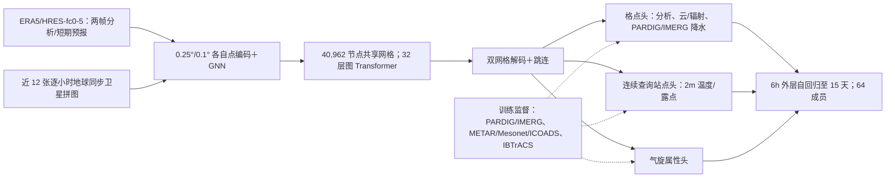

# WeatherNext 3：低延迟卫星观测增强的 15 天多模态概率预报

> Stephan Rasp、Boris Babenko、Dominic Masters、Andrew El-Kadi 等，*WeatherNext 3: Increasing resolution and performance of global weather models with raw observations*，[arXiv:2609.03582v1，2026-09-03](https://arxiv.org/html/2609.03582v1)，Google Research/DeepMind；[产品页](https://deepmind.google/science/weathernext/)。原稿 2026-09-24；按 v1 正文、Tables 1/A.1–A.3 和图 1–7 于 2026-09-25 重新精读。

## 核心贡献与任务边界

WN3 学习给定较旧的分析场和较新的地球同步卫星影像后的天气轨迹条件分布。它可**逐小时起报**，输出 **15 天、64 成员**全球集合；单层格点量和少数高空变量有逐小时/0.1°输出，但大部分高空格点仍为 6h/0.25°，站点与气旋另有输出头，不能统称全部变量为 0.1°逐小时。相较 WeatherNext 2，其主要扩展是观测直接入模、双分辨率、稀疏目标监督和更大的图处理器；论文并未证明抛弃分析场也能保持技巧。[摘要、Table 1、§2.1–2.3](https://arxiv.org/html/2609.03582v1)

## 输入—模型—输出结构

模型把两个相隔 6h 的分析帧和最近 12 张逐小时卫星拼图当作起报输入，辅以季节、地方时、入射辐射、海陆与地形强迫。这里的“原始观测”特指低延迟卫星拼图直接进入预报器；**PARDIG/IMERG 降水、地面站 2m 温度/露点及 IBTrACS 气旋是训练/验证目标，不是同等地位的实时初始化观测源**。PARDIG/IMERG 预测场在后续自回归步可作为输入通道；第一步因业务延迟过大予以遮罩。PARDIG 本身也是独立 AI 模型的卫星雷达降水估计，不能说整套系统都从原始测量端到端训练。[Figure 1、Table 1、§2.3、§A.1.2](https://arxiv.org/html/2609.03582v1)

图按原文方法自绘，虚线是**损失监督**而非直接观测输入；非论文原图。两个原生网格的每点编码宽度 **1024**，各经图神经网络映射到 6 次细分二十面体的 **40,962 节点**，网格潜量相加后经 **32 层图 Transformer**，再分别回译到 0.25°/0.1°格点并叠加跳连；相较 WN2 的 768 维/24 层明显扩容。站点头从 1801×3600 的细网格把跳连与解码潜量拼接，经 **4 层、宽 768 CNN**、双线性查询，再接入由海拔、陆海标志、相对时刻组成的 **1 隐层宽 768 元数据 MLP**，最后由 **2 隐层宽 768 MLP**输出温度和露点；相对湿度由二者换算，并非该头独立学习的第三变量。逐小时起报的延迟收益必须和 6 小时循环可用的分析时间戳对齐，否则会把更新鲜的初值当作纯模型结构技巧。[§2.2、Appendix A.1.1](https://arxiv.org/html/2609.03582v1)

## 数据加工与时效可用性

**原文 Table 1 的输入/目标边界如下。** 同一变量在训练或自回归时可有不同用途；“目标”不等于业务起报时已经获得该观测。[Table 1、§2.3](https://arxiv.org/html/2609.03582v1)

| 资料和覆盖期 | 原生时空尺度与变量 | 在本模型中的用途、可用性边界 |
|---|---|---|
| ERA5 1959–2015；HRES-fc0-5 2016–2023/26 | 13 层的位势/温度/比湿/U/V/垂速，及 2t、2d、10/100m 风、海平面气压、SST、四种云量；全体 0.25°/6h，HRES 的单层子集另 0.1° | 两帧分析类**初始化输入**；同名未来场也是监督目标。HRES-fc0-5 指分析循环之间最近的 0–5h HRES 预报，并非每小时都有新物理分析。另有逐小时单层量、300/500hPa 温度/位势及 1000hPa 风作为小时目标。 |
| 地球同步卫星拼图 2016–2023/26 | 11 光谱通道、0.1°、每小时；最近 12 帧 | 低延迟**直接输入**，同时预报未来卫星场。最新影像延迟不到 1h，而分析类输入约 5h；历史缺图须遮罩。 |
| PARDIG 1999–2023/26；IMERG Final 2000-06–2023/25 | 各为 0.1°/1h 降水估计；PARDIG 由另一个 AI 模型从 GPM 雷达等训练而来 | 主要是**降水监督/输出目标**；业务首步无足够低延迟实测，不当成实时初始化输入。IMERG Final 到 2025-09 停在本版可用窗。 |
| METAR/Mesonet/ICOADS，自 2001 年开始 | 不规则位置/小时报告：2m 温度和露点；2024 平均约 3000 报告/小时 | **站点头训练目标**；前两类固定留出 5% 站点做空间泛化测试。10m 风用于评估而非该站点头的监督目标。 |
| IBTrACS 1979–2023/26 | 气旋中心/存在、最低气压、最大风、最大风半径及 34/50/64kt 四象限风圈；输出 6h | 位置和属性转成 0.25° 网格目标；为逐小时初始化，先将 best-track 插值到小时再栅格化。 |
| 确定性/静态强迫 | 年内进度、地方时、总入射太阳辐射，海陆掩膜、地表位势；站点查询还带精确海拔与陆海标志 | 辅助输入或查询元数据；不是从未来实况偷看的目标。 |

站点分布在山区和高纬海域稀疏，作者每小时还随机取 **2000 个伪站点**，以对应 ERA5/HRES 网格场插值得到温度/露点标签，以抑制缺观测区偏差；所以站点头并非只由真实站点监督。2024 年按整年评估使用截止 2023 年底的 `<2024` 权重；2026-07-01 至 08-11 的近实时对照使用截止 2026-06-30 的版本。截断版本还包括 `<2023`、`<2025` 和 `<2026`，不能把较新权重混入旧年回测。[§2.3、§3.1、Appendix A.1.3](https://arxiv.org/html/2609.03582v1)

缺失与累积量处理直接影响能否复现：旧年代无卫星/降水产品时，相应通道填**训练集均值**，不是把零雨量当缺测；较新年份无 IMERG Final 也同样遮罩。HRES 辐射和降水原为从起报 0h 累计，先**去累计**成所需的 1h/6h 增量；fc0 没有增量时用上一个 HRES 循环的 fc6 补充。训练以 90%/2%/8% 采样“首步不可用/第二步部分可用/全部可用”的自回归输入掩码，模拟业务时延；这与网络层 dropout 是两个不同机制。陆地 SST 缺值由 ERA5 子集最小值填充，并依 0.25° ERA5 有效掩膜或 0.1° HRES 海陆掩膜决定陆地位置。所有输入按训练统计量零均值/单位方差变换；大多数目标也是先对上一输入帧取残差再标准化，小时子步目标对外层对应变量取差。气旋存在和小时子步的归一化另有例外。[Appendix A.1.1–A.1.3](https://arxiv.org/html/2609.03582v1)

训练目标为每场、每层/位置和该场可用时刻的 **fair CRPS**，一次采用两条采样轨迹、按字段自身样本支持求均值再以权重相加，避免稀疏站点/气旋被庞大格点数淹没；随自回归展开对各步求损失。Table A.3 的相对权重包括高空 t/u/v/q/w 各 **1.0**、位势 **0.2**、2m 温度 **0.5**、10/100m 风各 **0.025**、云量/海平面气压/降水网格各 **0.05**、太阳辐射 **1/60**、PARDIG **0.75**、IMERG **0.543**、每个卫星通道 **0.05**、稀疏站点温度/露点各 **1.0**、气旋存在/最大风/最低气压 **20** 和结构半径 **2**；小时高空指定层另 **0.1**。这些是损失系数，不是样本权重或实际物理量单位。降水与云量另加相当于基项 **0.3 倍**的全球 pooled CRPS 约束成员级偏差；站点头加此项会放大网格伪影，故不加。[Appendix A.1.1–A.1.2、Table A.3](https://arxiv.org/html/2609.03582v1)

## 训练顺序与微调：哪些权重冻结

作者按 **1°→0.25°→双网格 0.25°/0.1°**逐级训练，外层步先 12h 再 6h，小时子步作为部分变量的预测目标。粗网格承载全部格点变量；细网格仅承载 0.1° 子集，且最终细网格训练只使用 2016 年后 HRES 高分辨率资料。每次分辨率升级对编码 GNN 消息和作缩放（1°→0.25° 为 1/4，0.25°→0.1° 为 1/25），以保持输入信号尺度。下面逐阶段转录 Tables A.1–A.2；所有阶段共同用 **AdamW、weight decay 0.1、β₂=0.95、batch 64、FGN 双采样公平 CRPS、余弦 LR**，warm-up 步数为 `min(1000, 0.1×本阶段总步数)`。**β₁和完整参数总量未在该表给出，不以默认值冒充披露值。**[Appendix A.1.3、Tables A.1–A.2](https://arxiv.org/html/2609.03582v1)

| 阶段 | 数据/网络与训练、冻结动作 | 步数 | 峰值 LR | 梯度范数裁剪 |
|---|---|---:|---:|---:|
| 1 | 1°，12h 外层步；1959–2015 ERA5＋2016 年后 HRES、卫星/降水可用段；主干训练 | 400000 | `4.95e-4` | 3.5 |
| 2 | 仍 1°，外层步改 6h；主干训练 | 100000 | `7.07e-5` | 5.5 |
| 3 | 双网格都升 0.25°；主干训练 | 32000 | `7.07e-5` | 6.5 |
| 4 | 纳入 IBTrACS 气旋目标；**冻结主干，仅暖启新气旋头** | 5000 | `7.07e-5` | 6.5 |
| 5 | 解冻全部网络，将气旋/原有目标**端到端联合训练** | 20000 | `7.07e-5` | 6.5 |
| 6 | 粗网格 0.25°、细网格 0.1°，新高分辨率分支；主干训练 | 8000 | `7.07e-5` | 5.5 |
| 7 | 对已引入模态做 2→7 个 6h 自回归步渐进微调 | 9000 | 首段 `7.07e-6`；其后五段各 `7.07e-7` | 11.0 |
| 8 | 第一次站点头微调；**冻结主干和所有其他头**，只训站点头 | 12000 | `7.07e-5` | 5.5 |
| 9 | 主干进行 8 步自回归微调，并按评估版别引入较近年份资料 | 1000 | `7.07e-7` | 11.0 |
| 10 | 在阶段 9 主干上合并阶段 8 站点头，再**冻结主干/其他头**，继续训站点头 | 4000 | `1.17e-5` | 5.5 |

阶段 8/10 的 12k/4k 是站点头微调总步数的 **75%/25%** 分拆：让经 8AR 更新的主干和此前训好的站点头重新匹配。阶段 8 之前的数据只到 2022 年底，阶段 9/10 才按评估版本引入更新年份；这不是拿 2024 测试集训练 2024 回测。推理每步把云量裁剪到 [0,1]、比湿/太阳辐射/降水裁剪至非负，避免越界后在自回归里放大。两种随机性须分清：条件归一化层注入低维噪声表示**随机天气演变**，另用 epistemic dropout 表示**模型不确定性**；训练时同一步的两条 CRPS 样本共享一个 dropout 掩码，推理时每个成员和每步独立抽掩码。作者训练 **2 个独立 seed**（WN2 为 4 个），每 seed 约 6.7 天；合计约 4.8 TPUv4 chip-year＋8.9 TPU7x chip-year，单成员 15 天预报在 4 TPUv5p 上约 6.3 分钟。论文没有给出“64 成员一定如何在两个 seed 中分摊”的完整生成配置，不能自填。[§2.2、Appendix A.1.3](https://arxiv.org/html/2609.03582v1)

## 评估协议：先读清真值、成员和时间窗

主体评分用截止 2023 年底训练的版本对 **2024 全年**起报；2026 业务对照仅 **7 月 1 日至 8 月 11 日六周**、00/12 UTC，不能将六周信号当多年气候统计。不同分辨率先双线性插值到真值网格：WN2/ENS 的低分辨率输出对比 WN3 0.1°会叠加分辨率优势，但作者另报告在共同 0.5°采样点仍有较小优势。分析场主要以 **HRES-fc0** 为真值，AIFS ENS 则用自身 control-fc0（同源资料但插值不同），因此图 6 的对照不是完全同一目标；逐小时分析输出只能与 HRES-fc0-5 比到 **≤2 天**。站点评估用训练时固定留出的 METAR/Mesonet 位置，站点头在 0.05°格点查询后双线性插值；粗格点 2m 温度经地形直减率订正，0.05°站点头分数则未订正。[§3.1–3.3、Figures 2–3、6](https://arxiv.org/html/2609.03582v1)

降水须分 **IMERG Final、MRMS、雨量计**三种真值：IMERG 是 WN3 训练目标，非独立真值；MRMS 主要限于美国本土，雨量计稀疏且质控/配准不同。故“相对 IMERG 改善”不等于对独立地面雨量同步改善。训练损失使用两样本 **fair CRPS**；实际 64 成员/多 seed 评分使用 **biased CRPS**，因为成员并非严格独立同分布，ENS 子集又有成员数限制的例外。需要比较同一评分约定，不能把训练损失和图中指标视作相同公式。[§3.1–3.3、Appendix A.2.1](https://arxiv.org/html/2609.03582v1)

## 图表证据：成绩和产物缺陷

| 图 / 评测 | 可核验的作者报告 | 读法 |
| --- | --- | --- |
| 图 2，2024 全年分析验证 | 高空多数变量 CRPS 优于 WN2；中期上层变量平均约 **5%** 改善，作者换算为相同技巧约多 **6h** 时效。表层全部测试变量有优势，新加太阳辐射/云量等对 ENS 有优势 | 少数名义 6h、偶有 12h 变量退步；分析真值为 HRES-fc0，WN2 0.25°插值到 WN3 0.1°会混入尺度效应 |
| 图 3，未见 METAR 站点 | 站点头 T2m 短 lead CRPS 相对 WN2 最多改善 **30%**、相对 ENS 最多 **40%**；10m 风的格点输出早期约降 **5%** | 站点头监督 T2m/露点，RH 为派生；最大改善不是 15 天平均，站点地理覆盖仍不均 |
| 图 4a/b/d，降水/校准 | PARDIG 头短 lead CRPS 对 IMERG 最多改善 **60%**、MRMS **30%**、雨量计 **10%**；低雨强 Brier 改善较大，按 IMERG 的可靠度改善可延至 15 天 | IMERG 不独立，MRMS/雨量计限制明显；高雨强极端 Brier 绝对量很小、长 lead 不稳；PARDIG/IMERG 两头在不同真值下名次可换 |
| 图 4c，业务延迟校正 | 逐小时起报相对每 6h 起报对早期降水约赢得 **2–3h** 的时效等值 | 这是卫星更新/可用时刻和模型的合并收益，非第 15 天均匀增益 |
| 图 5，气旋 | 2024 全球同质配对的轨迹/强度均值误差小幅改善，34kt 风圈范围在 **1–3 天**改善更明显 | 强度和范围集合比 WN2 更欠离散；使用 IBTrACS 和作者的“提前业务化”订正 |
| 图 6，2026 六周实时 | 相对 AIFS ENS v2，高空变量第 1 周平均 CRPS 约改善 **10%**；站点 T2m/RH 优势，降水 PARDIG 对 MRMS 领先 | 不同分析真值/分辨率、WN2 未含 50r1 而另两者有、短样本和降水区域限制，不能称长期全面压倒 AIFS |
| 图 7，联合分布诊断 | pooled 降水评分较好，但单成员 24h PARDIG 可有六边形网格纹、站点成员在 6h 外层步边界有时间跳变；集合中位数较平滑 | 边际 CRPS 胜出不等于空间联合与时间连续性都合格，不能只展示均值图掩盖成员缺陷 |

论文训练的 `cdir` 直接辐射变量被作者认定技巧异常差，**未发布业务预报，也未纳入评估**；不能仅从 Table 1 的输出列表推断所有变量可用。图表上所述比例来自作者文字与对应图注，未把曲线视觉读数冒充正式表格数值；图 2/3/4/6 的改善含不同基线、起报时次、真值和时效，禁止合并成一个“总体提升百分比”。[Table 1 注、§4–5](https://arxiv.org/html/2609.03582v1)

## 对“卫星观测到中期预报”的理解

WN3 是**分析场 + 新鲜卫星直接观测**的融合式观测增强预报；站点和降水产品主要提供多目标监督，而非业务首步直接输入。与完全从观测初始化的论文相比，它回答的是“保留现有分析循环时，直接注入低延迟观测和非分析监督能带来什么”而非“能否摆脱 NWP 分析”。独立复核应冻结 2024/2026 起报窗、业务资料可用时刻、卫星缺图率、站点留出、IMERG 非独立性、AIFS 的不同分析真值，以及 CRPS/极端雨强/空间 pooled 和时间连续性指标；尤其单成员网格纹与 6h 边界不能用集合均值掩盖。尚未找到公开的全量训练配置/权重足以按论文成本端到端重训，本笔记不声称已复现。[§4–5、Appendix A](https://arxiv.org/html/2609.03582v1)

[返回首页](../../README.md)
