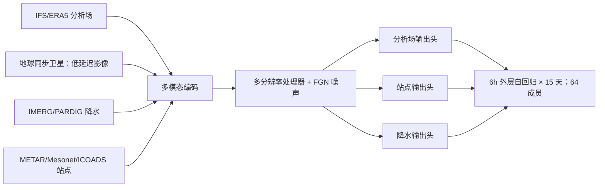

# WeatherNext 3：低延迟卫星观测增强的 15 天多模态概率预报

> Stephan Rasp、Boris Babenko、Dominic Masters、Andrew El-Kadi 等，*WeatherNext 3: Increasing resolution and performance of global weather models with raw observations*，[arXiv:2609.03582v1，2026-09-03](https://arxiv.org/html/2609.03582)，Google DeepMind；[产品页](https://deepmind.google/science/weathernext/)。精读于 2026-09-24。

## 核心贡献与任务边界

WN3 把分析场、地球同步卫星影像、卫星降水估计和地面站等不同观测作为不同“模态”，联合学习未来天气轨迹分布。不同于只接受 ERA5/IFS 分析的 WeatherNext 2，WN3 可利用近实时卫星镶嵌图进行**逐小时起报**，同时生成 **15 天、64 成员**全球集合；单层格点量可到 0.1°，高空格点与站点/降水输出有各自的分辨率和输出头，不能统称全部变量都是 0.1°逐小时。[原文摘要、第 2 节](https://arxiv.org/html/2609.03582)

## 输入—模型—输出结构

模型采用多分辨率编码—处理—解码与 Functional Generative Networks；每个 6 小时外层步建模未来窗口，窗口内把小时级变量视作不同目标。训练优化每模态、每层、每位置、每时间步的**边际 CRPS**；64 成员经噪声采样获得。输入源含 11 通道地球同步卫星拼图、0.1° PARDIG/IMERG 降水、METAR/Mesonet/ICOADS 站点和分析场等。站点输出头可在未见站点位置查询；但 PARDIG 本身也是一个先验 AI 降水产品，不能说整套系统全部直接由原始卫星测量独立训练。[原文第 2 节及附录](https://arxiv.org/html/2609.03582)

图按原文方法自绘，非论文原图。逐小时起报的延迟收益需要和“6 小时循环最新可用分析 + 2 小时外推”等业务资料时间戳对齐，否则容易把新鲜初值当作纯模型技巧。[原文 2.1–2.2、3.2](https://arxiv.org/html/2609.03582)

## 数据加工与时效可用性

分析资料在 2016 年前取 ERA5，之后取 HRES-fc0-5：后者为在 6 小时分析时间之间选最近的 HRES 预报充当小时目标，**不是每小时都存在新物理分析**。地球同步卫星输入使用最近 12 张逐小时镶嵌图、11 个光谱通道；卫星最新帧的业务延迟不足 1 小时，而分析场输入约 5 小时延迟。作者还接入 IMERG 与自建 PARDIG 降水、METAR 等稀疏站点及气旋属性。训练跨度按评估切片截断：例如 `<2024` 模型用于 2024 回测，`<2026-07-01` 用于 2026-07/08 近实时评估；不能把后一模型的较新权重混入 2024 验证。[原文 §2、Table 1、Appendix A.1.3](https://arxiv.org/html/2609.03582)

数据缺口是方法核心：旧年代没有相应卫星/降水产品时，通道填**训练集均值**，不是填真实 0；IMERG Final 对较新时间段未及时到齐也作同样遮罩。HRES 原始辐射和降水为自 0h 起累计，作者先做**去累计**得到所需 1h/6h 增量；0h 处需用上一循环的 HRES-fc6 补足。训练时还随机模拟业务缺失：90% 模拟第一滚动步不可用、2% 模拟第二步部分可用、8% 全部可用。这是抗训练—推理偏移的输入 dropout，不是简单的常规 dropout。陆地 SST 缺值填一个从 ERA5 子集取得的最小值，并在 HRES 网格沿用对应海陆掩膜。输入普遍以均值/方差标准化；目标（可能为差分）也标准化，气旋存在与小时子步目标有例外。[附录 A.1.2–A.1.3](https://arxiv.org/html/2609.03582)

## 训练顺序与微调：哪些权重冻结

作者按 **1°→0.25°→双网格 0.25°/0.1°**逐级训练，外层步先 12h 再 6h，小时子步作为部分变量的预测目标。主网格承载全部格点变量；细网格仅承载 0.1° 子集。每次分辨率升级还对编码 GNN 消息和作缩放（1°→0.25° 为 1/4，0.25°→0.1° 为 1/25），以保持输入信号尺度。下面是原文附录 Tables A.1–A.2 的关键参数转录；所有阶段共同用 AdamW、weight decay 0.1、β₂=0.95、batch 64、FGN 训练采样 2，余弦 LR 和 `min(1000, 0.1×总步数)` warm-up。**β₁未在此表说明，不自填。**[附录 A.1.3](https://arxiv.org/html/2609.03582)

| 阶段 | 训练对象/冻结情况 | 步数 | 峰值 LR |
|---|---|---:|---:|
| 1–3 | 1°/12h → 1°/6h → 0.25° 主模型预训练，主干训练 | 400000 / 100000 / 32000 | `4.95e-4` / `7.07e-5` / `7.07e-5` |
| 4–5 | 加气旋属性头：先**冻结主干仅暖启新头**，再**解冻全模型端到端** | 5000 / 20000 | 均 `7.07e-5` |
| 6 | 细网格升到 0.1°，粗网格保持 0.25°；主干训练 | 8000 | `7.07e-5` |
| 7 | 2→7 个 6h 自回归步渐进微调，原有模态继续输入/监督 | 9000 | 首段 `7.07e-6`，后五段各 `7.07e-7` |
| 8 | 第一次站点头微调：**冻结主干及其他头**，训练 METAR 站点头 | 12000 | `7.07e-5` |
| 9 | 8 步自回归微调；引入更近数据，主干再训练 | 1000 | `7.07e-7` |
| 10 | 第二次站点头微调：在最终滚动主干权重上合并前次站点头，再**冻结主干及其他头**训练站点头 | 4000 | `1.17e-5` |

阶段 8/10 的 12k/4k 即站点头微调的 75%/25% 分拆，是为在更新预报主干后重新适配站点。论文对较近年份另训练不同截断版本，这不是使用 2024 测试集监督 2024 结果。作者还为降水/云量加全球 pooled CRPS（相应边际损失权重的 0.3）抑制单成员全球偏差，但站点不加此项，因会加重网格纹；推理每步裁剪云量至 [0,1]、比湿/辐射/降水至非负。两 seed 合计约 4.8 TPUv4 chip-year + 8.9 TPU7x chip-year；每 seed 墙钟约 6.7 天，单成员 15 天预报约 4 TPUv5p 上 6.3 分钟。训练强度与能力应一起报告。[附录 A.1.2–A.1.3](https://arxiv.org/html/2609.03582)

## 图表证据：成绩和产物缺陷

| 图 / 评测 | 可核验的作者报告 | 读法 |
| --- | --- | --- |
| 图 2，2024 全年分析验证 | 高空多数项目优于 WN2；中期上层变量约 **5%** 改善、相当于约 **6h** 技巧时效 | 少数 6–12h 变量退步；分析真值是 HRES-fc0 |
| 图 3，留出 METAR 站点 | 站点头 T2m 短 lead CRPS 相对 WN2 最多改善 **30%**、相对 ENS 最多 **40%** | 最大收益非 15 天平均；仅站点覆盖位置 |
| 图 4，降水 | PARDIG 对不同真值的短期 CRPS 可改善：IMERG 最多 **60%**、MRMS **30%**、雨量计 **10%** | 相同模型在 IMERG 与 MRMS 真值上会有不同排序；高雨强 Brier 仍难评 |
| 图 4，逐小时起报 | 相比 6 小时起报约获得 **2–3h** lead 等效收益 | 主要影响快速发展过程的早 lead，不宜推广到第 15 天 |
| 图 5–7，气旋及联合分布 | 轨迹/强度略有改善，但强度与范围集合可**欠离散**；个别成员有六边形网格纹与 6h 边界时间跳变 | 边际 CRPS 胜出不等于生成的空间联合场无伪影 |

2024 整年评估与 2026 只有约六周的 AIFS ENS v2 对照，样本窗不同；不得把二者说成同一长期排名。论文自身指出 PARDIG 的六边形伪影、站点头的成员级全球暖/冷偏与 6h 时间不连续，尽管分位数和集合中位数受影响较小。[原文第 3–5 节](https://arxiv.org/html/2609.03582)

## 对“卫星观测到中期预报”的理解

WN3 是**分析场 + 新鲜卫星/站点观测的融合式**观测增强预报；AIFS-DOP 才刻意不依赖 NWP 再分析作为训练与初始化。因此两篇回答不同问题。独立复核应冻结 2024/2026 起报窗口、业务资料可用时刻、卫星缺图率、站点留出方案、PARDIG/IMERG 对照、CRPS 与空间联合指标；尤其对降水极端、气旋和单成员伪影不能只用边际均分判断。[原文讨论](https://arxiv.org/html/2609.03582)

[返回首页](../../README.md)
