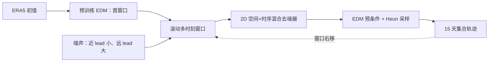

# ERDM：随时效增强噪声的滚动扩散中期集合

> Salva Rühling Cachay、Miika Aittala、Karsten Kreis、Noah Brenowitz 等，*Elucidated Rolling Diffusion Models for Probabilistic Forecasting of Complex Dynamics*，[arXiv:2506.20024v3，2025-12-08](https://arxiv.org/html/2506.20024)（首版 2025-06-24）；[NeurIPS 2025 论文](https://proceedings.neurips.cc/paper_files/paper/2025/hash/02cf868040aa0f0a1e1121cf255fdcfb-Abstract-Conference.html)。精读于 2026-09-24。

## 研究问题与机制

普通条件扩散每步独立采下一个天气场，难直接表达未来不确定性随 lead 扩张及相邻时刻的相关性。ERDM 把 EDM 的噪声日程、预条件和二阶 Heun 采样器嵌入**滚动时间窗**：近时效噪声较低、远时效噪声较高，序列去噪器联合处理多个时刻。首窗由预训练 EDM 初始化；损失权重把容量放在确定性向随机性过渡的中期阶段。其目标并非新 15 天业务基础模型，而是概率预测器的结构改进。[原文第 3–4 节](https://arxiv.org/html/2506.20024)

图由论文方法独立重绘。与一次产生全部长轨迹的生成模型不同，滚动窗保留局部时间相关性又限制计算规模；与单步自回归 EDM 不同，它显式给未来时间位置不同噪声。[原文第 4 节](https://arxiv.org/html/2506.20024)

## 数据与网络：和 GenCast 相像却不相同的地方

ERA5 训练采用 1979–2020 年 12 小时间隔、1.5° 全球场；论文所列 69 通道由 5 个高空变量×13 层和 4 个地表变量组成。附录称约 61000 个训练样本，2021 年从 00/12 UTC 共同起报时间均匀选 64 个初值评测。物理网格 `(240,121)` 因四次 U-Net 下采样不能整除，**仅在网络内部**双线性补到 `(240,128)`，最终卷积前再转回原格；不要把这个内部补形状误写为将 ERA5 数据集改成 240×128。经度卷积循环填充，纬度用零填充。[§5.3、附录 D.1–D.2](https://arxiv.org/html/2506.20024)

同一 ADM 风格 U-Net 供受控比较：四级上下采样、通道倍率 1/2/3/4、ERA5 基宽 256，最低两层空间注意力，不用 dropout；普通 EDM 约 517M 参数。ERDM 在每个上下采样块前加入**因果时间注意力**以耦合窗口帧，约 537M 参数；其 W=6 表示 6 个 12h 时间位置，不是 6 个自然日。ERDM 的 ERA5 设置为 `σ_min=0.002`、`σ_max=500`、噪声曲率 `ρ=-10`、`P_mean=2`、`P_std=1.2`、采样 `N=2`；与论文 Navier–Stokes 设置 `σ_max=200`、`P_mean=0.5`、`N=1.25` 必须分开。[§5.3、附录 D.2](https://arxiv.org/html/2506.20024)

## 优化、预训练初始化与“微调”边界

ERDM 在 ERA5 上**独立训练**，并非用单步 EDM 权重对整个 ERDM 网络微调；预训练 EDM 的作用是推理时**初始化首个滚动窗口**。后续窗口用已部分去噪的旧帧加一帧新噪声滚动，Heun 修正控制采样误差。若称“微调”，容易错误地暗示 ERDM 从 GenCast 或单步 EDM 参数迁移，原文无此陈述。[§4.2、附录 E.1](https://arxiv.org/html/2506.20024)

| ERA5 训练项 | ERDM | 受控单步 EDM 基线 |
|---|---:|---:|
| 有效 batch | 32 | 512 |
| 最长 epoch | 60 | 1000 |
| 学习率 | 5 epoch 线性 warm-up，峰值 `5×10^-4`，后余弦 | 同日程 |
| 优化/稳定 | AdamW，**无** weight decay，梯度范数裁剪 0.8，验证采用 EMA 衰减 0.9999 | 同设置 |
| 网络 | W=6、带时间注意力的 537M U-Net | W=1、517M U-Net |
| 验证集合 | 5 成员 | 5 成员 |
| 正式测试集合 | 10 成员 | 10 成员 |

batch 和 epoch 数差异使两者的总梯度更新次数接近，不代表计算 FLOPs 完全等量：ERDM 的时间窗明显更耗显存。论文 Table 1 的速度/显存实验特意使用**5 成员**，但正式 ERA5 技巧评估使用 **10 成员**，两者不能混同。外部 GenCast 用图网络、1°/0.25°数据并包含 SST；ERDM 所用的 EDM 基线是作者在**本研究 1.5°设置重训的 U-Net**，并不是公开 GenCast 权重的直接替换。[附录 D.1–D.5](https://arxiv.org/html/2506.20024)

## 数据、评分与具体成本

ERA5 1.5°（240×121）含 69 预报变量：5 高空变量×13 层 + 4 个地表量；1979–2020 的 12 小时样本训练，只在 2021 年 **64 个** 00/12 UTC 初值测试。主对照是同架构条件 next-step EDM，外部参照 IFS ENS、NeuralGCM ENS，后者因资料限制使用 **2020 年**而非 ERDM 的 2021 年，Graph-EFM 还来自其论文、训练期更长。IFS ENS 对业务分析验证，ERDM 对 ERA5 验证；所以外部“竞争力”不等于完全对等排名。[原文 5.3 节](https://arxiv.org/html/2506.20024)

| 原文图/表 | 数值或方向 | 代价/反例 |
| --- | --- | --- |
| 图 5，15 天 CRPS | 多数变量/lead 相对单步 EDM 改善，最多约 **10%** | 少数短期不如 IFS ENS；不能宣称全面超越 |
| 图 6，14 天频谱 | 高纬高波数能量较贴近 ERA5，某些变量接近或优于 IFS ENS | 1.5° 网格不代表 0.25° 局地极端结构 |
| 表 1，15 天/5 成员/A100 | EDM **600 NFE、237s、21 GB**；ERDM **120 NFE、209s、49 GB** | 计算函数次数少 5 倍，但显存超过 2 倍、真实耗时只略短 |
| spread–skill | ERDM 与 IFS ENS 较校准；EDM/NeuralGCM 某些 lead 欠离散 | 只测有限初始化/变量，可靠性仍需极端事件检验 |

表 1 的 NFE/时长基于 **5 成员**而非此前追踪表所写的 50 成员；已按原文纠正。训练约 4 张 H200 五天与外部 TPU 基线的硬件、分辨率、优化预算不同，不宜直接化为公平能效倍数。[原文 5.5 节](https://arxiv.org/html/2506.20024)

## 复核重点

应在相同初始化、相同真值、相同成员数下，比较 ERDM 与 EDM 的 CRPS/SSR/频谱以及高温、暴雨的空间联合可靠性；增大至业务分辨率时检查 49 GB 显存是否成为瓶颈。作者自己的消融提醒首窗初始化会损伤短 lead，不能只报告 15 天末的优势。[原文实验和结论](https://arxiv.org/html/2506.20024)

[返回首页](../../README.md)
