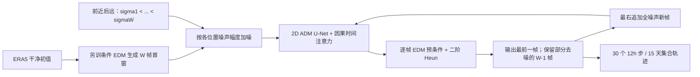

# ERDM：随时效增强噪声的滚动扩散中期集合

> Salva Rühling Cachay、Miika Aittala、Karsten Kreis、Noah Brenowitz、Arash Vahdat、Morteza Mardani、Rose Yu，*Elucidated Rolling Diffusion Models for Probabilistic Forecasting of Complex Dynamics*。2025-06-24 [arXiv v1](https://arxiv.org/abs/2506.20024)，此处所读为 2025-12-08 [v3 正文与附录](https://arxiv.org/html/2506.20024v3)；[*NeurIPS 2025* 正式收录](https://proceedings.neurips.cc/paper_files/paper/2025/hash/02cf868040aa0f0a1e1121cf255fdcfb-Abstract-Conference.html)，[DOI:10.52202/085713-0068](https://doi.org/10.52202/085713-0068)。2026-09-25 复核。以下流程和性能表均按作者原文独立整理，不转载原图。

## 研究问题与机制

普通条件扩散每步独立采下一个天气场，难直接表达未来不确定性随 lead 扩张及相邻时刻的相关性。ERDM 把 EDM 的噪声日程、预条件和二阶 Heun 采样器嵌入**滚动时间窗**：近时效噪声较低、远时效噪声较高，序列去噪器联合处理多个时刻。首窗由预训练 EDM 初始化；损失权重把容量放在确定性向随机性过渡的中期阶段。其目标并非新 15 天业务基础模型，而是概率预测器的结构改进。[原文第 3–4 节](https://arxiv.org/html/2506.20024)

图由论文方法独立重绘。与一次产生全部长轨迹的生成模型不同，滚动窗保留局部时间相关性又限制计算规模；与单步自回归 EDM 不同，它显式给未来时间位置不同噪声。[原文第 4 节](https://arxiv.org/html/2506.20024)

## 数据与网络：和 GenCast 相像却不相同的地方

ERA5 训练采用 1979–2020 年 12 小时间隔、1.5° 全球场；训练序列可从 00/06/12/18 UTC 取起点，约 **61,000** 个训练样本。2021 年测试只从 00/12 UTC 起报时间**均匀取 64 个初值**，不是全年每日 730 多起报。69 个双向预报变量：温度 `t`、位势 `z`、比湿 `q`、纬向/经向风 `u/v` × **50、100、150、200、250、300、400、500、600、700、850、925、1000 hPa** 共 13 层，加 `2t`、`mslp`、`10u`、`10v`；另以**输入而非输出**提供海陆掩膜、土壤类型、地形及球坐标 `sin(lat), cos(lat)cos(lon), cos(lat)sin(lon)` 六张静态图。[原文 §5.3、D.1](https://arxiv.org/html/2506.20024v3)

WeatherBench-2 数据物理网格 `(240,121)` 因四次 U-Net 下采样不能整除，**仅在网络内部**双线性补到 `(240,128)`，最终卷积前再转回原格；不要把这个内部补形状误写为将 ERA5 数据集改成 240×128。经度卷积循环填充，纬度用零填充。论文没有逐通道列出 ERA5 均值/标准差、缺测过滤或静态图缩放表；截至本次复核，作者指向的 [NVlabs/ERDM](https://github.com/NVlabs/ERDM) 不可访问，[作者的公开占位仓库](https://github.com/salvaRC/erdm)明确称代码尚待发布，故**这些预处理细节及训练权重不能据源码二次核验**，不能照搬 GenCast 的归一化参数。[原文 D.1–D.2；作者仓库 README](https://github.com/salvaRC/erdm/blob/main/README.md)

同一 ADM 风格 U-Net 供受控比较：四级上下采样、通道倍率 1/2/3/4、ERA5 基宽 256，最低两层空间注意力，不用 dropout；普通单步 EDM 约 517M 参数。ERDM 在每个上下采样块前加入**因果时间注意力**及随噪声调节的归一化以耦合窗口帧，约 537M 参数；其 `W=6` 表示 6 个 12h 时间位置，不是 6 个自然日。ERDM **不直接拼接干净的上一帧作为去噪器输入**：短时条件由已部分去噪的窗口与外部首窗预报承载；而条件 EDM 基线将干净初值沿通道拼入。这个区别决定了无法把 EDM 与 ERDM 视作只更换采样器。[原文 §3–4、D.2–D.3](https://arxiv.org/html/2506.20024v3)

按原文 Eq. 1，时间窗中第 `w` 帧的局部扩散时间是 `1-(w-t)/W`；用 EDM 的 `σ_min/σ_max/ρ` 曲线切成 W 段，令**越远的帧噪声越大**。去噪到窗口右移时，后 `W-1` 帧的噪声幅度恰好匹配新窗口前 `W-1` 个位置，因而不用每个预报时刻重做完整生成；只给新最远位置补一帧纯噪声。训练时对一个全局 `t∼U[0,1)`、对每帧按该位置噪声加噪，使用**逐帧 EDM 预条件** `c_skip/c_out/c_in/c_noise`；损失对每帧乘 `λ(σ)×f(σ; P_mean,P_std)`，其中 `λ` 是 EDM 的目标尺度因子，`f` 是对数正态密度，特意强调中等噪声/确定性向随机性过渡的部分。单把每帧套同一个 EDM 噪声或取消 `f` 都不是本文方法。[原文 Eqs. 1–5、Algorithm 1](https://arxiv.org/html/2506.20024v3)

ERA5 主实验为 `σ_min=0.002`、`σ_max=500`、曲率 `ρ=-10`、`P_mean=2`、`P_std=1.2`、采样 `N=2`；与 **Navier–Stokes** 研发/消融的 `σ_max=200`、`P_mean=0.5`、`N=1.25` 必须分开。主实验实际用**确定性二阶 Heun**（churn `S_churn=0`），原文 Algorithm 2 只是为了说明机制的 **Euler 简版**；附录 Algorithm 3 才给出二阶修正。噪声先验采用跨帧渐进相关 `α=1`，在训练和推理都用；即使每个集合成员采样不同，也不等于扩散 ODE 内打开随机 churn。[原文 §4、§5.3、C.3–C.4、E](https://arxiv.org/html/2506.20024v3)

## 优化、预训练初始化与“微调”边界

ERDM 在 ERA5 上**端到端独立训练**，并非用单步 EDM 权重对整个 ERDM 网络微调；另训的条件 EDM 只在推理时从干净初值自回归地产生 `W=6` 帧，供 ERDM **初始化首个滚动窗口**。ERDM 再按每帧该有的噪声水平加噪、联合去噪、输出第一帧、保留后五帧并向最远端补全噪声。附录另试过“先无条件预训空间主干、再微调天气序列”，但这**是失败消融**（Navier–Stokes Table 2 CRPS 从 0.904 恶化至 1.475），不是最终方法。若只说“EDM 预训练后微调 ERDM”，会错误地暗示参数迁移；原文恰恰认为序列任务端到端更好。[原文 §4.2–4.3、附录 E/E.1](https://arxiv.org/html/2506.20024v3)

| ERA5 训练项 | ERDM | 受控单步 EDM 基线 |
|---|---:|---:|
| 有效 batch | 32 | 512 |
| 最长 epoch | 60 | 1000 |
| 学习率 | 5 epoch 线性 warm-up，峰值 `5×10^-4`，后余弦 | 同日程 |
| 优化/稳定 | AdamW，**无** weight decay，梯度范数裁剪 0.8，验证采用 EMA 衰减 0.9999 | 同设置 |
| 网络 | W=6、带时间注意力的 537M U-Net | W=1、517M U-Net |
| 验证集合 | 5 成员 | 5 成员 |
| 正式测试集合 | 10 成员 | 10 成员 |

batch 和 epoch 数差异使两者的总梯度更新次数接近，不代表计算 FLOPs 完全等量：ERDM 的时间窗明显更耗显存。**训练期验证** ERA5 用 5 成员，正式技巧测试用 **10 成员**；论文 Table 1 的速度/显存实验又特意使用 **5 成员**、单 A100 混合精度，不能混同。ERA5 训练约 **4×H200、近 5 天**；研发也用过 8–16×A100。外部 GenCast 用图网络、1°/0.25°资料并包含 SST；ERDM 所用的 EDM 基线是在**本研究 1.5°设置重训的 U-Net**，不是公开 GenCast 权重的直接替换。ERDM 与 EDM 还分别采用 32 与 512 的有效 batch，受控比较依然不是逐项等算力实验。[附录 D.1–D.5](https://arxiv.org/html/2506.20024v3)

## 数据、评分与具体成本

ERA5 1.5°（240×121）含 69 预报变量；1979–2020 的 12 小时样本训练，只在 2021 年 **64 个** 00/12 UTC 初值测试。主对照是同架构条件 next-step EDM，外部参照 IFS ENS、NeuralGCM ENS，后者因资料限制使用 **2020 年**而非 ERDM 的 2021 年，Graph-EFM 也来自别篇论文、训练期**多约 20 年**。IFS ENS 虽用相同的 2021 起报日期，却对**业务分析**验证，ERDM/EDM 对 **ERA5** 验证；所以外部“竞争力”不等于完全对等排名。作者还特意将 ERDM 2021/2022 的同类起报作敏感性对比：多数变量年际差异 <3%，但 z500 在短于 8 天可差到约 **15%**，更证明异年图线不宜直接排名。[原文 §5.3、附录 E.2](https://arxiv.org/html/2506.20024v3)

空间聚合按格点纬界 `sin(上纬界)−sin(下纬界)` 做面积权重，免得极地小网格过度代表。正式概率分数使用**有限成员无偏 CRPS**：平均成员对实况绝对误差，减去成员两两差异项，后者分母为 `2M(M−1)`；将所有成员均值代入单值 MAE 不是同一指标。SSR 则是集合标准差与**集合均值 RMSE**之比，再乘 `sqrt((M+1)/M)` 小集合修正；接近 1 才表示分散度与误差量级匹配，单靠 SSR≈1 也不能证明极端事件可靠性。[原文附录 D.6 Eqs. 25–27](https://arxiv.org/html/2506.20024v3)

| 原文图/表 | 数值或方向 | 代价/反例 |
| --- | --- | --- |
| 图 5，15 天 CRPS | 多数变量/lead 相对单步 EDM 改善，最多约 **10%** | 少数短期不如 IFS ENS；不能宣称全面超越 |
| 图 6，14 天频谱 | 高纬高波数能量较贴近 ERA5，某些变量接近或优于 IFS ENS | 1.5° 网格不代表 0.25° 局地极端结构 |
| 表 1，15 天/5 成员/A100 | EDM **600 NFE、237s、推理 21 GB / 训练 19 GB**；ERDM **120 NFE、209s、推理 49 GB / 训练 53 GB** | 计算函数次数少 5 倍，但显存超过 2 倍、真实耗时仅快约 12%；不是 5 倍端到端加速 |
| spread–skill | ERDM 与 IFS ENS 较校准；EDM/NeuralGCM 某些 lead 欠离散 | 只测有限初始化/变量，可靠性仍需极端事件检验 |

**正式版 Table 3 的可读数值**（CRPS，越低越好；[NeurIPS 正式 PDF 第 35 页](https://proceedings.neurips.cc/paper_files/paper/2025/file/02cf868040aa0f0a1e1121cf255fdcfb-Paper-Conference.pdf)的列头确为 3/7/**14 天**，表注却写“3/7/10 天”；这不是 arXiv HTML 转换问题。本笔记按列头转录，仍保留需作者勘误的边界）：

| 变量 / lead | 作者重训 EDM | ERDM | IFS ENS | 正确解读 |
|---|---:|---:|---:|---|
| 10m 纬向风，3d | 0.6923 | **0.6748** | 0.6830 | ERDM 对同设置 EDM 更低；IFS ENS 真值不同。 |
| 10m 纬向风，7d | 1.324 | **1.312** | 1.318 | 差距很小，不从单一表值宣称显著。 |
| 10m 纬向风，14d | 1.769 | **1.737** | 1.785 | 末期 ERDM 表值最低。 |
| 500 hPa 位势，3d | 76.04 | 69.29 | **58.41** | 同为 2021 起报的三模型中，IFS ENS 表值更低。 |
| 500 hPa 位势，7d | 204.9 | 197.5 | **183.4** | 同为 2021 起报的三模型中，IFS ENS 仍更低。 |
| 500 hPa 位势，14d | 327.4 | **316.7** | 317.3 | 末期差约 0.6；不同验证分析且无表内区间，不能下“全面胜 IFS”结论。 |

10m 风单位依原变量为 m/s，位势 `z500` 为 m²/s²，表格中的 CRPS 保留对应量纲。正式 PDF 还列 **NeuralGCM ENS**：`10u` 三档均 N/A，`z500` 的 3/7/14d 为 **54.59/173.1/311.1**；因其是 **2020 年、与 ERDM 不同起报/验证协议**，不能把更低的表值作同年公平胜负。作者的 Fig. 5/10–13 展示更多变量/lead 及 SSR；Fig. 6/14 是 **14 天、60–90°高纬**的谱密度相对 ERA5 比较，不能推出全球每个尺度的物理守恒。Fig. 15–16 的 2022-01-01 单起报天气图不是上述 2021 年 64 起报定量样本。[正式 PDF 第 35 页；原文 §5.3–5.5、附录 F.2–F.4](https://proceedings.neurips.cc/paper_files/paper/2025/file/02cf868040aa0f0a1e1121cf255fdcfb-Paper-Conference.pdf)

## 消融：哪些证据来自流体任务，不能冒充 ERA5 重训

主文 §5.4 和[附录 Table 2](https://arxiv.org/html/2506.20024v3)的系统性消融主要在 **221×42 Navier–Stokes 五条测试轨迹**、64 步、50 成员上做，非 ERA5 15 天重新训练。下表严格照原表记 `平均 CRPS×10²`（表内的 **0.904 并非真实 CRPS=0.904 的无缩放值**）；每次只改指定构件，越低越好。基准流体配置为 `W=6,σmin=.002,σmax=200,ρ=-10,Pmean=.5,Pstd=1.2,α=1,N=1.25`，不能混成前述 ERA5 超参。

| Table 2 方案 | 平均 CRPS×10² | 与基准的机制差异 |
|---|---:|---|
| ERDM 基准 | **0.904** | 二阶 Heun、固定渐进噪声、对数正态权重、因果时序层。 |
| 只用 Euler | 1.160 | 少一次校正网络调用，速度换技巧。 |
| 去掉 `f(σ)` | 2.168 | 中噪声窗口失去强调，CRPS 比基准差约 2.4 倍。 |
| 用 EDM 默认 `Pmean=-1.2` | 2.001 | 直接搬默认训练权重不适合此滚动日程。 |
| 每帧独立噪声 | 1.176 | 相比 `α=1` 相关噪声退步；但这不是 ERA5 专项量化。 |
| 训练时随机改噪声日程 | 1.904 | 固定经调参日程约好一倍。 |
| 用 EDM 默认 `ρ=7` | 1.982 | 对应曲线让近未来过噪，约好两倍的反例。 |
| 将时间堆作 2D 通道 | 3.931 | 缺显式时间层，约 4.3 倍 CRPS。 |
| 空间骨干先无条件预训再微调 | 1.475 | 该微调路线在流体消融失败，不是最终 ERA5 训练。 |
| 首窗只持久化初值 | 14.789 | 短期到长滚动都不合适；真实未来帧初始化只是不可部署的上界。 |

`W=4/8/12` 在该表分别为 1.411/1.258/1.709，12 帧已明显退步；作者对每个窗口还另调 `Δt∈{.25,.5,.8,1}` 后才选最优，因此这些不是单纯固定采样预算的架构比较。Fig. 7 表示不同首窗初始化的差距主要集中前约 **10 个流体时间步**，最终渐收敛；**ERA5 的早期短时效弱项**可能与首窗有关，但不能把流体图的步数直接译成 ERA5 的 5 天。Fig. 8 更显示 2021→2022 验证年变化，Z500 短 lead 可达约 15%，提醒不同年份的外部模式名次不稳定。[原文附录 E/E.1/E.2](https://arxiv.org/html/2506.20024v3)

## 复现边界与判断

这篇最有说服力的内部比较是**同样 1.5° ERA5、同年 64 起报、同为 10 成员**的 ERDM 对作者重训单步 EDM；它支持“滚动逐时噪声与联合时序去噪能改善 15 天概率评分”，但不证明 ERDM 在所有变量都压倒业务 IFS ENS。外部 IFS/NeuralGCM/Graph-EFM 的年份、真值、分辨率、训练预算仍不同；文中没有极端暴雨/热浪可靠性、台风路径或 0.25° 高分辨率测试。49 GB 单卡推理内存与 53 GB 的表 1 单卡训练量提示向业务分辨率放大有实质瓶颈。[原文 §5–6、附录 D.4–D.6](https://arxiv.org/html/2506.20024v3)

复现时优先核实：ERA5 各变量归一化与静态图处理、首窗 EDM 的实际权重/rollout、相关噪声生成、Heun/churn 与有限成员 CRPS 修正。论文写了代码链接，但截至本次核验 [NVlabs/ERDM](https://github.com/NVlabs/ERDM) 不可访问，NVIDIA [研究页](https://research.nvidia.com/publication/2025-12_elucidated-rolling-diffusion-models-probabilistic-weather-forecasting)指向的[作者仓库](https://github.com/salvaRC/erdm/blob/main/README.md)只有“稍后发布代码”的说明；所以即使训练超参表较全，**实验脚本、数据统计量和权重的逐行复现仍不可核验**。后续如真正释出代码，必须对照固定提交核对而不是把“论文声明开源”当成已经可运行。[作者仓库 README](https://github.com/salvaRC/erdm/blob/main/README.md)

[返回首页](../../README.md)
