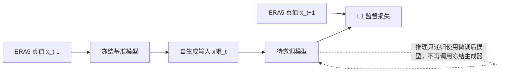

# SOFT：用模型自己的预测修正自回归天气预报的输入分布

> Yun-Ye Cai, Hsuan-Tien Lin. *Nipping the Butterfly Effect in the Bud: Self-Output Fine-Tuning for Autoregressive Weather Prediction*. arXiv:2607.21080v1，2026-07-23。  
> [论文摘要](https://arxiv.org/abs/2607.21080) · [HTML 全文](https://arxiv.org/html/2607.21080v1) · [论文所列代码地址](https://github.com/yunye0121/SOFT)  
> 阅读日期：2026-09-24；附录复核：2026-09-25。来源性质：预印本；HTML 顶部的 ACM 会议信息仍是未填写的模板文字，不能据此认定已经在会议发表。论文虽列出代码地址，本次访问该地址未能取得公开仓库，以下参数仅依据论文，**未声称经代码复验**。

## 先读结论

论文研究天气模型逐步滚动时的一个基本失配：训练时输入是真实大气状态，推理第二步起输入是模型自己的预测。作者认为，第一步预测即使视觉上逼真，也会携带可被模型识别的分布偏移；之后每一步既放大旧误差，又在偏移的输入上制造新误差。SOFT 的办法很直接：用冻结的基准模型先产生一步预测，再把这份“带有模型自身误差”的场作为训练输入，监督正在微调的模型预测再下一步真实场。[原文第 3–4 节](https://arxiv.org/html/2607.21080v1)

论文在三个区域的 ERA5 数据上，将 Aurora 区域模型滚动到 168 小时。SOFT 通常降低逐变量 MAE，并在作者选择的特征空间里减小预测分布与真实分布的距离。这个证据支持“自输出微调有助于区域 7 天自回归预报”；它没有验证全球 10–15 天技巧，也没有概率集合预报结果。[原文第 5 节](https://arxiv.org/html/2607.21080v1)

## 1. 研究问题和因果链

设单步天气模型为 $f_\theta$，真实大气演化为 $g$。常规监督训练让模型在真实 $x_t$ 上最小化 $f_\theta(x_t)$ 与 $x_{t+\delta}$ 的误差；多步推理却从第二步起计算 $f_\theta(\hat x_t)$。令单步固有误差 $\epsilon_t=f_\theta(x_{t-\delta})-x_t$，总误差 $e_t=\hat x_t-x_t$。论文在局部线性化近似下给出 $e_t\approx(J_g+J_\epsilon)e_{t-1}+\epsilon_t$：新误差和上一步误差经动力/模型误差雅可比传播共同造成增长。此式要求可微且上一时刻误差足够小，并非真实大气中任意轨迹的全局增长定理。图 2 的“直接远期预测”与自回归曲线支持传播误差的重要性，但因训练目标/步长不同，不是单独识别因果的随机对照。[原文 §3.2、图 2](https://arxiv.org/html/2607.21080v1)

作者进一步用 AuroraTW 的表示空间比较 ERA5 与单步预测：图 3 中两者肉眼相近，t-SNE 和一个二分类探针却可以将其区分。论文称探针准确率接近 100%。这一证据说明模型特征对一步预测的伪迹很敏感；它本身尚不能证明这种偏移是长期误差的唯一或主要因果来源。作者通过“直接预测远期目标”和自回归比较来补强传播误差的论点，但这两种训练/推理任务仍可能有其他差异。[原文 §3.2–3.4](https://arxiv.org/html/2607.21080v1)

## 2. SOFT 实际怎样训练

1. **基准单步模型**：从全球 Aurora 预训练权重出发，在区域 ERA5 上微调 $f_{\theta_{base}}(x_t)\rightarrow x_{t+\delta}$，损失为格点 L1。这个已收敛权重同时初始化后续两个副本。
2. **冻结生成器**：从 ERA5 取相邻三时刻真值 $(x_{t-\delta},x_t,x_{t+\delta})$，以冻结副本得到 $\hat x_t=\operatorname{stopgrad}[f_{\theta_{base}}(x_{t-\delta})]$。中间的真实 $x_t$ 用来对齐时间，并**不是**微调预测器的输入。这一步有意制造推理时会遇到的模型偏移。
3. **微调预测器**：以同样的基准权重初始化可训练副本，用 $\hat x_t$ 预测真实 $x_{t+\delta}$，最小化 $\lVert f_\theta(\hat x_t)-x_{t+\delta}\rVert_1$。真实标签来自 ERA5；没有对抗判别器、显式 FID 损失或让模型模仿自身错误的教师目标。
4. **推理**：使用标准自回归循环，不增加额外生成器或专用去噪器。

以下是依据论文方法节重绘的训练/推理结构图，并非复制原文插图：[原文 §4](https://arxiv.org/html/2607.21080v1)。

这种训练只对一步自生成输入之后的预测器求梯度；它避开了对长序列完整反传的显存开销。论文定理 4.1 在线性设置下给出的 $k\geq2$ 步损失上界为 $L_{\mathrm{rollout}}\leq2L_{\mathrm{SOFT}}+4\lVert W\rVert^2\lVert(W-\tilde W)X_t\rVert^2+4\lVert W\rVert^2\lVert(W^{k-1}-W)X_t\rVert^2$。后两项是基准权重与微调权重的差异、以及单步替代多步的结构误差；它们未被证明对真实 Aurora 足够小，因此上界不能解读为“SOFT 必然优于任意 rollout 训练”。[原文 §4、附录 B](https://arxiv.org/html/2607.21080v1)

## 3. 数据、模型和比较是否公平

| 项目 | 论文设定 |
| --- | --- |
| 数据取得 | ECMWF Climate Data Store 的 ERA5，以 `cdsapi` 下载 NetCDF；论文称原资料 0.25°、逐小时，实际模型取样步长未另给明确预处理脚本 |
| 区域切片 | 台湾周边 5–39.75°N、100–144.75°E；欧洲 35–69.75°N、0–44.75°E；“北美”表列 30–64.75°N、115–159.75°E。每块均为 140×180 格点 |
| 时间切分 | 训练 2013–2018；验证 2022；测试 2023 |
| 变量 | 高空 u/v/t/q/z，气压层 50、250、500、600、700、850、925 hPa；地面 u10/v10/t2m/msl。按附录表 7 字面相乘是 5×7＋4＝39 个物理场 |
| 主骨干 | Microsoft Aurora 预训练模型，先做区域单步微调 |
| 迁移检查 | 从头训练的 Pangu-Weather 架构复现版本 |
| 评测 | 6、24、96、132、168 小时；格点 MAE、Aurora 编码器特征上的 FID |
| 比较 | 单步训练、2 步 rollout、replay buffer、高斯噪声增强、特征匹配 |

论文只写“遵循 Aurora 仓库的默认归一化”，没有列出本试验的逐字段均值/标准差、缺测填补或具体时间抽样间隔。ERA5 虽为逐小时资料，报告 6/24/…/168 小时评分也**不能单独证明模型每一步都按 6 小时推理**。复现者应保留原 NetCDF 的坐标/时间元数据，并向作者确认归一化表、相邻三时刻的 $\delta t$ 与区域边界处理。[原文附录 C.1、C.4.1](https://arxiv.org/html/2607.21080v1)

### 3.1 从预训练到消融的完整训练日程

| 阶段或基线 | 实际操作和论文披露的参数 |
| --- | --- |
| AuroraTW 单步适配 | 全球 Aurora 预训练权重 → 区域 ERA5 真值单步 L1 微调 **400 epoch**；该权重同时作冻结生成器和可训练 SOFT 的初始化 |
| 主策略统一续训 | 单步权重上继续 **50 epoch**；线性 warmup 占前 **10% optimizer steps**，之后 cosine annealing；峰值 LR **3×10⁻⁵**、weight decay **1×10⁻³**、batch **32**，**8×NVIDIA H200** |
| rollout 比较 | 展开 **K＝2** 步；batch **16**、梯度累积 **2**，保持名义有效 batch 32，但论文没证明相同计算/显存 |
| replay buffer 比较 | buffer 容量 **250**、fine-tuning rate **1**、replay start step **0**；缓存状态的新旧混合细节未列出 |
| 特征匹配比较 | `timm` 的 ResNet50 判别器；每 **10 epoch** 更新一次、持续 **10 epoch**，取**所有层**判别器嵌入。它是比较基线，**不是 SOFT 的训练组件** |
| 高斯噪声比较 | 输入噪声标准差 **σ＝0.05**；单位/标准化空间依照正文未明确，因此不能对应到物理单位 |
| 叠加与架构消融 | 在既有 rollout/replay 等检查点上再施加 SOFT **25 epoch**；PanguTW 为作者按公开伪代码重实现的 3D Earth-Specific Transformer，在同一区域**从头训练**单步模型，再按相同方案续训 |

作者估计 AuroraTW 单步适配约 **24 小时**，各主策略续训约 **4–6 小时**；既未给出 SOFT 独立 GPU-hour 对照，也未完整公开随机种子、权重初始化版本、优化器名称、精确 step 数和每项实验显存。附录 C.4.5 只说消融“优化器不变”，**不能据探针的 Adam 推断预报器也是 Adam**。Aurora 使用 3D Swin Transformer/Perceiver IO，PanguTW 是 3D Earth-Specific Transformer；论文没有为这里的区域权重公开参数量或网络层配置，不应从原版全球模型照搬。[原文附录 C.2、C.4.1–C.4.5](https://arxiv.org/html/2607.21080v1)

### 3.2 分布偏移诊断和评估协议

探针使用**冻结 AuroraTW 3D Swin 编码器**的嵌入，将 ERA5 真值与单步生成场做平衡二分类；分类器为**两层残差 MLP＋GELU＋一维 BatchNorm＋Dropout**，用 Adam/BCE 训 **50 epoch**，作者称近 100% 准确率。训练/测试样本数、独立日期划分、类间气候/时间配对方式没有列出；接近完美的辨别率可能同时捕捉到平滑或频谱伪迹。FID 也取同一冻结 AuroraTW 编码器嵌入，故它不是独立物理真值验证。MAE 为空间平均绝对误差；逐变量的单位取决于原场，不能把 2m 温度与 Z500 的原始数值直接相除比较。[原文 §3.3、附录 C.3–C.4.4](https://arxiv.org/html/2607.21080v1)

数据表中的“北美区域经度 115°E–159.75°E”与地理位置不符，疑似方向标记笔误；复现前必须核对下载脚本和网格坐标，不应自行改成 W 或 360° 表示。训练期 2013–2018 与测试期 2023 之间隔开年份，但论文未说明 2019–2021 资料的处理，也未把跨气候态外推作为独立实验。三个区域格点相同，然而全球边界、极区及海气耦合问题仍未覆盖。结论的“局部区域”外推边界也与论文 Limitations 段只称“East Asia subset”的表述略有张力。[原文附录 C.1、Limitations](https://arxiv.org/html/2607.21080v1)

## 4. 数值结果怎样读

论文表 2 在 **168 小时**给出 2 米气温、10 米风、850 hPa 温度、500 hPa 位势高度的区域 MAE。以下选取台湾区域的四个变量，数值越小越好：[原文表 2](https://arxiv.org/html/2607.21080v1)。

| 策略 | t2m | u10 | T850 | Z500 |
| --- | ---: | ---: | ---: | ---: |
| 单步训练 | 3.029 | 3.718 | 3.255 | 504.107 |
| 2 步 rollout | 2.898 | 3.447 | 3.050 | 474.561 |
| replay buffer | 2.728 | 3.333 | 2.923 | 446.555 |
| **SOFT** | **2.609** | **3.266** | **2.789** | **442.777** |

相对单步训练，SOFT 对上述四项的作者报告降幅约为 13.9%、12.2%、14.3%、12.2%。这个表不能概括为“三个区域所有变量都最优”：例如欧洲区域 168 小时的 t2m 和 T850，replay buffer 的 MAE（4.566、4.996）低于 SOFT（4.762、5.187）；北美 Z500 也如此（1213.615 对 1217.320）。作者另以表 3 统计每个 lead 下 SOFT 在更多变量上取得最小误差，这比说它“全面胜出”更准确。[原文表 2–3](https://arxiv.org/html/2607.21080v1)

FID 结果同样要限定口径：168 小时台湾、欧洲、北美分别为 0.737、1.233、1.556。SOFT 在台湾和北美优于文中列出的其他策略，但欧洲 replay buffer 的 1.159 低于 SOFT 的 1.233。FID 使用 Aurora 编码器提取特征，因此它衡量该特征空间内的分布接近程度，不能单独证明动力守恒、降水结构或极端事件真实性。[原文表 4、附录 C.4.3](https://arxiv.org/html/2607.21080v1)

欧洲和北美的四变量数字不能省略，因为它们限定了结论。以下按原文表 2 的 **168h** 行逐字录入，顺序均为 t2m / u10 / T850 / Z500；每一列都是同一区域、同一变量下比较：[原文表 2](https://arxiv.org/html/2607.21080v1)。

| 区域 | 单步基准 | replay buffer | SOFT | 结论 |
| --- | --- | --- | --- | --- |
| 欧洲 | 5.250 / 3.863 / 5.531 / 1513.869 | **4.566 / 3.528 / 4.996 / 1288.561** | 4.762 / 3.570 / 5.187 / 1306.609 | 四项均是 replay buffer 更低；SOFT 仍优于单步 |
| 北美 | 5.296 / 4.247 / 5.916 / 1417.180 | 4.729 / 3.929 / 5.444 / **1213.615** | **4.657 / 3.824 / 5.391** / 1217.320 | SOFT 三项更低，Z500 replay 略低 |

原文表 3 的“win rate”实际是**逐时效胜出项数**，SOFT 在 6/24/96/132/168h 分别为 **37/31/37/36/34**。将同一列六种方法的数字相加，每个 lead 都恰为 **44**，但附录表 7 的高空五变量×七层＋四地面变量只有 **39** 个物理场；论文没有解释是否另加了诊断场或用了另一字段表。因此应把表 3 当作作者给出的胜出次数，暂**不能**写成“37/39 个变量”或“34/44 个真实变量”这类带明确分母的比例。原文表 1 的 168h 四项 MAE（2.609/3.266/2.789/442.777）又与 **SOFT** 在表 2 的台湾列一致，而同一表的 FID **1.105** 却与表 4 的台湾**单步基准**一致（SOFT 为 0.737）；这张跨时效表的模型归属混杂，曲线只能谨慎作误差/漂移随 lead 变化的示例，不宜当单一模型的全部性能序列。[原文表 1–4、表 7](https://arxiv.org/html/2607.21080v1)

组合实验也并非一律改善。表 5 的台湾四变量中，rollout＋SOFT 相对 rollout 的 168h MAE 为 **2.785/3.362/2.901/468.248** 对 **2.898/3.447/3.050/474.561**，四项改善；replay＋SOFT 为 **2.694/3.311/2.876/459.404** 对 replay 的 **2.728/3.333/2.923/446.555**，前三项改善但 Z500 **恶化约 2.9%**。表 6 的 PanguTW 从 **29.389/40.051/10.749/2333.240** 降到 **27.902/25.607/4.451/1475.974**；其基准绝对误差远高于 AuroraTW，作者只证明“在这份区域从头训练的复现模型上也能改进”，不能直接证明官方 Pangu-Weather 全球预训练模型同样受益。[原文表 5–6](https://arxiv.org/html/2607.21080v1)

### 4.1 结构图与性能图的逐图导读

- **图 1–2：问题定位。** 图 1 展示 6→168h 滚动误差与 SOFT 曲线；图 2 将自回归、真值输入的 oracle 和一次直达远期目标比较。后者有助于分辨传播与任务本身难度，但直达模型训练协议不同，不能把曲线差全归因于输入分布漂移。
- **图 3–5：可见场与不可见特征。** 图 3 是 2023-01-10 08:00 的 ERA5/一步预测示例，图 4 是 AuroraTW 编码器的 t-SNE，图 5 为作者提出的反馈机制图。t-SNE 分簇与探针高准确率只说明该嵌入可辨别来源，不能证明两类场位于不相交的真实大气流形。
- **图 6：方法总图。** 先用真值单步训练，再以冻结模型的输出构造 SOFT 输入；上面的 Mermaid 图是按此图重绘的流程。推理端只有微调后模型递归，冻结副本是训练时的数据生成器。
- **图 7：第 168h 个例。** 原文给出的 2023-01-28 12:00 UTC 起报，在四类场上比较真值、AuroraTW、SOFT 及误差；“个例更接近”并非全年地域或极端事件技巧统计。
- **附录图 8–11：不同 lead 的另一组个例。** 对 **2023-06-21 12:00** 起报，依次给出 t2m、u10、T850、Z500 的 6/24/96/168h 场图。它们扩展可视化覆盖，但仍是特定起报，不可替代独立随机种子、年际或概率集合检验。[原文图 1–11、附录 D](https://arxiv.org/html/2607.21080v1)

## 5. 我认为最有价值、最需谨慎的地方

方法的实用性是它针对训练—推理失配提出成本较低的修正，且可附加在已有单步模型上。它比单纯加高斯噪声更贴近模型真正会产生的误差形态；这解释了为何论文在多个变量和 lead 上观察到稳定收益。

但论文的“第一步即出分布”论据部分依赖于同一个 Aurora 特征编码器；跨骨干、跨再分析资料的探针实验会让机制判断更强。FID 和 MAE 也没有直接测试谱能量、质量/水汽守恒、集合校准和罕见极端事件。最关键的是，**最长实测只有 7 天**；将其用于 10–15 天或 S2S 仍是假说，不能作为已证实的中期技巧结论。

## 6. 复现实验与后续研究清单

- 先确认论文所列代码仓库是否开放；本次未能访问公开实现。取得代码后优先核对 ERA5 切片、北美经度、39/44 个场的口径、归一化、$\delta t$ 和 6/24/96/132/168 小时评测脚本。
- 做同等 GPU 小时和多随机种子的 SOFT、rollout、replay buffer 比较，报告均值及置信区间。
- 把评测延长到 10、15 天；分别测试全球模型与局地区域模型，观察长期失稳阈值。
- 增加位势高度 ACC、风场谱、降水/极端事件指标，并用独立编码器和物理指标检查所谓“分布对齐”。
- 对比“只微调第二步”“混合真实/预测输入”和多步 SOFT，判断一步偏移是否足以代表远期偏移。

## 关联

[返回仓库首页](../../README.md) · [返回总追踪表](../../气象大模型_中期预报论文追踪.md)
