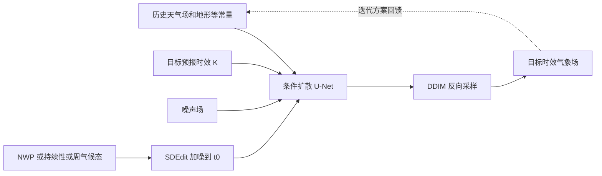

# 扩散模型如何接受 NWP、持续性与气候态引导：一项低分辨率天气预报实验

> Zhanxiang Hua、Yutong He、Chengqian Ma、Alexandra Anderson-Frey，*Weather Prediction with Diffusion Guided by Realistic Forecast Processes*。[arXiv:2402.06666v1](https://arxiv.org/abs/2402.06666)，2024-02-06，预印本；截至 2026-09-25，arXiv 仅列 v1，作者[发表列表](https://kellyyutonghe.github.io/publications/)也将其列为 arXiv。此笔记 2026-09-25 按[28 页 PDF 含附录 A–D](https://arxiv.org/pdf/2402.06666v1)逐页复核；PDF 的会议模板元数据并不能代替正式论文书目。

## 核心判断

这篇论文的真正增量不是造出领先业务系统的全球预报，而是证明一个条件扩散框架可在采样时加入已有预报：低分辨率 NWP、前一时刻持续性，或周气候态。作者给出最长约 14 天的定性/定量长时效实验，因此与中期/S2S 前段有关；但仅预测 Z500、T850 两个大尺度场，网格 5.625°，未证明高分辨率多变量业务技巧。[摘要、第 4 节](https://arxiv.org/html/2402.06666v1)

## 1. 问题设定和方法

给定最近若干天气状态、地形/陆海掩码/纬度等静态场和目标 lead $K$，模型学习 $p(x^{(K)}\mid x^{(k_1)},\ldots,x^{(k_L)},y)$。论文把目标 lead 编码为条件，故同一“框架”可以训练直接映射到某个 $K$，也可训练短步模型并自回归迭代。注意实验中 **DM direct 与 DM iterative 是分别训练的两个模型**，不是单个权重在不调整时同时完成所有方案。作者假设足够多的最近状态能近似屏蔽更早历史，这是将直接建模接到逐步滚动的依据，但该条件独立假设并没有被单独识别验证。[第 3.1–3.2、4.2 节](https://arxiv.org/html/2402.06666v1)

扩散网络将最近天气场、目标时刻带噪场和常量场**按同一物理变量的历史序列相邻排列，再串上常量通道**，而不是把所有历史帧混成一个数。物理 lead `K` 与扩散噪声步 `t` 各先做正弦位置编码，经两层 MLP 后相加，作为 U-Net 的残差块条件；模型采用 64/128/256 三尺度、带部分空间注意力的轻量 U-Net。训练目标是带纬度权重的噪声预测 MSE；推理用 DDIM 逐步生成场。Classifier-free guidance 把条件和非条件噪声估计组合，权重须随 lead 选择，而不是数据增强强度。图 2 还画了下/上采样处的注意力和瓶颈层；论文未给出完整逐层卷积核、注意力头数或参数总量，不能仅从示意图补造。[§3.3、Fig. 2、Appendix A.1](https://arxiv.org/pdf/2402.06666v1)

外部引导使用 SDEdit：将现有粗预测 $\hat x^{(K)}$ 加噪至扩散步 $t_0$，再从此处逆向去噪。$t_0=0$ 几乎保留原引导，$t_0=T$ 则近于从扩散模型自身采样；中间值是“相信现有预报多少”与“允许生成模型修正多少”的调节旋钮。这一机制在推理期发生，不需要针对每一种引导重新训练扩散模型。但“可控”不等于“物理守恒”：NWP 提供物理来源，扩散修正后的输出仍须单独检查动力一致性。[第 3.4 节](https://arxiv.org/html/2402.06666v1)

下面按论文图 1–3 重绘数据流，不转载原图：[原文图 1–3](https://arxiv.org/html/2402.06666v1)。

## 2. 数据、基线、时效与评分

作者将 ERA5/WeatherBench 用**双线性插值**重网格到 $32\times64$、5.625°，从逐小时资料抽取 00/06/12/18 UTC；输入/输出只有 Z500（原文数值单位为 **m²/s² 的位势**，不要误当以 m 计的位势高度）和 T850，另有陆海掩码、地形高度、纬度三个常量场。天气/条件输入用 min–max 变换至 `[-1,1]`；论文没有披露 min/max 如何处理验证期外值、逐变量端点及缺测规则。训练 1979–2015，2016 调参，2017–2018 测试；作为对照的总体/周气候态则由 1979–2016 资料构成，包含调参年但不含测试年。[§4.1、§4.4](https://arxiv.org/pdf/2402.06666v1)

作者分别训练 DM iterative 与 DM direct 两套权重。迭代版正文写四个连续观测 `x⁽⁰⁾,x⁽¹⁾,x⁽²⁾,x⁽³⁾`、主实验 `K=1`（每次再往前 6 小时）；直接版列出四帧 `x⁽⁰⁾,x⁽¹⁾,x⁽²⁾,x⁽⁴⁾` 和目标 lead 集合 `{1,2,4,12,20,28,36}`，最远一次采样到 **216 小时/9 天**。正文对直接版的历史上标与目标 `K` 使用同一组数字，却没有解释参考时刻如何避免历史帧与短 `K` 重合；复现要先向作者/代码核准样本索引，而不能按字面相减后声称存在泄漏。更长至约 14 天的图来自迭代版及推理期引导，不能混称“直接版一次采样 14 天”。[§4.2、Figs. 4/7/8](https://arxiv.org/pdf/2402.06666v1)

### 完整训练与采样配置：公开值和缺口

| 环节 | v1 正文/附录明确公开 | 尚不可从论文推出 |
|---|---|---|
| 扩散前向过程 | `T=1000`；线性 `βₜ` 从 `0.0001` 到 `0.02`；按纬度加权噪声预测 MSE。 | 未列不同物理变量的单独损失权重、绝对值反标准化规则。 |
| 条件训练 | 作者原文称 **35% 条件、65% 无条件**，以便推理时做 classifier-free guidance；`t`/`K` 双嵌入相加。 | 未给每个 lead 的抽样概率；不应自行改写为常见“10% 条件 dropout”。 |
| 两套网络训练 | DM direct 和 DM iterative 分别在**单张 NVIDIA A100**上、batch **32** 训练；各约 **20 小时**，以 2016 年验证集采样预报 RMSE 无明显改善为停止依据。 | 未披露优化器、学习率、weight decay、精确更新次数/epoch、随机种子、冻结层；不存在论文记载的从一个模型微调到另一个模型的步骤。 |
| 无引导推理 | 迭代版用 12 次 DDIM 采样、CFG 权重 1.75；每 6h 采一次，14 天需 **56 次**滚动，单 A100 报告约 **1.1 秒**；直接版最远 9 天一次采样可用 4 次 DDIM。 | 论文未说明 1.1 秒是否包括数据 I/O、CPU 后处理或批量多成员；不能外推 0.25° 业务成本。 |
| SDEdit 引导 | 将外部场加噪到 `t₀` 再逆采；`t₀=200` 的比较使用 **40 次 DDIM**。T42 6h 逐步引导；T63 12h 引导每两个 6h 步注入一次。 | 不是额外微调；不同 `t₀` 的代价/技巧不能与 12 步无引导结果混成同一设置。 |

以上配置以[附录 A.1–A.3](https://arxiv.org/pdf/2402.06666v1)为准。该论文没有完整集合可靠性训练，也未声明被测业务 T42/T63/IFS 与扩散器有完全相同的训练期或初始条件；公平性只能在各图的具体协议下讨论。

比较包含持续性、总体/周气候态、线性回归、五层 CNN、T42/T63 低分辨率物理模式及 ECMWF 业务系统；指标为全球纬度加权 RMSE 与异常相关 ACC。逐 lead 的排名比单个平均数更重要。研究重点是可引导性而非超越最强模式，因此不能把低分辨率 T42 的改进外推为超越 IFS。[第 4.4 节](https://arxiv.org/html/2402.06666v1)

## 3. 图表与具体结果的读法

| 实验 | 原文图表给出的结果 | 应如何解读 |
| --- | --- | --- |
| 无外部引导 | 直接 DM 的 Z500/T850 RMSE 优于周气候态约至第 7 天，迭代 DM 约至第 6 天 | 仅针对 2 变量、5.625°；T63 与业务 IFS 仍更好 |
| T42 引导 | 对 T42 输出加约 200 扩散步噪声后重采样，作者报告第 7 天 Z500/T850 技巧提升超过约 1 天 | 相对 T42 和无引导 DM；并非所有变量/lead 都改善 |
| T63 引导 | 加强噪声通常损害 T63 原有技巧 | 越强的引导模型，生成式“修正”越可能适得其反 |
| 周气候态引导 | 第 8 天起施加 $t_0=300$ 的周气候态，作者报告第 14 天 Z500 RMSE < 1000 m²/s²、ACC > 0.5 | 可能把长期结果拉向气候态；不能直接证明事件级预报技巧 |

表中前 3 行根据 [图 4–7 对应文字](https://arxiv.org/html/2402.06666v1)整理，最后一行根据[图 8 与第 4.5.3 节](https://arxiv.org/html/2402.06666v1)。论文主要以曲线呈现这些实验，未给所有 lead 的机器可读表格；这里不从图片虚构更精确的点值。持续性引导要按 lead 调节 $t_0$；附录 C 给出从短期约 700 步逐段下降到远期 50 步的配置。周气候态方案从 144 小时起切换引导，$t_0$ 从 250 逐渐降到 100，旨在减轻突变。[附录 C.1](https://arxiv.org/html/2402.06666v1)

采样步数和 classifier-free guidance 的消融同样重要：这个低维 2 变量系统的 Z500 RMSE 在约 **12 个 DDIM 步**内已达到较好值，direct 长 lead 的最优采样步甚至可低至 **4 步**；迭代版不同 lead 的较优 CFG 通常在 **1–2**，直接版 `K>20` 时约 **0.5** 更有利。它们分别对应不同模型/任务，不应把 1.75 当作两个模型通用配置。该规律是本数据、架构与指标下的经验，不宜推广为任意全球扩散模型的固定超参。[附录 B.1–B.2](https://arxiv.org/pdf/2402.06666v1)

### 图表索引：结构、性能与反例逐项对齐

| 原图/附录 | 证据内容 | 解读时必须保留的条件 |
|---|---|---|
| Fig. 2–3 | 条件 U-Net、双时间嵌入和 `NWP/持续性/气候态→SDEdit 加噪→反采样` | 这是**推理期接入外部场**，不是把 T42/T63 再拿来监督微调。上文 Mermaid 为原创流程重绘。 |
| Fig. 4 | Z500/T850 在 5.625° 的 RMSE/ACC；实线是迭代预报，点是直接预报 | 直接版在 7/9 天略优迭代版，但 T63 和业务 IFS 仍优于这两套 DM。 |
| Fig. 5–6 | T42/T63 不同 `t₀` 的引导曲线与 2017-12-24 12 UTC 的 T42 个例 | T42 加噪约 200 步可增益；强 T63 引导反而受损，个例不是全年平均。 |
| Fig. 7–8 / Appendix C | 持续性和周气候态引导最长约 14 天的曲线与分段 `t₀` 配方 | `Persist multi` 前 24h 从 700 起分段降至第 7 天附近 100，之后 50；`W Climo 144h` 于第 6 天从 250 逐步降至 100。第 14 天 Z500 `<1000 m²/s²`、ACC `>0.5` 是作者对特定引导配置的陈述，不是独立业务对照胜出。 |
| Appendix B / D | DDIM 步数/CFG 消融、T63 引导失败个例 | 引导越强不保证越好；优化采样设置或修正 T63 失败需要新的控制实验。 |

## 4. 局限、潜在偏差与复现清单

作者在附录 D 给出 T63 引导失败案例：尤其 T850 场会比原 T63 不够平滑。周气候态引导虽可稳定长期 RMSE/ACC，却可能抹掉日变化或个别天气扰动；若业务目标是热浪、寒潮等异常事件，应特别防止“看起来合理”但丢失极端信号。论文没有完整集合可靠性、CRPS、极端事件或守恒指标，也未在 0.25°/多层大气上测试。14 天成绩因气候态引导而改善时，必须与直接输出周气候态比较，并用异常技巧而不是仅用场均方误差判定。[第 4.5 节、附录 D](https://arxiv.org/html/2402.06666v1)

复现应锁定 WeatherBench/ERA5 数据版本、2017–2018 初始化日期、T42/T63 物理模式输出和 ACC 气候态定义；逐 lead 提供 Z500/T850 的 RMSE/ACC 数值表、多个随机种子和集合可靠性。进一步在同初值下把强业务 NWP、Pangu/GraphCast 类 AI 模型引导与“不引导”并排评测，检验 8–15 天异常场、极端事件和空间谱；否则这篇论文最稳妥的结论是**引导机制可行，强业务竞争力未证实**。

[返回仓库首页](../../README.md) · [返回总追踪表](../../气象大模型_中期预报论文追踪.md)
