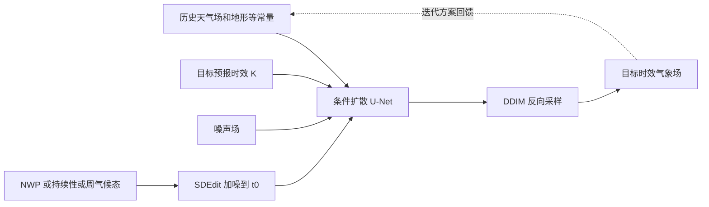

# 扩散模型如何接受 NWP、持续性与气候态引导：一项低分辨率天气预报实验

> Zhanxiang Hua、Yutong He、Chengqian Ma、Alexandra Anderson-Frey，*Weather Prediction with Diffusion Guided by Realistic Forecast Processes*。arXiv:2402.06666v1，2024-02-06，预印本。本笔记依据 [arXiv 全文](https://arxiv.org/html/2402.06666v1)，阅读于 2026-09-24。

## 核心判断

这篇论文的真正增量不是造出领先业务系统的全球预报，而是证明一个条件扩散框架可在采样时加入已有预报：低分辨率 NWP、前一时刻持续性，或周气候态。作者给出最长约 14 天的定性/定量长时效实验，因此与中期/S2S 前段有关；但仅预测 Z500、T850 两个大尺度场，网格 5.625°，未证明高分辨率多变量业务技巧。[摘要、第 4 节](https://arxiv.org/html/2402.06666v1)

## 1. 问题设定和方法

给定最近若干天气状态、地形/陆海掩码/纬度等静态场和目标 lead $K$，模型学习 $p(x^{(K)}\mid x^{(k_1)},\ldots,x^{(k_L)},y)$。论文把目标 lead 编码为条件，故同一“框架”可以训练直接映射到某个 $K$，也可训练短步模型并自回归迭代。注意实验中 **DM direct 与 DM iterative 是分别训练的两个模型**，不是单个权重在不调整时同时完成所有方案。作者假设足够多的最近状态能近似屏蔽更早历史，这是将直接建模接到逐步滚动的依据，但该条件独立假设并没有被单独识别验证。[第 3.1–3.2、4.2 节](https://arxiv.org/html/2402.06666v1)

扩散网络将最近天气场、目标时刻带噪场和常量场按通道堆叠，并分别编码物理 lead 与扩散噪声步。训练目标是带纬度权重的噪声预测 MSE；推理用 DDIM 逐步生成场。Classifier-free guidance 在训练/采样间混合条件与非条件预测，权重影响不同 lead 的误差。作者采用三层通道宽度 64/128/256 的轻量 U-Net，而不是 GraphCast/GenCast 级全球骨干。[方法式 4、附录 A/B](https://arxiv.org/html/2402.06666v1)

外部引导使用 SDEdit：将现有粗预测 $\hat x^{(K)}$ 加噪至扩散步 $t_0$，再从此处逆向去噪。$t_0=0$ 几乎保留原引导，$t_0=T$ 则近于从扩散模型自身采样；中间值是“相信现有预报多少”与“允许生成模型修正多少”的调节旋钮。这一机制在推理期发生，不需要针对每一种引导重新训练扩散模型。但“可控”不等于“物理守恒”：NWP 提供物理来源，扩散修正后的输出仍须单独检查动力一致性。[第 3.4 节](https://arxiv.org/html/2402.06666v1)

下面按论文图 1–3 重绘数据流，不转载原图：[原文图 1–3](https://arxiv.org/html/2402.06666v1)。

## 2. 数据、基线、时效与评分

作者把 ERA5/WeatherBench 重网格到 $32\times64$、5.625°，每 6 小时一帧；输入/输出只有 Z500 和 T850，静态场为陆海掩码、地形高度、纬度。训练 1979–2015，2016 调参，2017–2018 验证结果。扩散训练设置 $T=1000$。DM iterative 主实验以 4 帧为条件做 6 小时一步；DM direct 的目标偏移集合为 1、2、4、12、20、28、36 个 6 小时步，最长直接目标 **216 小时/9 天**。更长至约 14 天的图来自迭代及引导，不能混称“直接模型可预报 14 天”。[第 4.1–4.3 节](https://arxiv.org/html/2402.06666v1)

比较包含持续性、总体/周气候态、线性回归、五层 CNN、T42/T63 低分辨率物理模式及 ECMWF 业务系统；指标为全球纬度加权 RMSE 与异常相关 ACC。逐 lead 的排名比单个平均数更重要。研究重点是可引导性而非超越最强模式，因此不能把低分辨率 T42 的改进外推为超越 IFS。[第 4.4 节](https://arxiv.org/html/2402.06666v1)

## 3. 图表与具体结果的读法

| 实验 | 原文图表给出的结果 | 应如何解读 |
| --- | --- | --- |
| 无外部引导 | 直接 DM 的 Z500/T850 RMSE 优于周气候态约至第 7 天，迭代 DM 约至第 6 天 | 仅针对 2 变量、5.625°；T63 与业务 IFS 仍更好 |
| T42 引导 | 对 T42 输出加约 200 扩散步噪声后重采样，作者报告第 7 天 Z500/T850 技巧提升超过约 1 天 | 相对 T42 和无引导 DM；并非所有变量/lead 都改善 |
| T63 引导 | 加强噪声通常损害 T63 原有技巧 | 越强的引导模型，生成式“修正”越可能适得其反 |
| 周气候态引导 | 第 8 天起施加 $t_0=300$ 的周气候态，作者报告第 14 天 Z500 RMSE < 1000 m²/s²、ACC > 0.5 | 可能把长期结果拉向气候态；不能直接证明事件级预报技巧 |

表中前 3 行根据 [图 4–7 对应文字](https://arxiv.org/html/2402.06666v1)整理，最后一行根据[图 8 与第 4.5.3 节](https://arxiv.org/html/2402.06666v1)。论文主要以曲线呈现这些实验，未给所有 lead 的机器可读表格；这里不从图片虚构更精确的点值。持续性引导要按 lead 调节 $t_0$；附录 C 给出从短期约 700 步逐段下降到远期 50 步的配置。周气候态方案从 144 小时起切换引导，$t_0$ 从 250 逐渐降到 100，旨在减轻突变。[附录 C.1](https://arxiv.org/html/2402.06666v1)

采样步数和 classifier-free guidance 的消融同样重要：这个低维 2 变量系统的 Z500 RMSE 在约 12 个 DDIM 步内已达到较好值，direct 长 lead 的最优采样步甚至可能更少；最优条件引导权重随 lead 增大而降低，长 lead 约 0.5 更有利。该规律是本数据、架构与指标下的经验，不宜推广为任意全球扩散模型的固定超参。[附录 B](https://arxiv.org/html/2402.06666v1)

## 4. 局限、潜在偏差与复现清单

作者在附录 D 给出 T63 引导失败案例：尤其 T850 场会比原 T63 不够平滑。周气候态引导虽可稳定长期 RMSE/ACC，却可能抹掉日变化或个别天气扰动；若业务目标是热浪、寒潮等异常事件，应特别防止“看起来合理”但丢失极端信号。论文没有完整集合可靠性、CRPS、极端事件或守恒指标，也未在 0.25°/多层大气上测试。14 天成绩因气候态引导而改善时，必须与直接输出周气候态比较，并用异常技巧而不是仅用场均方误差判定。[第 4.5 节、附录 D](https://arxiv.org/html/2402.06666v1)

复现应锁定 WeatherBench/ERA5 数据版本、2017–2018 初始化日期、T42/T63 物理模式输出和 ACC 气候态定义；逐 lead 提供 Z500/T850 的 RMSE/ACC 数值表、多个随机种子和集合可靠性。进一步在同初值下把强业务 NWP、Pangu/GraphCast 类 AI 模型引导与“不引导”并排评测，检验 8–15 天异常场、极端事件和空间谱；否则这篇论文最稳妥的结论是**引导机制可行，强业务竞争力未证实**。

[返回仓库首页](../../README.md) · [返回总追踪表](../../气象大模型_中期预报论文追踪.md)
