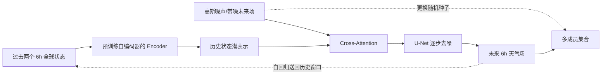

# CoDiCast：全球低分辨率条件扩散预报及其不确定性证据

> Jimeng Shi、Bowen Jin、Jiawei Han、Sundararaman Gopalakrishnan、Giri Narasimhan，正式论文 *CoDiCast: Conditional Diffusion Model for Global Weather Forecasting with Uncertainty Quantification*，[*IJCAI 2025*，AI and Social Good 专题，pp. 9853–9861，DOI 10.24963/ijcai.2025/1095](https://www.ijcai.org/proceedings/2025/1095)。前身题名中的 *Prediction* 见 [arXiv:2409.05975v4](https://arxiv.org/abs/2409.05975)，v1 2024-09-09、v4 2025-05-02；此笔记于 2026-09-25 对照 9 页正式版、18 页 v4/附录和[作者公开代码固定提交](https://github.com/JimengShi/CoDiCast/tree/599408b52263a1570ce2f8d103a4778c97cc114c)。

## 核心判断

CoDiCast 以过去两个天气状态为条件，从噪声生成下一步全球状态，重复采样形成集合、反复滚动到最长 **144 小时（6 天）**。它说明条件扩散可在少变量、5.625° 数据上同时提供单值评分与采样多样性；但论文没有 8–15 天实测，5 成员集合和置信带不足以证明概率校准，更未全面超越 IFS。[方法与实验](https://arxiv.org/html/2409.05975v4)

## 1. 模型结构：预训练编码器和条件去噪器分工

论文方案分两阶段：先以重建 MSE 训练卷积自编码器，再抽出编码器 $\mathcal F$ 将 $X^{t-1},X^t$ 压成条件特征；不是先把**预测目标**编码再只在潜空间扩散。扩散主模型把真实下一步 $X^{t+1}$ 按噪声日程加噪；反向过程从高斯噪声开始，以历史条件逐步预测噪声，优化噪声 MSE。论文图 4 的说明是带噪目标作 query、历史嵌入作 key/value，交叉注意力输出注入 U-Net；此处描述的是**论文设计**，与固定公开代码存在实现差异，见后文复现审计。[正式论文 §4.3–4.5、Fig. 2–4](https://www.ijcai.org/proceedings/2025/1095.pdf)；[v4 Appendix B/C](https://arxiv.org/pdf/2409.05975v4)

以下按照原文图 2–4 重绘模型数据流，不是原图转载：[原文图 2–4](https://arxiv.org/html/2409.05975v4)。

### 图 2–4 和附图 9–11：结构尺寸与信息流

| 模块 | 论文公开结构 | 作用 / 不可混淆之处 |
|---|---|---|
| 自编码器预训练 | 五通道 `32×64` 场输入；编码卷积为 2×2 核、32→128→256→512 filters 与 ReLU；解码器 512→256→128 逐级重建。 | 最终使用**编码器条件表示**；论文没有提供必须把生成目标也压到潜空间的步骤。 |
| 历史编码与交叉注意力 | 两个过去时刻分别编码，按位置展平为 `2048` token；论文附录 B.2 给出 Q/K/V 投影维 `d_q=d_k=d_v=64`。 | 图示把带噪目标当 Q、历史嵌入当 K/V；不是简单把原始场直接加到输出。 |
| 预测噪声 U-Net | 四个下采样单元及四个上采样单元，每单元两组 ResNet；通道宽 `64×j, j=1…4`，4×8 与 2×4 尺度带空间注意力；MaxPooling 下采样、最近邻 2× 上采样、Swish、8 组 GroupNorm，最后 1×1 卷积回到五通道。 | 1000 个 diffusion steps 是**采样/训练噪声层级**，不是 1000 个 U-Net 层。 |
| 概率输出 | 同一历史条件更换 Gaussian 种子，生成 **5 成员**后自回归重复 6h 步至 144h。 | 成员来自不同随机采样；不等于真实初值/模式参数不确定性均已建模。 |

这些结构参数出自[v4 Appendix B.1–B.3](https://arxiv.org/pdf/2409.05975v4)，主图为上方原创 Mermaid 重绘。需要强调：这不是“潜空间扩散模型”；历史场先编码为条件，被逐步扩散与还原的是目标五变量格点场。[正式论文 Fig. 2–4](https://www.ijcai.org/proceedings/2025/1095.pdf)

## 2. 数据、训练、对照与评分

采用 WeatherBench 预处理的 ERA5，`32×64`、5.625°、每 6 小时一帧；只用五个变量：Z500、T850、T2m、U10、V10。v4 附录 Table 3 给出 Z500 的 ERA5 ID 129、500 hPa、位势单位 **m²/s²**，T850 为 ID 130、K；T2m 为 ID 167、K，U10/V10 为 ID 165/166、m/s。训练 2006–2015，验证 2016，测试 2017–2018；以过去两个时刻预测未来 6h，再滚动到 6、12、24、72、144h。论文称在训练前对各字段做 max–min 到 `[0,1]`，但正式版/附录未说明用于验证、测试的 extrema 是否仅来自训练年，也未给缺测处理和海陆掩码，不能替作者填入无泄漏实现。[正式论文 §5.1](https://www.ijcai.org/proceedings/2025/1095.pdf)；[v4 Appendix A/Table 3](https://arxiv.org/pdf/2409.05975v4)

同篇结果表的 NODE、ClimaX、ClimODE 数值**转引自 ClimODE**，ForeCastNet 则重训且在推理使用 Monte Carlo dropout；IFS 是外部业务基线。故“相同 WeatherBench 数据”不代表相同变量、训练预算、初始时次或真值协议被逐项证明。CoDiCast 的 5 成员样本标准差也不是校准置信区间；2017–2018 测试只报告纬度加权 RMSE/ACC，没有 CRPS、Brier、rank histogram、覆盖率或 spread–skill。[正式论文 Table 1、§5.1–5.2](https://www.ijcai.org/proceedings/2025/1095.pdf)

### 训练顺序与超参数的三方核对

| 阶段/参数 | 正式论文与 v4 正文 | v4 附录 Table 4 / 作者代码固定提交 | 可复现的谨慎结论 |
|---|---|---|---|
| 自编码器 | 先预训练后抽取 encoder；主文未列细节 | **100 epoch、batch 128、Adam、MSE、初始 LR `1e−4`**；每 10000 optimizer steps 指数乘 0.95；训练 notebook 同值并按验证损失存 `encoder_cnn_56deg_5var.h5`。 | 不能把编码器训练错写成 CoDiCast 1000 步扩散，也没有论文记载的另一个迁移任务微调阶段。 |
| 去噪器 | Adam；初始 LR `2e−4`、每 10000 steps 乘 0.95；**800 epoch、batch 64**；1000 diffusion steps；正式版称实验在**单张 A100 80GB**进行。 | 附录 Table 4 与当前主训练 notebook 均写 **batch 256**、800 epoch、初始 LR `2e−4`（notebook 后段覆盖顶部 `1e−4`）。 | **batch 64 vs 256 是公开材料的真实冲突**；原报告实验的实际有效 batch 无法仅靠这些材料确定，不能任选其一掩盖差异。 |
| 噪声日程与微调 | 默认线性 `β=0.0001→0.02`，目标噪声 MSE；没有论文声称的长期 rollout 微调。 | 当前 `layers/diffusion.py` 默认线性；另有 quadratic 变体 notebook 供消融。 | 五变量 6 天技巧属于一步扩散器反复滚动，非对 24 步轨迹反传微调。 |

[作者 README/训练笔记固定提交](https://github.com/JimengShi/CoDiCast/tree/599408b52263a1570ce2f8d103a4778c97cc114c/training)与[v4 Appendix C](https://arxiv.org/pdf/2409.05975v4)可核上表；论文/代码未列完整随机种子、每一步模型参数量或独立微调阶段。主 notebook 标注 `num_epochs=800` 为展示值，不能把该 notebook 日志当作正式实验的无歧义训练记录。

### 作者公开实现的复现审计：不能把代码默认值当论文实验

在固定公开提交中，`training/ddpm_weather_56c2_56_5var_best.ipynb` 确实调用 `build_unet_model_c2(..., encoder=pretrained_encoder)`；但[该函数目前的源码](https://github.com/JimengShi/CoDiCast/blob/599408b52263a1570ce2f8d103a4778c97cc114c/layers/denoiser.py#L163-L213)将 `image_input_past1`、`image_input_past2` 都送进 encoder 生成两个嵌入后，**没有把这两个嵌入接到返回的输出路径**，真正进入 cross-attention 的是原始两帧拼接后的 3×3 卷积。第二个 encoder 调用还误用 `past1`，没有用 `past2`。因此静态图至少不能证明该主 notebook 按论文“预训练编码器条件化”路径在训练；不能据论文 Fig. 7 的消融结论就断言这份代码可直接重现同样增益。[训练 notebook 固定提交](https://github.com/JimengShi/CoDiCast/blob/599408b52263a1570ce2f8d103a4778c97cc114c/training/ddpm_weather_56c2_56_5var_best.ipynb)

同一函数调用 Keras `MultiHeadAttention` 时以**历史特征作 query、带噪目标特征作 value/key**，与正式论文 Eq. (7) 写的“带噪目标为 query、历史为 K/V”方向相反。源码结尾输出卷积核为 **2×2**，v4 附录 B.3 却称 **1×1**；这属于可指认的论文—代码分歧，不等于已经通过重训证明哪个版本的发表数值正确。[正式论文 Eq. (7)](https://www.ijcai.org/proceedings/2025/1095.pdf)；[源码固定提交](https://github.com/JimengShi/CoDiCast/blob/599408b52263a1570ce2f8d103a4778c97cc114c/layers/denoiser.py#L208-L263)

数据处理也要区分论文叙述和当前脚本。论文只称 max–min 至 `[0,1]`；[主 notebook](https://github.com/JimengShi/CoDiCast/blob/599408b52263a1570ce2f8d103a4778c97cc114c/training/ddpm_weather_56c2_56_5var_best.ipynb)分别对 train 与 validation 调用 `batch_norm(..., batch_size=1460)`，[辅助函数](https://github.com/JimengShi/CoDiCast/blob/599408b52263a1570ce2f8d103a4778c97cc114c/utils/preprocess.py#L4-L42)按每个 1460 样本片段、每个变量独立计算 min/max；编码器 notebook 还对 test 单独调用同函数。这**不是**一套只用训练期拟合且固定应用于后续年份的缩放参数，可能让各片段物理尺度不一致。公开评测若用真值片段的 min/max 逆变换，还需额外核查真实部署可用性；本文不把这种潜在偏差直接归咎于未公开的正式实验权重。复现实验应先固定训练期端点、修正条件路径并在同一 2017–2018 初值集重新评估。

评分为纬度加权 RMSE 和 ACC。这两项是集合均值或单值预报的主要准确性指标，**不是**独立的概率预报评分。作者对同一条件随机生成 5 个成员，在案例图中呈现均值和标准差范围；如果要声称“可靠的不确定性量化”，还需 CRPS、rank histogram、spread–skill、覆盖率和极端事件可靠性测试。[正式论文 §5.1–5.2](https://www.ijcai.org/proceedings/2025/1095.pdf)

## 3. 性能表：6 天优势有边界

下表直接摘录并重新排版原文表 1 的 **144 小时 RMSE/ACC**，只选关键比较；RMSE 越低、ACC 越高越好。[原文表 1](https://arxiv.org/html/2409.05975v4)

| 变量 | ClimaX RMSE | ClimODE RMSE | CoDiCast RMSE | IFS RMSE | CoDiCast ACC | IFS ACC |
| --- | ---: | ---: | ---: | ---: | ---: | ---: |
| Z500 | 801.9 | 783.6±37.3 | 757.5±42.8 | 398.7 | 0.78 | 0.86 |
| T850 | 3.97 | 3.62±0.21 | 3.61±0.19 | 2.23 | 0.85 | 0.81 |
| T2m | 3.38 | 3.30±0.23 | 3.45±0.22 | 1.78 | 0.91 | 0.82 |
| U10 | 4.24 | 4.02±0.12 | 4.25±0.15 | 3.04 | 0.42 | 0.72 |
| V10 | 4.42 | 4.24±0.10 | 4.21±0.18 | 3.26 | 0.37 | 0.71 |

读表可见：Z500、T850、V10 的 RMSE 在所列 ML 对照中有优势；T2m、U10 则不是最优。IFS 的 RMSE 在全部这五项都更低，因此正文“优于其他 ML 方法”的概括不能写成“整体超越业务 NWP”。ACC 有时与 RMSE 排名相反，如 144h T850/T2m 的 CoDiCast ACC 高于表中 IFS，但 RMSE 明显更高，说明空间异常型态和绝对误差是不同问题。原文仅将表中 `±` 称为模型不确定性范围，未明确采样估计/置信区间公式，不应自动当作统计置信区间。[IJCAI Table 1](https://www.ijcai.org/proceedings/2025/1095.pdf)

### 正式 Table 1 全部 lead 的 CoDiCast–IFS 对照

下表把[IJCAI 正式 Table 1](https://www.ijcai.org/proceedings/2025/1095.pdf)的两列主要系统逐 lead 转录为便于核对的性能矩阵；RMSE 单位为 Z500 **m²/s²**、T850/T2m **K**、U10/V10 **m/s**，ACC 无量纲。这里保留报告点值，`±` 的 144h 原表值见上表；**不凭这张表推断相同输入/真值协议**。

| 变量 | lead | CoDiCast RMSE | IFS RMSE | CoDiCast ACC | IFS ACC |
|---|---:|---:|---:|---:|---:|
| Z500 | 6h | 73.1 | 26.9 | 0.99 | 1.00 |
| Z500 | 12h | 114.2 | 33.8 | 0.99 | 0.99 |
| Z500 | 24h | 186.5 | 51.0 | 0.98 | 0.99 |
| Z500 | 72h | 451.6 | 123.2 | 0.92 | 0.98 |
| Z500 | 144h | 757.5 | 398.7 | 0.78 | 0.86 |
| T850 | 6h | 1.02 | 0.69 | 0.99 | 0.99 |
| T850 | 12h | 1.26 | 0.75 | 0.99 | 0.99 |
| T850 | 24h | 1.52 | 0.87 | 0.97 | 0.99 |
| T850 | 72h | 2.54 | 1.15 | 0.93 | 0.96 |
| T850 | 144h | 3.61 | 2.23 | 0.85 | 0.81 |
| T2m | 6h | 0.95 | 0.69 | 0.99 | 0.99 |
| T2m | 12h | 1.21 | 0.77 | 0.99 | 0.99 |
| T2m | 24h | 1.45 | 1.02 | 0.99 | 0.99 |
| T2m | 72h | 2.39 | 1.26 | 0.96 | 0.96 |
| T2m | 144h | 3.45 | 1.78 | 0.91 | 0.82 |
| U10 | 6h | 1.24 | 0.61 | 0.95 | 0.98 |
| U10 | 12h | 1.50 | 0.76 | 0.93 | 0.98 |
| U10 | 24h | 1.87 | 1.11 | 0.89 | 0.97 |
| U10 | 72h | 3.15 | 1.57 | 0.71 | 0.94 |
| U10 | 144h | 4.25 | 3.04 | 0.42 | 0.72 |
| V10 | 6h | 1.30 | 0.61 | 0.95 | 1.00 |
| V10 | 12h | 1.56 | 0.79 | 0.93 | 0.99 |
| V10 | 24h | 1.94 | 1.33 | 0.89 | 1.00 |
| V10 | 72h | 3.18 | 1.67 | 0.68 | 0.93 |
| V10 | 144h | 4.21 | 3.26 | 0.37 | 0.71 |

### 正式 Table 2：扩散步数对第 24 小时误差和延迟的影响

| 指标 \ 扩散步数 N | 250 | 500 | 750 | 1000 | 1500 | 2000 |
|---|---:|---:|---:|---:|---:|---:|
| Z500 RMSE (m²/s²) | 696.1 | 324.8 | 190.6 | **186.5** | 193.5 | 191.9 |
| T850 RMSE (K) | 3.88 | 2.38 | 1.53 | **1.52** | 1.56 | 1.58 |
| T2m RMSE (K) | 5.26 | 2.79 | 1.63 | **1.44** | 1.50 | 1.53 |
| U10 RMSE (m/s) | 2.74 | 2.05 | **1.81** | 1.87 | 1.99 | 2.01 |
| V10 RMSE (m/s) | 2.43 | 2.11 | **1.89** | 1.94 | 2.04 | 2.06 |
| 报告推理时间 (min) | ~1.1 | ~1.9 | ~2.8 | ~3.6 | ~6.5 | ~8.3 |

表 2 明确把误差定在 **24h lead**，最后一行却没有独立写每成员、每起报或完整六天的计时边界；不能把约 **3.6 min** 理解为完成五成员六天集合的总耗时。正式摘要另报告单 A100 80GB 上完整六天预报约 **12 min**，两者不是可直接相除的相同计量。[正式摘要与 Tables 1–2](https://www.ijcai.org/proceedings/2025/1095)

线性 β 噪声日程在正式 Fig. 8 对 Z500/T2m/U10/V10 优于 quadratic，T850 相近；它与表 2 改变**扩散步数**是两个不同消融。作者还在 Fig. 7 比较去掉编码器、去掉 cross-attention 及两者同时去掉的配置，声称完整模型较好，但曲线没有机器可读逐点数据。结合上面的公开代码路径差异，复核者应先修正实现、再在同 split/同随机种子上重新跑这两个消融；不可把图中视觉优势当作已核实的精确百分比。[正式 Figs. 7–8](https://www.ijcai.org/proceedings/2025/1095.pdf)

## 4. 对“概率”和“中期”的审慎解读

图 5 的案例展示不确定性范围随 lead 增大，但“五个样本覆盖多数真值点”不是校准证明；更不能用一张图替代跨季节/区域极端事件可靠性。图 6 的 6h 图上 U10/V10 局部相对误差超过 50%，高纬海洋较明显，提醒低分辨率均值指标可能掩盖局地失效。表 1 的对比至少证实两件事：条件扩散能形成合理的全球大尺度滚动样本；在此设置下 **144h 仍显著弱于 IFS RMSE**。[图 5–6、表 1](https://arxiv.org/html/2409.05975v4)

对用户关注的 10–15 天，这篇只能提供方法参照：输入变量有限、没有降水/湿度与多层风、空间分辨率粗、最长 6 天。下一个实验应在同 ERA5 初值、相同训练期资料和变量条件下跑 10/15 天，报告集合 CRPS/ES、异常相关、极端阈值 Brier score、spread–skill 以及每成员总成本；并与 GenCast、业务 ENS 这样的**概率**基线比较，才能检验其真正的中期价值。

[返回仓库首页](../../README.md) · [返回总追踪表](../../气象大模型_中期预报论文追踪.md)
