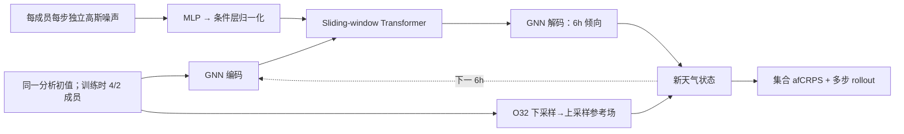

# AIFS-CRPS：以近公平 CRPS 训练中期集合，并检验其 S2S 外推

> Simon Lang、Mihai Alexe、Mariana C. A. Clare 等，*AIFS-CRPS: Ensemble forecasting using a model trained with a loss function based on the Continuous Ranked Probability Score*。[arXiv:2412.15832v1，2024-12-20](https://arxiv.org/html/2412.15832)；另有 [npj Artificial Intelligence 正式版](https://www.nature.com/articles/s44387-026-00073-7)。本笔记以预印本 v1 的可核验方法和数字为准，阅读于 2026-09-24。作者为 ECMWF 团队；这是研究版 AIFS-CRPS，**不能直接等同于业务运行的 AIFS ENS**。

## 一、问题与核心判断

确定性 MSE 训练会奖励平滑的条件均值，导致长滚动中的小尺度能量消失；仅对确定性模型加随机初值又容易集合离散度不足。作者以 AIFS 编码器—处理器—解码器为骨架，在每个集合成员、每个 6 小时步注入独立高斯噪声，训练时直接最小化集合的 almost-fair CRPS（afCRPS）。关键结论应拆开：**15 天中期集合**相对物理 IFS 集合对多数变量/时效得分更好；**46 天 S2S 回报试验**未经偏差处理时较强，但用异常场评估后主要是“有竞争力”，不是所有长时效均领先。[方法与摘要](https://arxiv.org/html/2412.15832)

## 二、模型结构和目标函数

底座采用图 Transformer 编码/解码及 sliding-window Transformer 处理器，16 层、1024 维、8 个注意力头、约 2.29 亿参数。噪声先经两层 MLP 与层归一化，再进入处理器的条件层归一化；集合成员共享网络权重，但噪声种子独立，推理时无传统“未扰动控制成员”。为避免自回归残差把细碎伪影积累到 300 小时，输出使用低分辨率参考场的下采样—上采样，再叠加学习到的倾向；文中采用 O32 参考网格。[原文第 2 节和图 1、3–4](https://arxiv.org/html/2412.15832)

图为按论文方法**自行重绘**的概念图，并非原图。标准 CRPS 的成员—真值绝对距离项和成员两两绝对距离项分别衡量准确度与离散度；fair CRPS 改变第二项分母以削弱有限集合偏差，但存在训练退化情形。afCRPS = α·fCRPS + (1−α)·CRPS，作者取 **α=0.95**。该损失是逐变量/网格优化，不应把单一 CRPS 视为极端天气概率已校准的充分证据。[原文 2.2–2.3 节](https://arxiv.org/html/2412.15832)

## 三、数据、版本与可比性

ERA5 1979–2017 用于训练，IFS 业务分析 2016–2023 用于后续微调；输入为 t−6h、t 两个天气状态，目标为 t+6h。训练由单步、双步、渐进延长至 12 步（72h）及 IFS 分析微调四阶段组成。低分辨率 O96 输入/O48 处理网格使用 4 个训练成员；高分辨率 N320 输入/O96 处理网格使用 2 个。推理与评分的 15 天集合却是 **50 成员**，与 50 成员 9 km IFS ENS 共用业务 IFS 集合初值。这使对比主要考察预报器及概率生成，不能声称 AIFS-CRPS 自己解决了观测同化或初值扰动。[原文第 3–5 节](https://arxiv.org/html/2412.15832)

### 数据字段、单位处理和模型版别

| 字段组 | 输入/目标 | 标准化与评读注意 |
| --- | --- | --- |
| 13 层高空 Z、U/V/W、比湿、温度 | 同为输入、输出；50–1000 hPa | 大多标准化，**位势 Z 例外使用 max scaling**；各层损失按 `plev/1000` 降权 |
| 地面气压、MSL、皮肤温度、2m 温度/露点、10m 风、整层水汽 | 同为输入、输出 | 标准化；不能把只有输出的降水算入递推状态 |
| 总降水 | **仅输出** | 更改标准差尺度但保留原均值；与零均值标准化不同 |
| 地形、海陆、辐射、位置与时间编码 | **仅输入** | 次网格地形做 max scaling；经纬/本地时刻/年内时刻的正余弦等不做标准化 |
| 6 小时步标识 | 输入 | 首步从分析场启动记 1；后续自回归状态记 2，帮助模型分辨输入分布变化 |

业务 IFS 分析来自更细的 TCo1279 网格，按所训练的 O96 或 N320 输入版别插值；ERA5 原网格是 N320。O96 版 4 个训练成员、高空压力权重最低截断到 **0.2**；N320 版为节约成本只用 2 个训练成员，**未**设置这个截断，所以两版差别不只分辨率。训练集和微调集在年份上有 2016–2017 重叠，但来源分别是 ERA5 与业务 IFS 分析，复现时需按资料版本分别处理。[原文 Tables 2–3](https://arxiv.org/html/2412.15832v1)

### 四阶段优化和微调日程

| 阶段 | 目标与更新数 | 学习率/日程 |
| --- | --- | --- |
| 1. 单步预训练 | 6 小时、**300,000** 次更新 | 初始 `1×10^-3`；1000 步线性 warm-up，随后余弦降到 0 |
| 2. 双步训练 | 12 小时、**60,000** 次更新 | 初始 `1×10^-5`；100 步 warm-up 后余弦退火 |
| 3. 多步自回归 | 从 3 到 12 步，即 18–72 小时；约 **45,000** 次更新 | `1×10^-6` 恒定；每个 epoch 增长 rollout 上限 |
| 4. 业务分析微调 | IFS 2016–2023 分析，重新逐级 rollout 至 12 步 | `5×10^-7`；每两个 epoch 增长 rollout 上限；正文未给最终总更新数 |

四阶段优化器是 AdamW，β=(0.9,0.95)、weight decay=0.1，batch size=16；损失全程使用 `α=0.95` 的 afCRPS。论文 Table 3 列 O96 版约 **64×H100 64GB、4 天**，N320 版约 **128×H100 64GB、7 天**；利用成员并行、模型分片及 activation checkpointing 支撑长滚动。训练的 4/2 成员与推理的 50 成员不是笔误：它是成本与样本化集合大小的折中，但也意味着应单独检验成员数变化对校准的影响。[原文 §2.3–2.4、Table 3](https://arxiv.org/html/2412.15832v1)

## 四、图表结果：优势与反例同列

| 论文实验/图 | 经核对的读数或方向 | 解读边界 |
| --- | --- | --- |
| 图 5–7，2024-02-01 至 09-30、00/12 UTC，15 天 | 多数对流层高空变量的 CRPS/RMSE/ACC 改善；Z500、250 hPa 风等得分提升约 **5–20%** | 范围随变量/lead 改变，不是全变量平均；分析评分和探空/SYNOP 评分分开 |
| 图 6–7，高层 | **100 hPa 及以上**部分指标相对 IFS 退步，N320 版更明显 | 与高层压力权重设定有关，不能概括为“全面胜过 IFS” |
| 图 6–9，地表/可靠性 | O96 版的总降水观测评分可低于 IFS；N320 多数地表变量改善，但中纬度部分变量**过度离散** | CRPS 改善不自动等于 spread/RMSE 配比正确 |
| 图 10，S2S | 2018–2022 共 260 个每周起报、8 成员、46 天；原始周平均较优，按各自回报气候态转异常后与 IFS 竞争 | 不能把未经校准原始均值优势解释成可预报异常信号全面增强 |

图 4 的谱比较提供对“MSE 平滑”问题的机制证据；图 9 的 spread–RMSE 则是校准警示。复现时应固定相同起报、ERA5/业务分析版本、初值成员、集合规模、观测 QC，并同时报告 CRPS、可靠性曲线、极端阈值及能量谱。尤其要分别重跑 O96/N320 版本，不能把高分辨率结果归给低分辨率训练设置。[原文第 5 节](https://arxiv.org/html/2412.15832)

## 五、与业务 AIFS ENS 的关系：同源但不能混合版本成绩

ECMWF 的 [AIFS ENS v1 实施说明](https://confluence.ecmwf.int/spaces/FCST/pages/540554034/Implementation%2Bof%2BAIFS%2BENS%2Bv1)明确把 **2025-07-01 起运行的 v1** 对应到 AIFS-CRPS 路线，而不是更早试验的扩散式 AIFS ENS DIFF。它采用 N320 约 31 km、13 个气压层、6 小时步、15 天预报，00/06/12/18 UTC 起报，输出 **50 个扰动成员 + 1 个标称 control**。这里 control 只表示初值未扰动，**模型内部仍采样噪声**，因此并非像物理 IFS ENS 那样的完全确定性控制预报。v1 继续使用与 IFS ENS 对应成员匹配的业务集合初值，训练中并没有直接使用观测；这与“由卫星直接做集合预报”的路线不同。[ECMWF 实施说明](https://confluence.ecmwf.int/spaces/FCST/pages/540554034/Implementation%2Bof%2BAIFS%2BENS%2Bv1)

ECMWF [业务回顾](https://www.ecmwf.int/en/newsletter/185/earth-system-science/aifs-ens-becomes-operational)报告了与研究版一致的 **2 成员训练、约 2.29 亿参数**，但业务 scorecard 是另一段实时评估，不能代替论文的 2024-02 至 09 回测。其上层温度、10m 风观测评分仍有弱点；高山复杂地形可能出现 MSL/低层温度异常，干旱区有微量虚假降水，部分高空量集合过度离散。一个阿尔卑斯暴雨个例中 AIFS ENS 对峰值的低估比 IFS ENS 更明显，说明“多数平均分数更好”不能转写为“极端降水幅度一定更好”。[ECMWF 业务回顾 Fig. 2–6 与已知问题](https://www.ecmwf.int/en/newsletter/185/earth-system-science/aifs-ens-becomes-operational)

截至本次阅读，ECMWF [数据说明](https://www.ecmwf.int/en/forecasts/datasets/aifs-machine-learning-data)显示业务 AIFS ENS 已于 **2026-05-12** 从 v1 升级至 v2。本文的训练参数和成绩只适用于所述 AIFS-CRPS 研究模型及有据可追的 v1 路线；不应把 v2 的产品时效/表现倒填进 2024 预印本。若将来另有 v2 论文，应独立立条并核对模型权重和评测期。

[返回首页](../../README.md)
