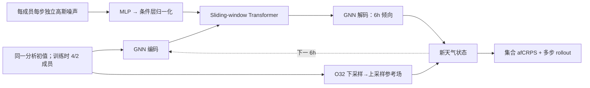

# AIFS-CRPS：以近公平 CRPS 训练中期集合，并检验其 S2S 外推

> Simon Lang、Mihai Alexe、Mariana C. A. Clare 等，*AIFS-CRPS: Ensemble forecasting using a model trained with a loss function based on the Continuous Ranked Probability Score*。[arXiv:2412.15832v1，2024-12-20](https://arxiv.org/html/2412.15832)；另有 [npj Artificial Intelligence 正式版](https://www.nature.com/articles/s44387-026-00073-7)。本笔记以预印本 v1 的可核验方法和数字为准，阅读于 2026-09-24。作者为 ECMWF 团队；这是研究版 AIFS-CRPS，**不能直接等同于业务运行的 AIFS ENS**。

## 一、问题与核心判断

确定性 MSE 训练会奖励平滑的条件均值，导致长滚动中的小尺度能量消失；仅对确定性模型加随机初值又容易集合离散度不足。作者以 AIFS 编码器—处理器—解码器为骨架，在每个集合成员、每个 6 小时步注入独立高斯噪声，训练时直接最小化集合的 almost-fair CRPS（afCRPS）。关键结论应拆开：**15 天中期集合**相对物理 IFS 集合对多数变量/时效得分更好；**46 天 S2S 回报试验**未经偏差处理时较强，但用异常场评估后主要是“有竞争力”，不是所有长时效均领先。[方法与摘要](https://arxiv.org/html/2412.15832)

## 二、模型结构和目标函数

底座采用图 Transformer 编码/解码及 sliding-window Transformer 处理器，16 层、1024 维、8 个注意力头、约 2.29 亿参数。噪声先经两层 MLP 与层归一化，再进入处理器的条件层归一化；集合成员共享网络权重，但噪声种子独立，推理时无传统“未扰动控制成员”。为避免自回归残差把细碎伪影积累到 300 小时，输出使用低分辨率参考场的下采样—上采样，再叠加学习到的倾向；文中采用 O32 参考网格。[原文第 2 节和图 1、3–4](https://arxiv.org/html/2412.15832)

图为按论文方法**自行重绘**的概念图，并非原图。标准 CRPS 的成员—真值绝对距离项和成员两两绝对距离项分别衡量准确度与离散度；fair CRPS 改变第二项分母以削弱有限集合偏差，但存在训练退化情形。afCRPS = α·fCRPS + (1−α)·CRPS，作者取 **α=0.95**。该损失是逐变量/网格优化，不应把单一 CRPS 视为极端天气概率已校准的充分证据。[原文 2.2–2.3 节](https://arxiv.org/html/2412.15832)

## 三、数据、版本与可比性

ERA5 1979–2017 用于训练，IFS 业务分析 2016–2023 用于后续微调；输入为 t−6h、t 两个天气状态，目标为 t+6h。训练由单步、双步、渐进延长至 12 步（72h）及 IFS 分析微调四阶段组成。低分辨率 O96 输入/O48 处理网格使用 4 个训练成员；高分辨率 N320 输入/O96 处理网格使用 2 个。推理与评分的 15 天集合却是 **50 成员**，与 50 成员 9 km IFS ENS 共用业务 IFS 集合初值。这使对比主要考察预报器及概率生成，不能声称 AIFS-CRPS 自己解决了观测同化或初值扰动。[原文第 3–5 节](https://arxiv.org/html/2412.15832)

## 四、图表结果：优势与反例同列

| 论文实验/图 | 经核对的读数或方向 | 解读边界 |
| --- | --- | --- |
| 图 5–7，2024-02-01 至 09-30、00/12 UTC，15 天 | 多数对流层高空变量的 CRPS/RMSE/ACC 改善；Z500、250 hPa 风等得分提升约 **5–20%** | 范围随变量/lead 改变，不是全变量平均；分析评分和探空/SYNOP 评分分开 |
| 图 6–7，高层 | **100 hPa 及以上**部分指标相对 IFS 退步，N320 版更明显 | 与高层压力权重设定有关，不能概括为“全面胜过 IFS” |
| 图 6–9，地表/可靠性 | O96 版的总降水观测评分可低于 IFS；N320 多数地表变量改善，但中纬度部分变量**过度离散** | CRPS 改善不自动等于 spread/RMSE 配比正确 |
| 图 10，S2S | 2018–2022 共 260 个每周起报、8 成员、46 天；原始周平均较优，按各自回报气候态转异常后与 IFS 竞争 | 不能把未经校准原始均值优势解释成可预报异常信号全面增强 |

图 4 的谱比较提供对“MSE 平滑”问题的机制证据；图 9 的 spread–RMSE 则是校准警示。复现时应固定相同起报、ERA5/业务分析版本、初值成员、集合规模、观测 QC，并同时报告 CRPS、可靠性曲线、极端阈值及能量谱。尤其要分别重跑 O96/N320 版本，不能把高分辨率结果归给低分辨率训练设置。[原文第 5 节](https://arxiv.org/html/2412.15832)

[返回首页](../../README.md)
