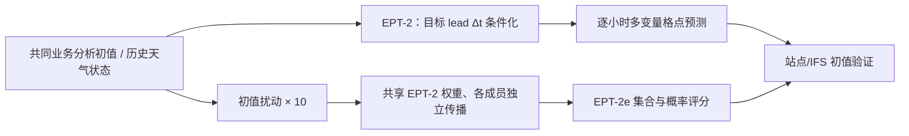

# EPT-2 / EPT-2e：任意 lead 条件化与能源变量的 10 天集合评估

> Roberto Molinaro、Niall Siegenheim、Niels Poulsen、Jordan Dane Daubinet、Henry Martin、Mark Frey、Kevin Thiart、Alexander Jakob Dautel、Andreas Schlueter、Alex Grigoryev、Bogdan Danciu、Nikoo Ekhtiari、Bas Steunebrink、Leonie Wagner、Marvin Vincent Gabler，*EPT-2 Technical Report*，[arXiv:2507.09703v1，2025-07-13](https://arxiv.org/html/2507.09703v1)，Jua.ai 技术报告；2026-09-25 对照原文正文及补图 1–15 复核。**EPT 是欧洲企业 Jua 的 Earth Physics Transformer 系列，不是 ECMWF 的 AIFS。**

## 核心问题与阅读结论

EPT-2 针对风、气温与太阳辐射等能源相关天气量，令模型接受目标时效 Δt 条件，而非只预测固定的 6 小时步。报告宣称系统可提供约 9 km、逐小时、最长 20 天业务产品；但公开图 2–11 的主要量化评测范围是 **0–240 小时（10 天）**，补图 12–15 也是 1、2、10 天空间图或 4 天单点案例。因此本笔记只把 10 天视为论文结果已覆盖的中期上限，不把“可运行 20 天”转写为“20 天技巧已验证”。集合版本 EPT-2e 主要是**扰动初值再独立传播**，不能自动视为完整后验分布模型。[原文 II–IV 节与补图](https://arxiv.org/html/2507.09703v1)

## 逐节研究问题与证据层级

本文同时提出三个层次的主张：一是动态 lead 条件化的全球确定性模型；二是用初值扰动构成 EPT-2e 的概率预测；三是面向能源业务的逐小时、20 天输出能力。第一、二项有 2023 年格点/站点的 **10 天**曲线；第三项的 20 天时效、全链路延迟与计算成本没有对应的公开逐 lead 定量表。摘要中“各变量、全时效都领先”的概括须回到 IV-A 图文判断，特别是格点 2m 气温超过约 130h 后相对 Aurora 的反例。[摘要、II-B、IV-A](https://arxiv.org/html/2507.09703v1)

与 [EPT-1.5](45-ept-1-5.md) 的关系是同一系列后代，但报告没有交代 EPT-2 是否从前代检查点初始化、哪些层重用、是否在新数据集微调，因此不能把 EPT-1.5 的训练配方移植为 EPT-2 的已知配方。和 AIFS-ENS/GenCast 的区别也不是简单“有无集合”，而是本文只公开了**初值扰动、成员独立前向**的集合生成机制；没有给出面向集合分布的专门训练目标。

## 模型和比较协议

论文给出过去状态序列到未来状态的映射、按纬度余弦加权的误差训练目标与动态 lead 条件化；没有完整披露足以从零复建 EPT-2 的层数、参数、逐层张量与训练样本清单。因此下面只画**公开可核验的功能结构**，不臆造 Transformer 内部模块。业务描述是 00/06/12/18 UTC 起报；评测则固定 2023 年 00/12 UTC、各模型共同初值。格点真值采用 IFS HRES 初值（太阳辐射用 ERA5），地面评分采用 WeatherReal-ISD 的 14,000 多站；对照包括 EPT-1.5、Aurora、IFS HRES 与 ENS 均值。站点非均匀覆盖，而且“相同初值”不等于各模型训练资料完全相同。[原文 III 节](https://arxiv.org/html/2507.09703v1)

结构图系根据原文描述自行重绘；**未**把“直接观测到预报”画进已经公布的 EPT-2 实验。报告提及将来可能发布高频观测接入版本，不能误算为现有系统功能。[原文 II-B 节](https://arxiv.org/html/2507.09703v1)

从公式看，输入写作当前和更早的 `X_t, X_{t-1}, …`，输出为 `f_θ(..., Δt)` 对未来 `t+Δt` 状态的估计。文中说动态条件化，但**没有展示 Δt 的编码器、注入层、训练时效采样分布、单步/多步目标的比例、推理是否递归**。所以“任意时效”应读作模型设计与业务产品的叙述，不等同于在任意实数 Δt 上都经过验证。论文列出了气温、风分量和位势等示意变量，并未提供完整输入通道表；评测的 10m/100m 风速是输出评分变量，不足以反推其输入张量。[原文 II-A](https://arxiv.org/html/2507.09703v1)

## 数据处理、训练及“未披露”清单

论文把输入描述为过去多个大气状态，模型为可按 `Δt` 条件化的预测映射。作者称继承异构数据训练路线，但**没有给出 EPT-2 实际训练数据各来源/年份、变量清单、采样比例和训练验证划分**。评测真值不是训练集清单：IFS HRES 分析格点和 WeatherReal-ISD 的 **14,000 多个站点**用于 2023 年测试；站点数据做统一与 QC，但本文没有给出逐步算法。作者明确说评测模型均**未用站点数据后处理或微调**。格点与站点采用不同插值/抽样，不能把“全球格点误差”和“站点误差”当同一任务。[第 III-A–C 节](https://arxiv.org/html/2507.09703v1)

原文在 IV-C 节给出一个此前笔记遗漏的**训练资源事实**：本论文评分的 EPT-2 预训练使用 **8 张 H100、10 天**；Aurora 对照引用的是 **32 张 A100、18 天**。这分别约为 1,920 与 13,824 GPU·小时，但加速器代际、训练数据、分辨率与任务不同，GPU·小时比值不能当作 FLOPs、成本或能效比的严格证明。作者还说做过“最高 100 亿参数”的其它规模变体试验，**并未披露本文评分版 EPT-2 的参数量**；绝不能把 100 亿参数写成该模型配置。论文称 EPT-2 推理比 Aurora 约快 25%，但缺少同硬件、同批量、同 lead 输出及预处理/后处理计时协议。[原文 IV-C](https://arxiv.org/html/2507.09703v1)

| 应核验的实施项 | 本报告实际给出的信息 | 仍缺失的内容 |
| --- | --- | --- |
| 输入/输出 | 历史状态→指定未来 lead；面向风速、气温、辐射等能源量 | 完整变量表、每层/每小时字段、静态强迫、缺测策略 |
| 空间时间 | 业务版 0.083° 约 9 km、逐小时，四次每日起报；主要评测 0–240h | 重网格、时间对齐、站点匹配、历史资料变化 |
| 训练损失 | 论文印有按纬度余弦加权的绝对误差形式；EPT-2 预训练 8×H100×10 天 | 变量缩放、优化器、LR、batch、训练步数、rollout 策略 |
| 架构与参数 | 动态 `Δt` 条件化的预测引擎；实验过“最高 100 亿参数”其它变体 | 本文评分模型的参数总数、Transformer 层数、patch/token、条件注入方式 |
| 微调 | 站点评测**未**微调 | 是否从 EPT-1.5 权重继承、其它数据微调、冻结/解冻与权重调度 |
| EPT-2e | 初值扰动生成 10 成员后传播 | 扰动分布、幅度、空间相关结构、是否逐步随机化、概率目标训练 |

一个应特别核实的排版问题：第 II 节训练式打印为 `|预测 X^(t+Δt) − X^t|`，而上下文描述的监督目标应是 **`X^(t+Δt)`**。不能在未勘误时把印刷公式当作可靠的实际代码实现。论文也没有说明 2024 年 EPT-1.5 报告所称的约 5 PB 语料是否原封不动用于 EPT-2；不能把前代数字直接复制为这一代的训练细节。[第 II 节公式](https://arxiv.org/html/2507.09703v1)

## 评测数据、预处理与比较公平性

训练资料与评测资料必须分开看。ERA5 在报告中作为再分析背景资料（约 0.25°、逐小时）介绍，但这**不等于** EPT-2 的完整训练源清单。主格点评测把各模型同日 00/12 UTC 起报的预测与相应有效时刻的 IFS HRES 初值比较；因 HRES 初值不含太阳辐射诊断变量，六小时累计的地表太阳短波辐射 SSRD 转用 ERA5 作为真值。对 EPT 预报的 0.083° 格点与其它系统的格点，论文没有提供可直接复现的统一重网格插值、掩膜和变量单位转换脚本。[III-A–C、IV-A](https://arxiv.org/html/2507.09703v1)

站点检验使用 WeatherReal-ISD，报告说该资料融合/质控 14,000 多个全球站，包含 SYNOP、METAR 等，地理分布如图 1，并以独立于格点分析的原位观测作为近地面主验证目标。作者称任何模型都没有对这些站点做后处理或微调；但文中没有列明实际参与每一变量、每个 lead 的可用站点数、缺测筛除、站点高度差纠正、地形/海陆代表性、格点到站点的插值公式。它引用的 [stationbench 代码](https://github.com/juaAI/stationbench)是协议入口，不应在未锁定 commit/数据版本时假定完全复现本文每条曲线。[III-A–C](https://arxiv.org/html/2507.09703v1)

IFS HRES **分析初值**不是独立观测真值；它与 IFS HRES 预报共享系统误差来源。站点更独立，但站点在陆地与人口稠密区集中，不能自动推广为全球面积加权优势。论文只给 2023 一年、每日 00/12 UTC 的评测，不是跨多年、跨业务升级版本或实时前瞻的稳定性验证。格点指标按纬度权重，站点指标论文设等权，因此两类图的不同胜负不能互相替代。[III-A–C](https://arxiv.org/html/2507.09703v1)

## 指标定义与公式校读

确定性 RMSE 用逐样本预测与有效时刻真值的平方误差再取根号；格点使用面积/纬度权重，站点为等权。集合均值 RMSE 先对成员取均值再对观察值评分，衡量点预测质量，不是集合分布质量。原文称 CRPS 衡量整个预测分布，这是合适的目标，但其式 (2) 将 CRPS 的两个距离项**都写成平方差**，与标准离散集合 CRPS 的**绝对差**形式不符；同时把成员索引与空间权重索引混写。图 10–11 的数值究竟按标准软件 CRPS 还是印刷式计算，报告及可见代码没有足够信息确认。本文保留作者曲线的相对方向作为“报告结果”，但不将印刷式当正确实现，不从曲线读出高精度具体值，也不根据一条 CRPS 曲线推断完整可靠度。[III-C、IV-B](https://arxiv.org/html/2507.09703v1)

## 模型性能读数与业务边界

图 2–5 是 IFS 分析场/ERA5 上的格点 RMSE，图 6–7 是独立站点 RMSE，图 8–11 是 10 成员集合的站点均值 RMSE 与 CRPS。无可下载数值表的曲线只记录交叉时间或明确方向，**不从图上读出小数点后两位**。作者声称 EPT-2 推理较 **Aurora** 约快 **25%**；由于没有同硬件和完整同化/预处理计时，该数字只作为作者报告的相对推理声明。[第 IV–V 节](https://arxiv.org/html/2507.09703v1)

EPT-2e 不同于 AIFS-ENS 的概率损失训练或 GenCast 的条件扩散采样。报告写明 EPT-2e 与 Aurora 的**初值小扰动、各 10 成员独立传播**，但未公开扰动分布、幅度及其空间相关结构，也未说明有无逐步再扰动或单独集合训练。论文未给可靠度图、rank histogram 或极端事件分层。即使其站点 CRPS 曲线优于同图对照，也只能证实**2023 年、所列近地面变量、10 成员协议**下的报告评分，不能推论 20 天极端风险已校准。预报时效 20 天、9 km 与逐小时是业务规格；论文公开的逐 lead 量化评测横轴只到 240h。[IV-B、补图](https://arxiv.org/html/2507.09703v1)

## 原图 1–15 的内容与可复核结论

以下是**原论文图表的原创中文索引/证据表**，不是对有版权图像的搬运。读者可沿“图号—真值—时效—结论—限制”回到[原始 HTML 全文](https://arxiv.org/html/2507.09703v1)查看曲线或补图；报告没有附逐 lead 的机器可读数值表，故不虚构表中小数。

| 图号 | 画了什么、用何种真值 | 应怎样读 |
| --- | --- | --- |
| 图 1 | WeatherReal-ISD 评测站点的全球分布 | 说明样本覆盖与陆地/区域不均，不是模型成绩图。 |
| 图 2 | 0–240h，格点 2m 气温 RMSE，对 HRES 初值 | EPT-2 优于 EPT-1.5；相对 Aurora 的优势约止于 130h，之后略弱。 |
| 图 3 | 0–240h，格点 10m 风速 RMSE，对 HRES 初值 | EPT-2 在报告曲线上相对 Aurora 全时效较低；这不等同于站点风的同幅度改进。 |
| 图 4 | 0–240h，格点 100m 风速 RMSE，对 HRES 初值 | 支持能源高度风速评估，但无独立站点 100m 风相应曲线。 |
| 图 5 | 0–240h，六小时累计 SSRD RMSE，真值应按 IV-A 文字为 ERA5 | EPT-2 相对 EPT-1.5/HRES 更低；公开 Aurora 不输出 SSRD，图中不能据此判 Aurora 输赢。图注泛称 IC，实际 SSRD 真值另换 ERA5。 |
| 图 6 | 0–240h，站点 2m 气温 RMSE | 相对 EPT-1.5 前约 100h 略差、约 120h 交叉；原文正文误引为图 7，应以图注为准。 |
| 图 7 | 0–240h，站点 10m 风速 RMSE | 对 Aurora 短时差不多，超过约 6 天后 EPT-2 更低。 |
| 图 8 | 站点 2m 气温，集合均值 RMSE | 与图 10 的分布评分分别看；EPT-2e/Aurora 各 10 成员。 |
| 图 9 | 站点 10m 风速，集合均值 RMSE | 原文把图 8、9 都误写成“图 9”；图注可校正变量映射。 |
| 图 10 | 站点 2m 气温集合 CRPS | 报告称 EPT-2e 多数时效领先，但公式与代码一致性未证。图注写“ensemble mean”的 CRPS 用语不精确，应是集合分布。 |
| 图 11 | 站点 10m 风速集合 CRPS | 同上，原文把图 10、11 都误写成“图 11”；不据此宣称所有极端事件校准。 |
| 补图 12、14 | 2023-10-01 起报，全球 2m 气温/10m 风速在第 1、2、10 天的地图，与 IC 及 EPT-1.5/Aurora 对照 | 用来观察空间纹理/平滑度；没有像素级评分表，单一初值不证明长期样本优势。正文“更锐利却更不准确”的句子和其主评分叙述冲突，不能单凭可视化定胜负。 |
| 补图 13、15 | 同日苏黎世一处站点的四天气温/风速逐小时曲线 | 作者举例说 EPT 保住了气温峰值、约 36h 的短暂风速起伏；Aurora 图中仅 6 小时间隔，这同时是时间采样不同的比较，不可当跨站点稳健结论。 |

集合图的 ENS 比较也须拆开：EPT-2e 与 Aurora 各 10 成员，而 ENS 是 ECMWF 业务集合均值；原文写“10 versus HRES’s 50”混淆 **HRES 确定性预报**与 **ENS 集合**。此外 ENS 均值只与 AI 集合均值 RMSE 直接比较；若把 CRPS 也作为 ENS 的分布比较，必须知道实际 ENS 成员口径和同一验证样本。这里不把不同成员数当受控实验。[III-C、IV-B](https://arxiv.org/html/2507.09703v1)

## 性能图表摘录与纠偏

| 原文位置 | 有依据的比较 | 必须保留的反例/限制 |
| --- | --- | --- |
| 图 2–5，格点 RMSE | EPT-2 对 10 米风在 0–240h 全程优于 Aurora；太阳辐射对 EPT-1.5/HRES 改善 | 2 米气温相对 Aurora 只在约 **130h 之前**较好，之后略弱；不能引用摘要“所有 lead 胜出”作精确结论 |
| 图 6–7，站点 RMSE | 10 米风相对 Aurora **6 天后**优势更明显 | 相对自家 EPT-1.5，2 米气温前约 **100h** 反而略差，到约 **120h** 交叉 |
| 图 8–11，站点集合 | EPT-2e/Aurora 各 10 成员；论文曲线显示 EPT-2e 对 2 米气温/10 米风的集合均值 RMSE 与 CRPS 多数 lead 有利 | 仅两个站点变量、单年且初值扰动式集合；不足以证明全球所有天气量可靠性 |
| II-B 与 IV 节 | 业务规格宣称 20 天；量化曲线展示到 **240h** | “20 天输出”与“20 天验证”不同；不要将 EPT-2e 当成 AIFS ENS |

重要校读：报告所写 CRPS 分解式使用**平方距离**，而标准 CRPS 对应**绝对距离**。在未明确公式勘误前，本笔记只引用论文所画的 CRPS 曲线/方向，不抄录该公式作为正确 CRPS 定义，也不从图片反推出伪精确分值。[原文 III-C 与 IV 节](https://arxiv.org/html/2507.09703v1)

## 研究价值与复现清单

论文在 1 小时原生频率、能源变量及站点检验上有鲜明应用价值，也提醒我们比较 AI 中期模型时应区分“格点分析验证”与“独立站点验证”。独立复核至少需要四组资源：① EPT-2 的训练样本版本/字段、归一化、缺测、动态 lead 采样、网络与优化器/检查点；② 2023 年 00/12 UTC 所有起报及每 lead 的模型输入、站点名单/质控与插值；③ 10 成员初值扰动种子/幅度/空间协方差及 ENS 成员和 CRPS 实际实现；④ 各变量逐 lead 数值表、置信区间及同硬件速度计时。报告含多处图号重复或用词不严（例如将 ENS 约 50 成员写作 HRES 成员），所以这里仅保留能从方法与图注交叉核对的主张；成本与速度宣称也应和同硬件基线复测。[原文 III–V 节](https://arxiv.org/html/2507.09703v1)

[返回首页](../../README.md)
