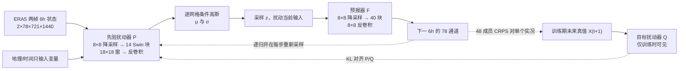

# FuXi-ENS：0.25°、15 天流依赖扰动集合的正式版精读

> Xiaohui Zhong、Lei Chen、Hao Li、Roberto Buizza、Jun Liu、Jie Feng、Zijian Zhu、Xu Fan、Kan Dai、Jing-Jia Luo、Jie Wu、Bo Lu，*FuXi-ENS: A machine learning model for efficient and accurate ensemble weather prediction*，*Science Advances* 11(44), eadu2854，[DOI:10.1126/sciadv.adu2854](https://doi.org/10.1126/sciadv.adu2854)，2025-10-31。[正式全文开放存档](https://pmc.ncbi.nlm.nih.gov/articles/PMC12577690/)及其[机器可读全文](https://www.ebi.ac.uk/europepmc/webservices/rest/PMC12577690/fullTextXML)；先前版本题为 *FuXi-ENS: A machine learning model for medium-range ensemble weather forecasting*，[arXiv:2405.05925v3](https://arxiv.org/html/2405.05925v3)，2024-08-09。复核日期：2026-09-25。正式版与预印本为**同一研究，不重复计篇**。

## 1. 先看任务和版本差异

FuXi-ENS 面向全球 **0.25°、每 6 小时一帧、最长 15 天**的集合预报。它不是把确定性 FuXi 复制 48 次后只在初值加白噪声，而是由条件扰动模型在**初值及每一个递归预报步**依据当前流场重新采样，再由预报器推进。其直接竞争对象是 2018 年归档的 **51 成员 ECMWF-ENS**，而不是现行 9 km 业务系统；两者还使用不同初始分析，不能把分数差完全归因于网络结构。[正式全文 Results／Materials and Methods](https://pmc.ncbi.nlm.nih.gov/articles/PMC12577690/)

旧笔记只读到 2024 arXiv v3，正式版有实质更新，不能沿用旧图号和训练配置：

| 项目 | 2024 arXiv v3 的记载 | 2025 *Science Advances* 正式版，本文采用 |
|---|---|---|
| 标题/作者 | *medium-range ensemble weather forecasting*；10 名作者 | *efficient and accurate ensemble weather prediction*；加入 Roberto Buizza、Zijian Zhu，共 12 名作者 |
| 训练 | 着重描述 1→3 步各 3,000 次、8×A100/每卡一成员 | **先**预报器单步 L1 预训练 60,000 次、8×A100；**再**两网络联合 CRPS＋KL 课程训练 1→3 步各 3,000 次、**48×A100/48 成员** |
| 数据处理 | 旧稿未列可复现的完整规范 | 正式版明确：训练集统计的 z-score；TP 取 `ln(TP+1)`；SST 陆地 NaN 在训练 loss 中遮罩 |
| 主结果展示 | 六变量×60 时效、**98.1%/360** 的 CRPS 胜出计数；正文 Fig. 1–5 | 主图改为三变量的 RMSE/ACC/MBE、CRPS/ROCASS/SSR、BS、台风和 5 天热浪；**正式正文未重述 98.1%/360**，不能把旧摘要计数冒称正式版主结果 |
| 极端/个例 | arXiv 图 3 的 4 变量×6 阈值；热浪图含 3 天和 11 天起报 | 正式图 3 主示 Z500/WS850/T2M 的 5%、95% 阈值，另称六变量×六阈值×60 时效；正式图 5 是**提前 5 天**的热浪例 |

正式版链接了[模型与运行代码归档](https://zenodo.org/records/15124541)及[预报数据归档](https://zenodo.org/records/15171712)。模型归档 API 显示主压缩包约 **9.45 GB**，本次只核实归档元数据，未下载检查点逐文件审计；补充 PDF 列 **S1–S31 与 Table S1**，本次可访问正式正文但未逐页获取 76.5 MB 的补充 PDF，因此以下附图结论明确标为**正式正文对附图的转述**，不自行读图取点。[正式版数据可用性声明](https://pmc.ncbi.nlm.nih.gov/articles/PMC12577690/)、[Zenodo](https://zenodo.org/records/15124541)

## 2. 数据、预处理和可比性

| 环节 | 正式版可核实设置 | 阅读时须注意 |
|---|---|
| 源资料和时间 | ERA5 逐 6h、`721×1440` 全球 0.25°；**2002–2016** 训练、**2017** 验证、**2018** 测试 | ERA5 是再分析，不是实时原始卫星观测；只做一年留出测试 |
| 高空输出 | Z、T、U、V、Q × 13 气压层：50、100、150、200、250、300、400、500、600、700、850、925、1000 hPa，计 **65 通道** | 不能把 13 层误数为 13 个网络 |
| 地面/海面输出 | T2M、D2M、SST、U10M/V10M、U100M/V100M、MSL、SNSR、SSRD、FDIR、TTR、TP，计 **13 通道** | 总输出 `65+13=78`，不含只输入的地理/时间强迫 |
| 预处理 | 除 TP 外，输入和输出按**训练集统计** z-score；高空各层分别求均值与标准差；TP 做 `ln(TP+1)`；SST 在陆地为 NaN，训练时对 2002–2016 期间 NaN 网格遮罩 loss | 正文未刊出逐变量均值/标准差或 NaN 在模型输入中的具体填充值；不能据别的 FuXi 配置补造 |
| 配对与附加输入 | 两个相邻 6h 天气状态由 `2×78×721×1440` 沿通道并为 `156×721×1440`；另有地形、海陆掩膜、地理和时间变量 | 156 是**两帧输入通道**，不是 156 个预报输出量 |
| 对照与真值 | FuXi-ENS 以 ERA5 初始化；ECMWF-ENS 使用自身 2018 控制/扰动分析，归档为 0.25°/51 成员；格点评分以 ERA5 作参照 | 不同初值、系统年代、成员数 48 vs 51 都是混杂因素；2023 年升至 9 km 的业务 ENS 不是本文对照 |
| 事件资料 | 台风位置以 NOAA IBTrACS 6h 最佳路径；极端阈值据 1993–2016 ERA5，逐格点、逐月、逐时刻求百分位 | 热浪图是个例，TC 仅满足集合探测筛选的样本 |

正式版没有把从 ERA5 原始小时资料到 6h 场的全部 QC／插值脚本、时间强迫编码、极点接缝处理、z-score 数值表和评估代码逐行印在正文；这些是复现时仍须从归档代码核对的边界。[Materials and Methods: Data、Data preprocessing](https://pmc.ncbi.nlm.nih.gov/articles/PMC12577690/)

## 3. 结构：训练时的后验与上线时的先验必须分开

此图依据正式 Fig. 6 和方法自行重绘，虚线是训练约束，不表示业务推理能读取未来真值。`P` 根据可用天气和地理/时间强迫生成条件高斯参数；`Q` 在联合训练阶段用 `X_t,X_{t+1}` 构造目标分布，再以 KL 项指导 `P`。测试时只保留 `P` 采样，若把 `Q` 放进推理图，就会产生未来实况泄漏。[正式版 Fig. 6／FuXi-ENS model training](https://pmc.ncbi.nlm.nih.gov/articles/PMC12577690/)

扰动器对 156 通道输入用核与步长均为 8 的卷积降到论文所写 `156×90×180` 潜平面，地理/时间变量有平行投影，拼接后经过 **14 个 Swin Transformer 块**，注意力窗 **18×18**，再反卷积生成与天气输入同尺寸的均值和尺度张量。论文称 `σ` 为 covariance matrix，却给它与输入相同的 `156×721×1440` 形状，并在讨论中把目前方式称作 *univariate* Gaussian；因此只可解读为逐元素/对角参数化，**不能误写为空间全协方差矩阵**。预报器再做 8×8 降采样、**40 个 Transformer 块**及 8×8 反卷积，输出下一 6h 状态；721 除以 8 与所列 90 行不严格整除，边缘裁剪／padding 实现需查代码，正文未明示。[正式版 FuXi-ENS model／Discussion](https://pmc.ncbi.nlm.nih.gov/articles/PMC12577690/)

## 4. 训练顺序、参数与是否微调

| 阶段 | 权重和可见信息 | 原文公开的优化设置 | 目的 |
|---|---|---|---|
| ① 预报器单步预训练 | 只训练预报模型，以可用两帧预测下一帧；目标为按纬度余弦加权的逐变量 **L1** | **60,000 iterations**；**8×NVIDIA A100**；每卡 batch **1**；AdamW，`β=(0.9,0.95)`、初始 LR `2.5×10^-4`、weight decay `0.1` | 先形成可靠 6h 状态推进器，而不是直接从噪声学习 15 天分布 |
| ② 联合集合训练 | 从阶段①预报器出发，联合优化预报器与扰动器；训练时 Q 可见未来目标、P 不可见；集合对同一个 ERA5 真值计 CRPS，另以 `λ KL(Q,P)` 约束，**λ=`1×10^-4`** | 自回归步数 **1→2→3**，每档 **3,000 iterations**（共名义 9,000）；固定 LR **`4.5×10^-6`**；**48×A100**、每卡 batch 1/生成 1 成员，形成训练用 **48 成员** | 用 proper score 训练概率集合并减轻长滚动误差 |
| ③ 推理 | 丢弃仅训练可用的 Q；每个初值独立生成 **48 成员**，每 6h `P` 重新采样并由预报器滚动 60 步到 15 天 | 单 GPU 可逐成员顺序运行，或多卡并行；作者报 15 天约 **10 秒/成员/A100** | 10 秒不是完整 48 成员串行加观测/起报处理成本 |

正式版对联合训练只明说固定 LR、卡数、批量和课程长度，**未在该阶段重新明确优化器、β、weight decay、调度、梯度裁剪及随机种子**；不能未经证据就把预训练 AdamW 设置全部照抄过去。阶段②从本研究单步预报器继续联合训练，属于全模型概率目标适配；未报告 LoRA、冻结层或对既有发布的确定性 FuXi 权重直接微调。`CRPS + KL` 所需的是**一个未来实况及多个生成成员**，不需要未来“真实集合”标签；附图 S24 据正文转述，CRPS 训练相较 `L1+KL` 同结构版在 CRPS、RMSE、spread、SSR 更好，但本次未从补图读出各点数值。[正式版 FuXi-ENS model training](https://pmc.ncbi.nlm.nih.gov/articles/PMC12577690/)

## 5. 正式版图表：优势、反例与证据层级

正式版主图均是 2018 留出年，与旧预印本图义不同。主图 1–3 的红点是 **1,000 次 bootstrap、97.5% 置信水平**的显著改善标记；无红点的曲线先后不等于统计显著。[正式版 Fig. 1–3](https://pmc.ncbi.nlm.nih.gov/articles/PMC12577690/)

| 正式证据 | 量化或方向性结果 | 反面/口径限制 |
|---|---|---|
| **Fig. 1：Z500、WS850、T2M 集合均值 RMSE/ACC/MBE** | 多数 lead 改善；T2M 约第 2 天 RMSE **最高降低 25%**，其他展示变量约 **10%**；作者称前 7 天尤其明显 | WS850 bias **前 5 天更小、后续更大**；Z500 有正偏差，幅度约为 ECMWF 负偏差的两倍，不能把 RMSE 领先读成全面无偏。正文称附图 S2–S3 第 5 天六变量约 70% 格点 RMSE 较低，第 10/15 天地区差缩小 |
| **Fig. 2：CRPS、上下三分位 ROCASS、SSR** | CRPS 多数变量/lead 优，前 7 天相对改善约 **10%–30%**；ROCASS 多数 lead 有利 | **Z500 前 2 天**、**T850 初始 12h**的 CRPS 不利；T2M 的 ROCASS 显著性并非大多数 lead 都成立。FuXi-ENS 在第 2 天 spread **低估 20%–30%**，第 7 天才到均值误差约 **90%**；不能称全程完美校准 |
| **Fig. 3：极端 BS** | 主图只绘三变量的 `<5%` 与 `>95%`；正文称含附图 S11 的全部设定为 **6 百分位×6 变量×60 时效＝2,160** 个组合，短 lead 改善更明显 | 阈值是 1993–2016 ERA5 逐位置/月份/时刻分位，不是固定绝对高温或降水量；正文未给旧稿的 98.1%/360 或新 2,160 组合的胜出百分比，不擅自补造 |
| **Fig. 4：台风路径集合** | IBTrACS 条件筛后 FuXi-ENS **167** 次预报、ECMWF-ENS **165** 次，约占 2018 测试资料的 **20%**；集合均值路径误差从早期约小 **10%** 到第 5 天约小 **20%** | FuXi-ENS 第 3 天后路径集合 spread **低估 20%–30%**，ECMWF 约高估 **15%**。只收录至少三分之二成员探测到台风的案例；正文举“32 成员”对应 48 成员，而 51 成员阈值应另核，不将样本筛后技巧推广至漏检风暴 |
| **Fig. 5：2018 东北亚热浪** | 2018-07-23 06 UTC 有效、提前 **5 天**起报：陆地 T2M 集合均值 RMSE **2.36 K（FuXi）对 2.76 K（ECMWF）**；两者都抓到渤海湾附近两个高温中心 | “best member”按目标区 T2M RMSE **事后挑选**，非可业务选择的成员；图中较好最佳成员不能替代极端可靠性或多年事件统计。正文提及附图 S18–S19 的热浪起止与时滞相关，但本次未独立读补图 |
| **效率与 GenCast** | 作者称 A100 上 15 天 **约 10 秒/成员**；正文转述补充 §S10 认为 FuXi-ENS/GenCast 整体技巧相近、依变量而变 | 没有统一硬件、成员数、起报资料的公开主图成本基准；GenCast 比较在补充材料，不能概括为全面领先或“10 秒完成全部 48 成员” |

格点 RMSE、CRPS 的纬度加权全球均值、逐格点图、台风路径与热浪区域 RMSE 使用不同分母与真值，不能将其拼成一个“综合胜率”。作者还报告 Fig. 1 的 T2M 低偏差可能与其直接预测 ERA5 T2M、ECMWF 诊断 T2M 的产品定义差异有关；这是作者对可能原因的解释，非控制实验的因果结论。[正式版 Results／Discussion](https://pmc.ncbi.nlm.nih.gov/articles/PMC12577690/)

## 6. 阅读判断与复现清单

这篇正式版的价值是把**单步预报器预训练 → 逐步扰动的 48 成员联合 CRPS/KL 训练**写成可辨认的两阶段流程，并在 15 天全球场、TC 路径及一个热浪个例上同时报告确定性和概率结果。局限也很具体：第 2 天的欠离散、第 3 天后的台风路径 spread 偏小、部分变量初始 CRPS 或长 lead bias 的反例，以及 2018 ENS 自有分析与 ERA5 初始化的非同初值比较。作者自己提出，未来可改用多元高斯/更合适的初值快增长扰动、参数扰动及后校准；这些是**建议，不是本文已经实现**。[正式版 Discussion](https://pmc.ncbi.nlm.nih.gov/articles/PMC12577690/)

复现时先核归档包里的归一化常数、TP 零值处理、SST NaN 输入填充、721 纬向格点的卷积边界、Q/P 的具体对角方差实现和第二阶段优化器，再在**同初值、同真值、同成员数、同年份**下重跑 CRPS/ROCASS/SSR/BS。若比较 GenCast，需区分正式正文仅转述的补充 §S10 与本次未独立获取的原始补图。与确定性 FuXi、观测直达 FuXi Weather、42 天日均 FuXi-S2S、推理时演化扰动 FuXi-Short 各是不同模型或研究，不合并训练参数及成绩。

[返回首页](../../README.md) · [返回总表](../../气象大模型_中期预报论文追踪.md)
