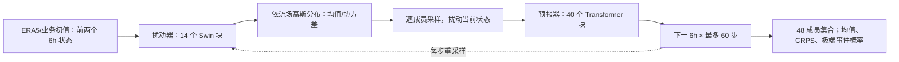

# FuXi-ENS：15 天、0.25° 的潜变量扰动集合预报

> Xiaohui Zhong、Lei Chen、Hao Li、Jun Liu 等，*FuXi-ENS: A machine learning model for medium-range ensemble weather forecasting*，[arXiv:2405.05925v3，2024-08-09](https://arxiv.org/html/2405.05925)（首版 2024-05-09）。阅读于 2026-09-24。FuXi-ENS 是**独立的概率模型**，不要与原 FuXi 级联确定性系统或 FuXi Weather 的卫星同化链混称。

## 研究问题与结论

确定性中期模型可以快速产生 15 天预报，却无法直接给出风险概率；以固定随机扰动硬拼集合，离散度往往很快崩塌。FuXi-ENS 用一个 VAE 风格的扰动器学习**依赖当前背景流场**的高斯分布，在初值及每个 6 小时滚动步注入样本，再交给天气预测器传播。论文在 2018 年 48 成员 FuXi-ENS 与 51 成员 ECMWF 集合的六个目标、60 个时效组合中，报告 **98.1% 的 360 个 CRPS 比较有利**；这是“所选 6 变量 × 60 步”的统计，不代表 78 个输出量逐一胜出。[摘要及结果 2.2](https://arxiv.org/html/2405.05925)

## 方法拆解及重绘结构

训练数据为 2002–2016 的 6 小时 ERA5，2017 验证、2018 测试，网格 0.25°（721×1440）。输入包含前两个天气时刻；5 个高空变量 × 13 层加 13 个地表变量，共 **78 个输出通道**。原文方法段有“11 surface variables”的文字笔误，但所列变量及 5×13+13=78 与摘要一致，本笔记按其变量表核对。扰动器的 14 个 Swin Transformer 块先输出高斯均值/协方差，再采样；预测器含 40 个 Transformer 块，经过 8×8 降/升采样，逐步输出下一个 6 小时状态。训练用集合 CRPS 加 KL 正则，让预报分布贴近目标分布。论文描述还涉及训练时的目标编码器，复现须严格区分训练可见未来真值与推理只用当前预报。[方法 4.1–4.2、图 6](https://arxiv.org/html/2405.05925)

图是依论文图 6 自行重绘，不复刻原图像素。其关键不同于“只在初值加噪声”：每一步重新产生有条件的扰动，试图同时近似初值及模式不确定性。模型训练目标优化概率分数，但这仍不保证对稀有事件的尾部可靠性。[方法 4.2](https://arxiv.org/html/2405.05925)

## 数据字段与处理：不能把 78 通道当作全部输入

ERA5 原始产品为小时资料；本文抽取**每 6 小时**一帧，放到 0.25° 的 **721×1440** 全球格点。15 年训练（2002–2016）、2017 验证、2018 测试。高空 5 个量是 Z/T/U/V/Q，每个取 50、100、150、200、250、300、400、500、600、700、850、925、1000 hPa，形成 **65 通道**。地表另有 **13** 个输出：T2m、D2m、SST、U10/V10、U100/V100、MSL、净太阳辐射 SNSR、向下太阳辐射 SSRD、地表直接太阳辐射 FDIR、顶层净热辐射 TTR、总降水 TP，故 `65+13=78`。方法段一句“11 surface variables”与同段列表和表 1 矛盾；应以列出的 13 项及 78 总数为准。[方法 4.1、表 1](https://arxiv.org/html/2405.05925)

额外**只作为输入**的是地形、海陆掩膜、经纬度、日时/年日、预报步数。两帧天气输入是 `2×78×721×1440`，沿通道合并为 156 通道；不能在“78 个预报变量”之外再错误计算一个 156 变量的输出。论文没有公开变量标准化的完整均值/方差、降水或辐射变换、极点处理和缺测填补，复现实验需要确认发布代码而不能臆造预处理。[表 1、方法 4.2](https://arxiv.org/html/2405.05925)

## 更细的网络和训练流程

扰动网络先用 **8×8 卷积、stride 8** 把天气张量压到约 `90×180` 潜平面；静态/时间强迫有平行投影，随后拼接并经过 **14 个 Swin 块、18×18 注意力窗**，再用 8×8 反卷积回到原网格。网络产生与两帧天气拼接维度相应的高斯参数：**均值和尺度张量**（原文称 covariance matrix，但未给全协方差参数化，不能由此推断有空间全协方差）。从条件分布采样得流依赖扰动，叠加到当前天气后送入含 **40 个 Transformer 块**的预报器；预报器同样是 8×8 下采样—处理—上采样。训练时的目标编码器 `Q` 看见 `X_t,X_{t+1}`，推理时只用先验 `P` 看见当前可用天气；把 Q 放在推理图会造成未来信息泄漏。[方法 4.2、图 6](https://arxiv.org/html/2405.05925)

损失写成 `CRPS(8 个训练集合成员, ERA5 真值) + λ KL(P,Q)`，其中 **λ=`10^-4`**。这是针对同一个实况样本优化预报分布的 proper score，并不需要“未来真实集合”作为训练标签。作者还与 `L1 + λ KL` 的同骨干对照，补图 14 报告 CRPS 版本更好。每张 A100 每步生成 **1 个成员**，8 张卡训练时相当于 **8 成员**；正式评估用 **48 成员**，不能混同训练和推理集合大小。

训练自回归课程依次 **1、2、3 个 6h 步**，每个长度 **3,000 iterations**，合计按所述课程约 **9,000 iterations**；每 GPU batch **1**，总计 8 张 A100；AdamW `β1=0.9, β2=0.95`、初始 LR **`2.5×10^-4`**、weight decay **0.1**。论文未说明 LR 后续 schedule、梯度裁剪、随机种子或是否从确定性 FuXi 权重初始化；也未报道独立微调阶段。因此这里把“课程增加 rollout 长度”记录为训练日程，而**不称为 LoRA/冻结层微调**。[方法 4.2](https://arxiv.org/html/2405.05925)

评估并非严格相同初值：FuXi-ENS 从 ERA5 起报，ECMWF 的 2018 ENS 用自身业务分析/控制成员。ACC 气候态取 ERA5 1993–2016；站点、台风和格点评分分别遵循不同配准逻辑。强事件结论必须同时查 BS/可靠性与 TC 检出率，而不仅看 CRPS；作者的 2018 旧版 ENS 对照也不能代表 2023 升级后的业务系统。[方法 4.1、4.4](https://arxiv.org/html/2405.05925)

## 结果图表和负面证据

| 原文证据 | 可核验结论 | 注意 |
| --- | --- | --- |
| 图 1 / 结果 2.1，2018 全年 | 六个展示变量多数 lead 的集合均值 RMSE/ACC 较 ECMWF ENS 有利 | Z500、T850 均有早期 **2/60 lead** 不利；高空全部变量未逐项同档评估 |
| 图 2 / 结果 2.2，15 天 CRPS | 六变量×60 步中 **98.1%** 有利；Z500 第一天 ECMWF 领先，约第 2 天后交叉 | CRPS 报告的比较集有限，不能当作所有地区/阈值均领先 |
| 台风路径 / 热浪个例 | 论文展示台风概率路径与 2018 东北亚破纪录热浪 | 个例不能代替大样本校准；台风统计排除了探测成员不足 2/3 的个例 |
| 推理耗时 | 单成员 15 天逐 6h 约 **10 秒/A100** | 未包含观测处理、初值生产及多成员吞吐配置，不能直接与整套 ECMWF 成本相除 |

格点准确度的全球均值可掩盖地区差异；原文空间差图亦显示随 lead 延长局部优势减弱。对照使用 2018 年历史 ECMWF ENS 约 0.25° 归档，而不是 2023 年升级后的 9 km 新版本。Brier Score 需要全 51 成员，作者只每五天下载一次，因此其 BS 有效样本约为其他评分的 **20%**。这几项是解释“优于 ECMWF 集合”的必要口径。[结果 2.1–2.5、方法 4.1](https://arxiv.org/html/2405.05925)

## 与 FuXi 系列关系及复核建议

原 FuXi 负责 15 天确定性级联；FuXi-ENS 负责同级时效的概率集合；FuXi-S2S 则是日均 42 天的次季节模型，结构和评估集均不同。复核本模型应在相同初值、相同 ENS 周期与相同成员数下同时报告 CRPS、spread–skill、可靠性图、Brier、台风探测召回与地区指标。尤其要将 2018 测试和未来业务周期分开，防止把旧版 ENS 对照推广为当前业务优势。

[返回首页](../../README.md)
