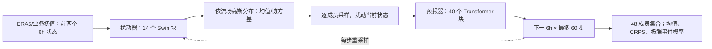

# FuXi-ENS：15 天、0.25° 的潜变量扰动集合预报

> Xiaohui Zhong、Lei Chen、Hao Li、Jun Liu 等，*FuXi-ENS: A machine learning model for medium-range ensemble weather forecasting*，[arXiv:2405.05925v3，2024-08-09](https://arxiv.org/html/2405.05925)（首版 2024-05-09）。阅读于 2026-09-24。FuXi-ENS 是**独立的概率模型**，不要与原 FuXi 级联确定性系统或 FuXi Weather 的卫星同化链混称。

## 研究问题与结论

确定性中期模型可以快速产生 15 天预报，却无法直接给出风险概率；以固定随机扰动硬拼集合，离散度往往很快崩塌。FuXi-ENS 用一个 VAE 风格的扰动器学习**依赖当前背景流场**的高斯分布，在初值及每个 6 小时滚动步注入样本，再交给天气预测器传播。论文在 2018 年 48 成员 FuXi-ENS 与 51 成员 ECMWF 集合的六个目标、60 个时效组合中，报告 **98.1% 的 360 个 CRPS 比较有利**；这是“所选 6 变量 × 60 步”的统计，不代表 78 个输出量逐一胜出。[摘要及结果 2.2](https://arxiv.org/html/2405.05925)

## 方法拆解及重绘结构

训练数据为 2002–2016 的 6 小时 ERA5，2017 验证、2018 测试，网格 0.25°（721×1440）。输入包含前两个天气时刻；5 个高空变量 × 13 层加 13 个地表变量，共 **78 个输出通道**。原文方法段有“11 surface variables”的文字笔误，但所列变量及 5×13+13=78 与摘要一致，本笔记按其变量表核对。扰动器的 14 个 Swin Transformer 块先输出高斯均值/协方差，再采样；预测器含 40 个 Transformer 块，经过 8×8 降/升采样，逐步输出下一个 6 小时状态。训练用集合 CRPS 加 KL 正则，让预报分布贴近目标分布。论文描述还涉及训练时的目标编码器，复现须严格区分训练可见未来真值与推理只用当前预报。[方法 4.1–4.2、图 6](https://arxiv.org/html/2405.05925)

图是依论文图 6 自行重绘，不复刻原图像素。其关键不同于“只在初值加噪声”：每一步重新产生有条件的扰动，试图同时近似初值及模式不确定性。模型训练目标优化概率分数，但这仍不保证对稀有事件的尾部可靠性。[方法 4.2](https://arxiv.org/html/2405.05925)

## 结果图表和负面证据

| 原文证据 | 可核验结论 | 注意 |
| --- | --- | --- |
| 图 1 / 结果 2.1，2018 全年 | 六个展示变量多数 lead 的集合均值 RMSE/ACC 较 ECMWF ENS 有利 | Z500、T850 均有早期 **2/60 lead** 不利；高空全部变量未逐项同档评估 |
| 图 2 / 结果 2.2，15 天 CRPS | 六变量×60 步中 **98.1%** 有利；Z500 第一天 ECMWF 领先，约第 2 天后交叉 | CRPS 报告的比较集有限，不能当作所有地区/阈值均领先 |
| 台风路径 / 热浪个例 | 论文展示台风概率路径与 2018 东北亚破纪录热浪 | 个例不能代替大样本校准；台风统计排除了探测成员不足 2/3 的个例 |
| 推理耗时 | 单成员 15 天逐 6h 约 **10 秒/A100** | 未包含观测处理、初值生产及多成员吞吐配置，不能直接与整套 ECMWF 成本相除 |

格点准确度的全球均值可掩盖地区差异；原文空间差图亦显示随 lead 延长局部优势减弱。对照使用 2018 年历史 ECMWF ENS 约 0.25° 归档，而不是 2023 年升级后的 9 km 新版本。Brier Score 需要全 51 成员，作者只每五天下载一次，因此其 BS 有效样本约为其他评分的 **20%**。这几项是解释“优于 ECMWF 集合”的必要口径。[结果 2.1–2.5、方法 4.1](https://arxiv.org/html/2405.05925)

## 与 FuXi 系列关系及复核建议

原 FuXi 负责 15 天确定性级联；FuXi-ENS 负责同级时效的概率集合；FuXi-S2S 则是日均 42 天的次季节模型，结构和评估集均不同。复核本模型应在相同初值、相同 ENS 周期与相同成员数下同时报告 CRPS、spread–skill、可靠性图、Brier、台风探测召回与地区指标。尤其要将 2018 测试和未来业务周期分开，防止把旧版 ENS 对照推广为当前业务优势。

[返回首页](../../README.md)
