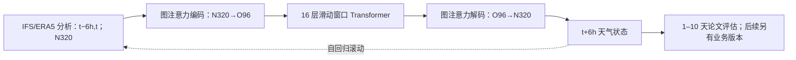

# AIFS：ECMWF 的确定性图编码—窗口 Transformer 中期预报底座

> Simon Lang、Mihai Alexe、Matthew Chantry、Jesper Dramsch、Florian Pinault、Baudouin Raoult、Mariana C. A. Clare、Christian Lessig、Michael Maier-Gerber、Linus Magnusson、Zied Ben Bouallègue、Ana Prieto Nemesio、Peter D. Dueben、Andrew Brown、Florian Pappenberger、Florence Rabier，*AIFS – ECMWF's data-driven forecasting system*，[arXiv:2406.01465v2，2024-08-07](https://arxiv.org/html/2406.01465v2)（首版 2024-06-03），ECMWF；复核于 2026-09-25。本文是 2024 年**实验研究版**，不得将 2025 业务 AIFS Single 1.0、后续 1.1/2.0 或 AIFS-ENS 的参数与成绩混填。[ECMWF 产品系列](https://www.ecmwf.int/en/forecasts/datasets/aifs-machine-learning-data)。

## 核心贡献及边界

AIFS 把 ECMWF 业务需要的资料管线、训练、GPU 并行、验证和发布与天气模型结合。模型使用**图注意力编码/解码**将 N320 约 0.25° 的输入映射到 O96 处理网格，再用 16 层移位窗口 Transformer 推进天气场；一次预测 6 小时，反复滚动生成中期预报。2022 年 Fig. 5 的系统评分主要覆盖 **第 1–10 天**，Fig. 9 的台风却使用 **2022 年 1 月至 2023 年 12 月**资料，两者不能说成同一回测。后续产品可输出 15 天，不等于本文已经量化了该时效的所有技能。[原文 §2–4](https://arxiv.org/html/2406.01465v2)

## 架构与训练链

输入前 6 小时和当前的 ERA5/IFS 分析，预报 Z、T、U/V、垂直速度、湿度等 13 层高空量以及地表量；降水作为输出。N320 网格有 **542,080** 点，O96 潜网格 **40,320** 点，避免常规经纬网格极点邻近过密。第一代约 1° AIFS 曾采用约 **10,000 节点/80,000 边**的二十面体处理图；本文讨论的是 **2024 年 2 月升级后**的 0.25° 输入、O96 处理网格和图 Transformer 编码/解码器，不能把第一代图规模当作本文配置。训练先以 ERA5 1979–2020 单步监督、随后 1979–2018 加最长 12 步（72h）滚动，最后用 2019–2020 业务 IFS 分析微调。纬度面积加权 MSE 及高度权重会影响高层技巧；推理仍依赖 IFS 的同化分析初值。[原文 §2–3](https://arxiv.org/html/2406.01465v2)

### 原始字段与空间/数值预处理

| 类型 | 输入输出身份与原文字段 | 阅读要点 |
| --- | --- | --- |
| 高空 | 位势、水平/垂直风、比湿、温度；50、100、150、200、250、300、400、500、600、700、850、925、1000 hPa | 13 层；越高层的训练损失权重越小，不能期待所有层同样最优 |
| 地表状态 | 地面气压、海平面气压、皮肤温度、2 m 温度和露点、10 m 水平风、整层水汽 | 同时作为输入和输出，支撑递推所需下步状态 |
| 诊断输出 | 总降水、对流降水 | 原文 Table 1 列为**仅输出**；不应写成未来真值降水作为输入 |
| 静态/外部强迫 | 海陆掩膜、地形及次网格标准差/坡度、入射太阳辐射、经纬度、日内时刻/年内日 | 部分强迫（如地形）按 min–max 标准化，其他状态按层零均值、单位方差标准化 |
| 网格 | ERA5 原生 N320 约 31 km 输入/输出；O96 处理器网格 | 相比 0.25° 规则经纬网格的 1,038,240 点，N320 的 542,080 点减少极区冗余和内存 |

训练/推理时两个相邻分析时刻 `t−6h,t` 一起输入，模型给出 `t+6h`，之后把自身预测递推输入。微调阶段不是用原始 O1280（约 0.1°）IFS 网格直接喂模型：论文明确将其**插值到 N320**；业务分析仍来自传统同化系统，AIFS 不是观测直达模型。图编码器/解码器给输入和处理网格的节点，以及两图的边，分别添加 8 个可学习特征；处理器使用 pre-norm 的窗口 Transformer。[原文 Table 1 与 §2–3](https://arxiv.org/html/2406.01465v2)

图根据原文图 1–3 自行绘制，只表达数据流，不重现作者原图。[原文图示](https://arxiv.org/html/2406.01465)

Fig. 1 的图边并非所有 N320 节点与 O96 节点全连接：编码器按处理节点附近的截断半径收集输入节点；解码时每个输入节点接其 **3 个最近的处理节点**。边的预定义特征包含长度和方向，输入字段与边先经线性嵌入；输入网格节点、处理网格节点以及编码/解码图边各另加 **8 个可学习特征**。Fig. 2 的窗口安排使完整邻域可落入局地注意力范围，并沿纬带移位；处理器自身**不显式使用图边**，不要将 Fig. 1 编码器的图消息传递误解成 16 层处理器均在图边上做卷积。Fig. 3 分别画图 Transformer 卷积块和 pre-norm/GELU 的窗口 self-attention 块。图 2 的“6 层信息传播”仅为示意，真正处理器是 **16 层**。[原文 §2、Fig. 1–3](https://arxiv.org/html/2406.01465v2)

并行机制同样是模型可训练性的组成部分：一种方式把图编码/解码及窗口注意力的 **attention heads** 跨 GPU 分片，再以 all-to-all 通信；另一种方式在图网络按 **1-hop 节点/边**分片并重排节点，减少设备间 gather/reduce。每个高分辨率实例分布在四张 A100 上，不能把“64 卡训练”理解为 64 个完全独立的数据并行副本。论文报告的至少 2048 GPU 近线性**弱缩放**是并行可扩展性测试，不是本模型采用 2048 GPU 训练的事实。[原文 §2](https://arxiv.org/html/2406.01465v2)

### 三阶段训练与微调参数（不是一句“使用 ERA5 训练”）

| 阶段 | 数据及目标 | 公开优化设置 | 该阶段解决的问题 |
| --- | --- | --- | --- |
| 1. 单步预训练 | ERA5 1979–2020，`t−6h,t → t+6h`，总 **260,000** 次更新 | 余弦学习率；前 1000 步从 0 warm-up 至 `1×10^-4`，之后退火至 `3×10^-7` | 学基本 6 小时状态转移；尚不能将其评分当成 10 天成绩 |
| 2. 多步 rollout | 从阶段 1 权重继续，ERA5 1979–2018，沿完整 6h 预测链反传 | 学习率 `6×10^-7`；每 **1000** 步增加 rollout，最长 **12 步/72 小时**；该阶段总更新步数未列 | 让训练时见到自己的预测分布，降低自回归误差累积；这是**同数据的多步训练**，不是独立预训练权重再做 LoRA |
| 3. IFS 分析微调 | 从已做 rollout 的模型继续，以 **2019–2020 业务 IFS 分析**再做 rollout | O1280 分析插值至 N320；正文未列此阶段学习率、步数、冻结层清单、早停条件 | 将 ERA5 分布适配业务分析/初值；这才是**换数据域的微调**，但不应据缺失信息声称全参数或特定层冻结 |

论文总体写采用 AdamW，β=(0.9,0.95)。目标是**完整归一化状态**的面积加权 MSE，**并非只预测归一化倾向/增量**；逐输出变量施加经验权重，使多数预报量贡献大致相等，垂直速度例外地降权，高空层也按高度线性降低权重。这解释了同一模型第 50 hPa 不利的可能训练机制，但没有逐层消融证明唯一因果。论文报告 batch size **16**、混合精度、activation checkpointing；一个实例跨 **4 张 40GB A100** 作张量/序列并行，总训练 **64 张 GPU、约一周**。原文没有给出每阶段完整步数/学习率、权重衰减、变量权重表、随机种子或微调冻结范围；不借 AIFS Single 1.1、AIFS-CRPS 的数值填补。[原文 §2–3、§5](https://arxiv.org/html/2406.01465v2)

## 结果图与“不全胜”的证据

| 原文位置 | 支持的结论 | 保留的反例 |
| --- | --- | --- |
| **Fig. 4**，北半球 Z500 ACC，逐日 **00 UTC** 起报、30 日滑动均值；2/6/10 天分面 | 较长 lead 相比当时 IFS 有**超过 12 小时**的技巧时间优势 | 各年份 IFS/ERA5 周期不同，不能把曲线差当固定 2022 同样本增益，更不能套用至当前业务 IFS |
| **Fig. 5**，**2022** 年每日 **00/12 UTC**，第 1–10 天北/南半球温带、热带、欧洲跨变量 scorecard | 对流层多个指标约 **10%** 改善，常见变量在第 1 天后 RMSE 较低；图中框线表示 **95% 显著性** | 50 hPa 高空 IFS 更好；第 1 天 IFS 分析验证下 850 hPa 风速可退步，但对应探空并未同样退步；100 hPa Z/T 也会随验证真值改变排序 |
| **Fig. 6**，**2022** 年 00/12 UTC 北半球 T2m/10m 风 RMSE | 0.25° 版本较第一代约 1° AIFS 在地面观测更有利 | 第一代的高空分数却与新版接近，分辨率收益不能外推到所有层或所有量 |
| **Fig. 5 的 TP/SEEPS** | 热带降水总体有利；较长 lead 中高纬也可能转为有利 | 温带**短 lead SEEPS 较差**；不要把该季节/区域依赖指标概括为“降水全面领先” |
| **Fig. 7**，2023-01-01 00 UTC 个例的 V850 场，12/120/240h | 12h 有较多小尺度结构 | 120/240h 的 AIFS 场比 IFS 平滑；这是个例展示，不是独立频谱量化表 |
| **Fig. 8**，**2022** 年 7 天 Z500、北温带、30 日滑动均值 | AIFS 与经过业务分析微调的 GraphCast 的 ACC/活动接近 | 与 IFS ENS **集合均值**的活动下降机制不同；不能将单值 AIFS 与集合平均的平滑程度当同类比较 |
| **Fig. 9**，**2022-01 至 2023-12** 台风样本 | AIFS 路径误差较小、沿轨偏慢较少 | 中心气压及最大风速强度偏弱，可能少检出气旋；这不是 Fig. 5 的 2022 全年同一评分集 |

Fig. 5 同时列“对 IFS 分析验证”及“对探空/SYNOP 验证”，它们并非同一个真值：由 IFS 同化产生的分析可能偏向 IFS 自身短期预报，因此需并排读。Fig. 9 的更好路径不能自动推断台风灾害强度更好。部署比较还应把 AI 预报器约 **2 分 30 秒/A100** 的 10 天推理（作者称**含预报 I/O**）与物理系统**完整的同化+预报**成本分开，不作不公平加速比。[原文 §3–5](https://arxiv.org/html/2406.01465v2)

## 与系列后续关系

本篇是 deterministic AIFS 基础。AIFS-CRPS 针对概率损失和集合离散度，AIFS ENS 是后续业务集合，AIFS-DOP 则更换了训练/初值来源，直接从观测预测。**2024 论文结论中的预期发布**不能继续被转述成“代码尚未开放”：ECMWF 之后已发布 [AIFS Single v0.2.1 模型卡和权重](https://huggingface.co/ecmwf/aifs-single-0.2.1)，标注此论文 arXiv ID，并提供 Anemoi 推理说明；约 **1.19 GB** 的 `.ckpt` 只含模型权重、**不含优化器或 LR 调度状态**。但模型卡标的是 **v0.2.1**，本次未核实其 SHA/训练批次与论文全部历史 2022–2023 评分完全一致，不能仅凭关联 arXiv ID 就断言用此检查点重跑会逐点复现 Fig. 4–9。模型卡还提示 checkpoint 为 pickle 型序列化、平台标为含不安全导入，阅读时只核元数据，本次**未加载或执行权重文件**。[ECMWF v0.2.1 模型卡及文件页](https://huggingface.co/ecmwf/aifs-single-0.2.1/tree/main)

若复现 2024 本篇，应固定准确的 AIFS 权重版本、当年的业务 IFS 周期、共同初值、探空/SYNOP 质量控制、台风追踪器和 N320 到观测/验证网格的插值。原文未披露标准化逐字段统计量、精确变量损失权重、IFS 微调学习率/更新总数/是否冻结模块；可从公开权重或 Anemoi 配置继续核实，但不能把后续 v1.1 改进倒填进 2024 研究版。[原文 §3–5](https://arxiv.org/html/2406.01465v2)

[返回首页](../../README.md)
