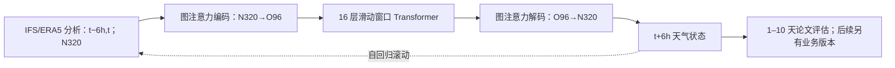

# AIFS：ECMWF 的确定性图编码—窗口 Transformer 中期预报底座

> Simon Lang、Mihai Alexe、Matthew Chantry、Jesper Dramsch 等，*AIFS – ECMWF's data-driven forecasting system*，[arXiv:2406.01465v2，2024-08-07](https://arxiv.org/html/2406.01465)（首版 2024-06-03），ECMWF。阅读于 2026-09-24。本篇是 2024 研究系统，业务产品后来还有 Single 更新与 ENS；版本不能混同。[ECMWF 当前产品说明](https://www.ecmwf.int/en/forecasts/datasets/aifs-machine-learning-data)。

## 核心贡献及边界

AIFS 把 ECMWF 业务需要的资料管线、训练、GPU 并行、验证和发布与天气模型结合。模型使用**图注意力编码/解码**将 N320 约 0.25° 的输入映射到 O96 处理网格，再用 16 层滑动窗口 Transformer 推进天气场；一层预测 6 小时，反复滚动生成中期预报。本文 2022 年回测的图 4–9主要覆盖 **1–10 天**，不能把后续产品的 15 天时效和本文旧版评分合并引用。[原文模型/结果节](https://arxiv.org/html/2406.01465)

## 架构与训练链

输入前 6 小时和当前的 ERA5/IFS 分析，预报 Z、T、U/V、垂直速度、湿度等 13 层高空量以及地表量；降水作为输出。N320 网格有 542,080 点，O96 潜网格约 40,320 点，避免常规经纬网格极点邻近过密。编码边依据邻近与方向构建，解码再把潜场映回原网格；窗口注意力沿纬向安排并随层移动。训练先以 ERA5 1979–2020 单步监督、随后 1979–2018 加 12 步（72h）滚动，最后用 2019–2020 业务 IFS 分析微调。纬度面积加权 MSE 及高度权重会影响高层技巧；推理仍依赖 IFS 的同化分析初值。[原文第 2–3 节](https://arxiv.org/html/2406.01465)

图根据原文图 1–3 自行绘制，只表达数据流，不重现作者原图。[原文图示](https://arxiv.org/html/2406.01465)

## 结果图与“不全胜”的证据

| 原文位置 | 支持的结论 | 保留的反例 |
| --- | --- | --- |
| 图 4，北半球 Z500 ACC | 长 lead 相比当时 IFS 约 **>12 小时**技巧优势 | 图基于 2022 等历史周期；不能套用到今天的业务 IFS |
| 图 5，2022 跨变量评分 | 对流层多个指标约 **10%** 改善，常见变量在 1 天后 RMSE 较低 | 50 hPa 高空 IFS 较好；短 lead 若用 IFS 分析验证，AIFS 可较差 |
| 图 5–6，地表及降水 | T2m、10m 风在分析/观测验证多有优势 | 温带降水 SEEPS 在短期较差；热带才总体较好 |
| 图 7–8，空间活动 | 确定性场的误差和 ACC 有竞争力 | MSE 令高波数能量随 lead 减少，长时效结构更平滑 |
| 图 9，热带气旋 | 路径误差较小 | 中心气压/最大风速强度偏弱，可能也少检出气旋 |

图 5 同时列“对 IFS 分析验证”及“对探空/SYNOP 验证”，它们并非同一个真值：由 IFS 同化产生的分析可能偏向 IFS 自身短期预报，因此需并排读。图 9 的更好路径不能自动推断台风灾害强度更好。部署比较还应把 AI 预报器约 2.5 分钟/A100 的 10 天推理与物理系统**完整的同化+预报**成本分开，不作不公平加速比。[原文第 4–5 节](https://arxiv.org/html/2406.01465)

## 与系列后续关系

本篇是 deterministic AIFS 基础。AIFS-CRPS 针对概率损失和集合离散度，AIFS ENS 是后续业务集合，AIFS-DOP 则更换了训练/初值来源，直接从观测预测。若复现 2024 本篇，应固定 AIFS 权重、2022 业务 IFS 周期、共同初值、探空/SYNOP 质量控制、台风追踪器和 0.25° 重网格方案；不得把后续 v1.1 改进归于此版本。

[返回首页](../../README.md)
