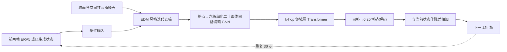

# GenCast：0.25°、15 天生成式集合预报的训练与评估细读

> Ilan Price、Alvaro Sanchez-Gonzalez、Ferran Alet、Tom R. Andersson、Andrew El-Kadi、Dominic Masters、Timo Ewalds、Jacklynn Stott、Shakir Mohamed、Peter Battaglia、Remi Lam、Matthew Willson，*Probabilistic weather forecasting with machine learning*，[*Nature*，2024-12-04 在线发表；2025 年卷 637 页 84–90](https://www.nature.com/articles/s41586-024-08252-9)，[正式正文 PDF](https://www.nature.com/articles/s41586-024-08252-9.pdf)，[正式补充材料 PDF](https://media.springernature.com/original/springer-static/esm/art%3A10.1038%2Fs41586-024-08252-9/MediaObjects/41586_2024_8252_MOESM1_ESM.pdf)。2026-09-25 对照正文、补充方法与扩展图表重读。**发表年份按在线首发 2024**，不可因卷期 2025 而重复收录为另一篇。

## 1. 为什么需要生成式集合

确定性 MSE 预报常接近未来条件均值，长期滚动后显得平滑，无法表达多种合理天气路径。GenCast 直接学习“给定前两帧，下一帧的概率分布”，每 12 小时抽一个新噪声并去噪，30 次自回归到 15 天；多次重采样得到集合。论文所说“8 分钟”是**单个 15 天成员在 Cloud TPUv5 上**的生成时间，多个成员可并行，不能写作在任意设备上 50 成员全套固定 8 分钟。[Nature 摘要与 Methods](https://www.nature.com/articles/s41586-024-08252-9)

## 2. 数据、标签与时间切分

| 项目 | 原文配置 | 对复现的影响 |
|---|---|---|
| 训练数据 | ERA5 0.25°、6 个地表变量 + 6 个高空变量×13 层，共 84 个预报变量 | 既包含动力热力量，也包含海温等下边界；不应与只用 69 通道/1.5° 的 ERDM 直接按“相同数据”比较。 |
| 时间取样 | ERA5 小时资料先选 00/06/12/18 UTC，再组成相隔 **12h** 的 00/12 或 06/18 序列 | 相邻两帧跨 ERA5 的同化窗边界，避免混入同窗与跨窗差异较大的 6h 目标分布。 |
| 累积量 | 降水等按目标时间之前的 **12h 累计**计算，而非只抽目标时点的累计值 | 时段与标签位置必须对齐，避免累计量无意义。 |
| 开发/最终测试 | 开发训练 1979–2017、2018 验证；冻结模型选择后重训 1979–2018、2019 测试 | 2018 不能再被视为最终模型完全未见训练年。2019 有 730 个 12h 初值。 |
| 初始化与验证 | GenCast 用 ERA5 分析起报并按 ERA5 评分；ENS 部分评分用 HRES-fc0 等自身分析 | 不同真值口径应并列说明，不能只凭汇总百分比直接下业务对等结论。 |

原文没有在 Nature 网页正文逐项给出 84 通道的标准化常数、每种静态强迫的处理和所有缺测填充规则；这些在代码/补充材料中须再核对。这里不把 GraphCast 的数据管线细节未经验证直接移植到 GenCast。[Nature Methods/Training data](https://www.nature.com/articles/s41586-024-08252-9)

### 正式版字段和预处理核对

正式 [Extended Data Table 1](https://www.nature.com/articles/s41586-024-08252-9.pdf) 把 **84 个预报场**拆为六个高空量 × 十三层与六个单层量，并把“只作输入上下文”的字段另列，不能把静态/时钟特征再加进 84：

| 角色 | 字段与层 | 处理含义 |
| --- | --- | --- |
| 输入且预测：高空 | 位势 `z`、比湿 `q`、温度 `t`、纬向风 `u`、经向风 `v`、垂直速度 `w`；各在 **50/100/150/200/250/300/400/500/600/700/850/925/1000 hPa** | 每类 13 张，共 78；条件历史帧按逐变量/层均值和标准差标准化，目标是逐变量/层方差为 1 的**下一时次增量**。 |
| 输入且预测：单层 | `2t`、`10u`、`10v`、`msl`、`sst`；另有**只预测、不作输入**的 12h 累计降水 `tp` | 共六个单层预测场；降水不是用 `X_t + 增量` 还原，而是直接从标准化残差输出恢复 12h 累计量。 |
| 只输入不预测 | 地表位势、陆海掩膜、纬度、经度、当地日内时钟、当年进度 | 提供静态/周期条件，不能当作模型预测的气象真值。 |

补充材料 [A.1.1–A.1.2](https://media.springernature.com/original/springer-static/esm/art%3A10.1038%2Fs41586-024-08252-9/MediaObjects/41586_2024_8252_MOESM1_ESM.pdf) 说明原始 ERA5 来自 CDS 的 0.25° 重网格版本；先取 00/06/12/18 UTC，再抽 12h 相隔的训练序列。陆地上 `sst` 原有 NaN，用 ERA5 一部分样本中出现的**全球最低 SST**填补；这是一项明确的数据处理，不意味着陆地拥有真实海温。下载 ENS 的 **2019-10-17 00 UTC** 地面变量起报失败，作者在 ENS 验证中剔除该起报，并为配对显著性检验使用邻近时刻信息；不能把“每条 ENS 曲线都完整 730 起报”当成事实。附表没有给出每一预测通道的最终均值/方差常数、SST 最低值的具体数值或所有缺测策略，精确重跑须固定作者数据包与检查点。

## 3. 模型结构和生成路径

图按原文 Figure 1 和 Methods 重绘，不复制论文原图。网络每一步对**下一状态残差**去噪，条件是当前与前一状态；噪声不是在原始经纬格点上独立逐像素取样，而是球面各向同性白噪声投影到格点，以减轻极区格点密度问题。编码器将带噪目标和历史条件映射到二十面体网格；处理器是局地邻域图 Transformer，解码器输出格点场。训练损失是噪声水平加权、逐变量/层加权、面积加权的平方去噪误差；训练噪声水平分布按**采样日程分位数**设计，而非照搬 EDM 原版对数正态。海温额外变量权重 0.1。[Nature Figure 1/Methods](https://www.nature.com/articles/s41586-024-08252-9)

把结构展开到可复现的公开粒度：正式版六次细化二十面体网格有 **41,162 节点、246,960 边**；图 Transformer 处理器为 **16 个 block、512 维、4 头自注意力**，每个节点关注自身及 **32-hop** 邻域。历史两帧和待去噪目标按通道拼接；噪声级先取对数，经 **32 个频率、基础周期 16 的正弦/余弦 Fourier 特征**与两层 MLP 变成 16 维条件向量，再在每层条件 LayerNorm 中产生缩放与偏移。EDM 风格的 `c_in/c_out/c_skip/c_noise` 预条件系数使用标准化目标 `σ_data=1`，不是另外训练四个网络。处理器与编码/解码器从 GraphCast 思路改造，但不能称整个 GenCast 就是原 GraphCast 的 GNN 主干。[正式正文 Methods/Denoiser architecture](https://www.nature.com/articles/s41586-024-08252-9.pdf)

训练一个样本时，先从相邻三帧取得两帧历史和未来 12h 的目标增量，将目标增量加上球面噪声 `ε(σ)`，令网络去噪后与干净增量比较。损失是 `λ(σ) × Σ[变量/层权重 × 格点面积权重 × (去噪估计−干净增量)^2]`；海温的额外变量权重在**正式 Nature 版为 0.1**。它学习单步**条件分布**，滚动 30 步是采样推理，而不是训练中反向传播 30 步的轨迹。扩散噪声在球谐域生成期望平坦谱、再反变换投影到经纬网格；靠近极区的格点噪声不再彼此独立，这正是纠正等经纬网格面积不均的设计。[正式正文 Methods/Training the denoiser](https://www.nature.com/articles/s41586-024-08252-9.pdf)

## 4. 训练流程与微调的精确含义

| 阶段 | 数据网格与网格网络 | 训练步数/资源 | 权重迁移与冻结 |
|---|---|---|---|
| 预训练 | 0.25° ERA5 双线性降到 **1°**；处理器用 5 次细化的二十面体网格 | 2,000,000 步；32 个 TPUv5 实例、略多于 3.5 天 | 学会单步 12h 条件去噪。 |
| **高分辨率微调** | 真实 0.25° ERA5；网格改为 6 次细化，输入输出改为 0.25° | 继续 64,000 步；32 个 TPUv5 实例、略少于 1.5 天 | 沿用前阶段 GNN/图 Transformer 权重。1°→0.25° 后每网格点约接收 16 倍格点消息，因此编码器消息和**除以 16**维持初始尺度。论文没有说这里冻结主干；不能写作仅训解码头。 |

这里的微调是**空间分辨率迁移**，不是用模型自己产生的多天序列作自回归训练。作者特别明确：GenCast 仅见真实历史两帧和下一帧目标做单步监督，**未执行 GraphCast 那种通过多步自生预测反传的长滚动微调**。另外 GenCast-Perturbed 是另行训练的确定性模型，去掉带噪目标/噪声级条件，以单步 MSE 学残差；给它的初值加高斯过程扰动形成集合，它不是直接给 GenCast 扩散网络做后处理。[Nature Methods/Resolution training schedule 与 GenCast-Perturbed protocol](https://www.nature.com/articles/s41586-024-08252-9)

正式补充材料 **Table A2** 已核对为下表；`batch=32` 是训练批大小，`TPUv5=32` 是硬件实例数量，两个“32”不是同一个概念。正文和表 A2 都没有列 AdamW 的 **β1/β2、ε、梯度裁剪、EMA** 是否另有非默认设置，故不借代码当前默认值补造。公开的不是“完全无优化超参”，而是表中这些明确值与其它未披露项并存。[正式补充材料 A.3/Table A2](https://media.springernature.com/original/springer-static/esm/art%3A10.1038%2Fs41586-024-08252-9/MediaObjects/41586_2024_8252_MOESM1_ESM.pdf)

| 配置 | 第一阶段：1° 预训练 | 第二阶段：0.25° 分辨率微调 |
| --- | ---: | ---: |
| 优化器 / 学习率衰减 | AdamW / cosine | AdamW / cosine |
| batch size | **32** | **32** |
| warm-up 更新 | **1,000** | **5,000** |
| 总训练更新 | **2,000,000** | **64,000** |
| 峰值学习率 | **1×10⁻³** | **1×10⁻⁴** |
| weight decay | **0.1** | **0.1** |
| 硬件与正文耗时 | 32 个 TPUv5 实例、稍多于 3.5 天 | 同为 32 个、略少于 1.5 天 |

微调不是单训解码头：作者明确说网格从五次细化变六次细化、数据 1°→0.25°，**沿用同一组 GNN/图 Transformer 参数**，仅把编码器聚合网格消息的和除以 16 来抵消每网格节点收到的格点信息约增 16 倍。没有说明冻结任何层；也没有执行长轨迹自回归微调。`GenCast-Perturbed` 是另行训练的**确定性对照权重**：Table A3 为 AdamW/cosine、batch 32、warm-up 1,000、共 **300,000 步**、峰值 LR **1×10⁻³**、weight decay **0.1**；它在 0.25° 上以 12h 单步 MSE 训练，不能把其 300,000 步加到 GenCast 扩散模型的训练日程里。[正式正文 Methods、补充 Table A2–A3](https://media.springernature.com/original/springer-static/esm/art%3A10.1038%2Fs41586-024-08252-9/MediaObjects/41586_2024_8252_MOESM1_ESM.pdf)

### 生成采样与基线初值扰动的数值配置

采样使用 **DPMSolver++2S**（不是简单的 20 次 DDPM/Heun 步），配 EDM 式随机 churn 和噪声膨胀；每个未来 12h 时刻设 **N=20** 个噪声级，二阶求解总共 **39 次去噪网络前向**。因此一条 15 天、30 次天气步的轨迹约需 `30×39=1,170` 次去噪器调用，不能把 20 当成全部 15 天的网络调用数。噪声分布用训练期逆 CDF 对齐采样期分位数，训练端噪声范围特意更宽。[正式正文 Methods/Sampling，补充 A.2/Table A1](https://media.springernature.com/original/springer-static/esm/art%3A10.1038%2Fs41586-024-08252-9/MediaObjects/41586_2024_8252_MOESM1_ESM.pdf)

| 采样参数 | 正式 Table A1 数值 | 训练期若不同 |
| --- | ---: | ---: |
| `σmax` / `σmin` | **80 / 0.03** | **88 / 0.02** |
| 噪声日程形状 `ρ` | **7** | **7** |
| 噪声级数 `N` | **20** | 连续噪声分布，不是 20 个离散训练级 |
| churn `S_churn` / 作用区间 | **2.5 / 0.75–80** | 推理配置 |
| 膨胀 `S_noise` | **1.05** | 推理配置 |

对照模型 `GenCast-Perturbed` 的初值不是“给所有字段加独立高斯白噪声”。补充 A.4：给**位势、温度、U/V 风、2m 气温**五类变量各采样球面零均值高斯过程，水平相关尺度 **1,200 km**；幅度为对应变量/层 **6h 差值标准差的 0.1 倍**。同一变量在两个输入时刻及各压力层共享扰动形状（仅各层幅度变），其它变量不扰动。作者扫过 0.03/0.05/0.07/0.085/0.1/0.3 倍与 30/480/1,200/3,000 km，30 km 显著较差；这种低成本扰动并非流依赖，也不保证物理守恒。它属于确定性基线的初值集合，不是 GenCast 本体每个 12h 步所注入的扩散噪声。[正式补充材料 A.4/Table A4](https://media.springernature.com/original/springer-static/esm/art%3A10.1038%2Fs41586-024-08252-9/MediaObjects/41586_2024_8252_MOESM1_ESM.pdf)

## 5. 结果、图表和比较陷阱

| 原文图表/协议 | 作者报告 | 应如何阅读 |
|---|---|---|
| Figure 3，2019 全年、CRPS 评分卡 | 在 1320 个变量×层×时效格子中，**97.2%** 显著优于 ENS；36h 以后为 99.6% | 1320 格相关，不是 1320 个独立天气事件；改善集中于一些近时效、地面及高压层变量。 |
| Figure 3 的 spread–skill 与秩直方图 | GenCast 与 ENS 通常接近校准，GenCast 往往略欠离散；GenCast-Perturbed 明显欠离散 | 概率技巧来自生成分布，而非仅对一个均值模型扰动初值。 |
| Extended Data 8 | GenCast 的 CRPS 胜过 GenCast-Perturbed 的约 99% 目标；后者对 ENS 约 82% 目标具竞争力 | 这是真正的生成建模增益消融，但模型训练目标也不同。 |
| 极端事件 Brier/REV | 高/低温、强风、低压多数阈值有增益；第 7 天后最极端风速以及部分极低气压阈值未显著 | 不可把“极端事件全时效领先”泛化。极端降水因 ERA5 真值质量担忧**未进主评分**。 |
| 热带气旋 | 同用 TempestExtremes 抽轨迹，但 ERA5 与 HRES-fc0 识别到的气旋数量相差约 23% | 作者作同名风暴匹配和自身真值评分；报告到 9 天的跟踪结果，非所有 15 天都有同等气旋验证。 |

由于 ENS 的部分对照采用自己的业务分析真值、训练/起报年份和模型分辨率也有差异，97.2% 是**该论文定义的评分卡结果**，不是脱离评估口径的永久排名。论文用区块 bootstrap 对 2019 的 730 次时序相关初值估计显著性，比逐格独立检验更合适；但跨年份、当前业务版本与独立站点验证仍须补做。降水主结论尤其不应替作者夸大。[Nature Results/Statistical methods](https://www.nature.com/articles/s41586-024-08252-9)

### 原图、扩展图和性能表怎样对齐

下表是**原创中文证据索引**，不搬运原图像，也不从曲线读出未公开的小数。所有百分比均来自[正式 Nature 正文及图注](https://www.nature.com/articles/s41586-024-08252-9.pdf)，不混用早期 arXiv 的不同数值。

| 来源 / 评测对象 | 正式版可核数字或方向 | 边界 |
| --- | --- | --- |
| Figure 1：生成路径 | 每个 12h 天气步有 20 噪声级、39 次去噪前向；30 步到 15 天 | 是训练后推理结构，不是每次训练反传 30 步。 |
| Figure 2：2019 Hagibis 样本与谱 | 第 1 天及第 15 天随机成员仍较锐利，50 成员**集合均值**较平滑 | 一次台风可视化和谱曲线，非全球全部事件的证明；GenCast-Perturbed 单成员较模糊。 |
| Figure 3a / Extended Data Fig. 8：边际 CRPS | 1,320 个变量×层×时效目标中 **97.2%** 相对 ENS 显著较好；超过 36h 的目标为 **99.6%**；相对 GenCast-Perturbed 为约 **99%** | 目标彼此相关；正式版用 50 成员同数量集合，降水不入主分数卡。 |
| Figure 3b–f / Extended Data Fig. 2：校准 | GenCast SSR 多数略低但接近 1，秩直方图近乎平坦；Perturbed 欠离散 | “平均校准”不保证每地区、每阈值、每极端案例可靠。 |
| Extended Data Fig. 1：集合均值 RMSE | GenCast 在 **96%** 目标不差于 ENS，其中 **78%** 显著更好 | 均值误差不是概率技巧；正式版与早期预印本所报比例不同。 |
| Extended Data Fig. 3–5：地面极端 | 高温/强风 99、99.9、99.99 百分位及低温/低压 1、0.1、0.01 百分位多数 Brier/REV 有利 | 极端 10m 风 **>99.99 百分位、7 天之后**和若干最低气压阈值优势不显著。 |
| Extended Data Fig. 6–7：平均/最大空间池化 CRPS | **5,400** 个变量×层×时效×尺度目标中分别 **98.1% / 97.6%** 相对 ENS 有利 | 池化尺度 120–3,828 km；评价联合空间结构的一部分，不能等同直接验证所有多变量物理约束。 |
| Figure 4a：区域风电功率 | 到第 2 天 CRPS 约好 **20%**，第 2–4 天约好 **10–20%**，显著优势延至第 7 天 | 由 5,344 风场位置的 **10m** 风和理想化风机功率曲线合成；非真实结算功率。 |
| Figure 4b–c：气旋 | 第 1–4 天集合均值路径有约 **12h** 技巧优势；匹配样本位置误差在 12h–3.5 天显著较低，轨迹概率 REV 到约第 7 天多数有利 | 位置与概率评测样本/真值并不相同，气旋跟踪只可靠报告到**第 9 天**。 |

正式版使用**公正（fair）集合 CRPS**，即成员—真值绝对差项减成员两两绝对差项，后项的分母是 `2M(M−1)` 而不是把有限成员当完整分布的 `2M²`。集合均值 RMSE 也先从样本均方误差中减去 `平均集合方差/M` 再开方；Brier 分数同样对有限集合概率估计作修正。这样 50 成员 GenCast 与 ENS 的评分才不因有限样本偏差随成员数变化而被误读。空间格点先按面积加权，2019 年 730 个半日时刻用配对区块 bootstrap，气旋位置误差因不同风暴/时刻样本则用按气旋聚类的 bootstrap。[正式补充材料 A.5–A.6、正文 Statistical methods](https://media.springernature.com/original/springer-static/esm/art%3A10.1038%2Fs41586-024-08252-9/MediaObjects/41586_2024_8252_MOESM1_ESM.pdf)

### 起报时钟和真值协议：公平性是有条件的

GenCast 从 **06/18 UTC ERA5 分析**起报，对自身 ERA5 真值评分；ENS 在可公开取得的 15 天轨迹上用 **00/12 UTC** 起报，对自身 HRES-fc0 分析评分。原因是 ERA5 的 00/12 场有约 **9 小时**的同化“look-ahead”，06/18 场约 **3 小时**；当年的 ENS 约有 3–5 小时。作者不使用 00/12 ERA5 起报，以免人为给 AI 预报更长的未来观测窗口；但这也意味着两个系统不是同一真实起报时钟、同一分析真值或同一输入场。区域风电的日变化会受有效时刻影响，作者对 ENS 的 CRPS 曲线做 lead 插值来对齐 06/18 有效时刻，并在 2018 年小样本试验检查这种插值倾向于**高估 ENS**。这比“同初值、同真值公平对照”更复杂，结论应限定在论文验证协议内。[正式正文 Methods/Accounting for assimilation windows](https://www.nature.com/articles/s41586-024-08252-9.pdf)

两个联合任务也有不同的可推广程度：空间池化直径从约 **120、241、481、962、1,922 到 3,828 km**；风电用全球数据库中 **5,344 个场站**，以双线性插值的 10m 风经过理想化 2MW 风机功率曲线（3m/s 切入、14m/s 达额定、25m/s 切出）后按场站容量求和，没有真实机组停机、限电及电网结构。气旋由同一 TempestExtremes 跟踪器从不同再分析真值识别；HRES-fc0 识别量比 ERA5 约多 **23%**，位置误差只在共同命名风暴/时效交集上比较，而概率 REV 未限定同一风暴。跟踪器虽读入 15 天预报，为避末端检出偏差只报告到第 **9 天**。不能把风电第 7 天或气旋第 9 天结果夸为这些下游任务“15 天全程领先”。[正式正文 Methods/Regional wind power、Tropical cyclone evaluation](https://www.nature.com/articles/s41586-024-08252-9.pdf)

## 版本差异：以 Nature 正式版为准

这篇的 [arXiv:2312.15796v2，2024-05-01](https://arxiv.org/html/2312.15796v2) 是重要早期全文，但**不是正式版参数表的替代品**：v2 摘要/正文写 CRPS 优势 **97.4%**、36h 后 **99.8%**，Nature 正式版改为 **97.2%/99.6%**；v2 的 SST 损失附加权重写 **0.01**，正式 Methods 写 **0.1**；v2 的方法/附录讨论 ERA5 EDA 扰动作为主集合初值，正式 Methods 对 GenCast 则固定两帧 ERA5 确定性分析，单列 GenCast-Perturbed 的高斯过程扰动。v2 的均值 RMSE 显著改善比也为 82%，正式版为 **78%**。这些不是可随意互换的小排版差异；笔记所有主成绩、初值和训练细节统一遵从**正式 Nature 正文 + 其同篇补充 PDF**，早期版本只用于追踪方法演变，不把前代的 EDA 初始化叙述悄悄补到正式版运行链。

## 6. 研究价值与复现实验清单

GenCast 的关键方法价值是单步生成过程经多次自回归能维持至 15 天的校准集合，而高分辨率训练用阶段式网格升级降低成本。若复现，先固定 1979–2018 ERA5 与 2019 起报，严格构造 12h 跨同化窗序列和累计量；再检查球面噪声、逐变量/格点权重、1°→0.25° 消息缩放以及 ENS 各自真值；最后同时报告 CRPS、SSR、秩直方图、空间 pooled CRPS、Brier/REV 和气旋检测，不能只看集合均值 RMSE。[原论文](https://www.nature.com/articles/s41586-024-08252-9)

[返回首页](../../README.md) · [返回总表](../../气象大模型_中期预报论文追踪.md)
