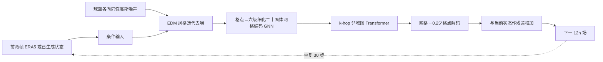

# GenCast：0.25°、15 天生成式集合预报的训练与评估细读

> Ilan Price、Alvaro Sanchez-Gonzalez、Ferran Alet、Tom R. Andersson 等，*Probabilistic weather forecasting with machine learning*，[*Nature*，2024-12-04 在线发表；2025 年卷 637 页 84–90](https://www.nature.com/articles/s41586-024-08252-9)。阅读日期：2026-09-24。**发表年份按在线首发 2024**，不可因卷期 2025 而重复收录为另一篇。

## 1. 为什么需要生成式集合

确定性 MSE 预报常接近未来条件均值，长期滚动后显得平滑，无法表达多种合理天气路径。GenCast 直接学习“给定前两帧，下一帧的概率分布”，每 12 小时抽一个新噪声并去噪，30 次自回归到 15 天；多次重采样得到集合。论文所说“8 分钟”是**单个 15 天成员在 Cloud TPUv5 上**的生成时间，多个成员可并行，不能写作在任意设备上 50 成员全套固定 8 分钟。[Nature 摘要与 Methods](https://www.nature.com/articles/s41586-024-08252-9)

## 2. 数据、标签与时间切分

| 项目 | 原文配置 | 对复现的影响 |
|---|---|---|
| 训练数据 | ERA5 0.25°、6 个地表变量 + 6 个高空变量×13 层，共 84 个预报变量 | 既包含动力热力量，也包含海温等下边界；不应与只用 69 通道/1.5° 的 ERDM 直接按“相同数据”比较。 |
| 时间取样 | ERA5 小时资料先选 00/06/12/18 UTC，再组成相隔 **12h** 的 00/12 或 06/18 序列 | 相邻两帧跨 ERA5 的同化窗边界，避免混入同窗与跨窗差异较大的 6h 目标分布。 |
| 累积量 | 降水等按目标时间之前的 **12h 累计**计算，而非只抽目标时点的累计值 | 时段与标签位置必须对齐，避免累计量无意义。 |
| 开发/最终测试 | 开发训练 1979–2017、2018 验证；冻结模型选择后重训 1979–2018、2019 测试 | 2018 不能再被视为最终模型完全未见训练年。2019 有 730 个 12h 初值。 |
| 初始化与验证 | GenCast 用 ERA5 分析起报并按 ERA5 评分；ENS 部分评分用 HRES-fc0 等自身分析 | 不同真值口径应并列说明，不能只凭汇总百分比直接下业务对等结论。 |

原文没有在 Nature 网页正文逐项给出 84 通道的标准化常数、每种静态强迫的处理和所有缺测填充规则；这些在代码/补充材料中须再核对。这里不把 GraphCast 的数据管线细节未经验证直接移植到 GenCast。[Nature Methods/Training data](https://www.nature.com/articles/s41586-024-08252-9)

## 3. 模型结构和生成路径

图按原文 Figure 1 和 Methods 重绘，不复制论文原图。网络每一步对**下一状态残差**去噪，条件是当前与前一状态；噪声不是在原始经纬格点上独立逐像素取样，而是球面各向同性白噪声投影到格点，以减轻极区格点密度问题。编码器将带噪目标和历史条件映射到二十面体网格；处理器是局地邻域图 Transformer，解码器输出格点场。训练损失是噪声水平加权、逐变量/层加权、面积加权的平方去噪误差；训练噪声水平分布按**采样日程分位数**设计，而非照搬 EDM 原版对数正态。海温额外变量权重 0.1。[Nature Figure 1/Methods](https://www.nature.com/articles/s41586-024-08252-9)

## 4. 训练流程与微调的精确含义

| 阶段 | 数据网格与网格网络 | 训练步数/资源 | 权重迁移与冻结 |
|---|---|---|---|
| 预训练 | 0.25° ERA5 双线性降到 **1°**；处理器用 5 次细化的二十面体网格 | 2,000,000 步；32 个 TPUv5 实例、略多于 3.5 天 | 学会单步 12h 条件去噪。 |
| **高分辨率微调** | 真实 0.25° ERA5；网格改为 6 次细化，输入输出改为 0.25° | 继续 64,000 步；32 个 TPUv5 实例、略少于 1.5 天 | 沿用前阶段 GNN/图 Transformer 权重。1°→0.25° 后每网格点约接收 16 倍格点消息，因此编码器消息和**除以 16**维持初始尺度。论文没有说这里冻结主干；不能写作仅训解码头。 |

这里的微调是**空间分辨率迁移**，不是用模型自己产生的多天序列作自回归训练。作者特别明确：GenCast 仅见真实历史两帧和下一帧目标做单步监督，**未执行 GraphCast 那种通过多步自生预测反传的长滚动微调**。另外 GenCast-Perturbed 是另行训练的确定性模型，去掉带噪目标/噪声级条件，以单步 MSE 学残差；给它的初值加高斯过程扰动形成集合，它不是直接给 GenCast 扩散网络做后处理。[Nature Methods/Resolution training schedule 与 GenCast-Perturbed protocol](https://www.nature.com/articles/s41586-024-08252-9)

公开正文可核验 2M/64k 步、网格变化、硬件和损失构型；AdamW/学习率峰值/β/weight decay/采样步数的精确表在额外的 Supplementary Information A.2/A.3 中。当前这份笔记**不把尚未核验的补充表值编造出来**，作为复现前的必查项。它说明论文的公开信息边界，不表示这些参数根本不存在。[Nature Supplementary Information 入口](https://www.nature.com/articles/s41586-024-08252-9)

## 5. 结果、图表和比较陷阱

| 原文图表/协议 | 作者报告 | 应如何阅读 |
|---|---|---|
| Figure 3，2019 全年、CRPS 评分卡 | 在 1320 个变量×层×时效格子中，**97.2%** 显著优于 ENS；36h 以后为 99.6% | 1320 格相关，不是 1320 个独立天气事件；改善集中于一些近时效、地面及高压层变量。 |
| Figure 3 的 spread–skill 与秩直方图 | GenCast 与 ENS 通常接近校准，GenCast 往往略欠离散；GenCast-Perturbed 明显欠离散 | 概率技巧来自生成分布，而非仅对一个均值模型扰动初值。 |
| Extended Data 8 | GenCast 的 CRPS 胜过 GenCast-Perturbed 的约 99% 目标；后者对 ENS 约 82% 目标具竞争力 | 这是真正的生成建模增益消融，但模型训练目标也不同。 |
| 极端事件 Brier/REV | 高/低温、强风、低压多数阈值有增益；第 7 天后最极端风速以及部分极低气压阈值未显著 | 不可把“极端事件全时效领先”泛化。极端降水因 ERA5 真值质量担忧**未进主评分**。 |
| 热带气旋 | 同用 TempestExtremes 抽轨迹，但 ERA5 与 HRES-fc0 识别到的气旋数量相差约 23% | 作者作同名风暴匹配和自身真值评分；报告到 9 天的跟踪结果，非所有 15 天都有同等气旋验证。 |

由于 ENS 的部分对照采用自己的业务分析真值、训练/起报年份和模型分辨率也有差异，97.2% 是**该论文定义的评分卡结果**，不是脱离评估口径的永久排名。论文用区块 bootstrap 对 2019 的 730 次时序相关初值估计显著性，比逐格独立检验更合适；但跨年份、当前业务版本与独立站点验证仍须补做。降水主结论尤其不应替作者夸大。[Nature Results/Statistical methods](https://www.nature.com/articles/s41586-024-08252-9)

## 6. 研究价值与复现实验清单

GenCast 的关键方法价值是单步生成过程经多次自回归能维持至 15 天的校准集合，而高分辨率训练用阶段式网格升级降低成本。若复现，先固定 1979–2018 ERA5 与 2019 起报，严格构造 12h 跨同化窗序列和累计量；再检查球面噪声、逐变量/格点权重、1°→0.25° 消息缩放以及 ENS 各自真值；最后同时报告 CRPS、SSR、秩直方图、空间 pooled CRPS、Brier/REV 和气旋检测，不能只看集合均值 RMSE。[原论文](https://www.nature.com/articles/s41586-024-08252-9)

[返回首页](../../README.md) · [返回总表](../../气象大模型_中期预报论文追踪.md)
