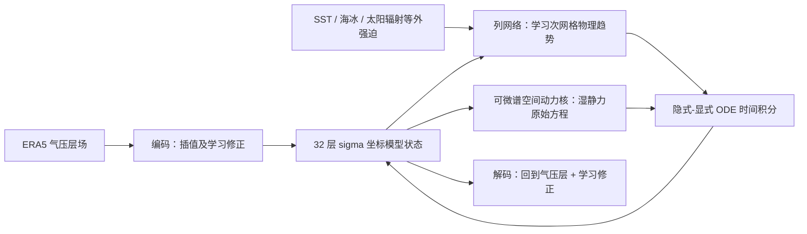

# NeuralGCM：把可微动力核、学习物理和集合训练接成天气—气候模型

> Dmitrii Kochkov、Janni Yuval、Ian Langmore、Peter Norgaard 等，*Neural general circulation models for weather and climate*，[*Nature* 2024-07-22](https://www.nature.com/articles/s41586-024-07744-y)；方法细节按[作者 arXiv v3（2024-03-08）](https://arxiv.org/html/2311.07222)核对。阅读日期：2026-09-24。预印本初稿 2023 年，不因此排除其 2024 年正式发表版本。

## 1. 问题与主张

许多 AI 天气模型把动力学整体学成黑箱，短期准确却未必能维持物理一致的长期积分和集合概率。NeuralGCM 保留解**湿静力原始方程**的可微动力核，用神经网络预测云、辐射、未解析尺度等过程对状态的趋势，然后在模型**真正滚动的轨迹上端到端反传**，避免离线参数化装入 GCM 后分布偏移。论文发布多个不同分辨率/目标的模型，不能将 0.7° 确定性、1.4° 集合和 2.8° 气候结果当成同一权重。[Nature 摘要](https://www.nature.com/articles/s41586-024-07744-y) · [原文 Figure 1](https://arxiv.org/html/2311.07222)

图据 Figure 1 自绘。动力核演化相对涡度、散度、温度、地面气压、比湿及冰/液云水等七个预报量，水平方向用伪谱离散、垂直方向用 sigma 坐标；学习物理按**大气单列**共享网络权重处理，并加输入场水平梯度、太阳辐射、SST、海冰等信息。气压层 ERA5 到 sigma 层的线性插值附加可学习编码/解码修正，以减小初值冲击和重建误差；不能误写为物理求解器直接在 ERA5 气压层运行。[原文 §Neural general circulation models、附录 2–4](https://arxiv.org/html/2311.07222)

## 2. 数据与预处理

作者将 ERA5 以**保守重网格**转至 2.8°、1.4°、0.7°对应的高斯网格，不是把所有实验先算到 0.25°再插值。2.8°和 1.4°版本开发时训练 1979–2017、验证 2018；0.7°和随机集合变体训练至 2019；最终 2020 从 00/12 UTC 各起报一次，共 732 个预报，全部再保守重网格到 1.5°统一评分。NeuralGCM、GraphCast、Pangu 对 ERA5 验证，ECMWF-HRES/ENS 对各自业务分析验证，跨系统名次存在真值不完全同源问题。[原文 §7.2、Figure 2](https://arxiv.org/html/2311.07222)

物理网络输入在模型初始化时按预计算均值/标准差标准化；训练损失中的不同变量再以**相隔 24h 的时间差标准差**缩放，避免不同单位直接相加。误差随 lead 的增大按 `(1+τ/24)^(-1/2)` 缩放，谱损失使用不同的 `(1+(τ/40)^4)^(-1/2)`。气候长积分并非自由海气耦合：文中历史 AMIP 样式试验按时间从 ERA5 **规定 SST 与海冰**，故不能宣称独立预测了海洋演化。[原文 §3.3、§7.3、气候评测](https://arxiv.org/html/2311.07222)

## 3. 优化、损失和模型规格

所有主模型用 Adam β₁=0.9、β₂=0.95、ε=`1e-6`；前 2000 次更新线性 warm-up 到峰值，维持到 15000 次，随后每 10000 次按 0.5 指数衰减。主训练通过**逐步增长的实际滚动时长**优化最长约 5 天，不是单步训练后只在推理时盲滚 15 天。[原文 §7.1–7.2](https://arxiv.org/html/2311.07222)

| 版本 | 主要用途 | 峰值 LR / 主训练更新数 | 参数 / 训练资源 |
|---|---|---|---|
| NeuralGCM 2.8° | 较粗确定性、长时间气候试验 | 0.002 / 38000 | 14.5M；16 TPUv4 约 1 天 |
| NeuralGCM 1.4° | 确定性与气候 | 0.002 / 26000 | 18.3M；16 TPUv4 约 1 周 |
| NeuralGCM 0.7° | 较高分辨率确定性中期 | 0.001 / 25000 | 31.1M；256 TPUv4 约 3 周 |
| NeuralGCM-ENS 1.4° | 随机集合至 15 天 | 0.001 / 43000 | 11.5M；128 TPUv5e 约 10 天 |

确定性损失由气压层/模型层的滤波 MSE、两种谱能量 MSE 加模型层谱偏差 MSE 五项构成；对应权重 `λ_data=20`、`λ_spec=0.1`、`λ_model=1`、`λ_bias=2`。随着 lead 增加先滤掉无法预报的高波数，避免“位置稍偏的锋面”被双重惩罚；另用频谱项防止过度平滑、偏差项约束长期漂移。0.7°/1.4°/2.8°版本谱损失截断波数分别为 120/80/42。随机集合版本改用网格空间 + 球谐空间 CRPS，训练每个初值生成**两个独立成员**来估计无偏 CRPS，而不是拿 50 成员进一次梯度步。[原文 §7.4/§7.6](https://arxiv.org/html/2311.07222)

## 4. 微调具体做什么、不做什么

主训练结束后，**仅对确定性版本的解码器**执行短程微调：冻结编码器和学习物理模块，使用 6/12/18/24h 预测的**格点空间传统 MSE**更新解码器；1.4°版本只用 12/24h。共 4000 次梯度更新，作者称约 1000 次后评价已趋平。目标不是提升 15 天滚动技巧，而是消除谱空间训练/球谐变换核带来的高频栅格伪迹。这个“解码器微调”与主训练中逐步增长预测时长、以及随机集合的 CRPS 训练，是三件不同事。微调 LR 的 warm-up 提前到第 1000 步，2000 步后每 1000 步减半；论文此处未在正文单列峰值，不能套用表 4 主训练峰值。[原文 §7.5](https://arxiv.org/html/2311.07222)

## 5. 绩效与图表理解

| 原文图表 | 可核验结果 | 阅读限制 |
|---|---|---|
| Figure 2，2020 共 732 初值 | 0.7°确定性在前 1–3 天与 GraphCast 等强模型竞争；7 天以后 NeuralGCM-ENS/ECMWF-ENS 集合均值的 RMSE 通常优于确定性单路 | 不能把集合均值 RMSE 优势误算到确定性版本。 |
| Figure 2，CRPS/SSR | 1.4° NeuralGCM-ENS 在大多数变量/时效/气压层比 ECMWF-ENS 低 CRPS，SSR 接近 1 | 1.4° 比业务 ENS 粗；SSR≈1 只代表必要而非充分校准。 |
| Figure 2 的 10 天 Q700 地图 | 检查热带/中高纬误差与离散度空间分布；热带比湿偏差较低 | 不应只从一张变量地图推出所有区域极端都更好。 |
| 长时间气候模拟 | 在给定历史 SST/海冰情况下可维持季节循环和气旋统计，但文中仍有不稳定个案和暖气候外推不足 | “气候稳定”不是“未来变暖情景可靠外推”的同义词。 |

复现实验需要分清模型版本、保守重网格、目标变量与参考真值，报告不同 lead 的 RMSE/CRPS/SSR、频谱和偏差，并把长期 AMIP 式强迫与自由耦合模拟区别开。若要用它作 10–15 天集合基线，应拿 **NeuralGCM-ENS 1.4°** 权重，而不是把 0.7°确定性成绩和集合校准成绩拼在一起。[Nature 正式论文](https://www.nature.com/articles/s41586-024-07744-y) · [作者完整方法](https://arxiv.org/html/2311.07222)

[返回首页](../../README.md) · [返回总表](../../气象大模型_中期预报论文追踪.md)
