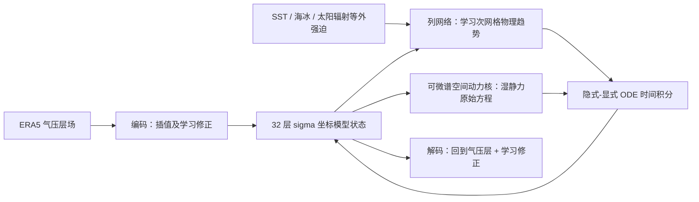

# NeuralGCM：把可微动力核、学习物理和集合训练接成天气—气候模型

> Dmitrii Kochkov、Janni Yuval、Ian Langmore、Peter Norgaard、Jamie Smith、Griffin Mooers、Milan Klöwer、James Lottes、Stephan Rasp、Peter Düben、Sam Hatfield、Peter Battaglia、Alvaro Sanchez-Gonzalez、Matthew Willson、Michael P. Brenner、Stephan Hoyer，*Neural general circulation models for weather and climate*，[*Nature* 632, 1060–1066，2024-07-22 在线发表](https://www.nature.com/articles/s41586-024-07744-y)；本文训练表、消融和部分数值依据[作者 arXiv:2311.07222v3（2024-03-08，含扩展方法）](https://arxiv.org/html/2311.07222v3)逐项核对。阅读更新：2026-09-25。预印本初稿于 2023-11-13 发布，正式发表为 2024 年；两者是同一成果，不能重复计篇。出版社全文在本轮无法直接取得，以下**扩展方法的表号和数值以 v3 为准**，不冒称已逐页校对 Nature 排版后的补充 PDF。

## 1. 问题与主张

许多 AI 天气模型把动力学整体学成黑箱，短期准确却未必能维持物理一致的长期积分和集合概率。NeuralGCM 保留解**湿静力原始方程**的可微动力核，用神经网络预测云、辐射、未解析尺度等过程对状态的趋势，然后在模型**真正滚动的轨迹上端到端反传**，避免离线参数化装入 GCM 后分布偏移。论文发布多个不同分辨率/目标的模型，不能将 0.7° 确定性、1.4° 集合和 2.8° 气候结果当成同一权重。[Nature 摘要](https://www.nature.com/articles/s41586-024-07744-y) · [原文 Figure 1](https://arxiv.org/html/2311.07222)

图据 Figure 1 自绘。动力核演化相对涡度、散度、温度、地面气压、比湿及冰/液云水等七个预报量，水平方向用伪谱离散、垂直方向用 sigma 坐标；学习物理按**大气单列**共享网络权重处理，并加输入场水平梯度、太阳辐射、SST、海冰等信息。气压层 ERA5 到 sigma 层的线性插值附加可学习编码/解码修正，以减小初值冲击和重建误差；不能误写为物理求解器直接在 ERA5 气压层运行。[原文 §Neural general circulation models、扩展方法 §2–4](https://arxiv.org/html/2311.07222v3)

### 网络、随机源和积分器：不同版本不能只按网格大小区分

学习物理的主干是**逐列共享**的 encode–process–decode 全连接残差网络：输入线性投到 **384 维**，process 部分有 **5 个三层 MLP block**（隐宽 384），最后线性映射到各 σ 层的趋势。另有五层一维卷积的垂直嵌入（隐通道 64、输出 32）及陆地/海洋/海冰三路地表嵌入；它们提供列信息，不把神经网络变成跨全球网格的 Transformer。位置特征在 2.8°确定性及 1.4°集合版为**每格 8 维**，在 1.4°/0.7°确定性版为 **32 维**。这些嵌入与网格大小共同影响下表参数量，不能把参数增长全部归因于动力核。[扩展方法 §3.1、3.4–3.5](https://arxiv.org/html/2311.07222v3)

学习物理输入含涡度/散度、两分量风、温度、三种水物质、对数地面气压及其水平导数、地形/陆海掩膜、纬度正余弦、太阳辐射和 σ 层气压。模型初始化时估计输入均值和标准差，近似归一到零均值/单位方差；**比湿按层归一**，可学习特征、随机场和嵌入不走这套标准化。神经趋势输出以 ERA5 的 1h 有限差分趋势标准差的 **0.01 倍**定标，不是输出一个可直接与原始 K/s、Pa/s 混合比较的无量纲值。积分器用半隐式/显式处理快重力波与其他项；动力步长 2.8°/1.4°/0.7°分别为 **12/6/3.75 分钟**，较贵的学习物理趋势通常约每 **30 分钟**刷新并在若干动力步内保持。[扩展方法 Table 3、§2.3、§3.3–3.5、§5](https://arxiv.org/html/2311.07222v3)

集合版不是对确定性 0.7°权重加初值白噪声：编码器用 **10 个**球谐高斯随机场，前向物理步再用 **10 个**独立时空相关随机场；后者随模型时间演化，相关长度和时间尺度可学习，每个成员有独立随机种子。解码器不接受这些随机场。训练 CRPS 每个起报点只产生**两条独立轨迹**以获得无偏估计；发表的 50 成员可视化/评分集合是推理时采样规模，不能当成训练 batch 内有 50 轨。[扩展方法 §3.2、§7.6、Figure 3](https://arxiv.org/html/2311.07222v3)

## 2. 数据与预处理

作者将 ERA5 以**保守重网格**转至 2.8°、1.4°、0.7°对应的高斯网格，不是把所有实验先算到 0.25°再插值。2.8°和 1.4°版本开发时训练 1979–2017、验证 2018；0.7°和随机集合变体训练至 2019；最终 2020 从 00/12 UTC 各起报一次，共 732 个预报，全部再保守重网格到 1.5°统一评分。NeuralGCM、GraphCast、Pangu 对 ERA5 验证，ECMWF-HRES/ENS 对各自业务分析验证，跨系统名次存在真值不完全同源问题。[原文 §7.2、Figure 2](https://arxiv.org/html/2311.07222)

训练损失中的不同变量另以**相隔 24h 的时间差标准差**缩放，避免不同单位直接相加；这个统计量用约 **10–60 个** ERA5 差值样本估计，不等于上一段的神经输入归一化。为平衡初期技巧，位势、比湿、模型层对数地面气压与云水还分别乘以 **2、0.66、5、0.05** 的附加缩放。误差随 lead 的增大按 `(1+τ/24)^(-1/2)` 缩放，谱损失使用不同的 `(1+(τ/40)^4)^(-1/2)`。这些是损失空间设置，不能机械地作为原始 ERA5 物理字段的预处理常数。[扩展方法 §7.3](https://arxiv.org/html/2311.07222v3)

气候长积分并非自由海气耦合：历史 AMIP 样式试验按时间从 ERA5 **规定 SST 与海冰**，2.8°版本约每 6h、1.4°版本约每 12h 更新相应外强迫。不能宣称它独立预测了海洋演化，也不能把这类有未来边界条件的多年模拟当作从单日初值预报几十年实际天气。[扩展方法 §3.1、气候评测](https://arxiv.org/html/2311.07222v3)

## 3. 优化、损失和模型规格

所有主模型用 Adam β₁=0.9、β₂=0.95、ε=`1e-6`；前 2000 次更新线性 warm-up 到峰值，维持到 15000 次，随后以 10000 更新为衰减时间尺度、衰减率 0.5。主训练通过**逐步增长的实际滚动时长**反传，不是单步训练后只在推理时盲滚 15 天；但**72h 是 2.8°/1.4°确定性版本的最终课程长度，60h 是 0.7°版，120h 才是集合版**。因此“所有版本都训练 5 天”不准确。[扩展方法 Table 4–5、§7.1–7.2](https://arxiv.org/html/2311.07222v3)

| 版本 | 主要用途 | 峰值 LR / 主训练更新数 | 参数 / 训练资源 |
|---|---|---|---|
| NeuralGCM 2.8° | 较粗确定性、长时间气候试验 | 0.002 / 38000 | 14.5M；16 TPUv4 约 1 天 |
| NeuralGCM 1.4° | 确定性与气候 | 0.002 / 26000 | 18.3M；16 TPUv4 约 1 周 |
| NeuralGCM 0.7° | 较高分辨率确定性中期 | 0.001 / 25000 | 31.1M；256 TPUv4 约 3 周 |
| NeuralGCM-ENS 1.4° | 随机集合至 15 天 | 0.001 / 43000 | 11.5M；128 TPUv5e 约 10 天 |

上表训练耗时不是统一预算下的算法性速度排名：0.7°与集合版还使用空间/集合模型并行，2.8°与 1.4°确定性版为数据并行。扩展方法 Table 6 的主 batch 维度各为 **16**，不应把 0.7°的 256 TPUv4 误读为 batch=256。论文列出的训练长度转折点值得逐一记录，因为它决定模型在哪个更新数开始见到更长的真实自回归轨迹：[扩展方法 Table 5–6](https://arxiv.org/html/2311.07222v3)

| 权重版本 | 损失使用的 rollout 时效（小时，按课程顺序） | 切换边界（训练更新数） |
| --- | --- | --- |
| 2.8°确定性 | 12→24→36→48→60→72 | 2000、5656、10392、16000、22360 |
| 1.4°确定性 | 12→24→36→48→60→72 | 2000、5656、10392、16000、22360 |
| 0.7°确定性 | 6→12→18→24→36→48→60 | 500、2000、4500、8000、12500、18000 |
| 1.4°集合 | 6→12→18→24→36→48→60→72→96→120 | 500、2000、4500、8000、12500、18000、24500、32000、40500 |

这是一张**训练课程表**，不是推理支持的最远时效：论文把确定性天气预报评到 10 天、集合评到 15 天，气候模拟更长；超过训练 rollout 的表现是泛化结果，不应反写成训练时反传了 15 天。训练目标在多个指定 lead 上累计，主确定性损失在球谐空间由**压力层和模型层滤波 MSE、两套谱能量 MSE、模型层谱偏差 MSE**五项组成。滤波 MSE 按 ECMWF-HRES 对 ERA5 的各波数随 lead 误差，选相对误差阈值 **0.12** 决定保留波数；谱能量截止总波数在 2.8°/1.4°/0.7°分别为 **42/80/120**。滤波降低锋面错位的双重惩罚，谱损失补回小尺度能量，偏差项约束长期系统漂移。[扩展方法 §7.4、Figure 12](https://arxiv.org/html/2311.07222v3)

五项损失的组权重为 `λ_data=20`、`λ_spec=0.1`、`λ_model=1`、`λ_bias=2`；这里 `data/spec` 项各跨层表示，不能从四个系数误认为只有四个实际距离项。随机集合版本则改用格点空间 + 球谐空间的 CRPS，球谐损失仅算到总波数 **80**；两条独立成员的绝对误差项减成员间距离项，既奖准确也奖合理离散。两成员是一个无偏 CRPS 估计的最少成员数；作者认为同样算力分配给更多**独立起报时刻**，比每个起报点增加成员更能降方差。主文没有给出各模型精确的每字段输出归一化表或训练随机种子，虽有源码和权重，也不能仅靠本文把一次实验完整重现。[扩展方法 §7.4/§7.6](https://arxiv.org/html/2311.07222v3)

## 4. 微调具体做什么、不做什么

主训练结束后，**仅对确定性版本的解码器**执行短程微调：冻结编码器和学习物理模块，使用 6/12/18/24h 预测的**格点空间传统 MSE**更新解码器；1.4°版本只用 12/24h。共 4000 次梯度更新，作者称约 1000 次后评价已趋平。目标不是提升 15 天滚动技巧，而是消除谱空间训练/球谐变换核带来的高频栅格伪迹。这个“解码器微调”与主训练中逐步增长预测时长、以及随机集合的 CRPS 训练，是三件不同事。微调 LR 的 warm-up 提前到第 1000 步，2000 步后每 1000 步减半；论文此处未在正文单列峰值，不能套用 Table 4 主训练峰值。**集合版无同样的解码器微调**，否则两种训练链就被错误拼接。[扩展方法 §7.5](https://arxiv.org/html/2311.07222v3)

## 5. 绩效与图表理解

| 原文图表 | 可核验结果 | 阅读限制 |
|---|---|---|
| Figure 2，2020 共 732 初值 | 0.7°确定性在前 1–3 天与 GraphCast 等强模型竞争；7 天以后 NeuralGCM-ENS/ECMWF-ENS 集合均值的 RMSE 通常优于确定性单路 | 不能把集合均值 RMSE 优势误算到确定性版本。 |
| Figure 2，CRPS/SSR | 1.4° NeuralGCM-ENS 在大多数变量/时效/气压层比 ECMWF-ENS 低 CRPS，SSR 接近 1 | 1.4° 比业务 ENS 粗；SSR≈1 只代表必要而非充分校准。 |
| Figure 2 的 10 天 Q700 地图 | 检查热带/中高纬误差与离散度空间分布；热带比湿偏差较低 | 不应只从一张变量地图推出所有区域极端都更好。 |
| 长时间气候模拟 | 在给定历史 SST/海冰情况下可维持季节循环和气旋统计，但文中仍有不稳定个案和暖气候外推不足 | “气候稳定”不是“未来变暖情景可靠外推”的同义词。 |

**评分细节**：2020 年闰年，00/12 UTC 的 732 次起报在保守重网格后的 **1.5°** 网格评分，格点误差按面积加权。每条 NeuralGCM/GraphCast/Pangu 与 ERA5 对照，业务 HRES/ENS 则与其 0h 业务分析对照；Figure 2 的“相对于 ECMWF-ENS 的百分比曲线”是两套真值下的各自相对评分，不是完全同初值、同真值、同分辨率的受控比赛。扩展方法对 SSR 的有限集合均值误差扣除 `S²/N` 以去偏，但**集合均值 RMSE 本身仍报告有偏估计**；因此不能把 SSR 的去偏步骤默默套到 RMSE 上。[扩展方法 §6，Figure 2](https://arxiv.org/html/2311.07222v3)

下表只转录**原文正文或扩展 Table 6 明确给出的数字**，不从 Figure 2 曲线像素制造逐日 RMSE/CRPS。气候行与天气行属于不同实验，不能合并为一个“模型总分”。[原文 Figure 4、扩展方法 Table 6](https://arxiv.org/html/2311.07222v3)

| 原文证据/版本 | 数值 | 应保留的协议和限制 |
| --- | --- | --- |
| Table 6：单 TPUv4 核生成**单条 10 天预报** | 2.8°确定性 **2.5 s**；1.4°确定性 **12.6 s**；0.7°确定性 **119 s**；1.4°集合模型**单成员 12.4 s** | 这些是推理核耗时，未计整套 50 成员并发调度、数据准备、资料分发和同化。 |
| Figure 4a：1.4°模型 2020 全球均温季节循环 | 37 个 2019 年起始态中 **35 个**稳定跑完两年；成功轨迹集合均值 RMSE **0.16 K**，1990–2019 气候态 **0.45 K** | 使用随时变化的历史 SST/海冰；只对成功的 35 条轨迹求图示季节循环，不代表 37/37 稳定。 |
| Figure 4i–k：1.4°气候单条轨迹年平均可降水量偏差 | NeuralGCM **1.09 mm**；X-SHiELD **1.74 mm**；气候态 **1.36 mm** | X-SHiELD 只取一条可比轨迹；NeuralGCM 向 ERA5 学习并按 ERA5 验证，对别的物理模型并非完全中立。 |
| Figure 4e–g：气候积分的 TempestExtremes 气旋数 | NeuralGCM **83**，ERA5 **86**，重网格后 X-SHiELD **40** | 是指定期间、指定跟踪器与网格的事件数，不能推断气旋强度、登陆损失或所有盆地都更准。 |

### 消融、反例与气候解释

扩展 Figure 31–32 的结论有意展示**技巧—真实性权衡**：在同一 2.8°版本上删掉谱项/偏差项或去掉滤波，普通 RMSE 可以改善数个百分点，**但第 15 天谱明显退化、场更模糊**。所以不能简单称完整损失是“所有评分都最优”；作者选择它主要为了长积分的谱稳定性。只用至多 **12h** rollout 训练的对照，RMSE 更差，约第 **13 天**后出现与数值不稳定相关的快速上升；只用 1h 单物理步训练的试验数日后不稳定。长滚动训练贡献不只是微调曲线的边际分数，还关系到系统在推理分布下能否持续运行。[扩展方法 §8.6、Figure 31–32](https://arxiv.org/html/2311.07222v3)

“有物理动力核”也不等于完全守恒或所有水文量正确。0.7°模型通过水物质净趋势诊断 **P−E**，在温带的分布较接近 ERA5，但热带极端尾部偏弱；它没有分别预测可独立验证的降水和蒸发。1.4°气候 P−E 图还出现格点伪影，作者认为可能与学习物理也在补偿粗动力核误差有关，但未给出确定归因。集合成员偶尔输出微小**负云液水/冰水含量**，物理上不可能；气候版 37 个起始态有 2 个不稳定。文章的“几十年稳定”应与这些失败率及未见变暖情景外推结果一起读。[扩展方法 §8.3、8.5、8.7 与 Figure 26、30、34–35](https://arxiv.org/html/2311.07222v3)

复现实验需要分清模型版本、保守重网格、目标变量与参考真值，报告不同 lead 的 RMSE/CRPS/SSR、频谱和偏差，并把长期 AMIP 式强迫与自由耦合模拟区别开。若要用它作 10–15 天集合基线，应拿 **NeuralGCM-ENS 1.4°** 权重，而不是把 0.7°确定性成绩和集合校准成绩拼在一起。[Nature 正式论文](https://www.nature.com/articles/s41586-024-07744-y) · [作者完整方法](https://arxiv.org/html/2311.07222)

[返回首页](../../README.md) · [返回总表](../../气象大模型_中期预报论文追踪.md)
