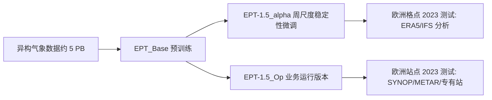

# EPT-1.5：欧洲能源场景的高分辨率中期预报

## 文献定位与版本

- Roberto Molinaro、Jordan Dane Daubinet、Alexander Jakob Dautel、Andreas Schlueter、Alex Grigoryev 等，**EPT-1.5 Technical Report**，arXiv:2410.15076，v2 日期为 2024-11-03。[原文 HTML](https://arxiv.org/html/2410.15076v2) · [版本记录](https://arxiv.org/abs/2410.15076)。
- Jua 的 Earth Physics Transformer（EPT）系列技术报告，主要针对欧洲风电、太阳能和温度业务。它报告业务生成可到 **20 天、逐小时、0.083°**，但本文公开的定量验证表**只到 10 天**；不能把业务时效当成已验证的 20 天技巧。
- 本篇是对 EPT-1.5 的独立阅读，不与 [EPT-2](38-ept-2.md) 合并：后者采用不同版本、不同实验，不可跨论文拼成一张性能排名。

## 研究问题与主张

作者认为常见天气 AI 模型的 6 小时时间步长和少量诊断变量不足以服务能源交易。EPT-1.5 试图同时给出任意 lead time 的预测接口、高分辨率全球预报和能源相关的 10 m/100 m 风速与地表短波辐射。其技术问题不只是单步拟合，而是把预训练底座修正为周尺度稳定的递推预报系统，并满足日常运行中的数据时效要求。本文的实证重心是欧洲区域的 10 天内预测，而非全球所有变量的一致改进。

## 数据、输入与预处理

| 环节 | 原文披露 | 对复现的影响 |
| --- | --- | --- |
| 预训练语料 | 约 **5 PB** 气象数据；时间、空间分辨率和输入/输出变量均异构 | 未给出各数据集清单、变量表、年份、训练/验证划分及占比，无法复原采样分布 |
| 评价真值：格点 | ERA5 重分析；另使用 IFS HRES 分析/初值 | ERA5 不是实时业务可得初值，须与业务站点评价分开读 |
| 评价真值：站点 | SYNOP、METAR 及购入的专有站点，使数量从约 2 万到超过 10 万；空间分布偏向欧、美 | 站点集合并非公开，抽样密度和站点 QC 不能由报告复现 |
| 评价期与初值 | 报告使用 **2023 年**；研究比较使用与其他 AI 模型相同的初值；业务比较用 IFS 初值 | 报告未完整列出逐日样本、缺测处理、插值/重网格、站点匹配细节 |
| 归一化/目标处理 | **未披露**变量变换、标准化统计、土地/海洋掩膜及缺测填补 | 不可把 ERA5 通用预处理假设为 EPT 的真实流程 |

格点评测与站点评测解决不同问题：前者容易覆盖全球和高空层，却以分析场为代理真值；后者直接对真实测量评估，但站点的地域和地形分布不均，且主要限于近地面变量。尤其不能把「约 10 万站」误解成预训练站点数量：该数字出现在**评测数据**说明中。

## 模型结构：已知机制和未公开部分

报告称 EPT-1.5 为**数十亿参数级**的专有 Transformer 变体，架构与 EPT-1 类似，版本更新仅有较小结构及训练策略变化。报告将底座描述为可在不同时间/空间尺度、不同变量集之间学习的地球系统基础模型，支持请求任意未来时刻；长预报则使用自回归思想，将模型输出继续作为后续输入。文中还称具备概率预报能力，但本报告所有表格是**确定性**评分，没有集合 CRPS、校准或离散度证据。

这是按报告第 III–V 节重绘的**版本和评测关系图**，不是论文未公开的 Transformer 内部层图。报告没有层数、注意力变体、token/patch 设计、通道宽度、位置编码、变量嵌入、物理约束及确切参数量，因此不能合理生成更细的结构示意。

## 训练流程、参数及微调

1. **底座预训练**：以异构分辨率/变量的约 5 PB 数据训练 `EPT_Base`。报告未说明训练目标（如状态回归、掩码恢复等）、优化器、学习率曲线、batch、训练步数、计算量和参数总数；“数十亿”是唯一参数量量级。
2. **长期微调**：在 `EPT_Base` 上得到 `EPT-1.5_alpha`，目标是更稳健的周尺度预报。作者另称采用多种微调以提高稳定性和业务鲁棒性；**没有交代**用什么数据、是否冻结部分网络、rollout 长度、loss、微调次数或权重继承方式。因此不能把它写成已经核实的多步自回归训练配方。
3. **业务版本**：`EPT-1.5_Op` 是最终运行模型。论文没有明确 alpha 与 Op 是顺序继承、平行分支还是独立微调；上图故意只从 Base 画到各版本，不制造缺失的训练链。
4. **推理/运行**：原生 0.083°（赤道约 9 km）、逐小时可达 20 天，每日 00/06/12/18 UTC 运行；每次有 early 和 standard 两版，前者更早出结果，后者等待更多输入，约有 6 小时延迟。这个部署说明不等于计算成本、延迟和 20 天评分的公开审计。

## 评测口径与图表解读

论文定义的 skill score 为 `SS=1−RMSE_模型/RMSE_IFS-HRES`，表内数值以百分数表示；**正值**表示 RMSE 小于 IFS HRES。不能与 ACC、CRPS 或不同真值基准混用。图 2–5 画格点变量随时效的 skill 曲线，附表 I–IV 给出可读数字；图 6–7 转为站点 RMSE，附表 V–VI 给出 6 小时至 10 天结果。下表是按原表关键时效摘录，不是图像截图。

### 欧洲格点：风速及温度

| 变量/时效 | EPT-1.5 alpha | EPT Base | EPT-1 | GraphCast | FuXi | Pangu | 说明 |
| --- | ---: | ---: | ---: | ---: | ---: | ---: | --- |
| 10 m 风速，6 h，SS % | 20.8 | 21.7 | 9.1 | 17.9 | 12.4 | 0.62 | Base 在这个短时效略优于 alpha |
| 10 m 风速，5 d，SS % | 13.9 | 11.0 | 8.7 | 9.6 | 9.9 | 5.3 | 长期微调版本开始明显受益 |
| 10 m 风速，10 d，SS % | 7.8 | 1.6 | 7.7 | 6.5 | -2.8 | 3.7 | alpha 相对 EPT-1 只高 0.1 个百分点 |
| 2 m 温度，10 d，SS % | 3.0 | 未列 | 2.0 | 2.7 | **17.8** | 0.1 | 该变量 FuXi 明显更好，不能称 EPT 全面领先 |

格点 2 m 温度在 6 小时还出现 EPT-1.5 alpha **-47.0%** 的 skill，说明短时效误差甚至大于 HRES 参考；作者主要优化的是风与辐射业务。100 m 风速相对 HRES 的 EPT-1.5 alpha skill 在 6 h/3 d/5 d/10 d 分别为 **25.25/14.80/14.51/7.16%**，而 EPT-1 在 10 d 是 **9.50%**：长期末端并未全部改善。地表向下太阳辐射的 diagnostic 版在 6 h 为 **20.44%**（EPT-1 为 13.19%），但 10 d 仅 **1.91%**（EPT-1 为 4.86%）。这些负面或例外结果同样属于模型性能。

### 欧洲站点：业务版与 IFS 同初值

| 站点变量/时效 | EPT-1.5 Op RMSE | EPT-1 RMSE | IFS HRES RMSE | 阅读判断 |
| --- | ---: | ---: | ---: | --- |
| 2 m 温度，6 h | 1.67 | 1.83 | 1.70 | 较 HRES 略低，差距 0.03 |
| 2 m 温度，5 d | 2.29 | 2.38 | 2.51 | 有较清楚的中期前段优势 |
| 2 m 温度，10 d | 3.58 | 3.61 | 3.79 | 比 HRES 低 0.21，较 EPT-1 低 0.03 |
| 10 m 风速，6 h | 2.33 | 2.38 | 2.38 | 两个对照相同 |
| 10 m 风速，5 d | 2.48 | 2.54 | 2.61 | 优势延续到第 5 天 |
| 10 m 风速，10 d | 2.74 | 2.80 | 2.83 | 对 HRES 优势缩小为 0.09 |

温度一般以 K、风速以 m/s 表示，但表 V–VI 表头没有逐项重复单位；上述数值严格按原表摘录。站点测试比再分析格点更靠近用户体验，但没有公开站点级误差分布、极端天气分组、置信区间或地理均衡加权结果，密集区域可能主导总体 RMSE。

## 研究结论与局限

EPT-1.5 是有价值的**能源定向**中期预报系统案例：10 天内的欧洲风速表现尤其有竞争力，也给出站点尺度业务版检验。但证据不支持“所有变量最优”或“20 天性能已证明”：2 m 温度的 FuXi 对照更强，100 m 风/辐射在 10 天时相对 EPT-1 还有退步；公开评分最高只到 10 天。报告关于异构数据、微调与概率预报的描述是方向级而非可复现方法级，且专有数据和训练细节缺失。若要复现/独立评估，首要补齐训练数据 provenance、预处理、模型结构/参数、微调具体配方、20 天逐变量分区评分，以及 ensemble 的 CRPS/可靠度和极端事件表现。

## 原文定位

- [arXiv v2 全文](https://arxiv.org/html/2410.15076v2)：第 III 节结构和运行，第 IV 节变体，第 V 节数据与指标，第 VI 节图 2–7 及表 I–VI。
- [arXiv 版本页](https://arxiv.org/abs/2410.15076)：核对作者、提交和修订日期。
