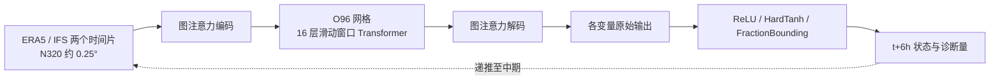

# AIFS Single 1.1：ECMWF 业务确定性预报的训练更新与物理边界层

## 文献与版本边界

Gabriel Moldovan、Ewan Pinnington、Ana Prieto Nemesio、Simon Lang 等，*An update to ECMWF’s machine-learned weather forecast model AIFS*，[arXiv:2509.18994v1](https://arxiv.org/html/2509.18994v1)，2025-09-23。论文首页写“March 2025”，但 arXiv 首次公开日期是 **2025-09-23**；正文说明业务版本 AIFS **1.1.0 于 2025-08-27 发布**，AIFS 1.0.0 则于 2025-02-25 投入业务。这是 **AIFS Single 的确定性 MSE 模型**，不是 [2024 研究版 AIFS](41-aifs-base.md)，也不是集合 AIFS ENS 或 [AIFS-CRPS](37-aifs-crps.md)。[原文首页及引言](https://arxiv.org/html/2509.18994v1)

## 为什么需要更新

旧版 AIFS 的总降水偶尔为负，且容易多报小于 1 mm 的小雨；独立预测对流降水还会出现“对流部分大于总降水”的违反定义情况。作者同时希望扩展土壤状态、太阳辐射、100 m 风和云量等能源/水文变量。论文的核心不是重新发明 Transformer，而是改变训练日程、扩大输出变量并在网络最后加入**训练期生效的硬边界层**。这和推理后简单裁剪不同：边界存在于反向传播路径中，也改变学习稀疏降水事件的方式。[第 1、3 节](https://arxiv.org/html/2509.18994v1)

## 输入数据、处理与变量

模型在 N320 reduced Gaussian 网格上工作，约 0.25°；处理器内部是 40,320 点的 O96 octahedral reduced Gaussian 网格，约 1°。输入使用 `t−6h` 与 `t` 的 ERA5 或 IFS 业务分析，目标为 `t+6h`；推理时将自身预测送回，反复递推。ERA5 **1979–2022** 用于单步预训练；IFS 业务分析 **2016–2022** 用于 rollout 微调。2023 年为主要独立评估期，不要混作训练样本。[第 2 节](https://arxiv.org/html/2509.18994v1)

| 变量组 | 变量和处理 | 训练角色/注意点 |
| --- | --- | --- |
| 高空状态 | 位势、`u/v`、比湿、温度，13 压力层 50–1000 hPa | 预报变量；默认 z-score，**比湿只除标准差**以保留非负零点 |
| 已有地表状态 | 地面气压、海平面气压、皮温、2 m 温度/露点、10 m 风、整层水汽 | 多数 z-score；整层水汽只除标准差 |
| 新增陆面预报 | `swvl1/2` 两层土壤水、`stl1/2` 土温 | 土壤水不归一化并约束 `[0,1]`；土温也不归一化；土壤水损失权重刻意较小 |
| 稀疏/诊断变量 | 总降水、对流降水、降雪、径流、向下太阳/热辐射、100 m 风、总/高/中/低云量 | 来自 ERA5 和 IFS 档案；降水/太阳辐射等有非负或分数边界，不应按普通 z-score 平移零点 |
| 静态/周期强迫 | 海陆掩膜、地形及子网格坡度、日射、经纬度正余弦、地方时、年日 | 不是预报目标；地形类按各自最大值缩放，部分不归一化 |

原表 1 逐变量公开了损失缩放系数：例如位势 **12**、温度 **6**、地面气压 **10**、高空 `u/v` **0.8/0.5**，总降水 **0.025**、对流降水 **0.0025**、降雪 **0.025**、太阳辐射 **0.05**、100 m `u/v` 各 **0.1**。这些是作者为平衡变量贡献设置的**损失权重**，不是物理单位换算系数。垂直速度和土壤水被降权；压力层权重为 `max(p/1000, 0.2)`，比旧版更保护 50–100 hPa 的高空技巧。[表 1](https://arxiv.org/html/2509.18994v1)

论文未完整列出重网格算法、样本缺失处理、每变量均值/标准差数值和 IFS 不同业务循环的同质化细节；若复现，需要查开放代码/权重及数据管线，而不能仅凭本表重建训练集。

## 模型结构及可重绘训练链

按论文第 2–3 节重绘；16 层、N320/O96 和图注意力来自本文，内部注意力宽度/总参数量本文未列。边界层作用在**标准化空间**，所以会与变量标准化方式耦合。总降水 `tp=max(raw_tp,0)`；对流降水 `cp=clip(raw_cp_fraction,0,1)×tp`，降雪也作为 `tp` 的分数；高/中/低云量是总云量的分数。这样按定义保证 `0≤cp≤tp`，但**不**自动保证质量、能量守恒。总云量、土壤水用 `[0,1]` HardTanh；径流、整层水汽、太阳辐射及高空比湿用非负 ReLU。[第 3.2 节、表 2](https://arxiv.org/html/2509.18994v1)

## 训练与微调：公开参数逐项记录

1. **单步预训练**：ERA5 1979–2022，目标 6 小时后状态，batch **16**，总计 **260,000 steps**。学习率前 **1,000 steps** 从 0 线性升到 `5×10^-4`，随后余弦退火至 `3×10^-7`。这种单步监督只教模型从真实初值推进，不足以完全处理长滚动中的自身误差积累。
2. **rollout 微调**：从上述预训练权重继续，不是另起模型。目标改为在**自身输出**上自回归，从 **1 个 6h 步**开始，每 epoch 增加一步，至 **12 步/72h**。全部用 **2016–2022 IFS 业务分析**，不再像旧版先 ERA5 rollout 再做末段 IFS 微调。batch **16**，约 **7,900 steps**（论文称每个 rollout 长度约一 epoch），学习率由 `1.28×10^-5` 余弦降至 `3×10^-7`。
3. **共同优化设置**：AdamW，`β=(0.9,0.95)`；数据并行，一实例分布在同节点 **4 张 64GB A100**，混合精度；Leonardo 集群上整体训练约 **3 天**。论文没有给出总节点/实例数、weight decay、梯度裁剪和随机种子，不能凭硬件描述推算全训练 FLOPs。
4. **推理**：论文称单 A100 上含读写的 **10 天预报约 2 分 30 秒**。这是预报器本身，不包含制作 IFS 分析初值的上游同化成本。[第 2.1–2.2 节](https://arxiv.org/html/2509.18994v1)

这里“微调”特指**整段滚动训练日程**，原文没有报告 LoRA、层冻结、只训头部等参数高效微调。它同时换成 2016–2022 业务分析数据；性能改善因而不能全部归功于输出边界。

## 图表与定量性能如何读

| 图/实验 | 读出的结果 | 反面或混杂因素 |
| --- | --- | --- |
| 图 2–4，旧版降水缺陷 | 旧版有负降水、多报小雨，局地 `cp>tp`；新版硬边界消除定义违例 | 单个天气图只证明机制可见，不能代表全年技巧 |
| 图 5，2023 全年 scorecard | 作者概括新版相对旧版多变量/时效约 **4–6%** 改善，展示 1–10 天和三大地区 | 色块包含改善与退步、95% 显著性框；不能把平均改善写成每变量全胜 |
| 图 6–7，北半球高空 ACC | Z500/T850 中期相对当时 IFS 约 **12–24 小时**技巧领先；100 hPa 温度和 50 hPa 风相对旧版改善 | 评测真值为 IFS 分析，初值也由 IFS 给出；50 hPa 风只是缩小与 IFS 差距 |
| 图 8，SYNOP 地表 | 2 m 温度和 10 m 风 RMSE 相对旧版改善 | 与分析场评分不是同一种真值/抽样 |
| 图 9，能源与云量 | 向下短波辐射、100 m 风相对 IFS 约**一天技巧增益**，分别用 CMSAF 卫星观测及 IFS 分析评估 | 总云量分布偏平，少报晴空/阴天两端；不同真值不能合并排名 |
| 图 10–11，24h 降水 | 2023 年 SYNOP SEEPS 三大区域有统计显著改善，约一天技巧增益；去掉 bounding 的消融显示主要改善来自边界 | **>10 mm** 阈值仍有频率低估且 PSS 逊于 IFS；边界不等于解决强降水 |

图 3 的欧洲 FBI/PSS 在 24/72/144 h 分别看不同降水阈值：小雨过多被大幅纠正，中等 1–10 mm 的 PSS 有竞争力，但大于 10 mm 的事件仍因 MSE 平滑与较粗网格而漏报。图 11 消融（同新版训练、唯独去掉总降水边界）比新旧版本简单对比更能识别边界层贡献；图 12 显示 ReLU 下的负空间带有“无雨”结构，但那部分输出被映射为零，不能当成准确概率。[第 4 节、图 3、10–12](https://arxiv.org/html/2509.18994v1)

## 批判性判断和复现清单

AIFS Single 1.1 的最清晰贡献是：**训练期**硬约束可同时修复无效输出并改善稀疏降水的学习，而增加训练年代、改变 rollout 数据源和高空损失下限提高总体预报技巧。归因要以消融为准，不能把所有约 4–6% 归给边界。10 天结构/温度与能源变量结果具实际价值，但 MSE 对强降水和云量极端分布的不足仍明确。复现时至少锁定 N320/O96 网格、变量顺序与表 1 标准化/权重、表 2 边界实现、260k+7.9k 日程、IFS 分析版本、2023 起报样本及 SYNOP/CMSAF 质控；还应评估暴雨阈值和概率校准，而不是只看平均 RMSE/ACC。

## 主要原文定位

- [arXiv 正文](https://arxiv.org/html/2509.18994v1)：第 2 节训练和数据、表 1、图 1；第 3 节边界公式与表 2；第 4 节图 2–13 的评分及消融。
- [arXiv 版本页](https://arxiv.org/abs/2509.18994)：核对首次公开日期与版本号。
