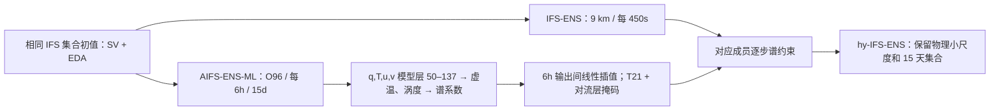

# IFS–AIFS 谱约束混合集合：把 AI 大尺度技巧带入 9 km 物理预报

> Inna Polichtchouk、Simon Lang、Sarah-Jane Lock、Michael Maier-Gerber、Peter Dueben，*Hybrid ensemble forecasting combining physics-based and machine-learning predictions through spectral nudging*，[arXiv:2603.05570v1，2026-03-05](https://arxiv.org/html/2603.05570v1)。2026-09-24 按 v1 原文及图 1–9 阅读。这是一篇**新的混合集合方法论文**，不是 AIFS-CRPS/AIFS ENS 业务说明的重复条目；预报实验最长 **15 天**。

## 一、研究问题、贡献与版本关系

纯物理 IFS-ENS 在大尺度中期场上常不如机器学习集合，但具有约 9 km 分辨率、成熟物理过程及更丰富的小尺度和极端事件产品。纯 AIFS ENS 的概率大尺度技巧较强，但当时业务版水平分辨率约 28 km，尤其近地强风、极端降水尾部偏弱。本文并未再训练一个“混合神经网络”：它先运行已有的概率 **AIFS-ENS-ML**，再把每个 AI 成员的**大尺度对流层**信息，在线约束对应的 IFS 成员；IFS 自己计算中小尺度与物理参数化。[引言与 §2](https://arxiv.org/html/2603.05570v1)

真正的新问题是**集合**而非单次确定性耦合：如果把所有 IFS 成员推向同一确定性 AI 场，集合大尺度离散度会被压塌，CRPS 和可靠性可能恶化。因此作者采用已按 CRPS 思路训练的概率 AI 集合、相同初值扰动和一一对应的成员约束，评估技巧、spread–error、热带气旋及地表极端尾部。论文的“首个”声明是作者对谱约束进入概率集合预报的定位；不应由此推断所有其他类型的混合集合此前不存在。[§1、§2.3、§4](https://arxiv.org/html/2603.05570v1)

## 二、三套系统分别是什么

| 系统 | 空间/时间与动力 | 本文角色、数据和不可混淆的版别 |
| --- | --- | --- |
| IFS-ENS | CY49R1；TCo1279，平均约 9 km；137 个混合坐标层至 0.01 hPa；450 s 步长；与 1/4° NEMO 海洋耦合 | 物理基线。奇异向量 SV 与 EDA 生成初值扰动，SPP 随机参数化描述模式不确定性。本文只运行 **8 个扰动成员**，不是完整业务 50+1。 |
| AIFS-ENS-ML | GNN 编码器 → sliding-window Transformer 处理器 → GNN 解码器；6 h 步长；O96 约 120 km，预测 IFS **模型层 137–50** 的场 | 本文的**AI 约束场**。ERA5 1979–2017 预训练，IFS 业务高分辨率分析 2016–2023 微调；训练数据统一上采/重网格至 O96。采用概率 CRPS 类目标。 |
| hy-IFS-ENS | 保留 IFS 9 km、450 s 积分，在谱空间给温度/涡度方程增加松弛倾向 | 每个 IFS 扰动成员约束到同编号 AIFS-ENS-ML 成员。不是新网络、没有可训练的混合模块。 |

业务 **AIFS ENS** 也出现在图 1、3–7 的比较中，但其约 28 km N320、13 个**气压层**与约 120 km O96、88 个**模型层**的实验 AIFS-ENS-ML 不同。不能把[业务 AIFS ENS v1 与 AIFS-CRPS](37-aifs-crps.md)中的参数量、阶段更新数或 2026 v2 产品成绩直接填给本论文的 AIFS-ENS-ML；本文没有披露 ML 变体的完整层数/参数量、优化器、学习率、batch、训练总步数或精确字段清单。[§2.1–2.2](https://arxiv.org/html/2603.05570v1)

## 三、数据、预处理、训练和微调逐步拆解

1. **AI 预训练资料**：ERA5 再分析 1979–2017。论文说训练数据重网格到 O96，但未给插值核、归一化常数、训练/验证拆分、各变量缺测规则；复现时这些是不可省的待索取配置。[§2.2](https://arxiv.org/html/2603.05570v1)
2. **AI 微调**：2016–2023 ECMWF 业务高分辨率分析同样转为 O96。原文明确是预训练后 fine-tune，但**没有**公开学习率、冻结哪些层、几步 rollout、epoch 或早停方案。因此不能照搬压力层 AIFS-CRPS 的四阶段日程；这里的 2016–2017 两资料年份有日历重叠，且实验 2024–25 虽在训练年份之后，业务回报气候态与训练期资料能否完全隔离仍是部署问题。[§2.2、§4](https://arxiv.org/html/2603.05570v1)
3. **预报初值**：IFS-ENS、AIFS-ENS-ML、hy-IFS-ENS 使用**相同**的 IFS 集合初值和成员扰动（SV+EDA），减少“初值不同”对模型比较的混淆；每个成员仍各自受 SPP 影响。AIFS 先独立跑完整 15 天、每 6 小时保存一次约束场。[§2.1–2.3](https://arxiv.org/html/2603.05570v1)
4. **场预处理**：保存模型层 50–137 的比湿 `q`、温度 `T`、水平风 `u,v`；在格点计算虚温 `T_v=T(1+0.61q)`，把虚温与风变换到 IFS 原生谱空间，风导出涡度谱系数。两个 6 小时 AI 输出之间做**时间线性插值**，以便 IFS 每 450 s 施加约束。原文没有把 AI 的地表场直接拿来驱动 IFS 地表物理。[§2.3](https://arxiv.org/html/2603.05570v1)
5. **“混合模型训练”澄清**：谱约束强度 `τ=12 h`、T21 截断和时变/垂直掩码是配置或敏感性试验，不是反向传播学得的权重。新方法运行时**不再微调** AI 模型；先前的 AI 模型训练/微调只用于提供参考预报。[§2.2–2.4](https://arxiv.org/html/2603.05570v1)

图为依据[§2.1–2.3](https://arxiv.org/html/2603.05570v1)自行重绘的流程概念，不是论文原图。

## 四、谱约束的可复现数学和参数

对虚温和涡度 `X∈{T_v,ζ}` 的大尺度谱系数，IFS 方程右端加 `−f(t)g(k)(X_IFS−X_AIFS)/τ`；`τ=12 h`。只作用于**总波数 0–20**（T21 截断、赤道附近水平波长约 >2000 km），中小尺度仍由 IFS 决定。垂直掩码 `g(k)=1/[1+exp(k_trp+5−k)]`，`k_trp` 为随位置和时间变的温度递减率对流层顶层号，避免强制 ML 上层平流层表现。时间函数 `f(t)=0.5{tanh[t/t_ramp−1]+1}`，`t_ramp=8640 s`，使前约 8–12 小时渐强，以免初始化后短时分析评分退化。[§2.3 公式 1–3](https://arxiv.org/html/2603.05570v1)

作者**不约束辐散**：试验中辐散的纬向波数 `m=2` 引入半日潮汐混叠，造成热带 MSL 和位势高度的波数 2 劣化。这一负面消融说明“变量越多越好”并不成立。另试 T42、T85，T42 对高空量仅多约 1–2% 改善，T85 没有进一步收益，所以选择较保守的 T21。对所有成员推向相同 AI 均值会损失 spread；逐成员一一约束是方法核心。[§2.3–2.4](https://arxiv.org/html/2603.05570v1)

## 五、实验设计、评分口径和图表逐图阅读

每天 00/12 UTC 两次起报，时间窗为 **2024-07-01 至 11-13** 和 **2024-12-01 至 2025-02-28**，中间 11 月下半月不在内。论文图 3–8 汇总 **447 个起报**、每起报 8 扰动成员、最长 15 天。评分使用 ECMWF QUAVER；高空对 IFS 业务分析与探空，地表对 SYNOP 站点，气旋对 IBTrACS；天气型/季节并非无限覆盖。主概率量 **fair CRPS (FCRPS)** 专门修正小集合的有限成员偏差，另列集合均值异常相关 CCAF；图 3 每格是一天 lead，99.7% 显著性边框。图 6 的 spread 校正系数是 `(N+1)/(N−1)`，`N=8`；业务 AIFS 的 50 成员不能与 8 成员的原始 spread 直接比较。[§2.4、图 3、6、8](https://arxiv.org/html/2603.05570v1)

| 图/实验 | 原文可核验内容 | 不能越界解读之处 |
| --- | --- | --- |
| 图 1，500 hPa 动能谱，**第 10 天** | T21 线之外至约波数 200（约 200 km）未见明显 IFS→hy-IFS 小尺度能量破坏；还画业务 AIFS 和低分辨率模型层 AI。 | 单张平均谱证明的是所选变量/时段的统计结构，不证明任一极端个例的位置和振幅正确。 |
| 图 2，风暴 Éowyn，**第 4 天** | 850 hPa 经向风的单成员视图中，hy-IFS 保持与 IFS 类似的空间细节。 | 这只是形态示例；非定量评分或 15 天个例证明。 |
| 图 3–4，高空 1–15 天 | 热带 850–250 hPa 温度/风 FCRPS 最大改善约 **25%**；热带可比技巧时效最多多约 **2 天**，南北半球温带约 **0.5 天**。混合与业务 AIFS 高空整体接近，纯 AIFS 在热带略好。 | “25%”是部分区域/变量/lead 的上限，不是全局平均；不同模式层 AI 与业务气压层 AI 也不可画等号。 |
| 图 3、5、7，地表与跨季时间序列 | 对**IFS 分析** 2m 温度/10m 风提升可达约 **10%**；对 **SYNOP** 通常只有 **2–3%**。北半球 10m 风混合优于 IFS 且优于业务 AIFS；2m 温度 AIFS 仍明显最佳；总降水混合较 IFS 最多约 **3%**。 | 分析检验和站点检验不能合并排名。总降水上，热带/南半球短于 5–8 天 AIFS 可占优，之后混合有利；欧洲混合总体更好。 |
| 图 3，50 hPa 位势高度 | 大部分平流层量间接受益，但 **50 hPa 位势高度 FCRPS 略差**，作者关联到均值偏差小幅移动。 | 不能声称“只约束对流层，所以平流层必无影响”。 |
| 图 6，500 hPa 风 spread–error | 混合误差普遍更低，spread 大致相当或略低；改善主要来自误差而不是靠无节制增大离散度。 | 8 成员采样噪声仍存在，50 成员业务 AIFS 未放入此图直接比较。 |
| 图 8，热带气旋 | 对 IBTrACS，路径位置误差减少，等价技巧时效最多约 **1 天**；最大风速强度与 IFS 相近，未见因约束而变差。 | IFS 与混合都**低估观测强度**；路径 spread–error 可能仍偏保守/欠信。 |
| 图 9，北半球近地极端，第 5 天 | 三系统都低估强风与强降水尾部；业务 AIFS 低估最重，混合基本保留 IFS 的尾部分布；冷极端 AIFS 更接近观测。 | 站点点值和 9/28 km 格网平均存在代表性差异；不能把尾部偏差全归模型架构。 |

上述“最多”数字是作者报告的范围，**不是从图像反读出来的小数**。图 1–9 的图意与有利/不利方向均来自[论文 §3–4](https://arxiv.org/html/2603.05570v1)，只用文字概括与自行重绘，未上传原图。

## 六、消融、计算代价、可复现性与开放问题

- **变量消融**：辐散造成 `m=2` 半日潮汐混叠，故取消；若让确定性 MSE AI 场充当集合目标，成员 spread 不足，不能用“集合初值扰动+物理随机项”轻易代替概率 AI。[§2.3、§4](https://arxiv.org/html/2603.05570v1)
- **尺度与时间消融**：T42 仅边际 1–2%、T85 无明显再增益；短时平滑开启约束是为了避免首几小时退步。这里没有公开完整分层的 T42/T85 变量得分表，应按文本范围理解。[§2.3–2.4](https://arxiv.org/html/2603.05570v1)
- **成本**：基于移动对流层顶的每步谱/格点变换令 IFS 积分成本增加约 **13%**，**不含**另跑 AI 和目标场准备；AIFS-ENS-ML 15 天单成员在 A100 上不到 1 分钟。固定层掩码可将 IFS 额外成本降至约 **2.5%**，但为保护高纬平流层需较低截断，可能失去热带高对流层的最大收益。[§4](https://arxiv.org/html/2603.05570v1)
- **公开资料**：论文列出 IFS 对照试验 DOI `10.21957/5157-0e77`、`10.21957/s8js-bp75` 与混合试验 `10.21957/djrv-e571`、`10.21957/zbtd-xh41`、`10.21957/0q39-9a16`；[Anemoi Core](https://github.com/ecmwf/anemoi-core) 提供 AI 框架代码。IFS 源码受 ECMWF 权属限制，OpenIFS 需许可证，所以“结果数据可取”不等于“完整流水线开箱复现”。[数据可用性声明](https://arxiv.org/html/2603.05570v1)
- **业务校准**：作者明确指出 ML 训练期与业务回报/EFI 所需 hindcast 可能重叠；物理 IFS 分析系统变化后，AI 参考模型可能需重训。本文实验是 2024–25 两季、8 成员、15 天，不能直接宣称 50 成员业务实时运转已验证。[§4](https://arxiv.org/html/2603.05570v1)

## 七、给后续研究的具体检查清单

复现实验至少固定三系统的逐成员初值、SPP 随机种子、O96 重网格/归一化细节、逐 450s 插值、T21/τ/掩码，并以相同站点匹配和有限集合校正重复 FCRPS、spread–error、IBTrACS 及极端尾部。优先增补 50 成员与多年度样本、真实业务校准后 EFI、不同 IFS 循环版本，以及第 10–15 天的热带气旋/极端降水条件评分。若只看平均高空 FCRPS，本方法的极端尾部和成本取舍会被遮蔽。[§3–4](https://arxiv.org/html/2603.05570v1)

[返回首页](../../README.md)
