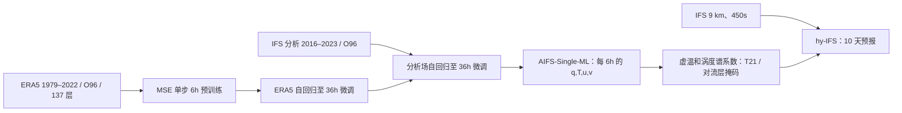

# 确定性 IFS–AIFS 谱约束：模型层预训练、滚动微调与极端事件

> I. Polichtchouk、M. C. A. Clare、M. Chantry、E. Gascón、M. Maier-Gerber、B. Vannière、S. Lang，*Hybrid weather prediction using spectral nudging toward machine-learning forecasts*，[arXiv:2604.22522v1，2026-04-24](https://arxiv.org/html/2604.22522v1)。2026-09-24 按 v1 原文图 1–11 阅读。论文研究**确定性** 10 天预报，和[15 天概率混合集合论文](48-hybrid-ifs-aifs-ens.md)不是一篇，也不是业务 AIFS-Single 的原始训练论文。

## 一、为何需要这项工作

MSE 训练的单次 AI 预报通常有较好的大尺度 RMSE/ACC，但回归平均会削弱高波数方差；大尺度路径更准确，并不自动意味着强风、雨带细节、气旋强度更好。作者提出让 9 km IFS 保持原有动力核和物理参数化，只把虚温、涡度的长波部分向定制 AIFS-Single 模型层预报松弛。核心问题包括：大尺度优势能否转给 IFS？小尺度与极端尾部是否保留？AI 训练期是否影响混合成绩？加入外部约束后，还能否看见物理方案改动带来的好坏？[摘要及 §1](https://arxiv.org/html/2604.22522v1)

原文先有 2025 ECMWF [Newsletter 技术介绍](https://www.ecmwf.int/en/newsletter/184/news/hybrid-forecasting-nudging-large-scales-ifs-deterministic-aifs)，但这篇 v1 论文有更完整的 2024–26 回报、训练期对照、预报失败定义和物理方案消融，故作为一条独立方法研究收录。后续概率集合版改用 AIFS-ENS-ML 与逐成员耦合，不能沿用本稿的 MSE、1536 潜维或极端事件统计。[§1、§2、§7](https://arxiv.org/html/2604.22522v1)

## 二、三种被比较系统和数据界面

| 系统 | 结构与作用 | 与本文的边界 |
| --- | --- | --- |
| IFS | CY49R1、TCo1279 约 9 km、450 s 步、137 个模式层到 0.01 hPa；耦合 1/4° NEMO | 未扰动确定性物理基线，以 ECMWF 业务分析起报，不改变资料同化。 |
| AIFS-Single-ML | GNN 编码/解码 + Transformer 处理，6 h 步，**137 个 IFS 模式层**，O96 约 120 km；隐藏维由业务版 1024 增至 **1536** | 用作谱约束源；不是业务 N320 约 28 km、13 气压层 AIFS-Single。本变体约十倍字段数，但低分辨率使计算量仍低于业务版。 |
| hy-IFS | 原 9 km IFS + 模式层 AI 提供的 T21 大尺度虚温/涡度目标 | 没有新的可训练耦合网络；AI 在预报前独立跑 10 天，IFS 积分时按每 450 s 时间插值约束。 |

业务 AIFS-Single 作为第四条参考曲线；它在 2m 温度和降水可能赢混合，却也在局地强风个例中偏平滑。与 AIFS 模型层版使用相同“AIFS”名称不代表同一分辨率、层数、训练滚动时长或性能。[§2.1–2.3、§4](https://arxiv.org/html/2604.22522v1)

## 三、AIFS-Single-ML 的训练/微调与未披露项

1. **数据统一**：原始 ERA5 再分析 1979–2022 和 ECMWF 业务高分辨率分析 2016–2023 被处理到 O96 的 137 模式层预测问题。这样每步约束不用把 13 气压层反复插值到 IFS 模式层。论文未列所有输入/输出字段名、缺测/插值算子、逐字段标准化常数、训练验证切分或重网格权重；不能按 13 层业务 AIFS 的字段表臆造。[§2.2–2.3](https://arxiv.org/html/2604.22522v1)
2. **第一阶段，单步预训练**：ERA5 1979–2022，预测 t+6 h；确定性 AIFS-Single 是 **MSE 类目标**，不同于概率 AIFS-ENS 的 CRPS。[§2.2](https://arxiv.org/html/2604.22522v1)
3. **第二阶段，ERA5 滚动微调**：仍用 ERA5 1979–2022，固定学习率，网络接收自己的前一步输出继续自回归，最长 **36 h**，以减轻训练只见真值输入、测试却见自身误差的分布差异。[§2.2](https://arxiv.org/html/2604.22522v1)
4. **第三阶段，业务分析滚动微调**：换用 IFS 高分辨率分析 2016–2023，同样固定学习率、自回归至 36 h；与仅微调 2016–2020 的对照模型并列评估。作者试过 **72 h** rollout，但即便总波数 <21 的大尺度也出现过度平滑，所以选 36 h；这与业务 AIFS-Single 的较长 rollout **不能混同**。[§2.2、§4.1](https://arxiv.org/html/2604.22522v1)
5. **未披露参数**：文中没有明确该 1536 隐维变体的总参数量、AdamW/其他优化器、学习率数值、batch、更新数、GPU 时长、各阶段冻结范围；“固定学习率”不等于可写出其数值。未见后续为特定风暴的事件微调；其微调对象是天气分析的长期样本。[§2.2](https://arxiv.org/html/2604.22522v1)

图据[§2](https://arxiv.org/html/2604.22522v1)自行重绘，不是论文原图。训练三阶段与“线上约束”是不同操作，不能把后者写作神经网络微调。

## 四、谱约束参数与垂直耦合取舍

针对虚温 `T_v` 和涡度 `ζ`，IFS 谱方程增加 `−f(t)g(k)(X_IFS−X_AIFS)/τ`。仅约束总波数 **0–20**，约 >2000 km；`τ=12 h`。对流层掩码 `g(k)=1/[1+exp(k_trp+5−k)]` 随递减率对流层顶层号 `k_trp` 变化。时间 ramp `f(t)=0.5{tanh[t/8640s−1]+1}`，让首 8–12 h 的约束渐强，避免分析起报后立即拉低短时技巧。[§2.4 公式 1–3](https://arxiv.org/html/2604.22522v1)

AI 每 6 h 保存所有 137 层的比湿 `q`、温度 `T`、风 `u,v`；先算 `T_v=T(1+0.61q)`，再把虚温、风变换到谱空间取得虚温与涡度系数；IFS 每 **450 s** 通过 6 h 输出的**线性时间插值**使用目标场。辐散没有约束：纬向波数 `m=2` 会混叠半日潮汐并劣化热带海平面气压和位势高度；只去掉 `m=2` 再约束辐散也未给额外提升。[§2.4](https://arxiv.org/html/2604.22522v1)

垂直界面消融是本稿区别于普通谱约束摘要的重点：把业务 AIFS 13 气压层每步插到模式层，额外成本 **25–30%**，且低于约 850 hPa 的边界层约束受限，首三天某些区域退步/热带层积云区劣化。专门训练垂直插值器可免反复插值成本，但残余边界层温度结构误差迫使约束限于约 900 hPa 以上。直接训练 137 模式层使近地也可被大尺度影响，短时和地表效果最好。[§2.3 与补充资料说明](https://arxiv.org/html/2604.22522v1)

动态对流层顶掩码使 IFS 积分成本约 **+13%**（另有 AI 推理/预处理）；固定模式层界可降至 **+2.5%**，但为不伤极区平流层需截在约 300 hPa 以下，丢掉热带高对流层的大部分作用。论文并非“无代价地把 AI 技巧注入 IFS”。[§2.6](https://arxiv.org/html/2604.22522v1)

## 五、评测设计与图 1–11 的主要读数

每天 00 UTC 起报，**2024-06-01 至 2026-02-28**，共 **644 次以上** 10 天确定性预报。QUAVER 对 ECMWF 分析评分用 1.5°×1.5° 格网；探空与 SYNOP 评分则从全分辨率 O1280 场用最近邻匹配站位。图 4 是第 1–10 天逐天 scorecard，ACC/RMSE，99.7% 置信标框；图 5–6 直接对比 IFS、混合、业务 AIFS 以及 2016–2020 训练期对照。极端阈值评分是 twMAE，不能与普通 RMSE 或集合 FCRPS 排成一个“最佳模型”总榜。[§2.5、§4–5](https://arxiv.org/html/2604.22522v1)

| 图/对照 | 原文证据 | 评读边界/反例 |
| --- | --- | --- |
| 图 1，第 10 天 500 hPa 动能谱 | 混合维持 IFS 小尺度能谱；业务 AIFS-Single 超过总波数约 20 后能量明显偏低，模型层 AI 略多些能量。 | 是多月平均谱，不是每个单点极端已被证明。 |
| 图 2–3，2025 年风暴 Amy 的 114 h 预报 | 混合的 700 hPa 湿度梯度、MSL 和苏格兰西部 10m 强风峰值更接近分析；业务 AIFS 更平滑且低估峰值。 | 一场风暴的视觉个例，不当作统计显著成绩。 |
| 图 4–5，高空 ACC/RMSE | 热带 850–250 hPa 部分变量 **ACC 最多 +33%、RMSE 最多 −20%**；技巧时间热带约 **+1.5 天**、温带 **+12–18 h**。 | 最大值不是全局/全年平均；业务 AIFS 在热带仍领先混合约一天。 |
| 图 4、50 hPa | 多数低平流层变量因对流层反馈受益，但 **50 hPa 位势高度 RMSE 退步**、伴均值偏移。 | 不能把“只约束对流层”解释成其余层必不受影响。 |
| 图 4、6，地表 | 对分析，2m 温度和 10m 风 ACC 最多 +10%、RMSE 最多约 −8%；对 SYNOP 的改进通常 **3–5%**。10m 风至第 5 天混合胜过业务 AIFS；2m 温度和大多数降水时效 AIFS 更强。 | 分析格网与站点口径必须分开；降水用 **SEEPS**，非降水 RMSE。 |
| 图 5–6，训练期敏感性 | AI 分析微调延长至 2023 对比仅至 2020，某些区域/变量提升最多约 **10%**；短期资料版仍优于自由 IFS。 | 数据量与分析代表性改善无法分辨，提醒要随业务分析更新重训。 |
| 图 7，第 6 天 Z500 预报失败 | ACC<40% 定义；欧洲 IFS **6→混合 3**、北美 **14→9**、东亚 **12→5** 次。 | 三地区样本量有限，不要把所有流型都称为“失败率减半”。 |
| 图 8，热带气旋 | 2024-06 至 2025-10 的 IBTrACS 验证；路径位置误差最多约 **−50 km**、约等效 **+12 h**；强度–中心气压关系近 IFS，业务 AIFS 强度偏弱。 | 此评分窗口短于全体 644 次起报窗口；不是 2026 全年气旋结果。 |
| 图 9，北半球极端 twMAE | 阈值：热 ≥35°C、冷 ≤−10°C、日雨 ≥30 mm、10m 风 ≥8 m/s；平坦/丘陵/山地按子网格地形标准差 `<40`、`40–120`、`>120 m`。温度极端部分格/时效改善最多约 9%；夏季丘陵/山地强降水最多约 5% 改善，**冬季小幅且不显著退步**。 | 阈值罕见事件即使每条件 ≥1000 观测仍有抽样不确定性；没有概率可靠性信息。 |
| 图 10–11，物理方案消融 | 对深对流卷入率加倍，混合仍能识别高空温/风退步，幅度约减半；地表露点退步相近，部分中尺度降水结构改善仍保留。 | 只有这一项较大物理改动；不能推成所有较小参数变化都可见。 |

图意/数字均对应[§2–6 与图注](https://arxiv.org/html/2604.22522v1)，这里是原创文字表和流程重绘，不复制出版原图。

## 六、关键局限及复现路径

业务分析起报但使用过往训练期资料，数据独立性需按每次起报年份和分析版本再核。10 天 deterministic RMSE/ACC 大幅改善，不等于逐时极端事件概率经校准；极端近地降水冬季还有中性至轻微不利，热带 50 hPa 位势高度也有回退。模型层 AIFS 的完整归一化、优化器/学习率、训练步数未公开，IFS 源码也并非完全开放；[公开试验数据 DOI](https://doi.org/10.21957/z7ks-tc34) 之外另列 `10.21957/aswx-qj80` 和 `10.21957/0xng-et91`，完整运行复现需 ECMWF 配置或 OpenIFS 授权。[§2.2、数据可用性声明](https://arxiv.org/html/2604.22522v1)

复核时应首先固定相同起报分析、AIFS 训练截期、O96 模式层重网格、T21/τ/ramp、动态对流层顶和站点匹配；分开报告高空大尺度、地表/极端阈值和计算成本。为检验“物理可改”，应始终成对比较 **nudged vs nudged** 与 **free vs free** 的物理方案变化，不能把互相不同的大尺度边界条件直接相减。[§4–6](https://arxiv.org/html/2604.22522v1)

[返回首页](../../README.md)
