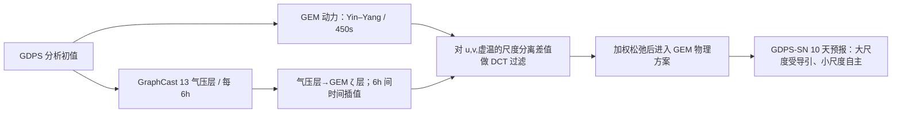

# 加拿大 GEM–GraphCast 谱约束：大尺度纠偏而保留中期天气极端

> Syed Zahid Husain、Leo Separovic、Jean-François Caron、Rabah Aider、Mark Buehner、Stéphane Chamberland、Ervig Lapalme、Ron McTaggart-Cowan、Christopher Subich、Paul A. Vaillancourt、Jing Yang、Ayrton Zadra，*Leveraging data-driven weather models for improving numerical weather prediction skill through large-scale spectral nudging*。首版 [arXiv:2407.06100v1，2024-07-08](https://arxiv.org/abs/2407.06100)，本笔记按 [v3，2025-06-11](https://arxiv.org/html/2407.06100v3)核对；另有 [Weather and Forecasting 同行评审版 DOI](https://doi.org/10.1175/WAF-D-24-0139.1)。2026-09-24 阅读。研究为**确定性 10 天**物理–AI 混合预报；不是 2026 ECMWF IFS–AIFS 谱约束两篇论文的同一实验。

## 一、问题和真实贡献

GraphCast 的 0.25° 网格分辨率并不等于预报的**有效分辨率**：随着自回归时效增长，短波能量被 MSE 型训练逐步平滑。但它对大尺度环流的相位/幅度往往比加拿大业务 GEM 更准。作者提出用 GraphCast 只指导 GEM 的大尺度虚温与水平风，仍由 GEM 自己生成小尺度、物理过程与完整业务字段。这个架构的科学判断须同时看谱振幅、谱相干、探空、地面强风/高温尾部、台风路径/强度，而不能只比单一 Z500 RMSE。[原文 §§1–3](https://arxiv.org/html/2407.06100v3)

论文 v3 总结 Z500 RMSE 约降 **5–10%**、约第 7 天的热带等效技巧增长超过 24 h，且 GDPS-SN 保持 GEM 的强天气尾部。不过本稿实际统计实验只采 **2022 冬/夏两季各 60/62 个起报**，不等同全年多年业务验证。v3 提及后续 2025-03 的**试验业务版**基于 ECCC 自己重训/微调的 GraphCast，不是本文 2022 回报所用的未再次微调权重。[§3、§6](https://arxiv.org/html/2407.06100v3)

## 二、模型结构、数据及训练和“未微调”边界

| 组成 | 论文可核验设置 | 数据/处理与误读风险 |
| --- | --- | --- |
| GDPS-CTL / GEM 物理基线 | 加拿大业务 GDPS 的 GEM：约 **15 km**、**450 s** 步长、**84** 预报层，顶部约 0.1 hPa；Yin–Yang 两套重叠有限区域格网，半拉格朗日动力、物理过程分裂耦合 | 这篇实验为**仅大气**配置；业务 GDPS 的 NEMO 海洋耦合没有在此实验打开，不能把海气耦合效果算入。 |
| GraphCast AI 参考 | Google DeepMind 公开预训练的 **13 气压层** GraphCast；0.25° 经/纬格、GNN encoder–processor–decoder、逐 6 h 滚动 | 原始模型在 ERA5 0.25° 上用垂直加权 MSE，训练最长 12 个自回归步/3 天；该 13 层版先前由权重提供方以 **2016–2021 ECMWF 业务分析**微调。 |
| 本论文的跨系统初始化 | 三系统 GDPS-CTL、GraphCast、GDPS-SN 都从**加拿大 GDPS 业务分析**起报 | **本文没有对 GraphCast 权重再微调**到 GDPS 分析。它依赖把 GDPS 初值变换成 GraphCast 所需字段/气压层；原文并未给出完整变量标准化、插值核、缺测处理或权重训练超参数。 |
| GDPS-SN 混合 | GEM 动力步后、物理参数化前，对选定大尺度变量施加谱增量 | 不训练新神经网络；`τ=12h`、DCT 双截断和垂直权重由敏感性试验选择，不能称为端到端反向传播参数。 |

GraphCast 高空 6 个场为温度、`u/v`、位势、比湿、垂直速度，另有 2m 温度、10m `u/v`、MSL 和降水等地表场；并非所有这些场都用于约束 GEM。37 层 GraphCast 虽有更高垂直分辨率，但在这项研究时**未有相同的业务分析微调**，故作者选 13 层版。[§2.2](https://arxiv.org/html/2407.06100v3)

流程为按[§§2、4](https://arxiv.org/html/2407.06100v3)自行重绘，不是原图。注意这里是**GEM 的 Yin–Yang 每片 DCT**，与 ECMWF IFS 原生全球谱系数 T21 耦合技术上不同。

## 三、数据/预处理、谱诊断与公平比较

冬季 **2022-01-01 12 UTC 至 03-31 00 UTC** 每 36 h 起报 **60** 次，夏季 **2022-06-01 00 UTC 至 08-31 12 UTC** **62** 次，每次 10 天。先以 250 hPa 动能谱、500 hPa 温度方差谱，以及“瞬变扰动” `x'=x−同季样本均值` 的振幅比 `γ(n)=sqrt(var_forecast(n)/var_analysis(n))` 和相干 `ρ(n)` 看尺度结构。作者将 `γ<0.9` 当作该波长幅度低估超过 10% 的有效分辨率阈值：GraphCast 约第 1 天已到 **1000 km**，第 3–5 天进一步降至 **2500–2700 km**，但不意味着它完全不存在更短尺度，只是振幅不足。[§3.1、图 1–2](https://arxiv.org/html/2407.06100v3)

为了避免平滑模式在原生格网上被“双重惩罚”偏差有利地评价，作者对 GDPS 和 GraphCast 都做了**全分辨率**与**低通到 GraphCast 有效尺度**两套探空检验。探空含 1000–100 hPa 强制层的 U、风速、Z、T、露点差；后者采用全球球谐低通，不是混合本身用的两块 DCT。作者还用 ECMWF 分析做独立参考，避免只用 GDPS 自己的分析偏向同源物理模型；反过来 ECMWF 分析也是 GraphCast 微调数据体系，所以两种参考都要看。[§3.2](https://arxiv.org/html/2407.06100v3)

地面评分合并 SYNOP、METAR 和加拿大 SWOB，降水用 CaPA 质量控制的地面 24 h 雨量。站高与 GDPS 地形相差 **>100 m** 的站点剔除，观测/预报的风速 **<1.5 m/s** 置零。热带气旋与 IBTrACS 比对。上述处理会影响强风分位数与复杂地形排名，不能省略。[§5.4–5.5](https://arxiv.org/html/2407.06100v3)

## 四、谱约束公式、参数选择与不利消融

在 GEM 一个动力步的中间态 `F_GEM` 上，先把 GraphCast 同一时刻气压层结果垂直插到 GEM 地形跟随 `ζ` 层，再算 `F_nudge=F_GEM+ω[F_GC−F_GEM]_LS`，其中 `ω=β(ζ)Δt/τ`，`Δt=450 s`。6 h AI 帧之间线性时间插值。大尺度差值通过**Yin 和 Yang 各自的离散余弦变换 DCT**过滤，逆变换后送入物理方案；所以非约束小尺度理论上来自 GEM，不被 GraphCast 直接复制。[§4.2 公式 4–5](https://arxiv.org/html/2407.06100v3)

| 参数/选择 | 主设置 | 为什么不是任意值 |
| --- | --- | --- |
| 约束场 | 水平风 `u,v` 与虚温 | 比湿约束可改近地 T/q 偏差，但多算场且**台风强度变差**；作者因此不用。 |
| 垂直 β | **>850 hPa** 和 **<250 hPa** 权重 0；**700–400 hPa** 权重 1，间段 `cos²` 平滑过渡 | 13 气压层 GraphCast 边界层垂直信息不足、ERA5/GDPS 地面强迫不同；平流层 AI 技巧不足。 |
| Yin–Yang DCT 两尺度软截断 | `λ_LS=2750 km` 以上全保留，`λ_SS=2250 km` 以下全删，中间平滑；换算全球高斯谱的大致软截断约 **5500–2000 km** | 尽量只用 GraphCast 长时效仍相干的大尺度，避免切割产生 Gibbs 振铃。DCT 数字不可直接等同 IFS 的 T21。 |
| 松弛时间 `τ` | **12 h**，全预报期固定 | 6 h 同步太强会放大复杂地形与垂直插值不一致；>24 h 又可能因混合平均出现滤波边缘及至第 10 天的平滑，48 h 尤甚。 |

这个设计有明确限制：GraphCast 的近地偏差不能靠只约束 850–250 hPa 彻底改正，区域如**亚洲夏季中高层**仍可能退步；比湿/边界层约束是未来可能的路，但需要与 GEM 分析更一致、层结更密的 AI 参考场。[§4.3、§5.2](https://arxiv.org/html/2407.06100v3)

## 五、图表和性能：正反证据一起读

| 图号/指标 | 原文可核验发现 | 不能夸大的地方 |
| --- | --- | --- |
| 图 1–2：250 hPa 动能、500 hPa 温度/相干 | GraphCast 0.25° 的标称格距掩盖长 lead 的低有效分辨率；GEM 有更多细尺度能量，GraphCast 大尺度相干更好。 | “有效分辨率 2500 km”是本文 `γ<0.9` 定义，不代表小于该尺度完全为零。 |
| 图 7–9：谱与 2022 风暴 Eunice，约 5.5 天 | GDPS-SN 的小尺度能谱接近 GDPS-CTL；2000–4000 km 长 lead 振幅仍可少约 **10%**。个例混合形成比自由 GEM/GraphCast 更合理的风暴小尺度。 | 一个个例不能代替全年极端事件统计。 |
| 图 10–13：探空、六区域 | 混合对多数层/变量优于 GDPS-CTL，**亚洲夏季中高层例外**；同 GraphCast 的公平低通对照中，混合的中高层一般更好，露点差例外，AI 低层又可占优。 | 不能只列改善的全域平均，不写区域/湿度负面结果。 |
| 图 14：第 7 天 ACC | NH Z500 冬/夏等效技巧约 **+11/+8 h**，SH 夏/冬约 **+3/+13 h**；热带 850 hPa U **≥+26 h**。论文摘要/总结的“热带 >24 h”与此口径相容。 | 不同半球/季节差别很大，非所有 Z500 均 +1 天。 |
| 图 15–17：站点与降水 | 近地改善弱于高空；高风/高温尾部混合与 GEM 相近，GraphCast 北美 99 分位风速约 **−3 m/s**，夏季高温分位约 **−2 至 −4°C**。北美冬季第 5 天降水主要靠减少虚警改善；夏季改善可忽略。 | “保留极端尾部”不等于强风/气温分位数已优于 GEM，降水季节差别显著。 |
| 图 18：IBTrACS 气旋 | 2022 夏季北半球三盆地，混合路径位置误差下降，尤其第 5 天后减轻走得过慢的 along-track 偏差。强度与 GEM 相近，**两者仍偏弱**，但强于 GraphCast。 | 不能写成“谱约束修复台风强度”；只改变大尺度引导流。 |

表中数字、图注和不利结果来自[§§3–5](https://arxiv.org/html/2407.06100v3)；这是自行整理的中文解读和模型结构图，未转载论文原图。冬季降水显著性以 3 天块 bootstrap、90% 分位检验；ACC 图以 95% 分位检验，二者也不可混成单一置信水平。[图 14、17](https://arxiv.org/html/2407.06100v3)

## 六、成本、版本迁移和复现清单

作者报告当前 GEM DCT 谱约束实现令物理预报计算量约 **+25%**，**另加** GraphCast 推理但后者相对小；这是概念验证配置，未优化 DCT 代码或异步输入。不能把后续 IFS–AIFS 原生谱方案的 +13% 成本套到本稿。[§5.6](https://arxiv.org/html/2407.06100v3)

复现实验要固定 2022 两季 60/62 次起报、相同 GDPS 分析、**未再微调**的 13 层 GraphCast 权重、气压→ζ 层与 6 h→450 s 插值、Yin–Yang 独立 DCT、双截止波长、β/τ、仅大气 GEM、站点 QC 与独立/自分析两类验证。文章虽有 2025 v3 与正式 DOI，不能把 v3 提及的 ECCC 试验业务版重训结果倒灌到 2022 实验。进一步需要多年样本、业务海洋耦合、同化更新后的 AI 微调和 37 层/模式层方案。[§§2–6](https://arxiv.org/html/2407.06100v3)

[返回首页](../../README.md)
