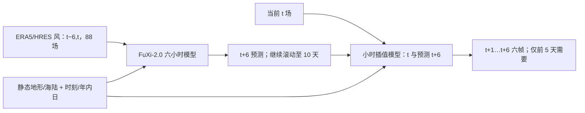

# FuXi-2.0：六小时主预报、逐小时插值与大气–海表联合变量

> Xiaohui Zhong、Lei Chen、Xu Fan、Wenxu Qian、Jun Liu、Hao Li，*FuXi-2.0: Advancing machine learning weather forecasting model for practical applications*，[arXiv:2409.07188v1，2024-09-11](https://arxiv.org/html/2409.07188v1)。2026-09-24 按 v1 原文图 1–6、方法与表 1 阅读。这是 FuXi 系列中面向**0–10 天中期**及能源/航空/海运应用的独立论文；不同于[FuXi Weather 观测同化](08-fuxi-weather.md)、[FuXi-ENS 集合](39-fuxi-ens.md)和[FuXi-S2S 42 天](../s2s/40-fuxi-s2s.md)。

## 一、问题、真正时效和贡献边界

早期 AI 全球天气模型通常每 6 h 出一张图，输出变量不够覆盖能源、航运等业务需求。FuXi-2.0 由两个网络组成：先自回归运行 6 h 基础预报，再用相邻 6 h 天气状态一次生成间隔中的连续逐小时结果。原文明确 **第 0–5 天逐小时、第 5–10 天每 6 小时**；“1-hourly global forecast”绝不可误写成完整 10 天逐小时。与 Pangu-Weather 四套 1/3/6/24 h 模型按时效切换不同，这里统一先走 6 h 主路径，再对需要的片段补 1 h 插值。[§1、§4.2](https://arxiv.org/html/2409.07188v1)

论文说“气海耦合”是把 SST 与海浪变量列入联合递推状态，报告对台风强度的影响；原文并未详细证明显式海洋动力核、通量守恒和海气能量反馈。因此本笔记将其称为**大气–海表/波浪联合预测**，把“物理意义的耦合反馈”视为有待消融验证的推断。主统计对比是 **2018 年、0–90 小时**逐小时场，另有 0–5 天台风，非论文展示出全部第 10 天变量的逐小时外部验证。[§1–2](https://arxiv.org/html/2409.07188v1)

## 二、逐字段数据、年份与预处理

| 数据/字段组 | 范围与作用 | 复现与评读注意 |
| --- | --- | --- |
| ERA5 时空网格 | 0.25° 经/纬、`721×1440`；6 h 主模型训练 **2012–2017**，小时模型 **2015–2017**，独立测试 **2018** | 原文把 2012–2017 口头称“8 年”，但包含起止年份只有**6 个自然年**；应以年份为准。 |
| 高空 65 场 | `Z,T,U,V,Q` × 13 气压层：50、100、150、200、250、300、400、500、600、700、850、925、1000 hPa | 都是递推输入/输出；本稿没有公开单字段归一化均值/标准差、插值核和变量特定缺测替代。 |
| 近地、辐射、云、海表/波浪共 23 场 | `T2M,D2M,SST,U10M,V10M,U100M,V100M,MSL,LCC,MCC,HCC,TCC,SSR,SSRD,FDIR,TTR,TP,MDTS,MDWW,MPTS,MPWW,SHTS,SHWW` | 都是递推输入/输出，合计 65+23=**88**；`TTR` 为净向下热辐射、与 OLR 符号相反；海洋变量陆地像元损失掩为 0。 |
| 静态/时间条件 | 地形、海陆、经纬、时刻、年内日与预报步标识 | **只作输入**，不能把这些算成第 89 等输出通道。 |
| 近地风 HRES 补强 | 东亚 HRCLDAS 站点/同化资料提示 ERA5 10m 风存在偏差；作者用 HRES 00/12 UTC 起报的 1–12 h `U/V10M` 和 `U/V100M` 做 FuXi-2.0 开发资料 | 这意味着“全部训练目标都来自 ERA5”不精确；论文未清楚逐小时交代 HRES 风与 ERA5 其他变量的拼接/标准化版本，复现时需追问。 |
| 台风真值 | IBTrACS 6 h 最佳路径，另从 ERA5 提取对应台风强度作为第二参考 | IBTrACS 风与 ERA5 风强度分布不同；不能只报更有利的 ERA5 指标。 |

资料摘自[表 1 与 §4.1](https://arxiv.org/html/2409.07188v1)。ERA5 降水因已知偏差未进主图 1–2 的常规气象分数比较，不能理解成网络完全不输出 `TP`。[§2.1](https://arxiv.org/html/2409.07188v1)

## 三、两个网络的空间/时间结构

两个网络处理 `2×88×721×1440` 的相邻状态。6 h 模型的两帧是 `t−6,t`，生成 `t+6`；小时模型读 `t` 和已算出的 `t+6`，一次产生 `t+1,…,t+6` 六帧。按原文，输入先把时间和通道合并成 `2C×H×W`，`8×8` 核、stride 8 的二维卷积压到约 `90×180`；地理/时间条件用并行卷积编码后拼接。中间为 **30 个 Swin Transformer blocks**，窗口 `18×18` 并采用 RoPE 位置编码；末端 `8×8` 反卷积还原空间分辨率。小时模型也有 30 块，按每 5 块子集配置解码以产出连续六小时。论文结构图并未给每个块的注意力头数、潜通道、网络总参数量；这些不应照搬 FuXi-1.0。[§4.2、图 6](https://arxiv.org/html/2409.07188v1)

这是按[§4.2](https://arxiv.org/html/2409.07188v1)自行重绘的模型/数据流。该插值模型利用**未来六小时的预报边界帧**，不是只凭起报时刻直接自回归 1 h；所以“每小时更精细”不等于包含额外实时观测。

## 四、训练日程、损失与是否微调

`Charbonnier` 鲁棒损失近似 `sqrt((a_i(预测−目标))²+ε²)`，`ε=10^-3`，`a_i` 给高纬较小权重。高空损失权重 **1**、地表 **0.1**；海洋变量陆地置零。这个形式大误差近 L1、小误差近 L2；但原文未给所有变量按不同单位做了哪些标准化，不能凭损失权重反算字段物理单位的重要性。[§4.3 公式 1](https://arxiv.org/html/2409.07188v1)

| 阶段 | 时间资料和输入/目标 | 可核验参数 | 冻结或微调关系 |
| --- | --- | --- | --- |
| 6 h 主模型 | 2012–2017 天气场，`t−6,t→t+6` | **40,000 updates**；每 GPU batch **1**；AdamW `β=(0.9,0.95)`，初始 LR `2.5×10^-4`，weight decay `0.1` | 从头训练独立主网络；正文未写学习率退火、GPU 数、总训练时长。 |
| 1 h 插值模型 | 2015–2017，先运行已训练主网一次得到**预测** `t+6`，再以 `t` 与该预测帧生成 `t+1…t+6` | **60,000 updates**，**8×A100**；原文未把该阶段的 LR/batch 另列 | 主网络参数**冻结**，训练第二网络；这不是把第一个网络继续微调，也不是用真实未来 t+6 代替推理时的预测帧。 |
| 风电下游 MLP | 2018-01 至 10 训练、11–12 月测试，前向 28–51 h，见下节 | 50 epochs、batch64、Adam β=(.9,.999)、初始 LR1e-4、WD0.2；milestones 15/20/25/30/35/40/45，乘 0.2 | 是**独立下游功率模型**，不代表 FuXi 天气模型本身被站点微调。 |

论文没有交代 FuXi-2.0 是否以 FuXi-1.0 权重初始化，也没有给“FuXi-1.0→2.0”的继续微调步骤；只把它们作为不同版本比较。不要把“版本升级”误写成已证实的参数迁移。[§4.3–4.4](https://arxiv.org/html/2409.07188v1)

## 五、业务下游数据处理与比较公平性

风电试验用英国 Kelmarsh（六台 2.05 MW、原始 10 min）和韩国 Yeongheung（两组风机、小时级），只研究 12 UTC 起报后 **28–51 h** 的日前功率。训练 2018-01-01 至 10-31，测试 2018-11-01 至 12-31。功率与风速 QC 后样本分别 **8760→8319**、**8760→8476**；韩国现场风速不公开，**以 HRES 风速辅助 QC**，对 HRES 对照可能带来资料依赖，须留意。下游 MLP 接 10m/100m 的 U/V/风速共六特征、站点周围 `3×3` 格点、目标时刻±1 h，共 `6×3×3×3=162` 输入，五隐层 `288/256/128/64/32`、ReLU、RMSE 损失。两个天气来源使用同结构/训练流程的 MLP，可分辨“上游天气输入”差异，但仅两场站。[§2.3、§4.1、§4.4](https://arxiv.org/html/2409.07188v1)

逐小时天气与 HRES 的公平比较以 **ERA5** 为共同真值，因为 HRES 自身分析 `fc0` 只有 6 h 间隔；6 h 补充比较却让 HRES 对其 `fc0`、FuXi/Pangu 对 ERA5，**真值口径不同**，不应跨图直接合并排名。ACC 气候态取 ERA5 **1993–2016**，指标含纬度加权 RMSE/ACC/活动度；“活动度”是异常波动幅度，并非准确度或概率可靠性。[§2、§4.5](https://arxiv.org/html/2409.07188v1)

## 六、图 1–6 的性能与负面结果

| 图/问题 | 已核对的结果 | 必须保留的限制 |
| --- | --- | --- |
| 图 1–2，2018 年 0–90 h 逐小时 | T2M、MSL、WS10M、T850、Z500、Q700 上 FuXi-2.0 多数 lead 的 RMSE/ACC 优于 HRES；Pangu 初段有时略好，但 FuXi-2.0 后段更有利，且 Pangu 小时曲线有跨步策略造成的振荡。 | 常规主图仅 **90 h**；不能把这组成绩直接延伸至第 10 天。活动度诊断显示 FuXi 的高空频谱/异常变化也非全面完美。 |
| 图 3，能源/航空/海运 | 100m 风、辐射、云量、SST/海浪等常用任务对 ERA5 的 RMSE/ACC 相对 HRES 多数有利。 | 风/云活动度比 HRES 低；SST 与平均风浪周期明显更平滑；可见度未输出。 |
| 图 4，下游风电 | 两个风场以 FuXi-2.0 输入训练的 MLP 在 28–51 h 功率预测优于同结构 HRES 输入；个例 Kelmarsh 的降功率时机更贴近观测。 | 图中两条“15 天时间序列”只是连续 15 天的**日前预测展示**，并非 **15 天 lead**；样本仅两站，且韩国 QC 借 HRES。 |
| 图 5，2018 年 90 场台风 | FuXi-2.0 与 FuXi-1.0 路径近似，二者略优 HRES；FuXi-2.0 的 MSL/WS10M 强度误差小于 1.0。 | 对 **IBTrACS**，HRES 的强度 RMSE **最好**；对 **ERA5**，FuXi-2.0 最好。ERA5 台风偏弱导致参考场切换改变排名，不能只摘“FuXi 强度全面胜 HRES”。 |
| 图 6，模型结构 | 6 h 主网 + 1 h 插值网、30 Swin 块、8 倍空间 patch/down-up 路线。 | 未公开头数/潜宽/总参数，不能靠示意图推测。 |

结果均按[§2、图 1–6](https://arxiv.org/html/2409.07188v1)复述，表和结构图为原创解读，未复制原图。图 5 的“与 FuXi-1.0 更好”只能说明所报告比较相关，不能在**无气海消融**下把全部改进唯一归因于海表字段；2.0 同时改变时间框架、变量和训练期。

## 七、复现与下一步核验清单

应先获取 2012–17/2015–17 的精确小时/6 小时资料提取脚本，核实 HRES 10m/100m 风与 ERA5 其他通道的时空配准、归一化与标签版本，并将“2012–2017 被称 8 年”的原文笔误登记。两网需独立训练、冻结主网后以**模型预测** t+6 训练小时网；评测明确 0–90 h 主图、5 天台风、5–10 天 6h 输出与两个月风场测试四个不同口径。对气海贡献应补做无 SST/波浪的 2.0 同架构消融，并以 IBTrACS 为主、ERA5 为辅验证强度与极端尾部。[§§2–4](https://arxiv.org/html/2409.07188v1)

[返回首页](../../README.md)
