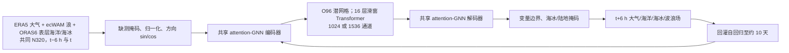

# AIFS Marine：单一模型联合预报大气、表层海洋、海冰与海浪

> Sara Hahner、Lorenzo Zampieri、Jean-Raymond Bidlot、Philip Browne、Matthew Chantry 等 25 人，*Representing the Surface Ocean in ECMWF’s data-driven forecasting system AIFS*，[arXiv:2604.25559v1，2026-04-28](https://arxiv.org/abs/2604.25559)；[含补充材料的全文 HTML](https://arxiv.org/html/2604.25559v1)。本笔记于 2026-09-24 核对 v1 全文、主图 1–14、补图 S.1–S.9、表 1/S.1。HTML 页眉另有“August 24, 2026”手稿日期；书目日期以 arXiv 提交史为准。本文是**中期**海气联合预报研究，不是 AIFS ENS 集合训练论文，也不把两个月压力测试误称为两个月业务技巧。

## 一、研究问题和贡献边界

常见数据驱动天气模型只把大气场当作显式状态，海表影响主要隐含在再分析场中。本文问：把浪、表层海洋和海冰与大气放入同一递推网络，能否改善海洋变量和大气中期预报？与分别训练大气、海浪、海洋模型再规定交换通量的传统耦合不同，AIFS Marine 共用图编码器、潜空间 Transformer 和图解码器，直接从配对资料学习相关性。这里的“联合”是**状态和参数共享**，不是已证明网络内部遵守能量/动量守恒；案例中的物理一致性属于定性证据。[引言与 §2](https://arxiv.org/html/2604.25559v1)

它每步预报 6 h，递归到中期，主要评分图覆盖约 10 天：图 6 海冰日 8–10，图 10 为 +240 h。论文还对极端扰动积分两个月以检验稳定性，不能据此宣称已对 S2S 两个月技巧完成独立评估。作者主张“多数海洋变量中期技巧约领先物理模型一天”，但**海表高度 SSH 例外**，而大气分数有局部退步。[§4–5](https://arxiv.org/html/2604.25559v1)

## 二、资料、字段和预处理

| 状态来源 | 原始资料与配对逻辑 | 进入模型前的处理和限制 |
| --- | --- | --- |
| 大气 | ERA5；气压层取 13 层，与 AIFS Single 1.1 字段体系相近。 | 输入 `t−6h,t`，预测 `t+6h`；N320 reduced Gaussian 网格约 0.25°。原文未在此稿逐一公布大气所有层的实际输入文件路径、QC/缺测率。 |
| 海浪 | ECMWF 为研究专制的 **1979–2025、约 9 km ecWAM 回报集**，含卫星高度计浪高同化、改进的海冰衰减。ecWAM 原频率×方向离散为 36×36，网络不直接输出完整频谱。 | 波浪目标减维为显著波高 SWH、平均周期、平均方向、波浪相关拖曳系数，再加六个 `10–12/12–14/14–17/17–21/21–25/25–30 s` 周期段波高，合计 **10 个物理字段**；方向拆 `sin/cos` 编码，不能误把 10 写成处理后的通道数。 |
| 表层海洋与海冰 | **ORAS6 1993–2023** 的小时平均场，ORCA025 约 25 km；NEMO4/SI3/NEMOVAR 系统，先有 5 年同化 spin-up；以 ERA5 逐小时强迫，吸收原位温盐、卫星海面高度异常、SST、海冰浓度。只用 control，不用另 10 个成员。 | 海洋取 SST、表层盐度、SSH、表层 u/v 流；海冰取浓度、反照率、冰体积/格点面积、雪体积/格点面积、冰流 u/v。正文称“五种平均预报量”但把 u/v 两分量列在同项，字段/通道计数应按表 S.1 和数据编码核对。**只取二维表面量**，没有显式次表层温盐记忆。 |
| 组件对齐 | 海浪回报、ORAS6 都受 ERA5 大气驱动，减少预训练阶段不一致；ORAS6 还包含波浪相关 Stokes 漂移、破碎浪湍流和表面应力等强迫。 | 海洋字段线性插到 N320。业务分析微调时，作者另外制备由 ECMWF **operational analysis 强迫**的对应海浪/海洋训练资料，而不直接把 ERA5 强迫版本与业务大气场拼接。 |

ORAS6 的 1993 起始限制了全部联合变体的预训练窗口；1999 年后 Argo 部署使次表层约束改变，作者因仅建模表面而**没有**分年代单独训练。大气与海洋的“配对”仍不完全一致：ERA5 海表边界主要是 OSTIA，业务分析则混用 OSTIA/OCEAN5，并非 ORAS6；这一不一致可能解释大气低层性能退步，但论文没有将因果完全隔离。[§2.1–2.2、§4.4](https://arxiv.org/html/2604.25559v1)

**归一化与缺测**：补表 S.1 将大气温度、位势等记为 Z-score，湿度、降水及多数海浪波高记为按标准差缩放；SST、SSH、盐度、流速为 Z-score；海冰浓度/反照率无需普通归一化，其他冰量多按标准差缩放。海面变量在陆地是 NaN：先在**归一化空间替换为 0**，损失函数跳过无效位置，推理输出再恢复 NaN 掩码。这里的 0 是数值占位，绝不是“陆地 SST 为零度”。方向量用正余弦化解 0°/360° 断点；海陆掩码、海底地形、地形和时空正余弦是固定/条件字段。[§3.1、§3.3、表 S.1](https://arxiv.org/html/2604.25559v1)

## 三、模型结构与参数规模

网络采用 attention GNN 编码/解码，处理器为 **16 层滑动窗口 Transformer**，潜网格 O96 八面体约 1°，注意力窗口沿纬圈组织。两个连续时刻状态通过同一共享网络生成 6 h 后状态，再用自预测递归；不是大气和海洋各有独立网络、推理时交换边界。海洋/海冰版把处理器宽度从 1024 扩为 1536（+50%），以容纳更复杂的联合任务。网络使用 ECMWF Anemoi 数据/训练/推理框架。[§2、表 1](https://arxiv.org/html/2604.25559v1)

上图按论文 §2–3 **自行重绘逻辑结构**；回灌箭头只代表递推，不表示跳过每一步的两帧输入重组。原文未在本稿逐项给出所有注意力头数、window 大小和每组件参数占比，不能由“16 层”补造这些参数。

| 消融版本 | 显式状态 | 处理器宽度 | 可训练参数 | 能回答什么问题 |
| --- | --- | ---: | ---: | --- |
| AIFS Atmosphere | 大气 | 1024 | 253M | 共同大气基线 |
| AIFS Waves | 大气+波浪 | 1024 | 253M | 增浪场是否影响浪/大气 |
| AIFS Ocean | 大气+表层海洋+海冰 | 1536 | 539M | 增海洋/海冰及增容量的联合效果 |
| AIFS Marine | 全部四类 | 1536 | 539M | 在 Ocean 架构上增浪场 |

这张表摘自[原文表 1](https://arxiv.org/html/2604.25559v1)。Ocean 与 Atmosphere **不仅输入不同，容量也不同**，因此两者直接差异不能纯归因于显式海洋字段；Marine 对 Ocean 的比较更接近同容量消融。

## 四、两阶段训练、微调与损失细节

1. **六小时单步预训练**：四类变体统一使用 **1993–2022** 联合资料，目标一步 `t+6h`。AIFS 旧版可用 1979 年后的 ERA5，但 ORAS6 从 1993 年才有；补图 S.5 显示 1979–2022 与 1993–2022 的大气预训练对北半球 Z500 差异可忽略、南半球较小，后续近期微调也会减轻早年差异。这只支持该指定指标和配置，不能断言历史样本对所有海洋极端无影响。[§2.4、§6.2](https://arxiv.org/html/2604.25559v1)
2. **自回归 rollout 微调**：从预训练权重继续，在 **2016–2022** 的业务分析及与之匹配的海洋/海浪资料上，把自身输出喂回模型，最长 **12×6h=72h**，学习长期误差累积。微调不是冻结大气主干只训练海洋头，也不是拿 2023 验证年继续训练。[§2.1、§2.4](https://arxiv.org/html/2604.25559v1)
3. **优化参数披露边界**：本文说优化器、LR 日程和 rollout progression 遵循 [AIFS Single 1.1](46-aifs-single-1-1.md)。后者公开 AdamW `β=(0.9,0.95)`、单步阶段 batch16/260k steps、先 1000 步 warmup 到 `5e-4` 再余弦退火至 `3e-7`，rollout 阶段 batch16/约 7900 steps，LR `1.28e-5→3e-7`。但 **Marine 本文未逐项确认四个变体是否完全复用这些步数、硬件和全部数值**；这些是参照论文参数，不能误标为 Marine 实验的直接披露值。Marine 各版本训练耗时、随机种子、wave/ocean 字段精确时间 QC 与完整 per-component loss reduction 未见逐项披露。[§2.4](https://arxiv.org/html/2604.25559v1)
4. **异尺度损失**：模型预测增量并有 skip connection，变化慢的 SST、盐度、冰场很容易因小增量在损失里被淹没，因此各字段加经验标度。补表 S.1 给出例如 SST **50**、SSH/盐度 **10**、海冰浓度 **500**、波高 **0.5**、平均周期 **0.2**、最远 25–30s 涌浪波高 **1.0**；这些是训练缩放，不是评分单位，也不能直接当各变量的最终全局权重比较。为抑制大气退步，完整 Marine 版将**多数海洋变量的 loss 权重再减半**，显示共享容量和多任务优化存在竞争。[§3.4、表 S.1](https://arxiv.org/html/2604.25559v1)
5. **物理范围与梯度**：波浪非负量用 ReLU；海冰等常为零的量在训练时用 `α=0.01` leaky ReLU，浓度/反照率在 `[0,1]` 用 leaky HardTanh，避免硬截断处梯度消失。SST 训练期下界 **271.15 K**，但没有按盐度变化调整冰点；推理再施加硬边界，若海冰浓度为零，则冰反照率/体积/速度/雪量同时清零。补表 S.1 还列各字段特殊约束。该后处理是物理范围修补，不等于质量/能量守恒。[§3.2、表 S.1](https://arxiv.org/html/2604.25559v1)

## 五、主图和补图的性能核验

| 图与检验样本 | 论文实际发现 | 不能省略的限定 |
| --- | --- | --- |
| 图 4、S.1/S.3：**2024-05 至 08** 浮标与卫星高度计 SWH | AIFS Waves 中期 SWH RMSE 相对物理波浪模式约低 **10%**，相当于约 **一天**技巧；强 10m 风尾部仍被低估，SWH 上尾却没有同样明显偏低。 | 浪回报训练时对风强迫做统计校正、波高场较平滑；“SWH 尾部较好”不能外推到热带气旋极端风。物理波浪对照是 50R1 原型，非图 6–7 的 IFS 原型。 |
| 图 5、S.2：4 浪场 vs 10 浪场、AIFS Waves vs Marine | 六个周期段提供额外谱信息，海冰边缘改善；只有浪、无显式海冰时冰缘波高过度平滑、**劣于物理基线**，Marine 显式冰场改善这一缺点。 | 不可把全球 10% 平均进步写作所有海区均进步。S.2 是个例图，非独立统计。 |
| 图 6：**2023-06-15 至 12-15**、北极/南极海冰、日 8–10 空间误差 | Ocean/Marine 的综合冰缘误差 IIEE 低于 IFS，南大洋尤其明显；边缘海冰浓度 MAE 差最大约 **10 个百分点**。 | IIEE 是错报+漏报冰覆盖面积，统一转到 0.5° 网格；Marine 与 Ocean 的 IIEE 几乎重合，**额外浪场没有明显提升冰缘**。真值 ORAS6 与训练同源再分析系统，非完全独立卫星真值。 |
| 图 7：同年同段的 SST、SSH，ORAS6 验证 | SST RMSE、偏差在多区优于 IFS；SSH RMSE **相近或略差**，且有随 lead 增长的负偏。 | 作者提出未去趋势的海平面上升让网络趋近训练气候态，是**假设**而非识别性因果证明；不能写“海洋所有变量都提前一天”。 |
| 图 8–10、S.6–S.8：大气场 2023-06 至 12 | 加波浪对大气 ACC/RMSE 大致中性；加海洋/海冰后边缘冰区与部分热带 2m 温度有利，文中讨论局地改善可至 **15% RMSE**；但部分低层高空场、10m 风评分**退步**。 | 增 1536 容量仍有退步；ERA5/OSTIA 与 ORAS6 资料错配、共享表征竞争只是可能机制。S.7 还有更广泛不利色块；不能只摘局地温度蓝区。图 9 对 SYNOP、图 8 对 IFS 分析，不能混成同一真值。 |
| 图 1、11–12：**2023-08-26** 台风 Idalia/Franklin 和南极海冰个例 | 风—浪增强、台风后 SST 冷尾、SSH/波高沿岸抬升，海冰边缘衰浪；跨变量空间响应看起来一致。 | 主要是物理合理性**定性案例**；并非风暴潮的潮位站定量验证，也不足证明网络显式守恒或对所有气旋强度可靠。 |
| 图 13–14、S.9：域外初值压力测试 | 25–30s 人工涌浪会横越大洋，风会新生波浪；把两个初时海冰全清零并对 SST 加 `2 K×原冰浓度` 后，冰面积季节性恢复、冰体积更慢。 | Waves 版在人工浪试验中南极冰缘位置错误；海冰两个月试验是**动力/稳定性压力测试，不是两个月 S2S 预报技巧评分**。 |

上述图意、样本、对照与补充实验见[全文 §4–6](https://arxiv.org/html/2604.25559v1)。表为本笔记独立整理，没有像素化复制论文图；没有从低分辨率曲线反推小数级数据。

## 六、对中期预报的判断与复现清单

本文对 8–10 天的意义是：显式冰场/波浪对**海洋任务本身**很有价值，海冰边缘的温度也可能受益；然而“联合变量越多，大气越强”不成立。四变体设计提供了可读的消融，但 Ocean 同时增通道，且不同物理 IFS 版本分别用于海浪、海冰/海洋、大气对比；跨图不能形成单一全局排行榜。[§4、补充 §6.6](https://arxiv.org/html/2604.25559v1)

复现应优先锁定三份资料的**时间配准和强迫版本**、ORAS6 control 与 2023 holdout、N320 插值/陆地掩码、六段涌浪编码、方向正余弦、训练/推理不同的边界函数、S.1 per-variable scaling、Marine 的海洋权重减半，以及各图所用 IFS cycle。若要证明“大气因真实耦合获益”，应另做同容量 Ocean/Atmosphere 消融、对齐 ERA5–ORAS6–OSTIA 边界，并用独立海温/卫星海冰与极端个例验证。本文没有提供完整训练脚本、全部 Marine 特有优化超参、深海状态，也尚未展示概率集合或第 3–6 周标准 S2S skill；这些都应列为后续问题，不能由 AIFS 系列其他模型代填。

[返回首页](../../README.md)
