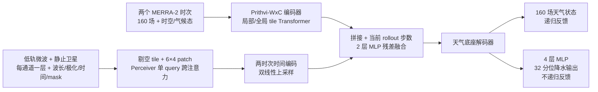

# Prithvi-Precip：卫星观测如何接入天气基础模型，以及它目前没有证明什么

> Simon Pfreundschuh、Christian D. Kummerow、Johannes Schmude、Sujit Roy、Rahul Ramachandran、Tsengdar Lee、Valentine Anantharaj、Katherine H. Breen，*Prithvi-Precip: Integrating Satellite Observations into an Atmospheric AI Foundation Model for Precipitation Forecasting*，[arXiv:2608.03959v1](https://arxiv.org/abs/2608.03959)，**2026-08-04** 首发；[全文 HTML](https://arxiv.org/html/2608.03959v1)｜[31 页 PDF](https://arxiv.org/pdf/2608.03959v1)｜[作者代码](https://github.com/simonpf/prithvi_precip)。阅读日期：2026-09-24。**证据等级：预印本全文与原图，未据此宣称已同行评审。**

## 1. 核心问题与时效定位

气象基础模型通常在再分析资料上学降水，然而再分析降水并非直接观测量；只在同源再分析真值上获胜，并不足以说明对真实降水的预报改善。作者以 Prithvi-WxC 为底座，分开研究两个干预：把降水监督从 MERRA-2 换成卫星融合的 **IMERG V07**；把原始卫星亮温/可见光观测作为初值旁路直接送入网络。论文同时比较递归滚动与指定 lead 一次预测、小/大底座、再分析单输入/卫星单输入/两者融合，并用独立雷达与雨量站检验泛化。[原文 §1–3](https://arxiv.org/html/2608.03959v1)

实际产品为**每 6 小时输出一次、最长 96 小时（4 天）**的全球降水预测。作者称其对“中期”有启发，但本文**没有 10–15 天验证**；放在中期目录仅作为卫星观测接入日尺度预报的前段方法，不应在 10–15 天技巧统计中计数。它也不是完全“无需再分析”的主结果：最强主配置仍使用 **MERRA-2 大气初值 + 原始卫星观测**；仅观测模式虽可运行，12 小时后明显变弱。[§1、§2.4、§3.2](https://arxiv.org/html/2608.03959v1)

## 2. 数据：输入、监督、独立验证不是一回事

| 角色 | 资料及论文可核验的处理 | 阅读时不能混淆的地方 |
|---|---|---|
| 大气状态输入 | 两个时次的 MERRA-2：20 个单层变量、10 个垂直变量 × 14 层，共 **160 个动态场**；还输入目标 lead、目标时刻气候态、经纬位置与两个输入时次的间隔。底座在 MERRA-2 上做掩码的现在/未来状态预训练。 | 这是卫星增强的**再分析初始化**，不是 GraphDOP/FuXi Weather 那种主流程完全不经再分析初值的验证。[§2.1、§2.5](https://arxiv.org/html/2608.03959v1) |
| 降水训练监督 | 对照使用 MERRA-2 降水和 **IMERG V07 Final** 卫星融合降水；IMERG 原资料 30 分钟，陆地还含月尺度雨量计订正。论文将降水重采样至 MERRA-2 网格和 **3 小时累计**，不是把卫星亮温当降水标签。 | “卫星作为监督目标”与“卫星原始观测作为输入”是两项独立干预。IMERG 仍有反演误差，不是真实无误差降水。[§2.4–2.5.1、§2.5.5](https://arxiv.org/html/2608.03959v1) |
| 原始卫星输入 | GPM 星座低轨被动微波 **SSMI、SSMI/S、AMSU-B、MHS、ATMS、GMI** 的 L1C 相互定标亮温；静止卫星的 CPC Grid IR、GridSat-B1/GridSat-GOES，可见光/水汽/红外；近年 GOES 档案补充。原[表 1](https://arxiv.org/html/2608.03959v1)给出每仪器通道/覆盖年，如 ATMS 23.8/31.4/88.2/165.5 GHz 及多个 183 GHz 水汽通道、GOES 0.64–13.3 μm 六个通道。 | L1C 选取以降水云水/水汽相关通道为主，排除了传统温度探测通道；不同仪器并没有共同固定通道数。[§2.5.4、表 1](https://arxiv.org/html/2608.03959v1) |
| 真正独立的降水验证 | 美国本土 **MRMS**：NEXRAD 雷达与地面雨量计订正；巴西 **INMET**：524 个自动站、每小时雨量。两者都不是本模型的训练降水目标。 | MRMS 为区域网格连续场，站点为点观测；与 0.625°×0.5° 格点直接比较时代表性误差不同。[§2.5.2](https://arxiv.org/html/2608.03959v1) |
| 时间与业务对照 | **2000–2020** 训练；**2022** 做设计选择/独立年份试验；**2025-03 至 08** 的 00/12 UTC 起报比 GEOS-FP、业务试验版 AIFS。GEOS-FP 与 MERRA-2 同系、采用 3D-Var，AIFS 则从 IFS 分析初值起报。 | 这不是同初值公平的 AIFS 对照；AIFS 的初值/同化链更强。IMERG 同源验证天然有利于以 IMERG 训练的模型，需同时看 MRMS/INMET。[§2.5.3、§2.5.5、§3.3](https://arxiv.org/html/2608.03959v1) |

空间处理：论文 §2.5.5 将网格明确写为 **0.625° 经度 × 0.5° 纬度**，把 IMERG、MRMS 和基线预报降到该网格，IMERG/MRMS 从降水率聚合为 3 小时累计；单站与格点比较另有尺度差。需要审计的一处不一致是 §2.1 将经向/纬向分辨率写作约 **0.67°×0.5°**，与 §2.5.5 的 0.625° 不同；复现应以模型数据张量/代码网格为准，不能把两数当完全相同的精确值。[§2.1、§2.5.5](https://arxiv.org/html/2608.03959v1)

## 3. 模型结构：从异构、稀疏观测到固定潜表示

Prithvi-WxC 是编码器—解码器式 Transformer，局部 tile 内注意力与跨 tile 全局注意力交替，并平移 tile 以缓解边界伪影；预训练输出是相对气候态的 160 个大气场异常。新增的降水头是作用于**还未做标准差缩放和气候态回加的原始输出**上的逐像素 **4 层 MLP + GELU + LayerNorm**。网络同时输出完整大气状态和二维降水；递归时反馈**大气状态而非降水**。[§2.1–2.2、图 1/4](https://arxiv.org/html/2608.03959v1)

卫星路径的关键不是为每个仪器造一套 encoder，而是把**每个仪器通道**视作独立“观测层”，附上波长、极化、相对 3 小时窗口的观测时间以及有效像素 mask。原始观测按 Prithvi-WxC 的 tile 分块；空 tile 丢弃，非空 tile 用 **6×4 像素 patch** 压缩。每 tile 的变长观测层序列，通过类似 Perceiver 的**单个可学习 query 跨注意力**投到固定潜向量；两输入时次的观测再经时间编码及双线性上采样，与天气底座 token 对齐。随后逐 token 拼接卫星和已编码大气状态及当前展开步数，用 **2 层 MLP** 生成**残差修正**并加回大气潜状态。[§2.3、图 2–4](https://arxiv.org/html/2608.03959v1)

上图依据原文**图 1–4**重绘，非论文原图复制。作者称大底座 **27 亿**、小底座 **2.8 亿**参数；但被引用的 [2024 Prithvi-WxC 原论文摘要](https://arxiv.org/abs/2409.13598)称公开大版为 **23 亿**。两篇公开文字的参数口径不一致，当前无法从这两篇论文判断是检查点、计数范围还是笔误；本笔记**不把二者擅自等同**。本文最终采用的是 2.8 亿小版，不是 27 亿版。[§2.1、§3.1.3](https://arxiv.org/html/2608.03959v1)

## 4. 训练和微调：原文给出的参数及未给出的参数

1. **底座预训练**：复用已经在 MERRA-2 上训练的 Prithvi-WxC 权重，本文不重新从零训练天气基础模型。大版还经过额外自回归 rollout 训练，小版没有同等的 rollout 适配；因此大/小版比较也混合了预训练史差异。原始底座的掩码重建/未来预测目标来自[原模型论文](https://arxiv.org/abs/2409.13598)，不能把本文的降水微调损失倒称为原模型预训练损失。[§2.1](https://arxiv.org/html/2608.03959v1)
2. **纯再分析输入的降水微调**：预测每格点降水分布的 **32 个分位数**，用**分位数损失**，优化器为 **AdamW**；训练目标**只计预测降水损失**，不另用 160 场天气状态的回归损失。自回归配置展开 **6×6 小时=36 小时**再训练，但推理继续滚到 96 小时；每 epoch 抽取 2000–2020 可用输入时次的 **10%**。共 **100 epochs**，前 **5 epochs** 线性 warmup 至 **5×10⁻⁴**，然后余弦退火，在第 **13、26、52** epoch 重新启动。降水目标分别用 MERRA-2/IMERG 做配对消融。[§2.4、§3.1](https://arxiv.org/html/2608.03959v1)
3. **直接指定 lead 的对照**：直接预测**最长 96 小时**而非训练多步展开；每 epoch 对数据按 **1/2** 子采样。为缓解超过 48 小时先过拟合，训练加入随机**纬向（东西向）滚动、经向（南北向）翻转**及输入缩放；翻转时相应改变经向风符号，经纬字段在与 tile 尺寸匹配的翻转/滚动中维持不变。它的计算较省，却在图 5 多数误差/相关/CRPS 上弱于自回归方案。[§2.4、图 5](https://arxiv.org/html/2608.03959v1)
4. **观测融合二次微调**：先完成上一阶段“仅再分析”权重，再加卫星 encoder，共享权重从该检查点初始化，重复训练；**大气编码输入与卫星编码输入分别以 20% 概率随机丢弃**，观测层另按 **20%** dropout。每个 3 小时窗口随机选 **48 层**，原文称两输入时次合计 **192 层**；没有详述这个合计的四窗口构造，不应自行改算为 96。这样单模型支持两种输入均在、单种缺失及部分缺测，但不意味着卫星单独模式能保持长期技巧。[§2.4](https://arxiv.org/html/2608.03959v1)
5. **容量消融**：大版由于显存/算力限制只训练 **4 个**递归 6 小时步，改为 **150 epochs**；小版是 6 步/100 epochs。图 7 小版在全部所测时效的 NRMSE、相关与 CRPS 更好，作者推断大版未训充分；这是**训练预算不同的容量比较**，不能得出“大模型结构先天更差”。[§3.1.3、图 7](https://arxiv.org/html/2608.03959v1)

本文没有在文字方法中完整给出 batch size、AdamW β/weight decay、梯度裁剪、32 个分位点的精确位置及新增卫星 encoder 的逐层宽度/头数；这些需要对照[作者代码](https://github.com/simonpf/prithvi_precip)和实验配置，而不能借用其他 Prithvi-WxC 应用的设置。也没有一项独立实验仅改变“冻结底座还是全量微调”作因果对照；这里的“微调”是从现成底座检查点继续优化，具体逐层可训练范围应再以代码核验。[§2.4、数据开放声明](https://arxiv.org/html/2608.03959v1)

## 5. 图表内容和性能：按验证资料分层阅读

原图均见[论文 PDF](https://arxiv.org/pdf/2608.03959v1)。下表记录**原文文字与图形能够可靠支持的趋势/时效**，没有从细线图反推伪精确小数；图 5–9 的设计消融主要是 2022 年资料，图 11–13 是 2025-03 至 08 的业务对照，样本不可混在同一排行榜。[§2.5.5、§3](https://arxiv.org/html/2608.03959v1)

| 原图 | 具体比较/度量 | 可核验结果与不利结果 |
|---|---|---|
| 图 5 | MERRA-2 降水目标；direct lead vs 6 步 rollout；偏差、NRMSE、相关、CRPS | rollout 在 NRMSE/相关/CRPS 的整个评估范围较好；到约 **36h** 之前偏差近零，此后转为低估；direct 在短时效正偏较大，随后缩小。不能说 rollout 的 bias 全时效都更好。[§3.1.1](https://arxiv.org/html/2608.03959v1) |
| 图 6 | MERRA-2 vs IMERG 目标，在两种同源参考及**独立 MRMS**上交叉验证 | 两模型对各自训练目标最“好”；MERRA-2 模型同源分数较高，却在独立 MRMS 的所有报告指标/时效输给 IMERG 目标模型。约 30h 后两种同源技巧差距缩小。关键发现是**标签质量与验证源会改变排名**。[§3.1.2](https://arxiv.org/html/2608.03959v1) |
| 图 7 | 2.8 亿/27 亿底座，IMERG 目标 | 小版在所有评估 lead 的三类主要技巧更好；大版只可承受 4 步展开，不能把结果归因于“参数越多越差”。[§3.1.3](https://arxiv.org/html/2608.03959v1) |
| 图 8 | 同一经 dropout 训练的模型，推理时保留再分析、卫星、或两者 | 融合在 NRMSE、相关、CRPS 上有稳健增益，主要在**约 40h 以内**；卫星单输入 6h 尚强，**12h 后就落后于仅再分析**。该结果最直接限制“观测直达四天预报”的宣传。[§3.2](https://arxiv.org/html/2608.03959v1) |
| 图 9–10 | 单类传感器消融与 12/36/48h 区域增益图 | MHS/ATMS/SSMI/S 被动微波和单通道 IR 有相近正收益，局地增益集中热带/副热带；仅 GMI 输入有轻微负收益至约 60h，之后微正，**但删除 GMI 的否定试验并未改善总体预报**。GOES 多光谱区域覆盖有限。此处为作者机制解释，不是独立证明哪一通道因果最重要。[§3.2](https://arxiv.org/html/2608.03959v1) |
| 图 11：IMERG 全球 | 融合/单输入 vs GEOS-FP/AIFS；同源卫星融合目标 | 融合优于 AIFS **约至 40h**，之后落后；再分析单输入 **24h 后**落后；仅卫星只在 **6h** 比 AIFS 好，**12h** 已落后。全部 Prithvi 版本在报告窗口胜 GEOS-FP；但 IMERG 是本模型训练标签，评分并非完全独立。[§3.3.1](https://arxiv.org/html/2608.03959v1) |
| 图 12：MRMS 美国本土 | 独立、雨量计订正雷达 | 融合对 AIFS 只在**约 18h 内略占优**、约到 **36h** 相近；卫星额外增益本区很小。作者推测 CONUS 观测本已充分进入 MERRA-2 初值；这只是解释假设，非同化覆盖消融的证明。[§3.3.2](https://arxiv.org/html/2608.03959v1) |
| 图 13：巴西 INMET | **524 站每小时点观测**；热带/副热带 | 卫星融合比 CONUS 的相对增益更大，**6/12h** 对 AIFS 略有利，**超过 40h** 又落后。曲线随起报时刻/日变化强烈振荡，且点雨量与粗网格代表性不同；不应只挑一个峰谷作百分比成绩。[§3.3.3](https://arxiv.org/html/2608.03959v1) |

评价包含相对 bias、归一化 RMSE、相关系数与概率 **CRPS**。32 个分位数允许估计降水预测分布，但论文不是用“32 个独立天气集合成员”计算 CRPS；分位数输出与天气集合不等价。图 11–13 将 GEOS-FP/AIFS 插值至同网格、仅用 00/12 UTC 起报，降低空间口径差异，却不能抹掉分析初值和数据同源性差异。[§2.4–2.5、§3.3](https://arxiv.org/html/2608.03959v1)

## 6. 我的判断、边界与复现清单

贡献可拆为三层：一是“用更接近独立观测的降水标签”比“同源再分析分数”更能改善真实泛化；二是把**变长、异构、缺测的卫星通道**压缩为可与基础模型 token 融合的统一观测表示；三是通过输入 dropout 允许再分析/卫星不齐全时继续出报。最有力证据是 IMERG 训练模型对独立 MRMS 的提升，以及融合在短时效/热带区域的增益；但**独立资料上的优势没有延伸到 4 天对 AIFS 的全面超越，更没有 10–15 天试验**。所以它是“卫星观测改善中期前段天气基础模型”的研究线索，不是已经解决卫星直达十天预报的系统。[§3–4](https://arxiv.org/html/2608.03959v1)

复现应逐项检查：① 固定 v1、底座小/大权重及 23 亿/27 亿参数差异；② 核对经度网格究竟 0.625° 还是文中粗写 0.67°；③ MERRA-2 两时次/160 字段、IMERG Final 陆地月雨量计订正、3h 累计与 6h 输出之间的对齐/信息泄漏；④ 逐传感器 L1C 通道、相对观测时间、空 tile 丢弃与 mask；⑤ 32 分位数/quantile loss、6 步 36h 训练和 96h 外推的 bias 演变；⑥ 20% 双分支 dropout 与观测层 dropout，分别验证三种输入；⑦ 2022 消融与 2025 业务对照分开重跑，至少同时报告 IMERG、独立 MRMS 与巴西站点，以及 AIFS 初值不一致。公开[代码仓库](https://github.com/simonpf/prithvi_precip)可作配置核验入口，但本笔记没有把未亲自核验的代码默认值写成论文事实。[原文数据可用性声明与 §2–4](https://arxiv.org/html/2608.03959v1)

[返回首页](../../README.md) · [返回总表](../../气象大模型_中期预报论文追踪.md)
