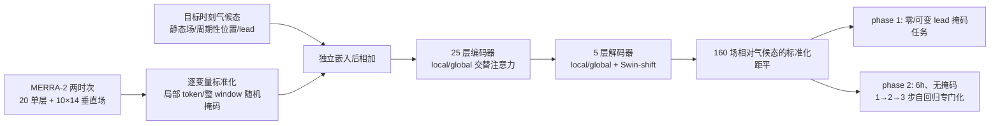

# Prithvi WxC：掩码重建与变时效预报联合预训练的天气/气候基础模型

> Johannes Schmude、Sujit Roy、Will Trojak、Johannes Jakubik、Daniel Salles Civitarese、Shraddha Singh 等 29 人，*Prithvi WxC: Foundation Model for Weather and Climate*，[arXiv:2409.13598v1](https://arxiv.org/abs/2409.13598)，**2024-09-20** 首发；[全文 HTML](https://arxiv.org/html/2409.13598v1)｜[原文 PDF](https://arxiv.org/pdf/2409.13598v1)｜[NASA-IMPACT 代码](https://github.com/NASA-IMPACT/Prithvi-WxC)｜[公开检查点](https://huggingface.co/Prithvi-WxC)。阅读日期：2026-09-24。**证据等级：原始预印本，按 v1 核验；不是 2026 年 Prithvi-Precip 降水微调论文。**

## 1. 问题、贡献和预报时效

单一目标训练的天气预报器往往只适于规则网格上的指定 lead；同一权重若要处理掩码重建、短期预报、区域降尺度与气候次网格参数化，需要能适应不同输入字段、密度和空间范围。Prithvi WxC 用 MERRA-2 的 **160 个动态场**构建 **23 亿参数**编码器—解码器，在预训练中把**随机 50% 掩码重建、零/多 lead 预测、气候态距平标准化**融为一个目标，然后继续对预报版做更专门的自回归微调。公开权重和下游例子显示了跨任务迁移，但不是“同一未改权重一键解决所有任务”：降尺度和重力波任务需要新的输入/输出层及任务训练。[§1–3](https://arxiv.org/html/2409.13598v1)

本文唯一的全球天气滚动评测为 **最长 5 天**；模型虽被定位为中期天气基础模型，原文**未证明 10–15 天预报技巧**。本文 5 天图中前 6/12h 很强，但作者明确称约 **66h 之后落后于 Pangu**；故列在中期目录只是基础模型和日尺度前段的过渡研究，不计入 10–15 天胜率。2026 年[Prithvi-Precip](57-prithvi-precip.md)在此底座上新增卫星和降水任务，必须分篇阅读。[§2.5.2、图 4](https://arxiv.org/html/2409.13598v1)

## 2. 原始数据、字段与预处理

| 项目 | v1 原文给出的设置 | 复现/比较注意 |
|---|---|---|
| 主训练资料 | NASA **MERRA-2**，规则经纬网约 **0.5°×0.625°**，3h 主采样；**1980–2019** 训练，各下游任务视情况用 2020–2023 中一年验证。每样本两输入时次，空间张量 **360×576**。[§2.2.1、§2.3.2](https://arxiv.org/html/2409.13598v1) | 原文有一句对 MERRA-2 “cubed-sphere grid”的一般描述，但实际模型输入写明是规则经纬网 360×576；实施以实际再网格化张量为准，不能把它误写成模型原生球面立方网格。 |
| 20 个单层动态量 | `U10,V10,T2M,QV2M,PS,SLP,TS,TQI,TQL,TQV,GWETROOT,LAI,EFLUX,HFLUX,Z0M,LWGEM,LWGAB,LWTUP,SWGNT,SWTNT`；包括近地风温湿、气压、柱云/水汽、土壤与辐射。[附表 2](https://arxiv.org/html/2409.13598v1) | 陆面/辐射等源产品可为 1h 时均，不能全写成“原始三小时瞬时分析”。用于 12 UTC 的某些 1h 量由相邻 11:30/12:30 值平均；`GWETROOT` 海上 NaN 填 **1**、`LAI` 填 **0**。[§2.2.1](https://arxiv.org/html/2409.13598v1) |
| 10 个垂直动态量 × 14 层 | `U,V,OMEGA,T,QV,PL,H,CLOUD,QI,QL`；14 个名义压层为 **985、970、925、850、700、600、525、412、288、245、208、150、109、48 hPa**，即 140 场。和单层合计 **160 场**。[附表 3](https://arxiv.org/html/2409.13598v1) | `QI/QL` 高层极小值造成归一化不稳定；垂直 H 是中层高度，不能不经单位换算当位势本身。 |
| 静态/时间字段 | `PHIS,FRLAND,FROCEAN,FRACI` 四个空间静态量，另有年内日和日内小时正弦/余弦、周期性空间 Fourier 位置编码，以及可学习目标 lead 与两输入间隔嵌入。静态场按月文件保存，但字段本身不随月变。[§2.2.1、§2.3.2、附表 4](https://arxiv.org/html/2409.13598v1) | 原文 §2.3.2 在释义上把后几项称 elevation/land/ice/lake，和附表 4 的 `FROCEAN`（海洋份额）不完全一致；字段表比口头释义更可核查。 |
| 气候态与标准化 | **1980–2019** 中取 **20 年**构造年内日 × 3h 时次气候态，逐 Julian day/小时跨年汇总，再以 **61 日、二次多项式权重**滑动平均；得到 **365×8** 时次，每像素理论由 20×61=1220 样本合成。输入用逐变量时空均值 `μ`、标准差 `σ`；输出是相对目标时刻气候态 `C` 的距平，再按距平标准差 `σ_C` 缩放。[§2.1–2.2.3](https://arxiv.org/html/2409.13598v1) | 论文称“20 年”与“1980–2019”并列，后者实际跨 40 个日历年；**具体取哪 20 年并未在这一段说明清楚**，要查生成脚本。数值夹紧为 `10⁻⁴≤σ≤10⁴`、`10⁻⁷≤σ_C≤10⁷`，主要保护高层 `QI/QL`。[§2.2.2–2.2.3](https://arxiv.org/html/2409.13598v1) |

输入是两时次 **320×360×576** 的扁平动态数据，加 160 场目标气候态和静态场；预训练时输入时距在 **3/6/9/12h** 中取样，目标 lead 在 **0/6/12/24h** 中取样。这里“输入维 320”是 **2×160 个字段**，不是网络 transformer 的隐藏宽度。模型在 2024 论文中**没有直接喂卫星原始亮温**；2026 降水工作的卫星 encoder 不能倒填为原始底座架构。[§2.1、§2.3.2、§2.4](https://arxiv.org/html/2409.13598v1)

## 3. 模型与预训练目标：公式的含义

其主任务可写为 `[(预测 X(t+lead) − 目标时刻气候态 C)/σ_C] = fθ(掩码后的标准化双时次 X；标准化目标气候态；静态场；lead；输入间隔)`。**50% 掩码**不是只隐藏气候态，也不是对所有 3D 气象 cube 做体素重建；作者在二维空间 token 上随机隐藏局部 token 或整个全局 window，保留预测目标时刻的可变 lead，使 lead=0 的重建与 lead>0 的天气预报共享权重。用气候态距平而非当前状态 tendency，可以使**零 lead 不是零输出的平凡任务**。[§2.1 公式 1–2](https://arxiv.org/html/2409.13598v1)

主干只依赖注意力：tile/window 内 token 自注意力与相同 token 位置跨 window 的自注意力交替，分别称 **local/global**，通过交换张量 window/token 轴实现；掩码可作用于单个 token 或整 window。编码器 **25 blocks（13 local、12 global）**，解码器 **5 blocks（3 local、2 global）**；隐藏维 **2560**、**16 heads**、MLP 扩张倍数 **4**，token **2×2 像素**，window **30×32 像素/15×16 tokens**，每样本约 **51,840 tokens**。解码器因输入重新变稠密而加入 Swin-shift；输入/输出投影分别处理动态与气候/静态字段。[§2.3–2.4.1、图 1](https://arxiv.org/html/2409.13598v1)

上图依据原文**图 1 与 §2.1–2.4**自行重绘，展示两阶段权重关系，不转载原图。作者称此 v1 公开底座 **23 亿**参数；2026 的[Prithvi-Precip 论文](57-prithvi-precip.md)却称大版 **27 亿**，但实际降水主结果用了 **2.8 亿**小版。应按各自论文/检查点记录，不自行解释为一个同规格模型。[2024 §2.4.1](https://arxiv.org/html/2409.13598v1)｜[2026 §2.1](https://arxiv.org/html/2608.03959v1)

## 4. 两阶段训练与下游微调：哪些参数真的公开

| 阶段/任务 | 初始化、训练资料和可核验设置 | 产物/未披露项 |
|---|---|---|
| Phase 1 通用预训练 | 从随机权重训练；**64×A100、论文写 batch size 1、100,000 梯度步**（batch 是全局还是每设备口径需查代码）；**5% drop-path**、**50% mask**，局部/全局掩码逐步交替；目标 lead `0/6/12/24h`，输入间隔 `-3/-6/-9/-12h` 随机选。**2,500 步**线性 warmup，余弦 LR 从 **1e-4** 降至 **1e-5**。[§2.4.2](https://arxiv.org/html/2409.13598v1) | 用于掩码重建、降尺度、重力波通量例子。FSDP、flash attention、activation checkpoint；Transformer 用 **bf16**，输入/输出层用 **fp32**；预训练显存**每样本略超 43 GB**。原文未在该段给完整 optimizer β、weight decay 或总 wall-clock。[§2.4.1](https://arxiv.org/html/2409.13598v1) |
| Phase 2 预报专门化 | 从 Phase 1 继续，mask→**0%**、drop-path→**0**，encoder 也加入 Swin-shift；固定目标 lead 和输入间隔均为 **6h**；LR **1e-5 常数**，使用 **1/2/3 步**自回归训练，GPU 规模 **16–48**。[§2.4.2](https://arxiv.org/html/2409.13598v1) | 供 5 天滚动和飓风试验。因 0% mask 后显存增加，80GB A100 可反传约 **3 步**（50% mask 可 4 步）；**没有公开 Phase 2 的确切总更新步数/逐阶段 batch 与耗时**。[§2.4.1–2.4.2](https://arxiv.org/html/2409.13598v1) |
| Phase 2 字段加权 | 垂直字段随压层压力线性加权；`H,OMEGA,T,U,V` 权 1，云、`PL,QI,QL` 权 0.1；单层 `U10/V10` 权 1，`SLP/T2M` 权 0.1，其余 0.01。[§2.4.2](https://arxiv.org/html/2409.13598v1) | 若直接用 Phase 1 权重评分 5 天，不等于论文图 4 的已 rollout 调优权重；作者虽称 zero-shot forecast，但自己承认已有专门化阶段。[§2.5.2](https://arxiv.org/html/2409.13598v1) |
| 下游降尺度/重力波 | 这些不是“从零再训练 23 亿参数”：通常**冻结 transformer 核心**，替换新输入/输出嵌入及上/下采样、卷积层。MERRA-2 降尺度保持原输入字段；CORDEX 换数据/字段/时空分辨率；重力波保持 `lead=0`。[§3](https://arxiv.org/html/2409.13598v1) | 每个新任务有自己的 trainable 模块。论文**未给所有下游任务统一适用的 optimizer/LR/epoch 表**，不能把 Phase 1 的 LR 冒充下游微调设置。 |

## 5. 下游数据加工与图表性能：按任务、真值分开

| 原文图表 | 具体协议与能得出的结论 | 必须保留的限制 |
|---|---|---|
| **图 2–3：重建** | 以 **95% 局部 token**或 **75% 整 window**高比例遮蔽展示仍可恢复大尺度形态；图 3 横向扫描 50–99% mask，用 RMSE 比 0h 与 6h，低掩码时 lead 差影响较小。[§2.5.1](https://arxiv.org/html/2409.13598v1) | 6h 重建曲线**未用 Phase 2 rollout 权重**；极高遮蔽下细结构流失，不能说只看 5% 输入就能无损重建。[图 2/3](https://arxiv.org/html/2409.13598v1) |
| **图 4：全球预报** | 稠密输入、Phase 2 权重自回归**至 5 天**；6/12h 对近地温度等强，**约 66h 后落后 Pangu**。[§2.5.2](https://arxiv.org/html/2409.13598v1) | WxC 的 MERRA-2 0.5°×0.625° 资料与 WeatherBench2 的 ERA5/IFS 分析 0.25° 参考不一致，变量覆盖也不同；不能用图 4 声称与所有对照完全同真值同网格，或外推为 10 天胜出。 |
| **图 5：Ida 2021 个例** | 2021-08-27 00 UTC 起报，与 HURDAT 对照；轨迹平均误差 WxC **63.9 km**、MERRA-FourCastNet **201.9 km**、ERA5-FourCastNet **262.3 km**；论文称上岸位置误差 WxC <5 km。[§2.5.3](https://arxiv.org/html/2409.13598v1) | 这是**单个风暴个例**，且比较模型用不同再分析训练资料；不能拿 63.9 km 当全体风暴均误差。 |
| **图 6/附表 6：多风暴** | 2017–2023 大西洋 C3–C5 飓风、表 6 列 **75 个起报条件**，HURDAT 路径；到第 5 天 WxC 的平均路径误差比两个 FourCastNet 版约少 **200 km**。但中心气压/10m 风强度虽优于 MERRA 版，**略逊于 ERA5 版**。[§2.5.3](https://arxiv.org/html/2409.13598v1) | 预训练期是 **1980–2019**，评测**包含 2017–2019 个例**，并非所有飓风都时间外；这与严格封存 2020–2023 的检验不同。作者未提供只选训练期后风暴的对照表。 |
| **图 7–8/表 1：MERRA-2 六倍降尺度** | 2m 温度从 **361×576→60×96**，先 3×3 平滑；进入冻结 WxC 前 2 倍放大成 120×192，token patch 1，出 backbone 后再 3 倍还原。2021-01-01 至 12-30 共 **2,912** 样本，空间 RMSE：最近邻 **3.22 K**、双线性 **3.08 K**、WxC **0.73 K**；时间 RMSE **2.46/2.34/0.64 K**，时间相关 **0.89/0.90/0.98**。图 8 的单时次 RMSE **0.76 K**、bias **0.02 K**，频谱更接近真值。[§3.1.1–3.1.2、表 1](https://arxiv.org/html/2409.13598v1) | 这是**人工粗化同一 MERRA-2 真值**的 perfect-model 实验，不能直接代表真实观测小尺度恢复。 |
| **图 9/表 1：EURO-CORDEX 十二倍降尺度** | EUR-11、CNRM-ALADIN63、日均近地温 `tas`，**444×444→37×37** 粗化/平滑→前置 3 倍上采样到 111×111→后置两次 2 倍回原网格；RCP8.5 的 2006–2100 训练，RCP4.5 的 **2096–2100/1,829** 样本测试。空间 RMSE 最近邻 **1.89 K**、双线性 **1.47 K**、WxC **0.44 K**；时间 RMSE **1.14/0.90/0.37 K**。图 9 单时次 RMSE **0.51 K**、bias **0.06 K**。[§3.1.3、表 1](https://arxiv.org/html/2409.13598v1) | 这是**情景外** RCP4.5，并非同时间段/同 RCM 完全独立的实测天气；时间相关三者都约 0.99–1.00，不能将其单独作为巨大改进。 |
| **图 10–11：重力波参数化** | ERA5 **4 年、1h、约 30 km、137 垂直层**；去掉 >45 km 的顶端 15 层，余 **122 层**。`u,v,T,p` 及位置/地形为输入，Helmholtz 分解得 `(u′ω′,v′ω′)` 等监督；输入/输出保守粗化至 **64×128、约 300 km**。冻结 WxC 编码/解码器，新接前后各 **4 个卷积块**（前部 `C,2C,4C,8C`，`C=160`），`lead=0`；输入 `[1,488,64,128]`，输出 `[366,64,128]`。图 11 的 2015-05 上对流层月均通量分布吻合，文中 Andes/Southern Ocean 相关分别 **0.99/0.97**。[§3.2、图 10/11](https://arxiv.org/html/2409.13598v1) | 这里是**参数化瞬时通量**，非 10 天预报分数；原文没有详列四年分割、逐实验样本数和逐地区完整数值表，不能把两处高相关推广为所有气候区。 |

## 6. 判读：有效的基础模型能力与未被证明的能力

最有说服力的是一套公开的“掩码 + 变 lead + 气候态距平”预训练机制，及同一冻结核心在 MERRA-2、CORDEX、ERA5 三类不同下游任务上的可用性。它明确展示“天气基础模型”不是只换一个输出头：常要重新做输入字段匹配、尺度适配、卷积增强与任务训练。Phase 2 的自回归专门化也表明预训练重建能力并不能自动保证较长滚动稳定。[§2–3](https://arxiv.org/html/2409.13598v1)

但量化结论必须按目标拆开：气象滚动止于 5 天且约 66h 后对 Pangu 不利；飓风轨迹 2017–2019 与预训练期重叠；降尺度是人为粗化的 perfect-model 设置；重力波结果主要是瞬时通量，尚不是耦合气候模式长期改进证明。2026 [Prithvi-Precip](57-prithvi-precip.md)虽补入卫星输入与降水目标，也只验证到 96h，且其文中“27 亿大版”与此处“23 亿”数目不同。研究路线相关，不意味着同一权重已经实现卫星直接驱动的 10–15 天业务预报。[图 4–11](https://arxiv.org/html/2409.13598v1)

复验次序：固定 arXiv v1 与公开检查点的参数数目；核验 MERRA-2 规则经纬网、20+140 字段及海上缺测填值；核验气候态到底是哪 **20 年**并保留 61 日平滑与 `σ/σ_C` 裁剪；分开加载 Phase 1 与 Phase 2 权重；逐阶段确认 mask/drop-path/lead/LR/字段损失权重；5 天预报统一真值与网格；飓风另做训练期后样本分析；降尺度保留先粗化再平滑的 perfect-model 协议；重力波独立记录 122 层通量构造与冻结/可训练模块。论文没有给出的优化器细节或下游 LR，需从[作者仓库](https://github.com/NASA-IMPACT/Prithvi-WxC)和检查点配置核实，不应填造。[原文 §2–3 与附表](https://arxiv.org/html/2409.13598v1)

[返回首页](../../README.md) · [返回总表](../../气象大模型_中期预报论文追踪.md)
