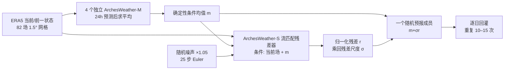

# ArchesWeather / ArchesWeatherGen：确定性均值与流匹配残差的中期集合预报

> Guillaume Couairon、Renu Singh、Anastase Charantonis、Christian Lessig、Claire Monteleoni，*ArchesWeather & ArchesWeatherGen: a deterministic and generative model for efficient ML weather forecasting*，[arXiv:2412.12971v1](https://arxiv.org/abs/2412.12971)，**2024-12-17**；[全文 HTML](https://arxiv.org/html/2412.12971v1)｜[作者代码与模型](https://github.com/INRIA/geoarches)。阅读日期：2026-09-24。**证据等级：按原始预印本 v1 全文、表 1–2、图 1–17 与附录 A–C 核验；非独立的两篇论文。**

## 1. 核心问题、论文贡献与适用边界

确定性网络以均方误差（MSE）学习 24 小时后的场时，最优预测趋向条件均值，局部极端和空间高频被平滑；把其单次输出当作真实天气轨迹继续递推，平滑会累积。本文一方面改造 Pangu 风格的 3D Swin U-Net，形成 ArchesWeather；另一方面利用四个独立 ArchesWeather-M 的平均作为条件均值近似，再以流匹配模型学习「ERA5 下一步真值减去均值」的**归一化残差**，形成 ArchesWeatherGen。这样确定性部分负责易学的大尺度均值，生成部分负责条件不确定性和小尺度变化，而不是让生成器从纯噪声重建完整大气状态。[摘要、§1、§3.2–3.3](https://arxiv.org/html/2412.12971v1)

两套模型以 **24h** 为单步，在 **1.5°** ERA5 场上自回归。摘要明确称可生成 **15 天轨迹**、单成员约 **1 分钟/A100**；但是表 1 为 24h，正文图 5–13 的主要确定性和概率**定量曲线只到第 10 天**。因此它是直接关联中期集合预报的论文，但不能把「15 天生成能力」写成「第 15 天优于 IFS ENS 已量化证明」。本文也没有直接和 GenCast 做实测比较，作者解释写作时缺少其可评估输出。[摘要、§2、图 5–13](https://arxiv.org/html/2412.12971v1)

## 2. 数据、时间切分与预处理

| 环节 | 原文设置 | 复核重点 |
|---|---|---|
| 原始资料/输入目标 | ERA5 6h 序列下采样到 **1.5°** 经纬网；每个状态有 6 个高空量 `T、Z、Q、U、V、W` × **13 气压层**，另有 `T2m、MSLP、U10、V10` 四个地表量，合计 **82 场**。训练映射为 `x(t) → x(t+24h)`；6h 是资料原始采样间隔，**不是此模型的时间步长**。[§3](https://arxiv.org/html/2412.12971v1) | v1 只写 13 层数量、未在正文或附录逐一列压力值；不能擅自补成另一模型的 13 层清单。`W` 是垂直运动分量，不应与 10m 风速混淆。 |
| 分割 | **1979–2018** 训练确定性模型及生成器第一阶段；**2007–2018** 是确定性 RPFT 的近年子集；**2019** 只用于残差生成器的 OOD 微调；**2020 每日 00/12 UTC** 为测试起报。[§3、§3.2–3.3](https://arxiv.org/html/2412.12971v1) | 文中称采用标准超参数而**不设验证集**。2019 虽在确定性模型之外，但已被生成模型看过，不应再称完全封存测试集。 |
| 归一化 | 输入按每个变量/气压层分别用 **1979–2018 训练集均值与标准差**作零均值单位方差标准化。残差 `r=[x(t+24h)-f(x(t))]/σ` 再按残差标准差归一化。[附录 A.1、§3.3](https://arxiv.org/html/2412.12971v1) | `σ` 是残差尺度，不是直接给原始状态加固定物理量噪声；文中未完整披露下采样插值核、缺测值处理与精确压力层表，复现需查代码。 |
| 训练损失与气候态 | 确定性与生成残差损失使用纬度面积权重；高空变量权重随空气密度，地表 `T2m=1`、MSLP/`U10`/`V10=0.1`。极端 Brier 阈值取 **1990–2018 气候态**的 `<1%`/`>99%` 分位。[§3.2、§3.4、附录 A.1](https://arxiv.org/html/2412.12971v1) | 气候态只用于**极端阈值评分**，不要误写成网络的额外气候态输入。地表均方损失权重与不同变量评分单位不是一回事。 |

原文称 1.5° 数据获取约 **1 TB**，相比 0.25° 少约 36 倍。这说明低分辨率使大学研究组可复现，但会让小尺度及局地极端的真实性成为独立问题。所有概率比较还需特别注意真值差异：本文 ML 模型对 **ERA5** 验证，IFS HRES/ENS 根据 WeatherBench2 对各自**IFS 分析**验证，并非所有系统在相同真值上逐像素公平竞赛。[§1、§3.4、附录 A.2](https://arxiv.org/html/2412.12971v1)

## 3. 模型结构与完整推理链

### 3.1 确定性 ArchesWeather

主干继承 Pangu 式三维 Swin U-Net，但不接受「竖向只看邻近两层」的限制。Pangu 的局部注意力窗是 `(Z,H,W)=(2,6,12)`；作者改为 **水平局部窗 `(1,6,12)` + 垂直整列 Cross-Level Attention（CLA）**。同一经纬度柱内的全部垂直特征可直接相互作用，不必逐层传递；CLA 参数量约 `O(d²)` 且不随层数 `Z` 二次增加，相比直接把所有垂直层拼进二维 embedding 的 `O(d²Z²)` 更省参数。作者又采用 **ICNR 初始化**末端反卷积缓解棋盘伪影、MLP **SwiGLU**、以 AdaLN 注入目标小时与月份。S 版 **16 层/4400 万参数**，M 版 **32 层/8400 万参数**。[§3.1、图 2](https://arxiv.org/html/2412.12971v1)

`ArchesWeather-Mx4` 是 **四个不同随机种子的 M 版独立训练后逐场平均**，目的为更稳定地近似条件均值。它不是通过四个随机残差产生的完整概率集合；若把 Mx4 的平滑平均误称为 ArchesWeatherGen 的四成员随机集合，就会误读图 6–8。作者的二维直接堆叠消融约 **8.5 亿参数**，即使远大于 M 版也未达到其技巧，支持「跨层信息交互方式」比单纯增参数更关键的解释，但不是所有二维 Transformer 必然较差的普遍定理。[§3.2、表 2、图 6–8](https://arxiv.org/html/2412.12971v1)

### 3.2 ArchesWeatherGen：条件均值 + 生成残差

设 `m=f(x_t)` 为四模型平均的 24h 确定性预测，训练残差为 `r=(x_{t+24h}-m)/σ_r`。流模型输入**当前/前一状态 `x_t、x_{t-24h}`、有噪残差 `(1-s)r+sε`、条件均值 `m`**，以加权去噪目标恢复 `r`；噪声混合参数 `s∈[0,1]`，噪声 `ε∼N(0,I)`，作者用 sigmoid-normal 抽样时刻，并沿用随信噪比变化的损失权重。原文式 2 明确给出两状态 Markov 近似，后续公式为简洁省略前一状态依赖。与 DDPM 基线的区别不是「有没有生成器」，而是**流匹配线性噪声路径 + 残差分解 + OOD 微调 + 噪声尺度校准**的组合。[§3.3，式 2–6](https://arxiv.org/html/2412.12971v1)

推理从高斯噪声出发，以 **25 步 Euler ODE**逐步得到残差，再乘回 `σ_r`、加到 `m` 上得到一个成员；将该成员作为次日输入继续 24h 滚动。生成残差主干沿用较小的 **ArchesWeather-S/4400 万参数**，因为每个未来日每个成员都要调用去噪网络 25 次。**不做初值扰动**；集合差异来自每步残差采样。2019 OOD 微调处理的是：确定性模型在 1979–2018 训练样本上误差偏小，其对应残差方差小于未见年份，直接学训练残差易使测试集合**欠离散**。推理时把初始噪声乘 **1.05**，而不是直接把生成的物理残差乘 1.05；后者在作者消融中损害 CRPS。[§3.3、图 12](https://arxiv.org/html/2412.12971v1)

上图依据原文**图 4、式 2/4–6 和训练/采样步骤**原创重绘；不转载论文原图。它把四确定性模型的平均与 25 步生成采样明确分开，便于核对真实推理成本。[§3.1–3.3](https://arxiv.org/html/2412.12971v1)

## 4. 训练、微调、超参数：哪些权重在哪些数据上更新

| 阶段 | 数据/初始化 | 优化与产物 |
|---|---|
| 确定性阶段 1 | 1979–2018 ERA5，S 与 M 从头训练，监督一步 `t→t+24h`。 | 纬度×变量加权 MSE，**250k steps**；每个模型单独随机种子。 |
| 确定性阶段 2，RPFT | 从上阶段权重继续，**2007–2018** 的较近期 ERA5。 | **50k steps**，降低早期再分析资料与近年资料的分布差异。M 版正文称 **2×A100 约 2.5 天**。 |
| 确定性阶段 3，可选自回归微调 | 从阶段 2 权重继续，回灌自身预测，沿整条轨迹累计 MSE 并反传。 | 标称 **20k steps**：2 天 rollout 8k、3 天 rollout 在 v1 正文写「**8 steps**」、4 天 4k。三个数若按字面合计只有 12,008，**与 20k 冲突**；疑是 3 天应为 8k，但未经勘误/代码确认，不替作者改写。**生成器默认使用未做此阶段的四模型平均**，因为这阶段虽能改善长时效确定性 RMSE，却损害下一步残差生成表现。[§3.2、图 13](https://arxiv.org/html/2412.12971v1) |
| 残差生成阶段 1 | 冻结/复用默认 Mx4 为条件均值，1979–2018 真值减去其输出，归一化后训练 S 版流匹配残差器。 | **200k steps**；本阶段不是重新训练四个 M 权重。 |
| 残差生成阶段 2，OOD 微调 | 从残差器权重继续，仅以确定性模型未训练过的 **2019 ERA5** 构造较大范数残差。 | **60k steps**；随后采样初始噪声按 **1.05** 放大。2019 是生成器训练的一部分，不是独立验证集。[§3.3、图 12](https://arxiv.org/html/2412.12971v1) |

**公共优化设置**见附录 A.1：所有模型 **AdamW、batch size 4、初始/峰值学习率 3×10⁻⁴、β=(0.9,0.98)、weight decay 0.05**；先 **5000 steps** 线性升温，再余弦衰减。文中没有按五个阶段分别给出不同 LR 表或每次重启 scheduler 的精确定义，不能随意填某一阶段额外学习率。论文的耗算口径存在另一个**文本矛盾**：摘要称 S 约 **9 V100-days**、最佳生成版约 **45 V100-days**；正文 §1 又写最佳生成版约 **23 V100-days**，而表 1 中 M=**18**、Mx4=**36** V100-days，§4.1 有「M 约 9」的叙述。应把这些视为不同实验/估计口径尚未解释清楚，而不是选最小数字宣传成本。附录 A.2 列换算比例 `1 A100=2 V100`，成本表不含数据下载及完整推理电耗。[摘要、§1、表 1、附录 A](https://arxiv.org/html/2412.12971v1)

## 5. 图表结果逐项复核

### 5.1 表 1：24h 确定性 RMSE 与训练成本

下表从原文表 1 **摘取有代表性的同列值**；单位 Z500 为 `m²/s²`、T850/T2m 为 K、Q700 为 g/kg、U850/U10 为 m/s；数值越低越好。不同分辨率、训练成本、IFS 真值来源并不一致，表只用于还原作者报告的对照。[表 1](https://arxiv.org/html/2412.12971v1)

| 系统 | 分辨率 | 训练成本 V100-days | Z500 | T850 | Q700 | U850 | T2m | U10 |
|---|---:|---:|---:|---:|---:|---:|---:|
| IFS HRES | — | — | 42.30 | 0.625 | 0.556 | 1.186 | 0.513 | 0.833 |
| GraphCast | 0.25° | 2688 | 39.78 | 0.519 | 0.474 | 1.000 | 0.511 | 0.655 |
| Stormer | 1.4° | 256 | 45.12 | 0.607 | 0.527 | **1.138** | 0.570 | **0.726** |
| ArchesWeather-S | 1.5° | 9 | 48.92 | 0.650 | 0.542 | 1.289 | 0.562 | 0.833 |
| ArchesWeather-M | 1.5° | 18 | 44.96 | 0.615 | 0.527 | 1.219 | 0.539 | 0.783 |
| ArchesWeather-Mx4 | 1.5° | 36 | 41.93 | 0.593 | 0.513 | 1.172 | 0.517 | 0.749 |

M 模型的 Z500 **44.96**、T2m **0.539**，对同表 IFS HRES **42.30/0.513** 并非全胜；四模型平均才把 Z500 降至 **41.93**。尽管 Mx4 的 U850 **1.172**优于 HRES **1.186**，却不如 Stormer **1.138**；10m 风亦相同。论文正文承认 Stormer 在多个风场 24h 更强。Mx4 的 `36` 是四模型训练预算估计，不能理解为概率模型总预算。[§4.1、表 1](https://arxiv.org/html/2412.12971v1)

### 5.2 表 2：CLA、RPFT、SwiGLU、集成的贡献

| 16/32 层对照（均 1.5°、24h） | Z500 RMSE | T2m RMSE | 相对 HRES 平均 RMSE skill |
|---|---:|---:|---:|
| Pangu-S 重训 | 66.7 | 0.840 | −30.6% |
| S 基础改良，不含 CLA | 55.1 | 0.594 | −17.1% |
| S + CLA | 50.6 | 0.567 | −9.7% |
| S + CLA + RPFT | 49.3 | 0.566 | −8.6% |
| S 完整版 + SwiGLU | 48.92 | 0.562 | −5.2% |
| Pangu-M 重训 | 58.7 | 0.780 | −20.4% |
| M 基础改良，不含 CLA | 51.8 | 0.572 | −11.6% |
| M + CLA | 48.7 | 0.552 | −5.6% |
| M + CLA + RPFT | 48.0 | 0.551 | −5.0% |
| 完整 ArchesWeather-M | 44.96 | 0.539 | +0.66% |
| Mx4 均值 | 41.93 | 0.517 | +5.3% |
| 2D 垂直层堆叠（约 850M 参数） | 53.0 | 0.575 | −8.0% |

从 S 基础改良到 S+CLA，Z500 **55.1→50.6**；从 M 基础改良到 M+CLA，**51.8→48.7**，是相同论文协议的消融，不是跨研究模型排行榜。作者为保持参数量相近，给 CLA 版本的 embedding 宽度约减少 **5%**；表 2 的“基础改良”已含 ICNR 等，不应把其全部收益归给 CLA。[§4.1.3、表 2](https://arxiv.org/html/2412.12971v1)

### 5.3 图 1、3–8：成本、资料年代、确定性与谱活动度

| 图 | 读到的关键证据 | 避免误读 |
|---|---|---|
| 图 1 | 左面板以 **1–3 天**平均 RMSE skill/训练预算比较确定性，右面板以 **3–10 天**平均 fair CRPS/集合均值 skill 比较概率；同图圆圈大小标识训练分辨率。 | 成本优势与技巧优势各有定义，不是第 15 天的性能证据；分辨率不同。 |
| 图 3 | 1979–2018 每年训练误差显示较近年代误差较低，2020 测试误差仍高于 2018，构成 OOD 残差设计动机。 | 年代差既可能与观测密度有关，也可能有年际天气差异；论文的因果解释为作者归因。 |
| 图 2、4–5 | 图 2 比注意力结构；图 4 展示四个确定性模型求均值、算残差、训练流模型、采样回灌的完整管线；图 5 的逐日确定性 RMSE 比较**最长 10 天**：Mx4 在 **7 天后**优于 GraphCast；经过多步微调的 Mx4 对 Stormer 多个 headline 变量在 **2–8 天**更好。 | 图 5 是均值 RMSE，不是概率可靠性；Stormer 的 24h 风场仍强。长时效微调版本**未用于默认生成器**。 |
| 图 6–7 | 确定性 Mx4 的短波谱能量/活动度下降；生成模型更接近 ERA5，1 天短波谱略偏强，**Q700**尤明显，7 天未进一步累积。 | 空间谱/活动度接近只说明统计质感改善，不能代替点位技巧、极端概率和物理守恒验证。 |
| 图 8 | 50 成员生成集合均值在除 **Z500 第 2–7 天**外的变量/时效较强。 | **图 8 未作有限成员公平校正**，其比较天然有利于能采样更多成员的系统；不是本文 fCRPS 图 9 的同一口径。 |

### 5.4 图 9–13 与附图：概率质量、校准与真正的负面结果

图 9 只平均 `Z500、Q700、T850、U850、V850` **五个高空 headline 量**，因 NeuralGCM 对照没有同样的四个地表变量；相对 IFS ENS 的集合均值 RMSE、**fCRPS、fEnergy Score、1% 双尾 fBrier**在**1–10 天**的平均曲线有利，spread–skill 与 IFS ENS 相近。所谓“对所有变量都好”不能由此推出。图 10 是逐变量 fCRPS：作者报告对 IFS ENS 的平均改善 **5.3%**，但 **T2m 超过 9 天略差**；相对 NeuralGCM 的 **Z500 第 3–10 天**是明确劣势。DDPM 基线的 24h spread–skill 约 **0.7**、10 天 **0.88**，显示单纯换成扩散并不足以校准。[§4.3、图 9–10](https://arxiv.org/html/2412.12971v1)

图 11 的 rank histogram 在 1 天接近平坦，到 7 天仍呈**欠离散**：Z500/Q700 比 NeuralGCM 更平坦，T850/U850/V850 **略差于 NeuralGCM**。图 12 从同一作者设置拆开机制：DDPM **0.68** → 基础流匹配 **0.85** → 加 2019 OOD 微调 **0.90** → 再加噪声尺度 1.05 **约 0.96（长时效约 0.98）**，数字是 24h spread–skill（除最后长时效值）；OOD 微调改善多个集合指标，但只改输入噪声尺度对 RMSE/CRPS/Brier 没有显著增益。直接扩大输出残差虽调了分散度，却恶化 CRPS。图 13 更强的 M/Mx4 确定性底座通常改善残差模型概率分数，但 **多步 rollout 微调过的底座反而不利**，因为下一步拟合退步。这也解释为何不能把“所有训练阶段都打开”当默认最好配置。[§4.3–4.4、图 11–13](https://arxiv.org/html/2412.12971v1)

图 14/附图 17 对飓风 Teddy 的 **700hPa 比湿**、25–50 个生成成员作 1 天/7 天个例展示，有成员保留或增强涡旋，也有少数消散；这只支持「可产生多样空间结构」的**定性观察**，不能计算热带气旋路径/强度年度技巧。附图 15 分五个 headline 量展示 fCRPS 排序仍一致，附图 16 显示 T2m 的 spread–skill 是噪声校准之后仍明显例外；作者未提供可将个例概率外推至所有年份/所有强天气的独立表。[§4.5、附录 B–C](https://arxiv.org/html/2412.12971v1)

## 6. 研究判断与可复现清单

这篇研究最有价值的是把**确定性均值训练、残差流匹配、专门为测试残差偏大的 OOD 微调**串成可分离、可消融的训练流程，并用表 2、图 12–13 展示何处增益来自 CLA、生成机制或校准。其 1.5°/24h 框架利于成本控制，概率预报在**已量化的 10 天内**有竞争力；但第 11–15 天的全球 fCRPS/极端 Brier/校准曲线未在主要结果中给出，不能断言 15 天性能排名。较低分辨率、无初始条件扰动、只评 2020、ML 与 IFS 真值不同、T2m/Z500/部分风场的负结果，都是使用时必须保留的边界。[§3–5](https://arxiv.org/html/2412.12971v1)

若复现，应先固定 **v1+代码版本**、82 场与 13 层实际坐标/下采样/标准化文件；分清 250k→50k 的四个独立 M、可选 20k rollout 和 200k→60k 的 S 残差器；核对「3 天 8 steps」文字冲突与所有成本口径；按 2020 00/12 UTC 和每变量真值统一评测，并分别输出 10 天与 15 天的数值曲线、成员数敏感性、有限成员公平修正；对极端事件另做跨年检验及 1.5° 下的小尺度评估。绝不可把未公开的垂直层列表、额外微调学习率、15 天相对 IFS 优势或与 GenCast 的直接对照填成已有结果。[全文及附录](https://arxiv.org/html/2412.12971v1)

[返回首页](../../README.md) · [返回总表](../../气象大模型_中期预报论文追踪.md)
