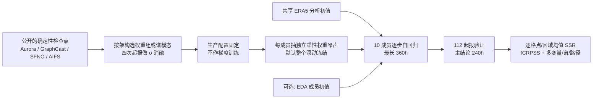

# SPW：从冻结确定性气象模型权重生成中期集合预报

> Simon Adamov、Oliver Fuhrer、Reto Knutti、Sebastian Schemm，*Stochastically Perturbed Weights: Ensembles from Deterministic Machine-Learning Weather Models*，[arXiv:2609.08412v1](https://arxiv.org/abs/2609.08412)，**2026-09-08** 首发；[原文 HTML（57 页、17 图、12 表）](https://arxiv.org/html/2609.08412v1)｜[作者代码 v1.0.0](https://github.com/MeteoSwiss/ai-models-ensembles)。阅读日期：2026-09-24。**证据等级：v1 预印本、已投稿但不是已录用正式版；本笔记核对方法、主结果与补充表/图。**

## 1. 问题和时效：不再训练模型，能否得到有用的概率集合？

Aurora、GraphCast、SFNO 和 AIFS Single 的公开检查点给出确定性预报。重训一个 CRPS/扩散集合模型成本高，且用户往往拿不到原训练数据和代码；仅给初值加小噪声又容易使长时间集合过窄。本文问的是一个具体的**推理期后处理**问题：保持已训练模型权重和归一化器不更新，对每个成员独立扰动网络权重，是否能用零**新增训练**成本产生概率集合？作者把方法称为 **stochastically perturbed weights（SPW）**，与另训多个种子的 deep ensemble、在参数化趋势加噪的数值模式 SPPT、原模型内部训练好的 AIFS-ENS 扰动机制都不同。[摘要、§1–2](https://arxiv.org/html/2609.08412v1)

核心回报为 **2023–2024 共 112 个起报时次 × 10 成员 × 最长 360h/15 天**；正式主结论取 **240h/第 10 天**，因为到 360h 各模型向气候态收敛，绝对差距变小不能解释为长期竞争力增强。它直接属于中期集合预报，但不应声称「权重扰动已取代专门训练的集合模型」；第 10 天最佳 SPW-AIFS 的 CRPSS **0.221**，专门训练的 AIFS-ENS **0.256**，且四底座需分别调参。[§3.3、图 3、表 9](https://arxiv.org/html/2609.08412v1)

## 2. 所用现成模型、数据和预处理：训练与微调究竟有没有发生

| 底座/对照 | 论文实际加载的检查点或来源 | 本实验中的处理 |
|---|---|---|
| **Aurora** | `aurora-0.25-pretrained`，Perceiver + 3D Swin Transformer，**约 1.3B 参数**。 | 权重冻结；在 encoder/backbone/decoder 各组与粗尺度 encoder 层试扰动，不对 Aurora 重训。原 Aurora 的预训练/微调资料与参数须查其独立论文，**不是本文新实验的训练流程**。 |
| **GraphCast** | `GraphCast_operational`，icosahedral mesh GNN，**约 37M 参数**。 | 权重共享跨网格层，整权重扰动可行；粗尺度试验需改为 mesh-node **activation hook**，不可误称全是权重扰动。 |
| **SFNO** | `sfno_73ch_small`，球谐 Fourier operator，加载检查点 **约 573M 参数**。 | 试整权重、编码器、处理器、解码器及低球谐模态扰动；复数谱权重用复高斯噪声。 |
| **AIFS** | `aifs-single-mse-1.1`，图编码器—Transformer—图解码器，作者加载审计 **约 255M 参数**。 | **输入/输出归一化器不扰动**；主要选择 decoder 噪声。不是把 AIFS-ENS 已训练的随机层接到 AIFS Single。 |
| 已训练概率/物理对照 | **AIFS-ENS 229M**、FourCastNet 3/FCN3 **711M**、Atlas-ERA5 **约 4.2B**、业务 **IFS-ENS**。 | 对照模型已有专门概率训练，本研究只作推理/统一评分，不提供这些模型的原始优化参数；训练版别与 SPW 底座不可混同。[§3.1、表 1/6](https://arxiv.org/html/2609.08412v1) |

所有 ML 预报使用 **NVIDIA Earth2Studio** 推理框架，通常用**同一个 ERA5 分析**起报并以 ERA5 对照；ARCO-ERA5 是多数模型的分析资料，AIFS/AIFS-ENS 从 Copernicus CDS ERA5 读取。只有标记 `_ic` 的变体改用从 ECMWF MARS 获取的逐成员 **IFS-ENS EDA 扰动分析初值**；`_ic_only` 是只给不同初值、**不扰权重**的归因对照。IFS-ENS 预报从 WeatherBench2 档案下载、原本就是物理集合，不应写成 Earth2Studio 生成。[§3.1–3.2](https://arxiv.org/html/2609.08412v1)

| 评测数据加工 | 可核验设置与隐患 |
|---|---|
| 时次划分 | 消融选 **4 次非连续中季起报**：2023-05-15、2023-08-15、2024-02-15、2024-11-15，各 10 成员、240h。确定配置后以较独立的 **112 次**生产网格验证：2023 与 2024 两年，1/4/7/10 月各 **2–8 日、00/12 UTC**，合计 2×4×7×2=112，10 成员到 360h。四次消融网格不等于 112 次泛化证明。[§3.3、表 3](https://arxiv.org/html/2609.08412v1) |
| 字段、空间/时间 | 共 **7 变量** `2t,msl,z,t,u,v,q`；5 个高空量各只取 **500 与 850hPa**，故多变量评分 **12 个变量×层通道**。纬度余弦面积加权。虽然全球模式仍可含其他层，本论文只评分这 12 通道；**没有降水、10m 风、1000/200hPa 等单独结论**。ERA5 和输出对齐到共享验证网格，台风强度相关 ERA5 上限约 0.25°。[§3.4、附表 8](https://arxiv.org/html/2609.08412v1) |
| 气候态与评分 | CRPSS 分母为 **1990–2019** 的 ERA5、与每一 valid time 同月/日/时的 **30 年成员**，同样用 fair CRPS 和面积权重计算；七变量先分别算无量纲分数，再平均，高空量先跨 500/850hPa 平均。概率气候态并非训练输入。IFS-ENS 档案 `msl` 约 **30%** NaN、其他字段约 **18–20%** NaN，用 skipna；它与 ML 的全样本 ERA5 评分并不完全同样本同分析来源。[§3.4、附录 C/表 9](https://arxiv.org/html/2609.08412v1) |
| 独立风暴 | 2024-10-02 至 08 日的 **14 次起报×10 成员**，TempestExtremes 在 5–40°N、60–120°W 检出/拼接 Milton 轨迹，再与 IBTrACS v4 和 ERA5 对照。使用 `_ic` 变体，而非主图的权重单独扰动；气旋表的检出率不能直接归功于权重噪声。[§3.5、表 7](https://arxiv.org/html/2609.08412v1) |

本文**没有任何新的网络训练或梯度微调**。作者调的 `σ`、张量组、刷新 cadence 和初值来源是**推理超参数/配置选择**，不是训练参数；若写成「四模型分别微调」即事实错误。底座本身在先前研究中如何训练，本文并未统一重述，不能替其填造 epoch、LR 和损失函数。[§3.1–3.2](https://arxiv.org/html/2609.08412v1)

## 3. SPW 的数学形式、三阶段选型和推理流程

对选中的原始权重张量逐元素操作：`W_m = W ⊙ (1 + σ ξ_m)`，其中每个成员/张量的 `ξ` 独立服从标准高斯；SFNO 谱滤波器用复高斯。这样每个参数的扰动方差是 `σ²|w|²`，而非绝对同方差噪声；`σ` 是**无量纲相对强度**。选中的成员权重在默认方案的整个自回归滚动中保持**冻结的同一次扰动**，不在每个时间步重采样；不同成员独立抽取。归一化层/偏置是否被选由张量组及源码定义，AIFS 的输入/输出 normaliser 明确排除。[式 1、§3.2](https://arxiv.org/html/2609.08412v1)

1. **Phase 1：整网络强度扫参。** Aurora/GraphCast/SFNO 的 `σ=0.001/0.003/0.01/0.03/0.1`；AIFS 只扫中间三档 `0.003/0.01/0.03`。四次起报×10 成员×10 天为**每个 cell**的计算量。作者用 `σ_full=0.01` 作为后续张量组的共同方差预算锚；不能只挑效果最好的 σ，却不提这是消融数据筛出的。[§3.2、表 2](https://arxiv.org/html/2609.08412v1)
2. **Phase 2/2b：扰动注入位置。** Aurora 按 encoder/backbone/decoder；GraphCast 按 `g2m/m2m/m2g`；SFNO、AIFS 按 encoder/processor/decoder。为大体配平扰动能量，组强度设 `σ_group=σ_full×√(N_total/N_group)`，这里 `N` 是**可学习张量的个数**、不是参数个数；再对近优组细化 σ。全模型 **没有统一最佳组**，处理器内部的归一化常使噪声衰减。[图 1、表 2](https://arxiv.org/html/2609.08412v1)
3. **Phase 3/3b：粗空间尺度限制。** Aurora 只扰 U-Net encoder 最低分辨率 `enc_2`（约 ≥5000 km），GraphCast 对前 **42** 个粗 mesh 节点加 activation hook（约 ≥3300 km），SFNO 只扰球谐 **ℓ=0…9**（约 ≥4000 km）。再把掩码放宽至约 2000 或 800–1000 km，均需方差预算重标。**AIFS 未做 Phase 3**，因为加入时间较晚，最终保留 Phase 2 decoder 配置。[图 2、表 2、§3.2](https://arxiv.org/html/2609.08412v1)
4. **生产配置固定后再验证。** 先按第 10 天 CRPSS 选；若相差在四次起报噪声散布约 **±0.02** 内，再比较 120–240h spread–skill、结构、多变量及时间路径评分，并把近优竞争者在 112 次生产网格复核。最后为 **Aurora encoder σ=0.025**、**GraphCast 全权重 σ=0.01**、**SFNO ℓ<10 σ=0.25**、**AIFS decoder σ=0.028**。这些都是权重冻结下的推理配置，且对其他检查点不保证可迁移。[§3.2、表 2/4/11](https://arxiv.org/html/2609.08412v1)

依据原文**图 1–2、式 1–2、表 2–3**自行重绘。单一共享初值是主对照；EDA 初值仅在 `_ic` 扩展/台风试验启用。作者还试了每 `N=1/10/20/40` 步重新抽权重噪声，令 `σ_N=σ_frozen√(T/N)` 大体匹配整个 `T` 步滚动的方差预算；SFNO 在 40 步 10 天里每 20 步刷新时由 0.25 变约 **0.35**，但此策略**不能泛化修复所有底座**。[§3.2、图 12](https://arxiv.org/html/2609.08412v1)

## 4. 指标与原文数值：何处有利、何处输给训练式概率模型

核心是 **fair CRPSS=1−fCRPS(模型)/fCRPS(气候态)**，分数高为好；0 是与 30 年概率气候态相同，不是零误差。spread–skill ratio（SSR）以 `(M+1)/M` 校正 10 成员有限样本，使完美可靠接近 1；`<1` 为欠离散，`>1` 为过度离散。必须**分开看格点 SSR 和先把全球场求平均后的空间均值 SSR**，因为两者在本方法中给出相反判断。额外十类度量包括 SSIM、log spectral distance、95 分位阈值/9×9 邻域 FSS、Wasserstein-1、Energy Score、Variogram Score 和轨迹 signature-kernel（SIGK），不应只选 CRPSS 报喜。[§3.4、附录 C](https://arxiv.org/html/2609.08412v1)

### 4.1 112 次生产网格主表：跨 3、5、10、15 天

| 系统（10 成员） | 72h CRPSS | 120h | 240h | 360h |
|---|---:|---:|---:|---:|
| **AIFS-ENS**（独立概率训练） | **0.707** | **0.580** | **0.256** | **0.084** |
| Atlas-ERA5（独立概率训练） | 0.695 | 0.558 | 0.238 | 0.065 |
| FCN3（独立概率训练） | 0.673 | 0.534 | 0.218 | 0.080 |
| **SPW-AIFS decoder** | 0.677 | 0.542 | **0.221** | 0.066 |
| SPW-GraphCast all | 0.628 | 0.489 | 0.167 | 0.023 |
| SPW-Aurora encoder | 0.633 | 0.471 | 0.134 | **−0.011** |
| SPW-SFNO low-ℓ | 0.556 | 0.388 | 0.125 | 0.029 |
| IFS-ENS（档案缺测，skipna） | 0.650 | 0.518 | 0.207 | 0.080 |

这是原文[表 9a/图 3](https://arxiv.org/html/2609.08412v1)的七变量平均值。第 10 天 SPW-AIFS **比 AIFS-ENS 低 0.035**（正文四舍五入说 0.036），却略高于 FCN3 **0.218** 与 IFS-ENS **0.207**；不能称「SPW 一概劣于所有概率集合」。但到 15 天 AIFS-ENS **0.084**、SPW-AIFS **0.066**，Aurora SPW 已 **−0.011**，落到气候态以下。作者提醒 15 天各模型绝对差距收敛不能解释成质量持平。第 10 天单变量：SPW-AIFS `2t=.247, msl=.235, z=.303, t=.270, u=.202, v=.141, q=.146`，AIFS-ENS 依次 `.282,.285,.349,.299,.232,.168,.178`，七变量**全部领先**；GraphCast SPW 的 `q=.079`、Aurora `.073`、SFNO `.056`，湿度尾部尤其弱。[表 9b、§4.2](https://arxiv.org/html/2609.08412v1)

### 4.2 消融、校准和“单成员变差、均值变好”

| 生产 SPW 配置 | 消融网格 240h CRPSS / 格点 SSR | 独立生产网格 240h CRPSS / 格点 SSR | 生产网格 240h **空间均值** SSR |
|---|---:|---:|---:|
| Aurora encoder 0.025 | 0.151 / 1.16 | 0.134 / **0.94** | **1.6** |
| GraphCast all 0.01 | 0.190 / 1.34 | 0.167 / **1.08** | **3.2** |
| SFNO ℓ<10 0.25 | 0.145 / 1.22 | 0.125 / **0.97** | **0.66** |
| AIFS decoder 0.028 | 0.204 / 1.37 | 0.221 / **1.11** | **2.5** |

上表分清原文**表 4 的四起报消融值**和**表 5/图 4 的 112 起报值**，不是同一试验的可重复四舍五入。生产网格逐格点 SSR 约 0.94–1.11 看似可靠，**区域/全球均值却严重过度离散**：GraphCast 3.2、AIFS 2.5、Aurora 1.6。原因是一次抽到的权重误差在整段滚动中持续推动同一成员的整片场同向漂移，格点噪声平均后剩下空间相干偏差；所以「格点校准」并不等于面平均或区域事件概率可靠。SFNO 只扰低球谐模态，空间均值 SSR 0.66（欠离散）反而落在训练式概率模型 0.62–1.42 的带内。[§4.3、图 4、表 4–5](https://arxiv.org/html/2609.08412v1)

作者专门按**单成员 RMSE**核查扰动代价：四模型在消融网格第 5 天相对原始确定性控制分别恶化 **+15.6%、+17.0%、+13.9%、+25.0%**；但十成员**集合均值**分别改善 **−10.7%、−3.4%、−8.1%、−1.1%**。第 10 天集合均值改善分别为 **−19.9%、−15.8%、−22.4%、−14.8%**，单成员仍全比无扰动差。负号在该表代表 RMSE **改善**，不是概率分数下降；这类平均平滑不能替代集合可靠性。[附表 12](https://arxiv.org/html/2609.08412v1)

### 4.3 两种补救：刷新权重噪声与加入 EDA 初值

每 20 步刷新配方下，SFNO 的空间均值 SSR **0.66→0.83**，消融 CRPSS **0.145→约 0.143**，尚可；Aurora **1.56→1.43**、AIFS **2.54→2.50**，几乎不解决过度离散，AIFS 在部分前段甚至更差。GraphCast 的粗 mesh activation hook 若刷新，消融 SSR **0.27→0.15**，比冻结更欠离散，说明激活空间与权重空间的刷新方向可相反。**不要把 SFNO 的补救推广为四底座通用技巧。**[§4.3、附图 12](https://arxiv.org/html/2609.08412v1)

EDA 初值加入各成员后，短 lead 格点分散度补足：AIFS 24h MSL SSR **0.65→0.79**，不同底座 MSL 增益约 **+0.09 至 +0.20**；但是 6h CRPSS 反降 **0.06–0.10**，从 24h 起平均 CRPSS 通常在权重单独版 **±0.02**。在空间均值上 GraphCast 第 10 天 **3.20→1.90**，仍高于目标 1。附表 10 的归因显示：权重单独产生的方差在 6h 仅占两源合用的 **8–17%**，240h 升至 **86–97%**；初值更主导前段，权重更主导长时效。两源合用方差在第 10 天仅为独立方差相加的 **0.59–0.69**，说明非线性饱和，不能机械相加。[§4.3、表 10](https://arxiv.org/html/2609.08412v1)

## 5. 图表与诊断的完整阅读地图

| 原文材料 | 具体内容与证据边界 |
|---|---|
| **图 1–2 / 表 1–4** | 图 1 是权重乘性噪声和按架构分组/扫幅度，图 2 标 Aurora `enc_2`、GraphCast 粗 mesh node、SFNO 低谱模态，**不是四者共用同一个可扰张量层**。表 1 的公开权重版别；表 2 的每 cell σ 范围；表 3 的四起报/112 起报隔离；表 4 的各阶段 CRPSS/SSR、空间结构/多变量选择证据，均已在上文还原。 |
| **图 3 / 表 5、9** | 图 3 6–360h CRPSS；表 9 的 72/120/240/360h 与逐变量数值见上；表 5 表示 AIFS-ENS 的 proper score 仍领先，SPW-AIFS 在多变量 ES/VS 约列 7 个 ML 系统第 3。不能因 SPW 推理无需重训就抹去专门概率模型的概率技巧优势。 |
| **图 4、10–12 / 表 10–12** | 图 4 的**空间均值 SSR**与图 10 的**逐格点 rank histogram**揭示「局地近校准、区域均值过离散」；图 11 把预报 spread 分十等分，240h 高 spread 格的 RMSE 约为低 spread 的 **4.0–7.3 倍**，说明有不确定性区分能力，但 24h SPW 的 spread 标准化误差 **2.19–3.52**，仍明显欠离散。图 12 显示 SFNO 刷新有效、AIFS/ Aurora 无明显改善；表 10/12 分别归因权重/初值方差与单成员/均值 RMSE。 |
| **图 7–9：物理/谱** | 图 7 500hPa 温湿联合分布：各系统相对 ERA5 的过饱和质量约 **0.02–1.3%**，ERA5 自身约 **0.1%**，并非 SPW 系统性独有；图 8 在 Milton 区域的 500hPa 地转平衡近似，离理论线 >15m/s 的尾部各系统约 **0.6–1.4%**，但两项只是针对性检验，不能宣称完整物理守恒。图 9 Z500 谱随时效小尺度能量偏高，GraphCast-SPW/AIFS-SPW 更明显；FCN3 最贴近真值谱。[附录 C](https://arxiv.org/html/2609.08412v1) |
| **时间路径 SIGK** | 单个时效的 CRPSS/ES 无法描述轨迹真实性；冻结同一噪声可产生时间上过度相干的路径，GraphCast-SPW 在 SIGK 明显较弱；权重+EDA 初值一般改善轨迹评分。此指标仍依赖所选 kernel/数据归一化，不应转译为可直接解释的物理单位。[附录 C、表 5/10](https://arxiv.org/html/2609.08412v1) |

### 5.1 飓风 Milton：不要只看路径误差，还要看是否检出

台风算法以 MSL 闭合低压、10m 风阈值和 **500–850hPa 暖核厚度距平 ≥6m**检测，在 5–40°N/60–120°W 连续 ≥24h 才连成轨迹。由于只留 500/850hPa 层，暖核算法是适配过的两层版；IFS-ENS 的档案缺测允许最长 **18h** 补桥接以避免人为断轨。所有系统按 14 起报×10 成员评分，而非拿业务 IFS ENS 50 成员直接与 ML 10 成员比。**表 7 的 SPW 一律启用 EDA 初值**。[§3.5、表 7](https://arxiv.org/html/2609.08412v1)

| 模型 | Milton 检出率 | 对 IBTrACS 平均路径误差 | 中位误差 | 平均最低气压偏差 |
|---|---:|---:|---:|---:|
| Atlas | **89%** | 281 km | 159 km | +42.4 hPa |
| AIFS-ENS | 86% | 300 km | 163 km | +39.2 hPa |
| Aurora-SPW+EDA | **66%** | **218 km** | **124 km** | +38.6 hPa |
| GraphCast-SPW+EDA | 73% | 258 km | 157 km | +40.0 hPa |
| AIFS-SPW+EDA | 67% | 262 km | 133 km | +40.3 hPa |
| SFNO-SPW+EDA | 76% | 306 km | 161 km | +41.7 hPa |
| IFS-ENS（WB2 缺测） | 71% | 317 km | 173 km | +36.6 hPa |

Aurora-SPW+EDA 的**被匹配轨迹**平均路径误差较低，但只检出 **66%**，不能仅以 218 km 称「该模型对飓风最好」；AIFS-ENS/Atlas 检出更稳定。IFS-ENS 档案多个追踪字段约五分之一时效缺值，约 **41%** 时效含全部六字段；对缺测值插值后检出率可由 **71%→80%**，是资料问题而非真实天气技巧变化。所有模型在 0.25° ERA5 强度标尺上都不能充分表达 IBTrACS 最低 **895hPa**，ERA5 约 **976hPa**；各模型最深成员仍只 **942–967hPa**。图 5–6 看轨迹/闭合等压线，图 13–17 补充气压、暖核、逐 lead 误差、风环与 IC 扩散；AIFS 加 IC 使前段路径 cone **48→96km**、气压 spread **1.1→1.9hPa**，主要改善离散而非集合均值。**单个 Milton 个例不能证明全年强台风强度技巧。**[§4.5、表 7、图 5–6/13–17](https://arxiv.org/html/2609.08412v1)

### 5.2 推理成本与“零成本”的准确含义

表 6 在 CSCS Alps **GH200** 上测 1120 条 **360h** 预报的单成员纯推理耗时：SFNO-SPW **59s**、Aurora-SPW **90s**、GraphCast-SPW **125s**、AIFS-SPW **75s**；AIFS-ENS 亦约 **75s**、FCN3 **114s**，Atlas 多步 SDE 约 **2280s/38 分钟**。SPW 的「零 marginal training cost」是**不用重新优化权重**，绝非成员采样、磁盘、数据读取、调参搜索、EDA 初值或设备能耗都免费。表 6 的单成员纯推理时间排除 fetch/load/zarr 写入；实际 1120 预报的 node-hours 则包含这些开销，硬件/账单口径不可直接与其他论文训练成本相加。[§4.4、表 6](https://arxiv.org/html/2609.08412v1)

## 6. 局限、复验路线与本库其他条目的关系

本研究的最重要负面结论不是「SPW 没效果」，而是**有效位置因架构而异**、**单成员准确率下降**、**全球/区域均值会因整场相干漂移严重过离散**、**降水等强非高斯间歇变量未纳入评分**。四次起报选择配置有约 ±0.02 CRPSS 采样散布；作者用 112 次网格和近优对手再评分缓解，但未做不同季节/年份的大样本业务验证。文中不含同家族 post-hoc MC-dropout/SWAG 的实测公平基线。IFS-ENS 缺测和 ERA5-native 模型用 ERA5 验证带来基线非对称，尤其短时效需慎读。[§5](https://arxiv.org/html/2609.08412v1)

复验时必须固定四个**准确检查点和版本**、Earth2Studio/SwissClim_Evaluations 配置、逐成员扰动 seed、张量组及 SFNO 复数谱模式；分别记录四起报扫参与 112 起报测试，10 成员、共同分析或 EDA 成员分析的版本不可混用；重算 fair CRPSS 的 1990–2019 日历年气候态和 skipna 后 IFS 同子样本；同时输出格点/空间均值 SSR、ES/VS/SIGK、逐变量第 10 天分数和第 15 天是否越过气候态。对降水、极端风/雨、山区区域平均、业务初值版本和新的 AIFS/Aurora 检查点，需要重新调参验证，不能把本文的 `σ` 当普适默认值。其与[AIFS-CRPS/AIFS ENS](37-aifs-crps.md)、[Aurora 初代](01-aurora.md)、[ATLAS](18-atlas.md)属于**现成底座的推理期集合化 vs 专门训练集合**关系，不能合并计为同一论文。[原文全文](https://arxiv.org/html/2609.08412v1)

[返回首页](../../README.md) · [返回总表](../../气象大模型_中期预报论文追踪.md)
