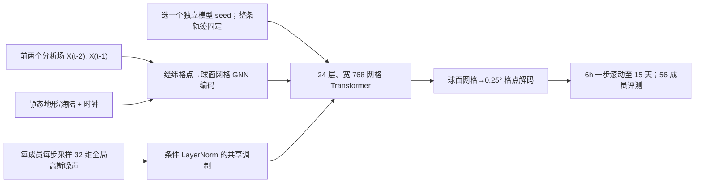

# WeatherNext 2 / FGN：只用边际 CRPS 训练的 15 天联合概率集合

> Ferran Alet、Ilan Price、Andrew El-Kadi、Dominic Masters、Stratis Markou、Tom R. Andersson、Jacklynn Stott、Remi Lam、Matthew Willson、Alvaro Sanchez-Gonzalez、Peter Battaglia，*Skillful joint probabilistic weather forecasting from marginals*，[arXiv:2506.10772v1，2025-06-12](https://arxiv.org/html/2506.10772v1)。作者的 [WeatherNext 官方代码与权重说明](https://github.com/google-deepmind/weathernext)将这篇技术报告对应到 WeatherNext 2（WN2）；论文的 2023 回报检查点与后续公开的 `<2025` 权重不能不经核对地视为相同权重。精读于 2026-09-24。

## 一、研究问题与真正的贡献

论文要解决的是全球 **15 天、0.25°、6 小时间隔**的概率中期预报。难点不只是让每个格点的温度/风分布准确，还要让同一集合成员中的相邻地区、不同变量与连续时次共同构成合理天气过程。此前 GenCast 用条件扩散明确学习下一步完整场的联合分布，但每一步要多次网络前向；FGN（Functional Generative Network）提出以**模型参数空间的低维随机扰动**产生集合，每成员每预报步只需一次前向，并用逐变量、逐格点的 fair CRPS 训练。全文的核心论点是：共享的网络结构和全局低维噪声使“只对边际分布打分”也能学到有用的联合结构；这是一项经验发现，**不是边际 CRPS 数学上保证联合分布正确**。[论文 §§1–2、6](https://arxiv.org/html/2506.10772v1)

这篇研究应与两类后续工作分开：WeatherNext 3 增加原始卫星/站点观测与更细时空输出；2026 年气旋业务论文还发展了直接气旋目标。这里的主体实验仍以 **ERA5/HRES 分析场为输入和训练目标**，气旋路径由预报格点场经 TempestExtremes 追踪，不是“原始观测直达预报”，也不是独立训练的气旋检测网络。[论文 §§3–4、6；官方仓库](https://github.com/google-deepmind/weathernext)

## 二、输入、随机机制与模型结构

FGN 每个递推步读入前 **两个**天气状态。经网格—网格图编码器投到球面二十面体网格，由 graph Transformer 处理，再由图解码器还原为经纬度场。主模型每个独立 seed 约 **1.8 亿参数**；图处理器隐变量宽 **768**、**24 层**、**6 个注意力头**，对照 GenCast 是约 5700 万参数、宽 512、16 层、4 头。0.25° 阶段使用六次细化的二十面体网格；早期 1° 阶段为五次细化。故最终性能不能单独归功于损失函数，还含分辨率、步长、容量和多模型集合的共同变化，论文另用消融拆解。[论文 §2.3、Appendix A.2–A.4](https://arxiv.org/html/2506.10772v1)

给定一个独立训练的模型 $\mathcal M_j$，每个集合成员、**每个 6 小时步**重新采样 32 维标准正态向量 $\epsilon_i^t$。它经一次矩阵映射后进入各层条件 LayerNorm，影响共享于全部空间节点的归一化参数，可理解为 $\theta_i^t=\theta_j^*+\Delta_j\epsilon_i^t$ 的受约束函数扰动；不是向每个像素分别加白噪声，也不是对已经生成的场再加扰动。四个从不同初始权重训练的 $\mathcal M_j$ 近似表示认识不确定性；每个模型内部的随机函数表示模型视角下未解析过程的不确定性。同一成员轨迹始终使用同一模型 seed，但逐步重新取噪声。[论文 §2.2](https://arxiv.org/html/2506.10772v1)

本图按论文图 1 和 §2.3 **自行重绘**，不转载原图。需要留意“在参数空间扰动”是对条件归一化调制的**功能解释**，并不意味着为 1.8 亿个权重逐个抽样。论文把 32 维噪声作用到约 8700 万维输出，可能鼓励空间相干，但也可能过度约束局地变率。[图 1、§6](https://arxiv.org/html/2506.10772v1)

## 三、数据字段、预处理与资料可用时间

预训练 ERA5 子集覆盖 **1979-01-01 至 2018-01-15**，原始档案按 6h 取样为 00/06/12/18 UTC；13 个等压层分别是 50、100、150、200、250、300、400、500、600、700、850、925、1000 hPa。高空输入与输出含位势、比湿、温度、u/v 风、垂直速度；单层含 2m 温度、10m u/v 风、海平面气压、海表温度。**6h 累计降水只作为输出、不作为输入**，另有地形位势、海陆掩膜、经纬度、地方时及年内进度等静态/时钟上下文。不能把“13 层×6 高空变量 + 单层量”误说成 13 个变量。[Appendix A.1 Table A.1](https://arxiv.org/html/2506.10772v1)

ERA5 除降水外按时间抽样；降水重算对应之前 6h 的累计。ERA5 的陆地 SST 原本为 NaN，作者以 ERA5 子集中的全球最低 SST 填补；微调所用 HRES-fc0 在同位置采用不同占位值，因此也改成与 ERA5 **相同位置、相同规则**的最低 SST。HRES-fc0 是 ECMWF 每日 00/06/12/18 UTC 的高分辨率业务预报零时效分析，给定时刻只用附近约 ±3h 的观测，相对于长窗口重分析更贴近实时资料。HRES-fc0 的 0h 累计降水为零，无法作为降水输入；论文因此仍取 ERA5 降水用于微调标签及降水评估。这是**重要的业务可用性/真值口径例外**，不能把全部结果称为完全基于实时 HRES 真值。[Appendix A.1](https://arxiv.org/html/2506.10772v1)

为形成 12h 的第一阶段，作者在 6h 序列上隔帧取样，累计量同步延长累积窗；为形成 1° 资料，从 0.25° 经、纬两轴各按 4 格抽样，而不是声明做保守重网格。开发时用 2022 HRES-fc0 验证；设计冻结后将训练延伸到含 2022 的数据，再在 **2023 全年** HRES-fc0 验证。原文未在这一段给出 HRES-fc0 各训练阶段精确起止日，不应凭公开 `<2025` 权重回推论文内每次更新的训练边界。[§3.1、Appendix A.2；官方仓库](https://github.com/google-deepmind/weathernext)

## 四、损失函数和四阶段训练/微调

模型每次训练从同一个输入生成 **N=2** 条随机轨迹，对每个变量—气压层—位置计算 fair CRPS，再平均时间、空间与 batch；位置/字段权重主要沿用 GraphCast/GenCast，位势字段权重因扩大模型后过拟合而减半。两成员 fair CRPS 的第一项惩罚成员偏离真值，第二项奖励恰当的成员差异；若只压第一项，集合会向确定性均值坍缩。训练时的 **2 条样本**与评估时的 **56 成员**不是一回事。训练的早期只监督一步；最后 HRES 阶段把自己预测回喂，多步损失对所有滚动步平均并**反传穿过整条展开链**，最长 8 步（48h）。[§2.2.3、§2.4](https://arxiv.org/html/2506.10772v1)

| 阶段 | 数据/时空步长 | 训练更新 | 自回归展开 | 峰值学习率与 warm-up |
|---|---|---:|---:|---|
| 1 | ERA5，1°、12h | 400,000 | 1 | `8e-4`，1000 步 |
| 2 | ERA5，1°、6h | 100,000 | 1 | `8e-5`，1000 步 |
| 3 | ERA5，0.25°、6h | 32,000 | 1 | `8e-5`，1000 步 |
| 4a | HRES-fc0，0.25°、6h | 8,000 | 1 | `8e-5`，800 步 |
| 4b | 同上 | 4,000 | 2 | `8e-6`，400 步 |
| 4c | 同上 | 3–8 步各 1,000，共 6,000 | 3–8 | `8e-7`，各 100 步 |

表为论文 **Appendix A.2 / Table A.2** 的逐项转录；六个 3–8AR 小阶段加 8k+4k 正好是 **18,000** 次 HRES 自回归微调更新。全部阶段 batch 64、每样本 2 个训练轨迹、AdamW、weight decay 0.1、余弦学习率衰减；原文此表未披露 AdamW 的 β 值，不自填。第 3 阶段细化二十面体网格、保留原权重并更新高分辨率输入/输出；为抵消网格—网格编码节点收到更多消息，消息和除以 4。这里的“微调”是真实地在 ERA5 预训练权重上继续用 HRES-fc0 训练，不是推理后处理或仅修改集合采样。[Appendix A.2](https://arxiv.org/html/2506.10772v1)

## 五、评估协议与图表逐项解读

主比较是 **2023 年**：FGN 对 HRES-fc0 起报并以 HRES-fc0 验证；对照为已经 HRES-fc0 微调的 WeatherNext Gen/GenCast，而不是原始 2025 *Nature* 论文中 ERA5 版 GenCast。00/06/12/18 UTC 四次起报均用于 FGN–GenCast 主比较，两者各 **56 成员**；FGN 为 4 个独立 seed 各 14 成员。由于这些成员不是完全独立，作者主比较用有限集合的偏 CRPS；FGN–ENS 附录另有 56 对 50 成员的不等成员数和 fair CRPS 独立性边界。与 ECMWF ENS 的对照受公开 TIGGE 限制只用 00/12 UTC，且 ENS 在 2023-06-27 升级由约 0.2° 到 0.1°，全部重网格到 0.25° 后比较。[§4、Appendix A.5.1](https://arxiv.org/html/2506.10772v1)

| 原文图表 | 作者报告的可核验结果 | 如何解读、不能推出什么 |
|---|---|---|
| 图 2a、附图 A.11：边际 CRPS / 集合均值 RMSE | 相比 GenCast，CRPS 在 **99.9%** 变量×层×时效目标上较好，平均相对改善 **6.5%**、最多 18%；RMSE 在 **100%** 目标上较好，平均 **5.8%**、最多 18%。 | “99.9%”是**目标组合占比**，不是 CRPS 降低 99.9%，也非每个起报事件均胜；图中阴影另标不显著格。 |
| 图 2b–f：spread–skill | FGN 多时效 spread–skill ratio 近 1，GenCast 在前约 5–7 天的校准略差。 | 近 1 是格点边际校准证据，不保证区域平均或多变量联合事件可靠。 |
| 图 2g–h、附图 A.14–A.17：极端事件 REV | 2m 极端高温（>99.99 分位）约与 GenCast 持平，10m 强风更好；更多极端阈值总体更好，但**部分长时效高温成本比不显著/例外**。 | REV 依赖成本/损失比、局地月时气候态，不能概括为所有极端事件均胜。 |
| 图 3a–d：空间与跨变量联合代理 | 平均池化 CRPS 在 **99.9%** 组合较好，最大池化 **99%**；均值相对改善 **8.7%/7.5%**。由 u/v 推算的 10m 风速 CRPS 平均好 **4.8%**，由 z300–z500 得到的层间差平均好 **7.8%**。 | 池化尺度约 120–3828 km；这是若干联合依赖的**代理测试**，不能证明任意高维联合分布完全正确；优势随时效接近 15 天而缩小。 |
| 图 3e–j、附图 A.18–A.19：球谐功率谱 | 多数谱形接近 HRES-fc0，避免明显高波数模糊；z500 等有约 100km 网格频率尖峰和额外高频能量。 | 说明有**网格伪影**，不能只展示均值误差而忽略单成员物理可信度。 |
| 图 4：热带气旋 | 第 3–5.5 天集合均值路径技巧约比 GenCast 提前 **24h**；路径概率 REV 在两者优于气候态的多数成本比上较好。 | 路径由 TempestExtremes 追踪；6h 而非 12h 步长可减少 tracker 跳跃。论文用 12h FGN 消融后仍在 2 天后领先，故两种因素都应保留。 |
| 附图 A.5–A.10：与 ECMWF ENS | GenCast 对 ENS 的 CRPS 组合胜率 **96.5%**、平均改善 **4.7%**；FGN 对 ENS 为 **99.3%**、平均 **10.8%**、最大 **27.7%**。ENS 升级前/后 FGN 平均分别 **12.0%/9.7%**。 | 只用 00/12 UTC，且不同 ENS 版本及 56/50 成员影响绝对比较；**10.8% 是作者该评测协议内平均**，不应推广成所有年份业务成绩。 |
| 附图 A.1–A.4：容量/AR 消融 | 同容量、同 12h、单 seed、无 AR 的小 FGN 仍在 **91%** 目标上匹配/胜 GenCast，平均改善 **2.7%**；加至 8AR 后 **99.8%**、平均 **4%**。 | 说明机制不是纯粹“更大模型”；但 AR、容量和四 seed 各能进一步增加技巧。无 AR 模型晚时效约 **0.1%** 轨迹可不稳定。 |
| 附图 A.12–A.13：12/24h 降水 | 对 ERA5 降水真值，FGN 的 RMSE、CRPS、SEEPS 均优于 GenCast。 | **主图主动排除降水**，作者明言对降水真值质量缺乏信心；附图不能消除这一限制。 |

所有数字是**原作者 2023 回报**，尚不是对当前公开 `<2025` 权重或业务连续运行的独立复现。论文图 5 的第 15 天 q300 放大图可见六边形蜂窝纹；作者还报告曾在验证集发现一个异常随机 seed，删除并重训后才入最终集合。论文对 32 维噪声带来的相干性提供机制解释，也承认可能造成过强局地相关与谱伪影。没有在本文单独训练直接气旋属性头的参数表，因此不能把后续气旋专用模型的技巧和训练细节填入这篇。[§6、图 5](https://arxiv.org/html/2506.10772v1)

## 六、复现与阅读判断

一个可信复现至少要固定：ERA5/HRES-fc0 的时间截断与可获得时刻、13 层字段表、陆地 SST 填值、累计降水例外、1° 子采样方式；再按四阶段调分辨率/步长/网格、固定每模型 seed 与每步 32 维噪声、用两样本 fair CRPS 训练。评估时分别记录边际 CRPS、56 成员集合均值 RMSE、spread–skill、池化/派生量 CRPS、球谐谱、气旋追踪器与 ENS 业务版本，不能只重画单一 scorecard。官方代码/权重公开便于检查推理和训练损失，但论文报告与后来运行权重的训练截止日需逐检查点核对。[论文 Appendix A、官方仓库](https://github.com/google-deepmind/weathernext)

我的判断：这篇真正重要的是**廉价生成具一定空间相干性的全球中期集合**，并以同容量单 seed 消融说明效果不只是堆大模型；但它依赖分析场、降水标签混用 ERA5、ENS 对照跨业务升级，且有蜂窝伪影和偶发不稳定 seed。它为 WN3 的观测增强与后续气旋业务模型提供基础，但不能把后两者的独立进步倒记到 FGN 2025 技术报告。[论文 §6；官方仓库](https://github.com/google-deepmind/weathernext)

[返回首页](../../README.md)
