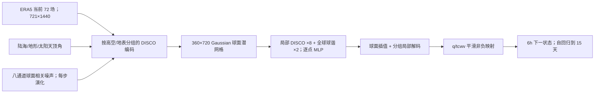

# FourCastNet 3：球面几何、谱 CRPS 与 15 天概率集合

> Boris Bonev、Thorsten Kurth、Ankur Mahesh、Mauro Bisson、Jean Kossaifi、Karthik Kashinath、Anima Anandkumar、William D. Collins、Michael S. Pritchard、Alexander Keller，*FourCastNet 3: A geometric approach to probabilistic machine-learning weather forecasting at scale*。[arXiv:2507.12144v2，2025-07-18](https://arxiv.org/html/2507.12144v2)；[NVIDIA Climate 机构页](https://research.nvidia.com/labs/climate/publication/bonev-2025-fourcastnet/)；[Makani 训练/推理代码](https://github.com/NVIDIA/makani)。初稿 v1 提交于 2025-07-16。本文按 v2 的 46 页 PDF、主图 1–5、附表 1–4 和附图阅读于 2026-09-24。

## 一、论文到底回答什么问题

FCN3 是一个直接生成**全球 0.25°、6 小时步、15 天概率集合**的天气模型。研究关注三件事：边际概率技巧能否与 GenCast/IFS-ENS 相比，单个集合成员能否保留真实的空间尺度与风暴形态，以及这种大模型能否在上千 GPU 上训练、在单 GPU 上低成本推理。作者还展示 30–60 天递推的数值稳定与功率谱，但**未按 60 天逐周给出完整、独立的 S2S 预报技巧比较**；因此本篇按主要验证任务归在中期目录，不把“60 天不发散”改写成“第 8 周有效预报”。[原文 §1、§5、附录 F](https://arxiv.org/html/2507.12144v2)

与前代 SFNO、确定性 FourCastNet 的差别不是换一个宣传名称：FCN3 使用球面局部 DISCO 卷积和球谐谱卷积的混合网络、带空间与时间相关性的**球面随机场**，并在格点和谱域同时对集合训练。它不需要 GenCast 式多步去噪，而是每 6 小时对每位成员作一次模型前向。与 WeatherNext 2/FGN 的低维全局条件归一化噪声也不同：FCN3 的八个随机通道是具有不同空间/时间尺度的球面扩散过程。[原文 §§2–3、附录 B.7、C](https://arxiv.org/html/2507.12144v2)

## 二、输入、数据集与预处理

论文使用 ERA5 再分析，而**非直接输入原始卫星/站点观测**；训练目标也是 ERA5。每个 721×1440 的等角经纬格点状态包含 **72 个预测字段**：5 个高空量（位势 z、温度 t、u/v 风、比湿 q）×13 个气压层 = 65 场，加 10m/100m u/v 风、2m 温度、海平面气压、整层可降水量 tcwv 这 7 个单层场。输入另有陆/海掩膜、地形高度、按起报时刻计算的太阳天顶角余弦，以及 8 个随机场；这些辅助/随机通道**不是另外 12 个被预测气象字段**。论文不预测降水、海洋或气旋中心属性，结论不能推广到这些字段。[附录 C.1 Table 1、E.4 Table 4](https://arxiv.org/html/2507.12144v2)

训练表将资料划为 **1980–2016 训练、2017 test、2018–2021 out-of-sample validation**，论文主成绩取后一区间内的 **2020 全年**，00/12 UTC 每 12 小时起报。第一阶段虽做 6 小时 lead 配对，但在历史**每一个整 UTC 小时**都构造输入—目标，因此比仅用四个每日起报时次有更多训练对；第二、三阶段才使用 00/06/12/18 UTC 的 6 小时资料。高分辨率原始缓存约 **39.5 TB**。[§4、附录 E.2–E.4、F.1](https://arxiv.org/html/2507.12144v2)

标准化不是全字段相同：多数气象量用训练集的 z-score；**比湿 q 与 tcwv 用 min–max**，以便最后的非负输出映射；u/v 风按**零均值**、用总风速幅值的标准差缩放，保留风向。常数先做球面空间平均，再对训练时段平均，不能从 2020 验证年重估。Table 4 的基础字段权重为：T2m=1，10m/100m 风、msl、tcwv=0.1；高空 z/t/u/v/q 则按气压层 $p\times10^{-3}$ 加权。损失另设时变尺度权重和自回归步权重；论文未在表中公布完整的谱损失系数、所有步权重、Adam β 或任何 warm-up，复现实验不能自行把别的模型的值填进来。[附录 E.1/E.4](https://arxiv.org/html/2507.12144v2)

资料描述有**原文内部日期不一致**：Table 3 明确写 1980–2016；附录 E.2 的一处正文说 1979–2016；E.4 又说小时资料在 1980–2018 采样，随后立刻把 2017 与 2018–2021 列为非训练期。本文按可复核的 Table 3 记录训练年份，并保留矛盾；不把“1980–2018 有资料”误解为“已用 2018 标签训练主回报”。此外，2020 位于作者所谓 validation 区间而非其命名的 2017 test；若模型选择曾查看 2018–2021，2020 不能毫无说明地称为完全未触及的最终封存测试。[附录 E.2–E.4、F.1](https://arxiv.org/html/2507.12144v2)

## 三、模型结构：球面局部/全局算子和随机场

一步映射写作 $u_{n+1}=F_\theta(u_n,t_n,z_n)$，其中 $z_n$ 由八个球面高斯扩散过程生成，不是每像素独立同分布白噪声。每个过程在球谐空间调节空间波数能量，时间上有相关递推；论文 Table 1 固定了八个 $k_T$ 尺度、$\lambda=1$、$\sigma=1$。这一设计使成员之间的差异有空间形态和跨时次连续性；**同一个网络权重**通过不同噪声轨迹生成集合，不需另训 50 个模型。[§2、附录 B.7、C.1](https://arxiv.org/html/2507.12144v2)

输入 721×1440 场由分组的球面局部卷积降到 **360×720 Gaussian 网格**，高空、单层、辅助/噪声分别编码；高空 13 层共享同一类编码器，且每个物理通道在编码/解码阶段**不提前混合**，以保护截然不同的谱统计。核心处理器在局部 DISCO 卷积与全局球谐谱卷积之间交替，局部:全局约 **4:1**，算子块改造自 ConvNeXt，含 GeLU、逐点 MLP 和内部残差，但刻意**不使用 LayerNorm**。解码先球面双线性升采样，再用局部卷积补回高频，避免转置卷积棋盘纹。输出直接预测下一状态，不做 $u_{n+1}-u_n$ 大残差；作者认为大残差会在长递推放大高波数伪影。q/tcwv 经过平滑的 `softclamp` 非负映射，避免简单 ReLU 的导数拐点引入新高频。[§3、附录 C.2–C.8](https://arxiv.org/html/2507.12144v2)

此图据论文图 1、图 9–10 与附录 Table 2 **自行重绘，非论文原图**。Table 2 报**8 个局部块 + 2 个谱块**、处理器 MLP 隐维 1282、模型总参数 **710,867,670**；图 1 图注却写“8 个算子块”。保留这项冲突：按结构表更像 10 块，具体发布检查点应以代码配置核验。编码段写潜状态 641 通道，Table 2 把气象与辅助合计写 677 通道，是不同位置的通道数，不宜挑一个无上下文统称“模型隐维”。[图 1、附录 Table 2](https://arxiv.org/html/2507.12144v2)

## 四、为什么要加谱域 CRPS

逐格点 CRPS 只看一处、一个变量在成员间的分布；若在每个格点**分别打乱集合成员编号**，全部边际 CRPS 不变，但一位成员中的风暴可变成不连贯的拼图。FCN3 的训练损失把球面面积加权的**格点 CRPS**与球谐系数上的**谱 CRPS**相加，后者按球谐模态覆盖不同波长，意在约束每个集合成员的空间关联及谱能量，而不是仅靠事后低通滤波。总损失再按变量权重、时变尺度权重和自回归时效权重组合。[§2、附录 E.1 Eq. 87–90](https://arxiv.org/html/2507.12144v2)

训练目标的 CRPS 版本随阶段变化：第一阶段用 **biased/nodal+spectral CRPS，16 成员**，因为小成员数的 fair CRPS 在初始化阶段偶会出现无界 spread；后续 4 步/8 步阶段改 **fair CRPS**，分别用 2/4 个训练成员。论文举的退化例子是两成员 fair CRPS 中若一个成员恰等于真值，另一个成员可能无界而损失仍为零。论文 Eq. 88 文字说按**一小时差分标准差的倒数**加权，但排版公式呈现为差分期望的倒数；此处应以文字和 Table 4 的可用参数为依据，重现时需查代码，不推导出一个作者未验证的标准差公式。[附录 E.1–E.2](https://arxiv.org/html/2507.12144v2)

## 五、三段课程训练与真正的微调

| 阶段（论文 Table 3） | ERA5 样本与训练目标 | 更新步、学习率 | 展开/训练成员/batch | 并行与耗时 |
|---|---|---|---|---|
| 预训练 1 | 1980–2016 每小时可起报的 6h 输入—目标；332,800 样本；格点+谱 **biased CRPS** | **208,320** 步，恒定 `5e-4` | 1 步 / 16 成员 / batch 16 | 纬×经 2×2 分片；**1024 H100、78h** |
| 预训练 2 | 同时期 6h 采样；表列 55,460 样本；格点+谱 **fair CRPS** | **5,040** 步，从 `4e-4` 起每 840 步减半 | 4 步 / 2 成员 / batch 32 | 2×4 分片；**512 A100、15h** |
| 微调 | **2012–2016 ERA5 最近五年** 6h 样本；表列 5,840；仍是格点+谱 fair CRPS | **4,380** 步，从 `4e-6` 起每 1,095 步减半 | 8 步 / 4 成员 / batch 4 | 4×4 分片；**256 H100、8h** |

全阶段 **Adam、bf16 自动混合精度**，不是 AdamW，也**没有 HRES 微调**。最后一段在前两段模型权重上继续训练，用较长自回归展开减少误差积累；其“微调”是**训练期时序与 rollout 目标适配**，不是遥感接入或下游新头。该阶段加入 noise-centering：奇偶成对成员用相反符号的同一噪声，实现对称采样。正文第二阶段样本数写约 55,400，Table 3 为 55,460；以上保留表值而不凭空抹平差异。作者未报告全部随机种子和多个重复训练的方差，计算规模数字是报告的单次方案口径。[§4、附录 E.2–E.3 Table 3](https://arxiv.org/html/2507.12144v2)

规模能够实现，靠的不只是 1024 GPU：Makani 按经纬度对球面数据及相应权重**共同切块**，分布式球谐变换/局部 DISCO 卷积用通信恢复所需轴；batch 和成员维并行，CRPS 评分时才跨成员集合通信。训练输入也按块读，避免每个 rank 全量读入 721×1440 场。空间模型并行度从 4→8→16 倍，是为了容纳 1→4→8 步展开显存；不能把 GPU 数直接解释成 1024 个独立模型。推理用在线评分减少存储，代码公开；要复现论文的相同耗时仍需对应 H100/A100 与集群通信条件。[图 2、§4、附录 G](https://arxiv.org/html/2507.12144v2)

## 六、主图与补图：具体结果、负面结果和适用口径

| 图表 | 论文实际展示 | 不能扩大为 |
|---|---|---|
| 图 3、附图 12–14：2020 全年 50 成员 | 00/12 UTC 起报，ERA5 验证；FCN3 的 CRPS、集合均值 RMSE、ACC 多变量优于 **IFS-ENS**，与 GenCast 接近。附录称协议 16 个评分通道中 **15 个在短 lead 匹配或略胜 GenCast**，**2m 温度是明确例外**；较长 lead GenCast 略强。 | “所有变量、所有 lead 超过 GenCast”；曲线无作者给出的逐格精确数字，不从图片反推伪小数。 |
| 图 3、附图 15–16：spread/skill 与 rank | **训练只用 16/2/4 成员，主回报用 50 成员**；约前 6–24h 略过度离散，24–200h 偏欠离散，后来更近于 1/均匀 rank。温度/位势 rank 有轻微不对称。 | “各时效完全校准”；格点平均 SSR 也未证明多格点极端联合风险可靠。 |
| 图 4：风暴 Dennis | 2020-02-11 起报，展示 850hPa 风速、500hPa 位势等高线，成员对第 5 天登陆给出不同而合理的路径/强度情景；图下功率谱与 ERA5 接近，延至 720h 仍相对稳定。 | 单个风暴个例可证明全年气旋路径/强度评分；此图也不含 30 天预报技巧定量。 |
| 图 5、附图 23–24：角向/纬圈谱 | 图 5 在 **360h/15 天** 2020 多次起报、单成员平均后与 ERA5 谱重合较好，正文称主要相对误差约 **−0.2 至 +0.2**；附图扩到 1440h/60 天，显示无明显高波数模糊或发散。 | “第 60 天仍有观测可用的概率技巧”；图 23 的图注和后续正文对“2020 多起报平均”还是“2018 单起报四成员”的描述冲突。 |
| 附图 17–18：单成员 RMSE/ACC | 固定随机轨迹时，作者报告单成员可优于对照 IFS-ENS 的单成员。 | 单成员比分布均值更稳；概率模型的单成员与确定性控制预报不是同一评测目标。 |
| 附图 19–22：长滚动与偏差 | 2018-01-01 个例展示 6h、15 天、60 天场；2020 年平均偏差显示 **850hPa 温度轻微冷偏**、赤道 Z500 略偏低。 | 可推广为所有季节的无偏或 S2S 可靠性。附图 20 的图注又误写为“6h”，与节内 360h 说明不一致。 |

这些是**作者实验**，并非当前业务天气预报排名。2020 的 IFS-ENS 与 GenCast 分数来自 WeatherBench 2/ARCO-ERA5，对照资料与 FCN3 所用官方 ERA5 有轻微差异；FCN3 的 6h 步长与 GenCast 的 12h 步长、训练截止 2016 对 2019，以及推理 **H100 GPU 对 TPU v5 / CPU**的硬件和原生分辨率均不同。作者报告单个 15 天 FCN3 成员约 **60 秒/H100**，相对报告中的 GenCast 8 分钟和 IFS 约 1 小时为约 8×/60×；这不是同硬件、同 I/O、同分辨率的纯算法基准。60 天成员在单 H100 上不到 4 分钟同样是作者的推理报告。[§5、附录 F.1](https://arxiv.org/html/2507.12144v2)

## 七、阅读判断与复现检查

本研究有说服力之处是把**概率技巧与单成员谱稳定**放到同一个设计里，不让低 CRPS 掩盖“逐格点可好、整场不真实”的风险；同时把球面几何、随机过程、谱损失与分布式训练的角色拆得相对清楚。主要证据边界是：2020 属论文命名的 validation 区间；比较使用两种 ERA5 产品、不同时间步与不同硬件；缺少降水目标，长至 60 天主要评的是**场外观与谱/数值稳定**，不是经过 20 年 hindcast、逐周可靠性和技巧检验的 S2S 产品；训练数据年份与网络块数/附图图注还存在上文所述冲突。[附录 E–F](https://arxiv.org/html/2507.12144v2)

如要复验，先冻结 Table 3 的三个检查点及训练期数据划分，确认 Table 2 的实际块配置，再分别重跑：16→50 成员变化的 fair CRPS、图 3 各变量早/中/后期 SSR 与 rank、图 5/23/24 的球谐和纬圈谱、无谱损失消融、2017 完全封存测试、2020 与 ARCO-ERA5/官方 ERA5 双真值对照。只有这样的后续实验才可能把“60 天稳定”推进成经验证的次季节预报能力；论文自身尚未完成这一证据链。[原文与公开代码](https://github.com/NVIDIA/makani)

[返回首页](../../README.md)
