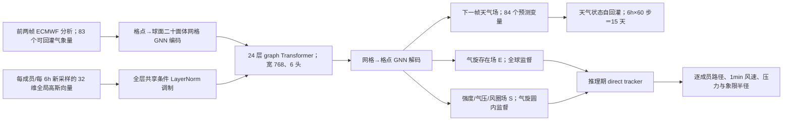

# WeatherNext Cyclones：全球天气场与最佳路径共同训练的 15 天台风集合预报

> Ferran Alet、Tom R. Andersson、Ilan Price、Stratis Markou、Andrew El-Kadi、Dominic Masters 等，*Operational tropical cyclone forecasting with AI*，*Nature* **657**, 680–688 (2026)，[2026-08-06 在线发表，DOI:10.1038/s41586-026-10953-2](https://www.nature.com/articles/s41586-026-10953-2)。本文依据[正式全文](https://www.nature.com/articles/s41586-026-10953-2)、[32 页补充材料](https://media.springernature.com/original/springer-static/esm/art%3A10.1038%2Fs41586-026-10953-2/MediaObjects/41586_2026_10953_MOESM1_ESM.pdf)（2 张补表、19 张补图）及[作者代码/轻量权重仓库](https://github.com/google-deepmind/weathernext)核读于 2026-09-24。本篇和 [WeatherNext 2 / FGN](61-fgn-weathernext2.md) 共用概率建模思想，但**气旋专用训练目标、评测对象和正式论文均不同**，故独立成篇。

## 一、研究问题与结论边界

传统全球预报掌握大尺度引导气流，台风路径通常较强，却因约 0.25° 分析网格不能解析眼墙峰值风速而低估强度；高分辨率区域模式可以改善强度，却受计算和覆盖范围限制。常见 AI 流程也先预报格点天气，再用 TempestExtremes 等算法从海平面气压和 10m 风反演气旋，训练损失中并没有“最大 1 分钟风速、风圈象限半径”等最佳路径标签。WeatherNext Cyclones（WN-C）把天气场与最佳路径转换后的密集目标**共同训练**，使粗格点网络仍能直接预测风暴的路径、强度与尺度。[正文“An ensemble weather and cyclone model”及 Methods](https://www.nature.com/articles/s41586-026-10953-2)

输出是 6h 一步、最长 **15 天**的完整全球天气轨迹与气旋轨迹；50 成员是常规业务口径，另测试 1000 成员的低概率灾害预报。论文主图最可核查的定量气旋结果多在前 **5–7 天**，而 15 天是完整滚动产出/全球天气验证时效；不能把“5 天路径误差”说成“15 天路径同样精度”。它不是从未经同化的原始卫星直接起报：初值是 ECMWF 业务分析 HRES-fc0，依赖外部传统同化系统。[正文 Fig. 1–4、Evaluation methodology](https://www.nature.com/articles/s41586-026-10953-2)

## 二、训练资料：每个字段怎么来、怎么对齐

大气端用 **ERA5**（论文方法报约 1979–2018 的预训练归档）和 ECMWF **HRES-fc0**（2016 年后可用的业务分析）；开发时数据用到 2021 年，2022 年为设计验证，测试某年之前会按冻结训练配方重训至上一年末，故不存在用 2025 年资料训练 2023 年检验的情况。ERA5 来源文件的具体截点是 **1979-01-01 至 2018-01-15**，按 00/06/12/18 UTC 抽取；12h 阶段再在 6h 序列上隔一个时次抽样。1° 阶段由 0.25° 在经纬维每 4 格抽样，**不是面积平均**。ERA5 的 6h 总降水是前 6h 的累计量，改 12h 训练时累计对应更长区间。[补充材料 §1.4.1、正文 Training methodology](https://media.springernature.com/original/springer-static/esm/art%3A10.1038%2Fs41586-026-10953-2/MediaObjects/41586_2026_10953_MOESM1_ESM.pdf)

输入/预测的全球大气场为 **6 个高空变量**（z、q、t、u、v、w）×**13 个气压层**（50–1000 hPa，见补表 2）+ **5 个单层量**（2m 温度、10m u/v、海平面气压、海表温度）= **83 个输入并预测的气象变量**；另外 **6h 降水仅作为预测目标**，所以正文 Fig. 1 称 **84 个天气预测变量**，不应把降水误记为模型初值输入。静态/时间上下文还有地面位势、陆海掩膜、格点经纬度、当地时刻与年内进度，不属于预测目标。HRES-fc0 的降水在起报步恒为 0，因此模型不读降水初值；微调和验证该目标仍用 ERA5 的降水标签。ERA5 海表温度在陆地为 NaN，改用全球子集最小 SST；HRES-fc0 陆地占位值也按同样规则统一。[正文 Problem formulation；补表 2 与 §1.4](https://media.springernature.com/original/springer-static/esm/art%3A10.1038%2Fs41586-026-10953-2/MediaObjects/41586_2026_10953_MOESM1_ESM.pdf)

气旋端是 **IBTrACS v4r01**，近 45 年约 5000 个风暴；从 3h 插值产品只取业务中心实际报告对应的 00/06/12/18 UTC。最大持续风速采用 USA_WIND 的**1 分钟平均**口径，以免把不同机构的 10 分钟风速当作同一真值；还用 USA_PRES、USA_RMW 和四个象限的 34/50/64kt 风圈半径。训练额外构造 ALL_WIND：把 CMA、NEWDELHI、REUNION、BOM 的风速各自用 **1979–2015 同时有 USA_WIND 的样本**拟合单变量线性变换，负预测截为零，再对可用机构平均；此衍生量**参与训练但不参加成绩评测**。原始 IBTrACS 路径位置在研究开发/历史验证中可用于 tracker 初始气旋，实时部署时则由 TCVitals 提供，不能把离线真值初始化误认为线上可用。[补充材料 §1.4.3、§2.1](https://media.springernature.com/original/springer-static/esm/art%3A10.1038%2Fs41586-026-10953-2/MediaObjects/41586_2026_10953_MOESM1_ESM.pdf)

**稀疏标签的格点化**是本研究关键预处理：每个真实气旋中心在 0.25° 网格上形成峰值 1、尺度 **120 km** 的测地距高斯存在场 $E$；风速、气压、最大风半径及风圈象限标量则广播到中心 120 km 圆内形成 $S$，圆外不计算损失。风速/气压/RMW 缺测保持 NaN、不造标签；某风速阈值的四象限半径若仅部分缺测，则以已有象限均值填补；四个全缺则填 0。这是**训练时**的插补策略；风圈概率评分另使用 NaN-aware 真值掩码，不能用填零的训练标签直接当风险事件真值。$E$ 全地球计算损失，$S$ 只在真实气旋圆内算，不按当天气旋数重新归一化；训练集包含热带、亚热带及温带阶段，但配对主评分只纳入观测标记为热带或亚热带的系统。[正文 Methods“Griddification”“Model training”；补充材料 §1.5](https://www.nature.com/articles/s41586-026-10953-2)

## 三、模型结构：为何粗网格仍能给出直接气旋目标

一步条件概率从前两帧天气场预测下一帧天气及 $E,S$，时间步 **6h**。主体沿用 GenCast 的格点—球面二十面体网格—格点结构：GNN 编码/解码，六次细化的二十面体网格上运行 graph Transformer；WN-C 每个独立权重种子约 **1.8 亿参数**，隐宽 **768**、**24** 层、**6** 个注意力头。GenCast 对照约 5700 万参数、宽 512、16 层、4 头，需要多次扩散去噪；WN-C 每个 6h 步**只前向一次**。在 1° 预训练阶段用五次细化网格，切到 0.25° 时升为六次细化、复用原权重，并把编码器聚合消息和除以 4 补偿邻接数增长。边特征嵌入 MLP 特别缩到 32 维以省内存；年内相位也广播到网格节点。上述并非换上卫星原始观测编码器。[正文 Model architecture；补充材料 §1.1](https://www.nature.com/articles/s41586-026-10953-2)

此图依据原文 **Fig. 1、Extended Data Fig. 2 和 Methods 自行重绘，非转载原图**。气旋场是**输出监督**，不把上一时次 IBTrACS 作为网络物理状态输入；推理期仍有**非微分的贪心 tracker**从网格输出恢复表格路径，所以“端到端”指气旋变量进入训练梯度，不等于从原始观测端到端，也不等于完全取消推理后处理。tracker 用 0.9 动量预测下一中心，在 250 km 邻域先找存在场极大值、再做概率加权的亚格点中心；500 km 内存在均值低于 $10^{-5}$ 时消亡，并在 500 km 内竞争中心时剪枝；新生候选先在 5°×5° 方块筛选存在值 >0.3。这些搜索参数用 **2022 验证集**调节，不是训练出一个另行可微的检测头。[正文 Methods“Cyclone tracking algorithm”](https://www.nature.com/articles/s41586-026-10953-2)

随机性由 FGN 的**函数空间扰动**实现：每成员、每个时次抽 32 维 $z\sim N(0,I)$，经线性映射调制多个条件 LayerNorm，调制系数在空间位置间共享，于是整场差异较连贯，而非逐像素噪声。另训练**四个独立初始化检查点**表达权重/模型不确定性，不能说 1000 成员都是 1000 次独立训练。训练用 **2 成员 fair CRPS** 约束边际分布；该损失本身不强制空间协方差，函数扰动和共享网络结构提供联合分布的归纳偏置。常规 50 成员从四检查点均衡抽样，1000 成员也按检查点均衡扩样。[正文 FGN 与补充材料 §1.1–1.2](https://www.nature.com/articles/s41586-026-10953-2)

## 四、六阶段训练与真实微调参数

| 阶段 | 资料、空间/时间步、参数更新 | 训练步与自回归 | 补表 1 的优化设定 |
|---|---|---|---|
| 1：大尺度天气预训练 | ERA5、1°/12h；除未启用的气旋输出头外训练主体 | **400k**，单步 | 峰值 LR **8e-4**；1000 步线性 warmup |
| 2：时间分辨率适配 | ERA5、1°/6h；主体继续训练 | **100k**，单步 | 峰值 LR **8e-5**；1000 warmup |
| 3：0.25° 网格适配 | ERA5、0.25°/6h；网格细化并复用旧权重 | **32k**，单步 | 峰值 LR **8e-5**；1000 warmup |
| 4：气旋头冷启动 | ERA5 + IBTrACS 格点化直接气旋目标 DCT，0.25°/6h；**冻结主体，仅训气旋输出头** | **5k**，单步 | 峰值 LR **8e-5**；1000 warmup |
| 5：天气—气旋联合训练 | ERA5 + DCT，0.25°/6h；**解冻全网端到端** | **20k**，单步 | 峰值 LR **8e-5**；1000 warmup |
| 6：业务分析与长滚动微调 | HRES-fc0 + DCT，0.25°/6h；**全网微调**、通过 rollout 反传 | **8k×1AR + 4k×2AR + 1k×3–8AR = 18k** | 1AR/2AR/3–8AR 峰值 LR 分别 **8e-5 / 8e-6 / 8e-7**，warmup **800 / 400 / 各 100** |

补表 1 其余所有阶段共同参数：**batch 64、每个训练样本抽 2 个集合成员、AdamW、weight decay 0.1、线性 warmup 后余弦退火**。第 6 阶段最长**8 个自回归步＝48h**的损失逐步平均并穿过 rollout 反传，不是训练时已经完整反传 15 天；推理才滚到 60 步。主文逐阶段说明第 **4** 阶段开始加 DCT，但补表 1 的*表题*写“stages 3–6 include DCT”，与表体（第 3 阶段数据仍只写 ERA5）和正文冲突；本表按**主文逐阶段 + 补表表体**记录，复现时仍应查公开代码/配置。作者给的完整训练成本约**每个 seed 4 天、合计 560 TPU v5p/v6e device-days**；一个 0.25°/15 天成员在单 TPU v5p 上约 **1 分钟**，不能直接与不同硬件的 NWP 墙钟时间作同机基准。[正文 Training schedule、Computational resources；补表 1](https://media.springernature.com/original/springer-static/esm/art%3A10.1038%2Fs41586-026-10953-2/MediaObjects/41586_2026_10953_MOESM1_ESM.pdf)

loss 权重同样影响复现：大多数高空场与 2m 温度设 **1**，其他单层场 **0.1**，位势 **0.5** 以缓解过拟合；存在场、最大风速、最小气压各 **10**，RMW 和象限半径各 **1**。气旋标量只在真实风暴半径内回传，而存在场全地球参与。这些数是**损失权重，不是模型最终输出的物理量权重**；因为气旋目标稀疏，10 也不能与普通格点变量的 1 直接比较。[正文“Reparameterization trick and CRPS marginal training”](https://www.nature.com/articles/s41586-026-10953-2)

## 五、验证协议与主图/补图的实质内容

2022 年选择设计和 tracker 超参，**全球天气场评估 2023**，气旋主实验 **2023–2024 全球**，2025 年另评北大西洋/东太平洋的实际上线版本；每个测试年都用前一年末之前的资料重新训练。格点天气真值是 **HRES-fc0**；路径/强度/风圈真值是 **IBTrACS**。配对气旋验证沿 NHC 同质样本协议：只有各被比较模型和真值在该 lead 都有活动风暴才纳入，并剔除非热带/亚热带观测阶段。HAFS 只覆盖北大西洋与东太平洋且到第 5 天，所以 Fig. 2 虚线前后**样本地理范围改变**，不能把曲线折点全解释为模型动力学变化。对分析型模型，主配对评分还使用前 6h 起报的“早期预报”，以最新 TCVitals 调整当前偏差并在后续 48h 衰减；无配对概率事件回报不作这项调整。它让 6.5h 分析延迟下的业务可用性更现实，但也意味着原始网络输出并非主图的全部后处理。[正文 Evaluation methodology；补充材料 §1.5](https://www.nature.com/articles/s41586-026-10953-2)

| 图/表与评价对象 | 可从论文复核的结论 | 解读时必须保留的条件/负面结果 |
|---|---|---|
| **Fig. 1**：2024 Milton 的结构/风险演示 | 84 个天气预测场与气旋专用格点输出每 6h 递推 15 天；1000 成员可映射为指定 4 天窗的 34/50/64kt 风险。 | 单个风暴情景不是全年评分；风圈内每点风速非严格径向单调，风险格点图是由近似象限半径换算。 |
| **Fig. 2a**：2023–24 配对、集合均值路径 | 第 **5 天** WN-C **230 km**，ENS **370 km**，GenCast **335 km**；在 230 km 等误差阈值上约比 ENS 提前 **>30h**、比 GenCast **约 24h**。 | 都是同质样本的集合均值/有效风暴；少于 **30%** 成员维持风暴时不定义该集合均值。HAFS 超出 5 天后退出比较。 |
| **Fig. 2b–c**：最大 1min 风速与 34kt 象限半径 | 第 **3 天** WN-C 强度 MAE 比区域 HAFS 低 **3.75kt**；34kt 半径误差低于 ENS/HAFS。 | 区域 HAFS 的训练/网格、集合均值对确定性单成员并非严格同条件；RMW 因 IBTrACS 样本过少未展示正式验证。 |
| **Fig. 3a–d**：概率路径/强度 | 路径 energy score 相对 ENS 有约 **1 天**领先；路径 spread/skill 接近 1；不少 lead 上强度 CRPS 相对 ENS/校正后 GenCast 下降 **>50%**。 | **强度校准仍总体较差**，WN-C 仍略欠离散，只是相比基线更接近 1；不能写成“已完全校准”。 |
| **Fig. 3e–f**：首 24h 快速增强 RI | RI 定义 **24h 内最大风增强 ≥30kt**；在一部分概率阈值上 CSI 可从不足 **0.3** 提到 **0.5**，概率可靠图总体接近对角线。 | 精确率—召回率彼此牵制，没有模型在所有阈值占优；高 RI 阈值样本很少。 |
| **Fig. 4、补图 9–11**：风速超过阈值的相对经济价值 REV/可靠性 | 1000 比 50 成员对第 7 天稀有风险和小 cost/loss ratio 更有价值；在比率 **0.001**，1000 成员第 7 天 REV 可超过 50 成员第 5 天。 | REV 是给定事件、成本/损失假设的决策评分，不等于实际防灾经济收益；高阈值仍略过于自信，7/10 天与 ENS 比较只用 00/12 UTC。 |
| **Fig. 5**：和 NHC 共识指引结合 | 2022 验证集固定权重后，TVCN+WN-C 路径平均改善 **28%**（不同 lead 18–38%），IVCN+WN-C 强度平均改善 **6%**（5–14%）。 | WN-C 单独对 IVCN 的**长 lead 强度反而较差**；共识收益既来自技巧也来自与传统模式的低误差相关，不等于完全替代传统指引。 |
| **补图 7/8**：独立消融 | 若**两模型都仍用分析场 tracker**，IBTrACS 联合训练只在 **5.25–7 天**带来边际而显著的路径提升，基于最低气压的强度几乎不变；改用直接气旋输出和 tracker 才带来系统强度收益。 | 不能把全部提升都归因于 32 维 FGN 或“联合训练一个动作”；两个环节各有不同贡献。 |
| **补图 18/19**：WN-C Mini | 1°、宽 512、16 层、单 seed，跳过主模型第 3 阶段，后续仍在 1°；大部分所列指标优于旧基线但弱于完整 WN-C。 | 开源轻量模型**不是**论文主图 0.25°、四 seed 系统的同一检查点，不能用 Mini 权重声称复现 230 km。 |

原论文 Fig. 2/3 可由[全文主图](https://www.nature.com/articles/s41586-026-10953-2)核对，表中是**带条件的文字化性能摘录**，不是从曲线肉眼反推未标数值。全球天气场另一条主结果是 2023 年的气象量 CRPS：相对 HRES 微调 GenCast，**99.8%** 的变量—层组合显著较好；相对 ENS，**99.2%** 的已评变量/层/时效组合较好，并在 7 天等误差点平均多 **30h**。这与台风专用评分是两套真值和统计对象，不能和 5 天 230 km 混算。显著性使用配对 bootstrap **1000** 次或非配对 HAR 推断。[正文“Global weather forecasting”与 Statistical tests](https://www.nature.com/articles/s41586-026-10953-2)

## 六、读后判断：可信贡献、已知局限与复验路线

这篇论文真正重要的是**“稀疏灾害标签 → 密集可微目标 → 与大气共享表征 → 推理再追踪”**的监督路径，让粗网格长时效模型得到气旋的强度/结构信息；补图 7/8 使“联合训练改善背景流、直接目标改善强度”的机制比只报总体优胜更可信。多 seed + 每步 FGN 采样的集合使低概率风圈风险具有可操作概率，而 Fig. 5 说明 AI 相对于传统模式的**互补性**，不是“AI 已独占最优”。[正文 Methods、Fig. 5、补充材料 §2.4](https://www.nature.com/articles/s41586-026-10953-2)

关键证据边界还有：① 初值需外部 ECMWF 分析且有约 6.5h 延迟，并非原始卫星观测直达；② 15 天推理存在，但主要气旋强度/风圈的直接定量对照集中前 5–7 天，后期活跃气旋样本会减少；③ 强度集合校准虽领先仍欠离散，最大风半径缺少足量正式验证；④ 最佳路径的 1 分钟风速与风圈半径依赖机构历史质量，四象限训练缺测填补有自己的假设；⑤ 2025 线上 tracker 曾在 9 月 25 日由 v0 换为 v1，同年回报要分清旧/新/混合线上版；⑥ 主系统需四个约 1.8 亿参数的 seed，不要把开源 Mini 性能直接外推。[正文 Discussion；补充材料 §§1.3.7、2.1、2.9](https://www.nature.com/articles/s41586-026-10953-2)

若要独立复现，优先固定 2022 验证/2023–24 回报划分与每年重新训练协议，核对补表 1 的**第 3 阶段表题冲突**；重建 IBTrACS 6h/USA_WIND/ALL_WIND 转换与双套 NaN 策略；分别运行“分析-only + 原 tracker”“DCT + 原 tracker”“DCT + direct tracker”三组，以补图 7/8 判别贡献；报告 50 与 1000 成员的同阈值可靠性、RI 精确率—召回率、30% 消散规则的敏感性，以及第 8–15 天仍有活动风暴的样本量。这样的复验才能把可生成 15 天轨迹与真正可信的 10–15 天灾害技巧连接起来。[原论文与补充材料](https://www.nature.com/articles/s41586-026-10953-2)

[返回首页](../../README.md)
