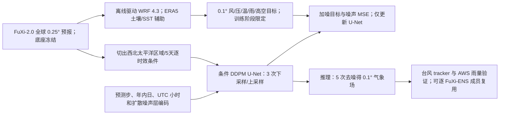

# FuXi-TC：以 FuXi 驱动 WRF 样本训练扩散式台风风雨细化器

> Shan Guo、Lei Chen、Yangyang Zhao、Yuetan Lin、Zeyi Niu、Xinyan Zhang、Ziyao Sun、Xiaohui Zhong、Hao Li，*FuXi-TC: a generative framework integrating deep learning and physics-based models for improved tropical cyclone forecasts*。[arXiv:2508.16168，2025-08-22 v1、2026-04-18 v2](https://arxiv.org/abs/2508.16168)；2026-09-08 在 [*npj Climate and Atmospheric Science* 在线发表，DOI:10.1038/s41612-026-01501-w](https://www.nature.com/articles/s41612-026-01501-w)。以下方法/主图以[29 页 arXiv v2 正文](https://arxiv.org/html/2508.16168v2)为准，补图以[正式发表附带的 21 页补充材料](https://media.springernature.com/original/springer-static/esm/art%3A10.1038%2Fs41612-026-01501-w/MediaObjects/41612_2026_1501_MOESM1_ESM.pdf)为准；论文另提供[FuXi-TC 与 WRF 脚本归档](https://zenodo.org/records/19382719)。核读于 2026-09-24。正文和正式补充材料的补图编号/个别样本计数不完全一致，下面明确标注版本与图号，避免把不同版本结果拼为同一次试验。

## 一、问题、模型边界与归档理由

FuXi 系列的全球 AI 预报在台风路径/背景环流上有长处，但由 ERA5 训练的 0.25° 场往往把台风眼墙、10m 最大风及强降水抹平。直接用 WRF 在业务时刻为每个 FuXi 预报动力降尺度虽然能恢复小尺度，却需要昂贵的 CPU 积分。本研究把昂贵物理计算前移到**训练数据构造阶段**：先以 **FuXi-2.0 的预测场**驱动区域 WRF 4.3，得到相互对齐的 0.1° 高分辨率目标；再让条件扩散模型学习从 FuXi 场快速生成该目标。推理时只运行 FuXi+扩散细化器，**不实时运行 WRF**。这和 [FuXi-ENS](39-fuxi-ens.md) 的初值扰动集合、[FuXi-S2S](../s2s/40-fuxi-s2s.md) 的 42 天逐日集合、[FuXi-2.0](51-fuxi-2-0.md) 的全球主网络是独立任务，不能合并成“一个伏羲模型”。[原文 §§1、4.1–4.3](https://arxiv.org/html/2508.16168v2)

**实际验证最长 120h/5 天**，是中期**前段的区域灾害细化**，绝非论文证实 10–15 天台风技巧，更不是 S2S。本篇放在 `medium-range`，在标题和指标处反复标注 5 天边界。英文摘要所称“matches operational ECMWF intensity”是西北太平洋的**总体/部分 lead**结论，北大西洋中间时效就存在 HRES 更强的反例。[正文 Figs. 1、6 与 Discussion](https://arxiv.org/html/2508.16168v2)

## 二、数据链：FuXi → WRF → 扩散标签 → 独立真值

| 环节 | 数据、年份和处理 | 为什么重要 |
|---|---|
| 全球背景 | FuXi-2.0 的全球预报提供 WRF 初边值与扩散条件；高空 z、T、U、V、q 在 **13 个气压层**，单层含 MSL、地面气压、T2m、D2m、U/V10m。WRF 仍从 ERA5 补**土壤量和 SST**；相对湿度由 q、气压、温度经饱和水汽压公式推导并截到 100%。 | 物理训练标签并非完全只靠 AI，ERA5 土壤/SST 仍在链中；不能声称“观测直达”。FuXi-2.0 底座本身另有训练史，本文**不重训**它。[正文 Table 2；补充 §1](https://arxiv.org/html/2508.16168v2) |
| WRF 高分辨率标签 | WRF **v4.3**、西北太平洋 **100°E–159.1°E、0.5°N–50°N**，**592×496、0.1°、56 eta 层、顶 50 hPa**，00/12 UTC 起报至 120h。以 FuXi 的预报而非 ERA5 分析驱动，并施加大尺度谱约束以维持路径对齐。**2023-04-01 至 10-31** 样本训练细化器，**2024-07-01 至 10-31** 独立测试。 | 若训练目标来自 ERA5 驱动的 WRF，目标风暴可能与 FuXi 预报路径错位，使细化器浪费容量“修正路径”；此配对设计尽量让训练集中输入和目标同一风暴。[正文 §4.1.3/4.5；正式补充 §1](https://media.springernature.com/original/springer-static/esm/art%3A10.1038%2Fs41612-026-01501-w/MediaObjects/41612_2026_1501_MOESM1_ESM.pdf) |
| 学习字段与标准化 | WRF 目标表层为 **T2m、U/V10m、WS10m、MSL、前 6h 累计降水 TP**；高空在 **200/300/500/700/850 hPa** 给出 T、q、U、V，并从 WRF 模式层线性插值。非降水变量按训练集均值/标准差做 **z-score**；TP 因长尾先做 $\ln(x+1)$，反变换再回物理空间。FuXi 区域子块/预测步与年内日、日内时次的 sine/cosine 编码共同作为条件。 | 评测暴雨时必须检查对数反变换的尾部扩大；勿用测试年估标准化统计。[正文 §§4.1.4、4.2](https://arxiv.org/html/2508.16168v2) |
| 路径/强度真值 | **IBTrACS**：西北太平洋采用 CMA agency、北大西洋采用 USA agency 的最佳路径；主图西北太平洋 **2024 年 17 个 TC**，北大西洋 **2024 年 15 个 TC**。评测只纳入真值和各比较预报同时存在的时次，排除 TD/温带阶段。ECMWF HRES/ENS 路径由 TIGGE XML 获取。 | CMA/USA 的风速定义、数据覆盖不可不加转换就跨洋合并评分；正文 §4.6 写“35 个 TC”，却与两主图和正式补表的 **17+15=32** 不一致，需以图注和案例表为本次主图口径。[正文 Figs. 1/6、§4.6；正式补表 1](https://media.springernature.com/original/springer-static/esm/art%3A10.1038%2Fs41612-026-01501-w/MediaObjects/41612_2026_1501_MOESM1_ESM.pdf) |
| 降水独立真值 | 中国气象数据服务中心 **AWS 自动站** 6h 雨量先插值至 **0.1°**，只在中国大陆陆地有效格评分；海洋/域外掩掉。事件阈值为 **0.1、10、20、40 mm/6h**，CSI=TP/(TP+FP+FN)，同时看 POD 与 FAR。 | AWS 是独立于 WRF 训练目标的观测，但站点→格点插值仍有代表性误差；不同 UTC 时次有效站点数不同，曲线锯齿不全是模型动力波动。[正文 Fig. 2、§4.6.3；正式补图 3/7/8](https://arxiv.org/html/2508.16168v2) |

WRF 的物理过程沿上海台风模式方案：Thompson 微物理、多尺度 Kain–Fritsch 积云、RRTMG 长波、Noah 陆面、YSU 边界层。谱约束只施于 **U、V 与虚温**，**不 nudging 比湿**；垂直范围只在 **850 hPa 以上**并向近地面减弱，约束较长波成分，贯穿积分。正式补充给 0.25°/0.1° 的 WRF 积分步长分别 **120s/60s**，0.1° 强度明显较好、路径相近，故选 0.1° 生成标签。正文并未逐项给出谱截止波长、松弛系数和扩散训练中每变量 loss 权重；这些参数若需严格重现，应检查作者归档的 WRF 配置，不能凭其他谱约束论文填充。[正文 §4.5；正式补充 §1、补图 1](https://media.springernature.com/original/springer-static/esm/art%3A10.1038%2Fs41612-026-01501-w/MediaObjects/41612_2026_1501_MOESM1_ESM.pdf)

## 三、网络结构与训练：什么冻结、什么真正更新

图据论文 **Fig. 7 与 Table 2 自行重绘，非论文原图**。U-Net 沿用 Diffusers，编码器/解码器各 **3 级**、通道依次 **256/512/1024**，每级 3×3 卷积、SiLU 与 GroupNorm；瓶颈含 **12 层全局自注意力**。加噪在 WRF 目标上进行，模型估计高斯噪声 $\epsilon_\theta(X_t,t,C)$；优化噪声真实值与预测值的**均方误差**，并非直接对路径误差、AWS 降水 CSI 或 IBTrACS 最大风做反传。推理采用**线性 β 日程、5 次去噪**；文中未给总扩散步数、完整 β 端点或模型总参数，不能凭 U-Net 宽度反推精确参数量。[正文 §§4.2–4.3、Eq. 5–7](https://arxiv.org/html/2508.16168v2)

训练仅更新 DDPM/U-Net，**FuXi 权重冻结**；使用 **2 张 NVIDIA A100、每卡 batch 2、60,000 iterations、AdamW β1=0.9/β2=0.95、初始学习率 2.5×10⁻⁴、weight decay 0.1**。论文没有披露学习率后续 scheduler、梯度累积/裁剪、EMA、随机种子总数或独立重复试验置信区间，所以不把它们写成已知参数。所谓“fine-tune/微调”应在这里准确表述为**在预训练/既有 FuXi-2.0 之上新增并训练独立细化模块**，不是端到端微调 FuXi。零样本北大西洋测试**没有再训练或微调**；对 FuXi-ENS 是把同一个细化器逐成员应用，而不是另训一个 ensemble 网络。[正文 §4.4、Results §2.3–2.4](https://arxiv.org/html/2508.16168v2)

推理输出仍由**修改过的 Aurora tracker**计算中心和最大风：从 IBTrACS 已知起报中心开始，最多最近 8 个 6h 位置作线性外推；在高斯平滑的 MSL 场按 4°→3°→2°→1.5° 搜索局地低压，必要时以 Z700 低值替代，再在中心邻域取最大 WS10m。若 1.5° 邻域的最大 850hPa 涡度低于 **5×10⁻⁵ s⁻¹**或最大 WS10m 低于 **8m/s**，就终止路径；不同分辨率相应调整平滑核，使搜索的物理尺度大致可比。已知最佳路径起点是离线评分的条件，不说明新生台风零初值检出能力。[正文 §4.6.1](https://arxiv.org/html/2508.16168v2)

## 四、逐图结果与不能忽略的反例

| 原文/正式补图 | 具体证据 | 限制、负面结果与解读 |
|---|---|---|
| **主 Fig. 1**：2024 西北太平洋 17 个气旋、0–120h | FuXi-TC 的最大 10m 风速 MAE 明显低于 FuXi/ERA5，与 HRES 约相当，**前 48h 优于 HRES，但末 12h 略差**；路径对 FuXi/WRF 变化很小，FuXi 系统在 84–120h 优于 HRES。 | 图中没有给出所有 lead 的精确数值标签；不从曲线硬读小数，也不据此宣称 10–15 天台风技巧。 |
| **主 Fig. 2、正式补图 3/7/8**：AWS 6h 雨量 | 在 0.1/10/20/40 mm 阈值，FuXi-TC 多数 lead 的 CSI 优于 FuXi 与 WRF/HRES 的部分阈值；高阈值物理模式比原 FuXi 更有优势。 | CSI 随阈值升高下降；AWS 00/12 与 06/18 有效样本不均导致明显锯齿，且大陆陆地评分不能推广到海上台风雨带。必须同时看 POD 与 FAR，WRF 有湿偏、前段 spin-up。 |
| **主 Figs. 3–4、正式补图 4–6**：Bebinca/Gaemi | Bebinca 的风场较原 FuXi 增强且更细；Gaemi 24h 累计雨量的重雨区和峰值更接近 AWS。正式补图 4：Gaemi 第 5 天 HRES 路径 RMSE **>500 km**，FuXi-TC **约 300 km**；该个例 20mm/6h CSI 整段 5 天优于列出的模式。 | 两个经典极端个例、13/10 次起报不是全球台风气候分布；Bebinca 强度误差前 4 天多数低于 10m/s 也只是这个个例。 |
| **主 Fig. 5、正式补图 6**：FuXi-TC-ENS | 把同一细化器逐一用于 **51 个 FuXi-ENS 成员**。Bebinca 个例中原 FuXi-ENS 峰值大约 **20m/s**、观测 **>40m/s**，细化后强度幅值和集合 spread 随 lead 增加更接近合理范围。 | 该图只给**两次起报的案例集合扇形/轨迹**，没有全季节 CRPS、可靠性或极端频率检验；“well-dispersed”不能等同已证实业务概率校准。 |
| **主 Fig. 6**：2024 北大西洋 15 个气旋 | 未做当地微调，FuXi-TC 相比 FuXi/ERA5 改善最大风；路径在 **48–120h** 较 HRES 更好。 | 强度只在**前 36h 与最后 12h**优于 HRES，**中间时效不如 HRES**；零样本泛化有价值但并非全时段胜出。北大西洋由两个与训练域同尺寸的重叠块拼接并平均重叠区。 |
| **主 Fig. 7、Table 1**：结构与速度 | 0.1°、120h 的一条 WRF 预报报告 **32 CPU / 11.5h**，FuXi-TC **单 A100 / 2min**；Fig. 7 展示条件 DDPM。 | 这是异构硬件/不同计算口径，不是严格同机算法加速；扩散细化器的标签仍需离线 WRF 成本，FuXi 主网络推理和 I/O 是否计入 2min 需复现核实。 |
| **正式补图 1/9/10/13–15**：分辨率、谱、中心气压、随机性和初值 | WRF 0.1° 相比 0.25° 主要改善强度非路径；补图 9 表明 FuXi-TC 的高波数能量比 FuXi 高，但 WS10m 在更高波数仍比 WRF 更平滑；补图 10 的 MSL 虽好于 FuXi，**HRES 整体仍最佳**。补图 14 同一 Bebinca 初值 10 次扩散采样的路径 std 通常 **<15km**、Vmax **<2.5m/s**，降水随机振幅因对数反变换更大；补图 15 两个个例改用业务 ECMWF 分析初值仍保持相对 FuXi 的改进。 | 谱能量不是直接灾害技巧；生成器本身的 10 次随机样本**远小于初值/路径不确定性**，不应把它当完整集合不确定性。补图 15 只两个台风，不能宣称所有年份业务初值普适更好。 |

上表的正式“补图”来自[发表附带补充材料](https://media.springernature.com/original/springer-static/esm/art%3A10.1038%2Fs41612-026-01501-w/MediaObjects/41612_2026_1501_MOESM1_ESM.pdf)，不是原样转贴图片；架构图为原创重绘，性能摘录保留图号、比较对象、样本和反例。正式补表 1 列 **2024 年西北太平洋 17 + 北大西洋 15＝32 个**，还列 **2025 年西北太平洋 26 个**，合计 **58 个列名案例**；本笔记引用的**主 Fig. 1/6 均是 2024 年**，不能把 2025 案例数塞进这两个主图分母。[正式补表 1](https://media.springernature.com/original/springer-static/esm/art%3A10.1038%2Fs41612-026-01501-w/MediaObjects/41612_2026_1501_MOESM1_ESM.pdf)

## 五、与系列模型的关系、风险及复验检查

FuXi-TC 的改进来自**训练目标的细尺度物理场**和条件生成，并非重新发现更好的全球环流预报器；它基本沿用 FuXi-2.0 的路径，补图 13 中两者路径几乎重合。与 WeatherNext Cyclones 的“全球 15 天+直接气旋强度标量监督”相比，FuXi-TC 是“区域 5 天+WRF 教师场细化”，两个模型解决的问题、真值与计算费用不能互换。论文的贡献是用一次离线 WRF 预算训练可复用、可跨盆地和逐 FuXi-ENS 成员应用的细化器；同时承担了 WRF 物理方案和谱约束的**教师偏差**。作者 Discussion 也明确指出 NWP 物理方案误差可能锁定上限，下一步拟用真实观测校正。[原文 Discussion](https://arxiv.org/html/2508.16168v2)

严格复验要做四组消融：同一 FuXi 预报分别接 ERA5 训练的图像式细化器、FuXi 驱动但无谱约束的 WRF 教师、目前 WRF 教师、和更真实观测/分析校正目标，分辨“物理一致配对”和“扩散网络本身”的贡献；保留 2023/2024 跨年切分，给不同种子和更多台风的 CI；把雨量按 00/12 与 06/18 有效站数、按阈值分层，同时报告 POD/FAR；对 51 成员系统补齐全季节 CRPS、rank、spread/skill 和登陆极端事件 Brier/可靠性检验。正式文章的 2025 补表案例可作为进一步独立核验起点，但不能未经图表证据把它宣传成已经完整发表的 2025 概率验证。[原文与作者归档](https://zenodo.org/records/19382719)

[返回首页](../../README.md)
