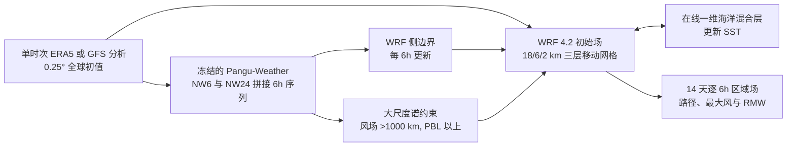

# Pangu–WRF：两周热带气旋预报中的机器学习—物理模型耦合

> Hao-Yan Liu、Zhe-Min Tan、Yuqing Wang、Jianping Tang、Masaki Satoh、Lili Lei、Jian-Feng Gu、Yi Zhang、Gao-Zhen Nie、Qi-Zhi Chen，*A Hybrid Machine Learning/Physics-Based Modeling Framework for 2-Week Extended Prediction of Tropical Cyclones*，*Journal of Geophysical Research: Machine Learning and Computation* 1，e2024JH000207，**2024-07-19 首次发表**，[正式全文及图表](https://agupubs.onlinelibrary.wiley.com/doi/10.1029/2024JH000207)，[第一作者公开 PDF](https://faculty.nuist.edu.cn/liuhaoyan/en/lwcg/212325/content/129973.htm)。2026-09-24 按 18 页正式论文和图 1–7 阅读。期刊列有 1.3 MB 补充材料 S1，但下载接口本次返回 403；以下不把未核对的补图 S1–S8、表 S1 当成独立数值证据。

## 研究问题与结论范围

Pangu-Weather 在大尺度环流和气旋路径上已有优势，却以 0.25° 全球格点平滑掉内核，难以直接给出可信的最大风速与最大风半径（RMW）。2 km 级区域 WRF 能解析更紧凑的结构，但只给侧边界时，其内部大尺度环流可以在长积分中偏离驱动预报，使路径漂移，又反过来改变海温、垂直风切等强度环境。论文的假设是：**用 Pangu 给 14 天大尺度轨迹，用 WRF 产生高分辨率强度，再以谱约束持续锁住 WRF 的引导气流，辅以在线海洋混合层而非未来真实 SST**。[§1–2](https://agupubs.onlinelibrary.wiley.com/doi/10.1029/2024JH000207)

作者在 2018–2023 年五个跨海盆长寿命气旋上报告：完整方案相对四个 TIGGE 全球确定性 NWP 的两周平均路径/强度误差分别降低 59%/32%；相对单独 Pangu 分别降低 2%/59%；相对 ERA5 驱动 WRF 分别降低 32%/23%。这表示真正新增的强项是把路径技巧**保留**在高分辨率模拟中，同时改善强度和结构，而不是宣称相对 Pangu 的路径大幅跃升。五场个例、每场一个主要初始化时刻的概念验证，不能外推为所有两周台风的业务可靠性。[摘要、§4](https://agupubs.onlinelibrary.wiley.com/doi/10.1029/2024JH000207)

## 数据、样本选择与处理

| 环节 | 原文实际做法 | 解读和复现边界 |
| --- | --- | --- |
| 全球初值 | ERA5 再分析与 NCEP GFS 业务分析，均为 0.25°。Pangu(ERA5) 与 Pangu*(GFS) 为初值敏感性对照；四组 WRF 试验统一用 ERA5 初值。 | Pangu 主结论采用与其训练域相近的 ERA5 初值，不能直接等同于以实时 GFS 初始化的业务表现；GFS 版本路径/引导气流通常更差。 |
| 气旋真值 | IBTrACS-WMO v4，每 6 h 提取中心经纬度、近地最大持续风、中心气压与 RMW。 | 路径、强度和结构的真值不是 ERA5 涡旋；不同机构的风速定义可能不同，重做实验要固定 WMO 口径。 |
| NWP 对照 | TIGGE 中 CMA、CMC、NCEP、ECMWF 四套全球确定性预报，作者取可用的最高 0.5°，高空层 1000/925/850/700/500/300/250/200 hPa。 | 对照不是同分辨率、同初始化系统的端到端公平训练实验；TIGGE 涡旋提前消散使长 lead 可评分样本减少。 |
| 五个试验气旋 | Hector（东太，2018-07-31 12 UTC）、Florence（北大西洋，2018-09-01 00）、Surigae（西北太，2021-04-14 00）、Sam（北大西洋，2021-09-23 00）、Freddy（南印度洋，2023-02-07 00）。 | 先以全生命期大于两周且连续两周超过 17 m/s 筛选出六场；Dorian 2019 因四个 NWP 不能连续表示而被排除。这是困难个例的选择性缺失，不是随机五场样本。 |
| 其他观测 | 可见光卫星云图取美国海军研究实验室档案；Fig. 7 将其与 WRF 模拟亮温/云结构作定性对照。 | 云形相似不等于已经用独立雨量站或雷达定量证明降水技巧；原文的“雨量分布改善”至多是该图的间接判断。 |

以上来自[§3.1–3.2、表 1](https://agupubs.onlinelibrary.wiley.com/doi/10.1029/2024JH000207)。文中给出了原始分辨率和资料源，但没有完整公开把 Pangu 各气压层插值到 WRF 60 层、缺测/外推、涡旋追踪阈值及 IBTrACS WMO 风速转换的逐步代码；复现不能自行假定这些细节已被论文规定。

## 模型结构：不是训练一个新的端到端网络

示意图按[原文图 1 与 §2–3](https://agupubs.onlinelibrary.wiley.com/doi/10.1029/2024JH000207)重绘。**Pangu** 直接使用已发布的 NW6/NW24 权重：每个 24 h 周期由 NW6 递推 6/12/18 h，由 NW24 从该周期 00 UTC 直接给下一个 00 UTC；再重复，形成每 6 h 的 14 天驱动。它输出 13 个气压层的位势、比湿、温度、u/v 风，加 2 m 温度、10 m u/v 风和海平面气压；本文没有重新训练或针对台风微调 Pangu。[§3.3](https://agupubs.onlinelibrary.wiley.com/doi/10.1029/2024JH000207)

**WRF 4.2** 采用 18/6/2 km 双向嵌套三网格，D02/D03 各为 271×271 且随气旋移动；D01 按风暴为 691×331、661×481、531×451、531×531 或 731×301。垂直 60 层，顶压 50 hPa。微物理 WSM6，长/短波 RRTMG，边界层 YSU，陆面 Noah；仅 D01 使用 Kain–Fritsch 积云参数化，海表通量采用适于强风的粗糙度及耗散加热方案。小尺度内核主要由 WRF 自由演化，不是用 Pangu 格点直接插值出 2 km 台风结构。[§3.4、表 1](https://agupubs.onlinelibrary.wiley.com/doi/10.1029/2024JH000207)

**谱约束（SN）** 在 WRF 全积分期间连续施加，驱动场每 6 h 更新；仅将 Pangu 的水平风中波长大于 1000 km、边界层以上的成分用于调节，系数 0.0003。如此减少 WRF 的大尺度引导流偏差，尽量不直接钳住气旋眼墙。**海洋混合层（OML）** 与 WRF 在线耦合，以 50 m 初始混合层深度、水温垂直递减率约 −0.14 K/m，模拟风暴冷尾迹对 SST 的反馈；该简化一维模型并非完整海气耦合集合。[§2.2–2.3](https://agupubs.onlinelibrary.wiley.com/doi/10.1029/2024JH000207)

## 训练流程、参数与微调的准确边界

这篇论文**没有为混合框架训练新神经网络**，所以不存在本文的 batch size、优化器、学习率、训练轮次或 LoRA/全量微调设置。它借用 Pangu-Weather 在 1979–2017 ERA5 小时资料上预训练好的 NW6 与 NW24 网络，并通过物理模型运行期的侧边界、谱约束与 OML 参数做耦合。Pangu 原论文的网络训练细节要到[其独立论文](https://www.nature.com/articles/s41586-023-06185-3)核验，不可把那里任何超参数误写成刘等 2024 的新训练日程。这里可调的是 **WRF 物理和网格配置、SN 1000 km 阈值/0.0003 强度/6h 更新、OML 50m/−0.14K/m**；原文并未报告对这些参数的大规模搜索、独立验证集或学习型校准。[§2–3](https://agupubs.onlinelibrary.wiley.com/doi/10.1029/2024JH000207)

论文给出原型计算成本：Pangu 14 天约 10 核 Intel Xeon Gold 6126 上小于 2 h；WRF 约 192 核 Xeon Gold 6226R 上 15 h，端到端近 16 h。它说明实时系统在计算上可行，但没有包括分析资料延时、排队和业务容错等全流程 SLA。[§2](https://agupubs.onlinelibrary.wiley.com/doi/10.1029/2024JH000207)

## 六组设计及其能回答什么问题

| 实验 | 全球/区域驱动与 SST | 可回答的问题、不可回答的问题 |
| --- | --- | --- |
| Pangu、Pangu* | 同一冻结网络，分别以 ERA5、GFS 分析起报。 | 检查初值域移；两者路径差异不能归因于模型结构变化。 |
| WRF-ERA5 | ERA5 初值、每 6h 的**未来 ERA5**侧边界和 SST，无 SN。 | 提供受再分析驱动的物理对照；未来 ERA5 并非实时可得，不是业务预测。 |
| WRF-ERA5-OML | 如上，改为在线 OML 更新 SST。 | 只隔离简化海洋反馈；仍使用未来 ERA5 边界。 |
| WRF-Pangu-OML | ERA5 初值、Pangu 预报侧边界、在线 OML，无 SN。 | 检查单纯动力降尺度能否保留 Pangu 路径：结果表明强度/结构变好，路径没有可靠改善。 |
| WRF-Pangu-OML-SN | 上一实验再加 Pangu 风场大尺度 SN。 | **完整方案**，隔离 SN 对大尺度引导和路径的重要作用；不是独立的新深度学习模型。 |

设计见[表 2、§3.5](https://agupubs.onlinelibrary.wiley.com/doi/10.1029/2024JH000207)。所谓“仅需单时次全球分析”的部署说法适用于完整方案运行时：14 天后续驱动全部由该初值下的 Pangu 预报生成；对照组 WRF-ERA5/OML 仍用未来再分析，不能用来声称它们也可实时运行。

## 逐图解读与真实性能

| 来源 | 读到的结果 | 必须同时阅读的限制 |
| --- | --- | --- |
| 图 1 | Pangu 全球路径、WRF 边界/谱驱动、移动嵌套内核、在线 OML 四环节在 Freddy 个例中连接。 | 流程图证明方法组合，不是单靠图 1 证明各组件增益；要看表 2 的配对实验。 |
| 图 2 | 对五场 TC，以**最佳路径中心**为圆心，在 250–850 hPa、3° 纬距（约 333 km）算引导气流；ERA5 初始化 Pangu 的速度和 u/v 偏差/RMSE 较四个 TIGGE 对照低。 | 即便各模式实际涡旋中心不同，评估仍围绕观察中心，有利于比较同一区域环境，却未必等于模式自身涡旋感受的引导流；作者试算 5°/7°，但未展示曲线。 |
| 图 3a–f | 完整方案在五场样本上联合降低 14 天路径、最大风及 RMW 误差；平均相对 NWP 为 **−59% 路径/−32% 强度**，相对 Pangu 为 **−2%/−59%**，相对 WRF-ERA5 为 **−32%/−23%**。第 7 天平均路径误差略低于图中的 335 km 参考线。 | 图下逐时标可评分个数，后期其他预报涡旋消失；不能把不同 lead 的样本视为恒定五场完整配对。335 km 与 10.9 m/s 虚线是外部 5 天参考阈值，不是本研究在同样样本上与当前业务的严格配对比较。 |
| 图 3 的消融 | WRF-Pangu-OML 仅从 Pangu 下采样/运行 WRF，强度和 RMW 好于粗格全球模型，但路径与 WRF-ERA5-OML 接近；再加 SN 才保留 Pangu 路径。OML 相对 ERA5-SST 对路径/强度/RMW的增益较小。 | 从结果看“强度大幅改善全部来自 OML”不成立；主要改进分别依赖细网格结构和 SN 的引导流。 |
| 图 4，Freddy | ERA5 初始化 Pangu 在第 7/14 天路径误差 **193/607 km**，四个全球确定性 NWP 的相应均值 **665/6837 km**；Pangu 最大风约 20 m/s、明显偏弱。完整方案克服无 SN 的 WRF 第 7 天后南偏与过早减弱。 | **6837 km 是 Freddy 单案第 14 天的四模式均值**，受部分轨迹偏离/消失影响，不能作为全球/全年平均。GFS 初始化 Pangu* 也与 Pangu 有明显差异。 |
| 图 5，Freddy 环流 | 第 9 天、850 hPa，未约束 WRF 中 Mascarene High 和 Dingani 位置偏差及虚假气旋改变相互作用；加 SN 后背景位势高度和两气旋路径更接近 Pangu/ERA5。 | 这是机制性个例，不可仅凭一张空间图证明每个海盆每场气旋的路径修正原因完全相同。 |
| 图 6，内核 | 第 9 天 Freddy 的径向/切向风剖面：Pangu 与部分全球 NWP 内核松散、弱；WRF 对入流、上层出流及眼墙更能解析，完整方案涡旋最有组织。 | 原文称 WRF RMW 约 40 km，更接近 best track 约 10 km；“改进”并不等于已经解析到观测真实眼墙尺度。 |
| 图 7，云形 | 第 9 天后 6 h 的可见光云图与 WRF 模拟亮温比较；完整方案的云团大小/形态更接近约 600 km 观测云盾。 | 不同物理量图像只作定性比较；作者没有在本文给出独立降水技能评分，不能宣称 14 天定量降水获胜。 |

全部图号、对照及数值均按[正式全文 §4–5、图 1–7](https://agupubs.onlinelibrary.wiley.com/doi/10.1029/2024JH000207)核对；表为原创重排，未复制论文原图。正文引用的补充图 S1–S8 和表 S1 本次未能打开，不从其标题推断未公开的细分数值。

## 为什么归入中期，而不是 S2S 或同化

实测对象是**单个热带气旋的路径、强度和结构，逐 6 h 运行到第 14 天**，正落在本库中期预报的时效上限。它不是预报第 3–6 周气旋活动概率的 S2S 模型，也不是把卫星原始辐射或站点观测同化成初值的方法；分析初值来自 ERA5/GFS。可与[FuXi-TC 的 5 天生成式细化](64-fuxi-tc.md)、[WeatherNext Cyclones 的全球概率台风模型](63-weathernext-cyclones.md)、[GEM–GraphCast 谱约束](50-gdps-graphcast-spectral-nudging.md)在“全球 AI 驱动区域/物理模型”的方法层面对读，但它们的样本、时效、变量和性能百分比不可直接排名。

## 局限、负面证据与复验清单

1. **样本选择风险**：六个满足长寿命条件的风暴中排除了 Dorian，因为对照不能稳定追踪；应另做包含失败个例的检测率/失踪惩罚，并以多初值、多季节而非五场单次起报验证。
2. **初值域移**：主混合框架用 ERA5 初始化，Pangu*(GFS) 较差；若主张业务实时使用，应在 GFS/业务分析上重跑整个 WRF-Pangu-OML-SN，而不只是重跑裸 Pangu。
3. **公平性与不确定性**：TIGGE 0.5° 与 Pangu 0.25°、WRF 2 km 不同分辨率，NWP 各有不同资料同化/版本；论文没有多成员概率分布、可靠性、统计显著性区间，不能等同集合预报系统。
4. **未来资料泄露只限对照组**：WRF-ERA5 使用未来每 6 h ERA5 边界；它可作物理上界参照，却不是可部署的先验预报。对照组 WRF-Pangu-OML-SN 和 WRF-Pangu-OML 则仅依赖起报分析加 Pangu 自身未来预报。
5. **参数与代码披露**：复现实验须锁定 Pangu NW6/NW24 权重版本、ERA5/GFS 初值时间、WRF 4.2 物理选项与移动网格、1000 km/0.0003 谱约束、OML 50 m/−0.14 K m⁻¹，并索取/核对完整 WRF namelist、涡旋追踪代码、分数逐案原始数据及期刊 S1 补充材料；不能把没找到的训练超参补写成本文已披露。

这篇论文的工程价值在于可解释的分工：Pangu 提供长时效引导流，WRF 解析内核，SN 维护两者一致性，OML 避免把未来海温当输入。但数据仅证明五个筛选个例上的方案潜力；下一步应在独立年份、全海盆高频起报和实时初值下检验路径—强度联合误差与提前消散率。[正式论文结论和数据/软件声明](https://agupubs.onlinelibrary.wiley.com/doi/10.1029/2024JH000207)
