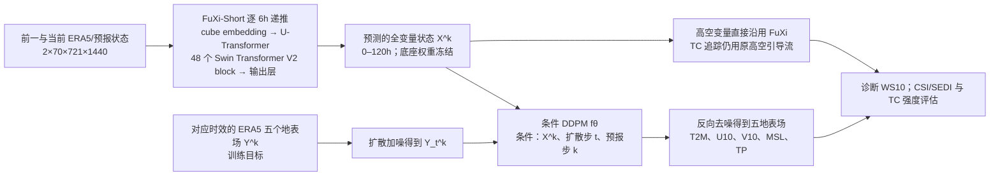

# FuXi-Extreme：冻结伏羲底座、用条件扩散修复五天极端降雨与风速

> Xiaohui Zhong、Lei Chen、Jun Liu、Chensen Lin、Yuan Qi、Hao Li，*FuXi-Extreme: Improving extreme rainfall and wind forecasts with diffusion model*。[2023-10-25 arXiv:2310.19822v1 开放全文](https://arxiv.org/html/2310.19822v1)；2024-10-15 发表于 *Science China Earth Sciences* 67:3696–3708，[期刊 DOI 与正式书目信息](https://link.springer.com/article/10.1007/s11430-023-1427-x)。本笔记 2026-09-24 核对：数值、公式和图表判断来自**开放的 v1 全文**，期刊页面可核对正式出版日期和摘要，但正式正文为订阅内容，未将其视作已取得的新版全文。若日后取得正式正文，应逐项检查修订差异。

## 一、研究问题、贡献和时效边界

FuXi 的确定性预报在多年、全球平均误差指标上具有竞争力，但递推越久，近地面降水和风的局地峰值越容易被平滑。FuXi-Extreme 的提问并非“再训练一个更长预报时效的 FuXi”，而是：在**保持 FuXi-Short 大尺度预报不变**的条件下，能否用条件去噪扩散模型（DDPM）修复其 0–5 天的五个地表场，进而提高强降水、强风和高温尾部分布的事件检出？这使它与[原始 FuXi 15 天级联](https://www.nature.com/articles/s41612-023-00512-1)、[FuXi-ENS 概率集合](39-fuxi-ens.md)和[FuXi-TC 区域台风细化](64-fuxi-tc.md)是不同的研究问题，须单列论文。[原文 §1、§3](https://arxiv.org/html/2310.19822v1)

论文自己的直接实验止于**逐 6 小时、120 小时/第 5 天**。虽然被作为“中期前段”放在 `notes/medium-range/` 以便跟踪 FuXi 系列，它不证明第 10–15 天的极端降雨或风速技巧，也不提供第 3–6 周 S2S 检验。DDPM 可以产生样本，但本文主要评测确定性的 CSI、SEDI、RMSE、ACC、台风路径和强度；没有对成员数、CRPS 或可靠性图做独立概率集合基准，不应因“扩散”一词把它和 FuXi-ENS 等同。[原文 §4](https://arxiv.org/html/2310.19822v1)

## 二、资料、标签、时序和预处理：已知与未知分别列出

| 数据角色 | 原文明确内容 | 复现时不能擅自补写的内容 |
| --- | --- | --- |
| 气象基础资料 | ERA5 **0.25°、6 小时**；本文 DDPM 用 **2012–2017 六年**训练，**2018** 测试。基础 FuXi 是此前用约 39 年 ERA5 训练的模型，本文只调用其 0–5 天 FuXi-Short。 | 本文没有为 DDPM 独立标出验证集年份、每月采样权重或季节平衡办法；不能把基础 FuXi 的 39 年训练期当作本 DDPM 的 39 年训练期。 |
| 预报输入 | 基础 FuXi 每步吃前一帧与当前帧，形状 `2×70×721×1440`，由高空和地表资料组成。条件 DDPM 接收 FuXi 对**所有变量**的预报场、扩散步 `t` 和预报 lead `k`。 | 论文没有给条件张量如何拼通道、是否裁 patch、是否按变量用不同尺度、lead 编码维数与缺测掩码。70 是 FuXi 底座输入通道，**不是** DDPM 的五个输出数。 |
| DDPM 输出/ERA5 监督 | 五个 0.25° 地表量：`T2M`、`U10`、`V10`、`MSL`、`TP`。6 小时累计降水 `TP` 与后验雨强阈值对应；`WS10=√(U10²+V10²)` 为评测时的诊断风速。 | 原文没有逐变量归一化公式/均值方差、降水零值与偏态处理、负降水裁剪或 U/V→WS10 的训练期独立加权；作者明确指出 WS10 **没有直接优化**。 |
| 常规评分与气候阈值 | 2018 ERA5 是全球场 CSI、SEDI 及 RMSE/ACC 的验证真值。SEDI 的 90/95/98/99.5 百分位按格点、月份、UTC 时次、变量，用 **1993–2016 ERA5** 气候态构造。 | 不能把 ERA5 百分位解释为独立站点观测分位数；期刊版若改动阈值构造，需再核对。 |
| 台风独立参照 | 2018 **IBTrACS** 为台风路径/强度观测参照；另用 ERA5 追踪得到的台风强度作第二套真值。ECMWF HRES 台风轨迹由 TIGGE XML 的 `forecast` 标签提取。 | 这两套强度真值不等价，不能将基于 ERA5 的“优于 HRES”与基于 IBTrACS 的“弱于 HRES”平均成统一冠军。 |

以上来自[§2、§3.1、§3.3、附录 A](https://arxiv.org/html/2310.19822v1)。论文图 4/5 指出 HRES 原始网格为 0.1°，但全球评分对 ERA5 0.25° 进行；原文并未完整披露 HRES 到 ERA5 网格的重映射算子、插值权重或守恒处理。这会影响小尺度降水/风极值比较，故不自行补成“保守插值”。

## 三、模型机制：条件 DDPM 只改地表，不改 FuXi 的动力路径

这是依据[原文图 1 和 §3.1](https://arxiv.org/html/2310.19822v1)的原创流程重绘，不转载论文原图。基础 FuXi 的 U-Transformer 包括下采样、48 个 Swin Transformer V2 block 和上采样，最后用全连接层形成预测。论文说“DDPM 以所有 FuXi 变量作条件”，但只重建五个地表变量；台风追踪所需 200/500/700/850 hPa 高空风和位势来自未改动的 FuXi，因此台风**路径几乎未变**有机制上的合理性，而非扩散器改善了高空引导流。[§3.1、§4.2](https://arxiv.org/html/2310.19822v1)

正向扩散逐步给目标 ERA5 地表场 `Y^k` 加高斯噪声，反向模型学习从噪声场、FuXi 条件和两个时间索引恢复地表结构。这里需要区分**预报时间 `k`**（第几个 6h 预报）与**扩散时间 `t`**（一次去噪中的噪声步）：前者让网络适应 FuXi 随 lead 变大的误差，后者控制生成过程。通常 DDPM 教科书使用噪声预测目标；本文 §3.1.2 的式 (3) 先介绍该通用目标，但**实际式 (5) 明确改为预测原始目标 `Y^k` 的 MSE**，不应把教科书 ε-prediction 误写成本实验损失。原文式 (2) 条件符号与式 (4) 字母有排版不一致，阅读时以式 (5) 和正文叙述为准。[式 (1)–(5)](https://arxiv.org/html/2310.19822v1)

## 四、训练、微调和公开参数

| 阶段 | 权重与样本 | 论文明确的训练设置 | 必须保留的未披露项 |
| --- | --- | --- | --- |
| 基础 FuXi-Short | 使用已训练的 **0–5 天** FuXi，本文阶段**完全冻结**；逐步产生条件预报，而不是用 ERA5 真值代替有误差的 FuXi 预测。 | 本文重述其双时次 70 通道、U-Transformer/48 Swin V2 block；基础 FuXi 的详细预训练日程属于[另一篇论文](https://www.nature.com/articles/s41612-023-00512-1)，不能嫁接成本论文 DDPM 超参。 | 本文不报告对 FuXi-Short 做新的 2012–2017 微调；没有证据支持 LoRA、层冻结解冻或端到端更新底座。 |
| 条件 DDPM 训练 | 用 2012–2017 ERA5 五地表量为目标，FuXi 每次产生相应 lead 的条件场；仅更新扩散器。以目标 `Y^k` 的 **MSE** 训练；条件含 FuXi 全变量、`t` 和 `k`。 | **120,000 iterations，约 24h，8×NVIDIA A100，每卡 batch 1（总 batch 8）**；AdamW `β=(0.9,0.95)`、初始 LR `2.5×10⁻⁵`、weight decay `0.1`、Scheduled DropPath `0.2`。[§3.2](https://arxiv.org/html/2310.19822v1) | 文中没有可复现的 DDPM 骨干层数/通道、参数总量、噪声 β 日程、扩散/反向采样总步数、推理 sampler、完整 LR 曲线、变量损失权重和随机种子；不能填造。 |
| 下游微调/联训 | 本文未报告第二阶段解除 FuXi 冻结的真实训练，也未报告针对台风的单独微调。 | **无可填的 epoch、LR 或冻结范围**；所有五地表改善来自固定底座上训练的 DDPM。 | [复旦机构介绍](https://ai3.fudan.edu.cn/info/1062/1242.htm)曾写“扩散模型模块单独训练后，再端到端训练”，但开放原论文 §3.2 明确说 **only the parameters of DDPM model are updated**。两者存在口径冲突，本笔记以原论文方法作为可复核事实，不把机构短文的端到端阶段补写成已验证实验。 |

这里的“微调”不能宽泛地指“在 FuXi 之后接 DDPM”：这是**训练新的条件生成后处理器**，而不是对 FuXi 70 通道预报底座继续梯度更新。论文亦没有用 2018 台风样本训练台风专用头。[§3.2、表 2](https://arxiv.org/html/2310.19822v1)

## 五、评分设计和原图表：极端技巧与平均误差方向不同

### 5.1 两种事件指标为何不能混为一谈

**CSI** = 命中/(命中+空报+漏报)。降水 6h 绝对阈值是 **2.5、6.25、25、62.5、70 mm**；WS10 绝对阈值是 **13.9、17.2、20.8、24.5、28.5、32.7 m/s**。降水阈值从中国 24h 降水分级值除以 4 而来，并非作者拟合出最优阈值；高阈值事件稀少导致 CSI 变低。**SEDI** 用命中率和空报率的对数组合，对格点/月/UTC 时次的 **90、95、98、99.5 百分位**做异常尾部检出；不同沙漠与雨林格点的绝对雨量阈值自然不同。论文没有给各图曲线逐点数据表，因此下表只写原文可核验的**方向和具体阈值**，不从图像估算小数。[§3.3、图 2–3](https://arxiv.org/html/2310.19822v1)

| 图/指标/真值 | 可直接核对的性能关系 | 重要的反面或边界 |
| --- | --- | --- |
| 图 2；2018 ERA5；6h TP 的 2.5/6.25/25/62.5/70 mm CSI，lead 0–120h | FuXi-Extreme 整体最高；与 FuXi 的差距在高阈值、较长 lead 更明显。 | 裸 FuXi 在低/中阈值可优于 HRES，但 62.5 与 70 mm 对 HRES 落后；不能写成 FuXi 原本就擅长所有极端雨量。 |
| 图 2；2018 ERA5；WS10 的 13.9–32.7 m/s CSI | FuXi-Extreme 总体高于 FuXi/HRES。 | 风速由 U/V 诊断，模型没有直接风速损失；静态阈值的风灾风险不能直接外推到站点阵风。 |
| 图 3；2018 ERA5；T2M/TP/WS10 90/95/98/99.5 百分位 SEDI | FuXi-Extreme 在文中这些指标和 lead 上最高；T2M 全 5 天 SEDI **超过 0.6**。 | 90 百分位 FuXi 与扩散版很接近；裸 FuXi 在 99.5 百分位比 HRES 差。TP 相比 T2M 的极端检出最难。 |
| 附图 B.4；2018 ERA5；三地表量的全球面积加权 RMSE、ACC | FuXi 和 FuXi-Extreme 均优于 HRES；两种 FuXi 总体接近。 | **FuXi 本体在 T2M、TP、WS10 三量的平均 RMSE 略低、ACC 略高于 FuXi-Extreme**。尾部改善是与平均误差的小幅权衡，不能简写成“所有指标均升级”。 |
| 图 4–5；台风 Rumbia，2018-08-15 12 UTC 起报的 6/60/120h 场 | 扩散后 TP、WS10 的纹理细节较 FuXi 丰富，较长 lead 更明显。 | 这是**单次个例展示**；ERA5 真值本身比 0.1° HRES 平滑，“看起来细”并非独立高分辨率真值的误差检验。 |

附录图 A.1–A.3 不是预报性能图，而是 ERA5 的 T2M、TP、WS10 **空间/季节百分位阈值图**，展示 March/June/September/December 的 90 百分位及 95/98/99.5 相对 90 百分位的差值。它们支撑 SEDI 使用逐格逐月基准的必要性，但不能把附图色阶当作新模型的预测能力。[附录 A/B](https://arxiv.org/html/2310.19822v1)

### 5.2 台风实验：29 次起报、共同检出筛选、两套真值翻转

台风追踪先在 IBTrACS 初始中心 **445 km** 内找最低 MSL，随后用前一步位移线性外推与 **200/500/700/850 hPa** 平均引导风共同预估下一中心，再在预估点 445 km 内找 MSL 局地极小。候选需满足 **278 km** 范围内 850 hPa 涡度绝对值 `≥5×10⁻⁵ s⁻¹` 等条件；陆地还需 WS10 `>8 m/s`，高地 `>1000 m` 或无合格候选即中止。式中上层风来自仍冻结的 FuXi，扩散版只替换地表场。[§3.3.3、表 1](https://arxiv.org/html/2310.19822v1)

| 表 2 的 2018 TC | 共同检出后的起报数 | 解释 |
| --- | ---: | --- |
| Maria | 5 | 00/12 UTC 多次 5 天轨迹 |
| Rumbia | 2 | 其中一个个例不足完整 120h，展示图不能充当全年平均 |
| Mangkhut | 4 | 台风个体与起报次数不可混同 |
| Kong-Rey | 9 | 同一台风的相邻起报有很高相关性 |
| Yutu | 9 | 五场共 **29 次**，不是 29 个独立气旋 |

该纳入规则只保留 **IBTrACS/ERA5、HRES、FuXi、FuXi-Extreme 共同能够检测到的 TC**，因而评测的是共同检出后的路径和强度，不含模型漏检气旋的全部风险，也不能用来证明全球 TC 发生概率技巧。[§2.2、表 2](https://arxiv.org/html/2310.19822v1)

| 图/真值 | 路径 MAE | 强度 RMSE 的结论 |
| --- | --- | --- |
| **图 6 对 IBTrACS** | 第 0–2 天 FuXi-Extreme 略不如 FuXi/HRES；再往后 FuXi 与 FuXi-Extreme 路径均优于 HRES，两个 FuXi 路径差异很小。 | FuXi-Extreme 的最大 WS10 较裸 FuXi 改善，但 **HRES 的 WS10 与中心 MSL 强度 RMSE 仍最低**；扩散版 MSL 相对裸 FuXi 改善不明显。 |
| **图 7 对 ERA5** | 两个 FuXi 的路径优势方向相近。 | FuXi/FuXi-Extreme 对 ERA5 的强度 RMSE 小于 HRES，和 IBTrACS 真值下结论**反转**。 |

作者解释反转与 ERA5 中台风强度偏弱、结构比 HRES 平滑有关：ERA5 的中心 MSL 更高、最大 WS10 更低，直接以 ERA5 为训练真值的模型天然更接近该真值。读者因此不能只挑 ERA5 图 7 宣称 FuXi-Extreme 的台风强度“优于业务 HRES”；面对独立 best-track 的图 6 恰好相反。原文图 6/7 没有公开逐 lead 的精确数字表，故本笔记不从曲线读取伪精确公里或 m/s 值。[§4.2、图 6–7](https://arxiv.org/html/2310.19822v1)

## 六、局限、复验顺序和阅读判断

1. **分布改善不等于无条件升级**：图 2/3 的极端事件识别增加，但附图 B.4 常规三变量 RMSE/ACC 稍退步。复现实验宜同时给阈值技巧、均值误差和概率校准；若只贴极端 CSI，将掩盖平衡代价。
2. **标签上限**：ERA5 0.25°、6h 对小尺度强降水/台风核心仍可能低估；HRES 原始 0.1° 比 ERA5 更“细”并不直接说明 HRES 错。优先用独立雨量站、雷达、best-track 验证真实灾害值；本文没有对全球地面站给完整验证。
3. **样本独立性**：台风只 5 场、29 次高度相关起报，并排除了至少一个系统未检测的事件；应给按台风而非按起报 bootstrap 的区间及漏检率。原文未给这些统计，不应声称差异显著。
4. **缺失的生成设置**：噪声 schedule、采样步数/器、网络层宽、参数量、归一化/缺测方案未披露到可直接复现的程度。公开的 FuXi 代码链接不是这一后处理器完整训练 recipe 的替代；正式期刊正文与独立 DOCX 附件也未直接核验。
5. **与中期/S2S 的准确关系**：它证明的是冻结 5 天 FuXi-Short 的地表尾部后处理；若要声称 10–15 天 FuXi-Medium/Long 效果，需要把后处理器用于那些 lead 重训/验证，原文没有完成。概率集合性质也需要多样本/校准/CRPS 另测，而不是由 DDPM 架构直接推定。

我的阅读判断：最有价值的不是“生成图更锐”，而是同一研究同时提供**极端 CSI/SEDI 改善、均值 RMSE/ACC 略退、独立 IBTrACS 强度弱于 HRES、ERA5 真值又反转**四条可相互制约的证据。它提示后续伏羲系列研究在报告“极端天气改进”时，必须同时交代训练/验证真值、事件筛选、常规技巧代价和真实观测验证。[开放全文结论及附录](https://arxiv.org/html/2310.19822v1)

[返回首页](../../README.md) · [返回总表](../../气象大模型_中期预报论文追踪.md)
