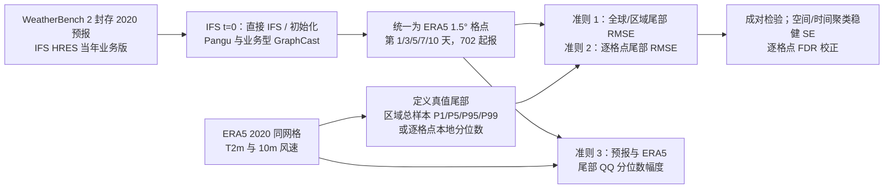

# 第十天极端温度与大风：GraphCast、Pangu-Weather 和 IFS 的全球分区比较

> Leonardo Olivetti、Gabriele Messori，*Do data-driven models beat numerical models in forecasting weather extremes? A comparison of IFS HRES, Pangu-Weather, and GraphCast*；*Geoscientific Model Development* **17**, 7915–7962，**2024-11-07** 正式发表，DOI [10.5194/gmd-17-7915-2024](https://doi.org/10.5194/gmd-17-7915-2024)；[出版社完整正文/附录 A–D](https://gmd.copernicus.org/articles/17/7915/2024/)，[作者分析/绘图代码 Zenodo](https://doi.org/10.5281/zenodo.13329880)。这是**独立模型评测论文**：本文没有训练新模型、提出新参数化或给出新微调阶段，主实验验证到**第 10 天**，因此按实际时效归中期目录。Appendix D 才引入 FuXi，且用了与主文不同的初值/真值设置，不可以把两套结果混成同一个排行榜。[§2–4、附录 D](https://gmd.copernicus.org/articles/17/7915/2024/)

## 一、作者问的问题并不只是“谁的 RMSE 低”

传统全球分数往往把绝大多数普通天气与少量极端事件平均，无法回答稀有高温、严寒、大风是否被模型抓住。作者把 **IFS HRES、Pangu-Weather、GraphCast** 放到半业务化的共同初值、共同 ERA5 真值和共同粗网格上比较，分开评估：(1) 全球/大区实测尾部的幅度误差；(2) 每个格点自己相对极端时的误差与空间差异；(3) 预报分布尾端是否保持了 ERA5 的分位数幅度。第一个问题衡量所挑中真极端时的**相对误差**，第三个问题衡量**边缘分布尾部的幅度**，二者不能替代；“AI 某些地区尾部 RMSE 更低”并不意味着它没有在第十天把峰值拉向均值。[引言、§2.4、§3–4](https://gmd.copernicus.org/articles/17/7915/2024/)

全文发表于 2024 年而非 2026；2026 Jua 的 [欧洲实测站点极端评估](../nowcasting/79-jua-europe-extremes.md)是另一篇论文，样本年份、真值、模式代际和最高时效都不同。本篇的强项是**10 天全球格点/区域比较**，弱项是**2020 单年与 ERA5 再分析真值**；后者更平滑于点站观测。两篇结论并非矛盾，而是在问不同层级的问题。[本稿 §2–4、Jua §3](https://gmd.copernicus.org/articles/17/7915/2024/)

## 二、底座、训练与实际使用的版别

| 系统 | 原稿给出的训练/结构背景 | 本文真正拿来算主文分数的版本 |
| --- | --- | --- |
| **IFS HRES** | ECMWF 物理数值确定性模式；原稿称原生约 0.1°、137 层，业务初值融合观测与前次循环结果。 | WeatherBench 2 封存的 **2020 当时业务版**；**2020-06-30 前 Cy46r1，之后 Cy47r1**。它同时提供 Pangu/GraphCast 的 `t=0` 输入，因而主文有共同起点。不能把 2026 当前 IFS 或 AIFS 业务成绩倒填进来。 |
| **Pangu-Weather** | 三维视觉 Transformer，原基础系统用 **ERA5 1979–2017** 训练、2018–2019 验证；五个高空变量×13 层与四个地表变量，约 0.25°、6h 自回归，最长 10 天。 | 主文“业务型”从 **IFS HRES t=0** 起报；附录 D 的同模型使用 **ERA5 t=0** 起报。原稿没有说为本次评估额外训练或微调 Pangu。 |
| **GraphCast** | 图神经网络；原底座用 **ERA5 1979–2019** 训练，接受前两个时次的六个高空变量×37 层和地表/掩码，约 0.25°、6h 自回归。 | 主文用**额外经过一小批 IFS HRES 资料微调的业务型**，并调整到不依赖降水输入，才能由 IFS HRES t=0 初始化；附录 D 使用 ERA5 初值的再分析型。原稿只说明“额外微调”，**没给本篇所用微调的年份/步数/LR/batch/冻结范围**，不能从其他 GraphCast 论文猜填。 |
| **FuXi** | 原 FuXi 由 ERA5 **1979–2017** 训练，采用分时效级联模型；详见本库 FuXi 系列的独立笔记。 | **只在附录 D** 使用 WeatherBench 2 能提供的再分析起报资料；作者明确因为没有其业务型对应封存场，所以**不进主文三系统半业务公平比较**。 |

该表是本评测对底座的**引用背景与实验版别审计**，不是原始模型训练报告。本文作者只读取封存预报并做统计，没有自己的梯度更新、优化器、batch 或后处理微调。Pangu 和 GraphCast 的完整网络参数、损失、训练工程应回到各自原始论文核查；本研究不是那些细节的第一手出处。还需注意，主文所说“业务型”仅指初值接近业务可得，**并非当年独立在线业务运行与值班检验**。[§2.1–2.3、附录 D](https://gmd.copernicus.org/articles/17/7915/2024/)

## 三、资料预处理、共同评估协议及三种极端定义

主文比较 **2020-01-01 至 2020-12-16** 每日 **00/12 UTC** 起报，在每个 lead/格点得到 **702 个可比起报**；只报告 **第 1、3、5、7、10 天**。Pangu/GraphCast 的原生约 0.25°、IFS 的约 0.1° 均被放在 **1.5° 共同格点**上与 **ERA5 1.5°** 真值比较。变量是 **2m 气温**和**10m 风速**；风速需从水平风分量形成标量幅度。重新网格化减轻分辨率不公平，但也**滤掉局地最尖的极端**，所以结论不能等同站点、灾害峰值或公里尺度检验。原稿引用 WeatherBench 2 的封存预报；具体每个变量的重网格算法/插值权重未在这篇方法正文完整逐项列出，不能自填。[§2.1–2.4、代码与数据声明](https://gmd.copernicus.org/articles/17/7915/2024/)

上图按[§2.4、图 1–12](https://gmd.copernicus.org/articles/17/7915/2024/)原创重绘。极端定义的细节会改变回答：

1. **准则 1：全球或大区共同阈值。**把该区域 2020 全部 `时间×格点` 的 ERA5 实值合成一个分布，冷端取最低 **5%/1%**，热端/风速取最高 **5%/1%**，再只在这些实值已极端的位置比较预报与 ERA5 的平方误差。这样某个格点/某个月可贡献多个样本，面积/气候带占比会影响全球结果；它不是“每站各取 5%”。论文公式把尾部指示函数乘进平方误差、在全域大小 `T·I·J` 上归一，再开方；严格说其尺度不是“只除尾部样本数”的条件 RMSE，但**同一被选样本集上模型排名不变**。纬度权重 `w(i)` 也进入公式。[§2.4，式 1–2、图 2–3](https://gmd.copernicus.org/articles/17/7915/2024/)
2. **准则 2：每格点自己的阈值。**每个点各用 702 次实值估分位数，5% 约 **36 个样本/点**，1% 更少；地图显示局地谁更优。两模式成对差异用考虑时空聚类的稳健标准误，主要全局/区域比较用 **5% 水平**；逐格点多重检验用 Benjamini–Hochberg **全局 FDR 0.1**，并不是地图所有色块都显著。作者对“最好 AI 与 IFS”做像素图时存在先挑最好模式再比较的问题，尤其在少量尾部样本上应谨慎理解其显著色块。[§2.4、图 5–8](https://gmd.copernicus.org/articles/17/7915/2024/)
3. **准则 3：边缘尾部 QQ。**比较预报与 ERA5 的冷端约 **P10–P0.1**、热/风端 **P90–P99.9** 分位值，图 9 对 1/3/5/7/10 天，图 10–12 更细看第 5 天地区。QQ 趋近对角线说明**总体边缘分布的分位幅度**接近，不意味着某次极端事件的地点、发生时刻或概率校准正确；三个系统都是确定性，不能把这里的“tail calibration”误当集合可靠性。[§2.4、图 9–12](https://gmd.copernicus.org/articles/17/7915/2024/)

## 四、图 1–12：平均胜负与第十天尾部的反转

| 图号和问题 | 正文可直接确认的结果 | 同时必须保留的限定或失败案例 |
| --- | --- | --- |
| **图 1：全部 2m 温度/10m 风速 RMSE** | 两个 AI 在全球和多数大区的整体误差小于 IFS；**GraphCast 在各区/各时效均优于 IFS**。对第 10 天 T2m，GraphCast 相比 Pangu 的差异在多个大区约 **5–20%**。 | 这是 **ERA5 1.5°、2020 单年**的平均分数，不说明峰值正确。Pangu 的相对优势随 lead 更快恶化；“图 1 全胜”不能推出图 2/3 尾部也全胜。 |
| **图 2：区域冷/热/风最极端 5% 的 RMSE** | 全球 GraphCast 三类尾部在多数 lead 优于 IFS；热/风改善尤其明显。热极端的 Pangu 只在 **1–3 天**有显著优势。 | Pangu 在较长时效的热和风尾部**不及 IFS**；IFS 在 AusNZ/南极冷极端，东亚/北美/南极热极端可优于两个 AI。GraphCast 在热带/北太平洋强，但不能称各大区都最强。 |
| **图 3：更极端的 1%** | 热/风的大体区域趋势延续；东亚短时效严寒 Pangu 可比其他模式好**最高约 40%**。 | GraphCast 在全球及高纬**冷尾部明显退步**；1% 极寒的全球样本更偏向南极，选样构成与 5% 不同，不能只用“阈值更严”解释为模型物理崩溃。 |
| **图 4：各分组优胜摘要** | “一般天气 AI 优势”与“高纬极端/长 lead 的 IFS 竞争力”并存。 | “最佳模式”是基于本评估的区域/变量/lead 选择，不是新的训练后智能混合集合；不能把不同格子拼成同一可运行模式的成绩。 |
| **图 5–8：逐格点强弱及其幅度** | 普通天气多数点 AI 更好，尤其热带；尾部只约 36 样本/点，显著色块明显减少。部分美国、东亚/印度北部及欧洲人口稠密地区的强风尾部 IFS 更好。 | 风尾部的模式差异常**不显著**；地图中有颜色并不等于统计可靠、业务可用。热极端在北极附近和南半球若干海区 AI 不利，东大洋盆地的 T2m 偏差也值得单看。 |
| **图 9–12：尾部分位数幅度** | IFS HRES 整体尾部 QQ 较贴 ERA5；AI 对强热与大风幅度多偏低、lead 越长越明显。第 5 天北美热端 AI 约**低 2 K**，北极冷端各模式约**低估极寒幅度 2–3 K**。 | “极寒温度低估”在文字中指**强度**不足，实际温度可表现为过暖；勿不加方向地转写成温度数值低 2–3 K。IFS 也不是所有地区完美，如北极/北太平洋的冷端都偏弱。 |

以上数值只来自[正式论文 §3–4 对图 1–12 的原文描述](https://gmd.copernicus.org/articles/17/7915/2024/)，不是从热图色条反算的精确 RMSE。科学上最关键的并列结论是：GraphCast 对**已经由 ERA5 筛出的某些极端样本**可有较低 RMSE，同时**边缘分布第十天热/风峰值幅度**又可能被压低。误差和幅度是两个统计量，不可用一方否定另一方。作者把高纬劣势、强风弱项与缺少土壤湿度/雪冰等输入、风分量分别训练及纬度加权联系起来，但这些是**解释假设**；论文未做移除/新增变量或同架构损失消融，不能写成证实的因果机制。[§3–4](https://gmd.copernicus.org/articles/17/7915/2024/)

## 五、附录 A–D 的四层敏感性，尤其 FuXi 的正确位置

**附录 A（图 A1–A4）**把主文“最好 AI 对 IFS”的局地图拆成各模型自身的逐格点胜负和差值，可避免误以为每个格点同一 AI 都领先。**附录 B（图 B1–B2）**考虑单独截取真值尾部的 RMSE **并非 proper/consistent score**：作者引入 Taggart 的 MSE 分解，在区域 P5/P95 或 P1/P99 阈值上报强调尾部的矩形分区分数。尾部组件 `S1/S2` 与其余部分加起来才是全域 MSE；只看尾部可诱导模型取巧，所以仍须与整体评分并读。[附录 A–B、§4 讨论](https://gmd.copernicus.org/articles/17/7915/2024/)

**附录 C（图 C1–C5）**改成由 **IFS HRES 的预报**而非 ERA5 实际值选极端。这样会减少专门针对真值已选样本“hedging”的比较问题，但随着 lead 增长，IFS 自己漏报/误报的事件会使入选集合偏离真实极端，所以两种选样各有偏差，不是简单谁更公平。**附录 D（图 D1–D12）**比较 ERA5 初值的 Pangu/GraphCast 与**额外的 FuXi**；为尽量公平，作者对物理模式使用 IFS HRES `t=0` 作参考真值，而 AI 仍对 ERA5 评价，意味着**真值定义已不完全共同**。FuXi 在附录 D 的第十天 T2m 格点图表现突出，但不能拿它与主文共享 IFS 初值的 GraphCast/Pangu 或主文区域统计直接排名。FuXi 这里的角色是再分析起报的佐证，**不是本文首次提出的新 FuXi 模型**。[附录 C–D](https://gmd.copernicus.org/articles/17/7915/2024/)

本评测的代码在[Zenodo 10.5281/zenodo.13329880](https://doi.org/10.5281/zenodo.13329880)，各模式封存输出由 WeatherBench 2 提供，底座训练代码/权重归原始作者；研究组没有发布“重新训练后的 GraphCast/Pangu/FuXi”。要复验第十天地图，应固定 2020 的业务版本、初值和 ERA5 1.5°，重建区域/格点阈值、纬度权重、成对聚类标准误及全局 FDR；并在后续独立年份、原始 0.25°和真实站点上复查。主文只有一年、两类地表变量、无极端降水/阵风/集合概率；均方误差又与多款 AI 的训练目标接近。**本论文能支持“十天尺度上某些 AI 优于 IFS、另一些极端尾部退步”这一受限结论，不能证明所有灾害场景的可靠性。**[§4、代码与数据声明](https://gmd.copernicus.org/articles/17/7915/2024/)

[返回首页](../../README.md) · [返回总表](../../气象大模型_中期预报论文追踪.md)
