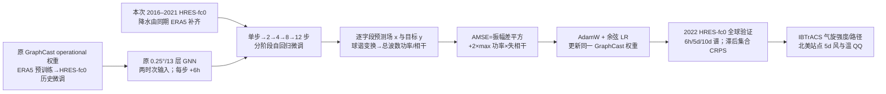

# GraphCast 的球谐谱 AMSE 微调：第十天预报的锐度、集合离散度与极端风

> Christopher Subich、Syed Zahid Husain、Leo Separovic、Jing Yang，*Fixing the Double Penalty in Data-Driven Weather Forecasting Through a Modified Spherical Harmonic Loss Function*。2025-01-31 [arXiv v1](https://arxiv.org/abs/2501.19374)，2025-05-29 [v2 全文与附录](https://arxiv.org/html/2501.19374v2)；[ICML 2025/PMLR 267:57191–57211 正式书目](https://proceedings.mlr.press/v267/subich25a.html)。本笔记于 2026-09-24 按 **v2 HTML 全文、表 1–2、图 1–14 和正式会议书目**核验；正式 PMLR PDF 尚未逐页核对，不能据此声称两个版本逐字一致。作者公开[训练代码](https://github.com/csubich/graphcast/tree/amse)与[微调权重](https://huggingface.co/csubich/graphcast_amse)。本篇从现有 GraphCast checkpoint 出发真正实施了新损失函数微调，报告 6 小时至 **240 小时/第 10 天** 的谱与概率评测；没有第 11–15 天的定量证据。[arXiv 版本记录](https://arxiv.org/abs/2501.19374)、[§2–3](https://arxiv.org/html/2501.19374v2)

## 一、研究问题与关键判断

全球数据驱动模式在常规平均误差上很强，却常把小尺度天气磨平。论文强调这不是模型网格从 0.25° 降为粗网格，而是**训练目标使可预测性较差的尺度主动减小振幅**：气旋略偏位时，逐格点 MSE 同时罚“真位置没有”和“预测位置多出”，网络因而倾向输出保守的平均场。作者问的是：不把确定性 GraphCast 改造成生成模型，仅替换损失、少量再训练，是否可以恢复真实的空间谱、强风和热带气旋强度，同时不严重损失大尺度技巧？这里的“锐利”只表示小尺度振幅更接近真值，不自动等于每个涡旋的相位/位置更准。[§1–2](https://arxiv.org/html/2501.19374v2)

论文的最重要科学边界是三个指标不能合并。**谱振幅**衡量各波数的能量是否充足；**coherence**衡量预测谱系数与真值在该波数的相位相关；**CRPS/气旋强度**则检验下游价值。作者报告的 1250→160 km 是自选谱阈值下的“有效分辨率”变化，微调后 160 km 附近实际上由小尺度**过量能量/噪声**限制，并非已证明 160 km 涡旋逐个可准确定位。第十天图 3 是谱诊断，表 2 的精确数值只列 **2.5/5/7.5 天** 的滞后集合 CRPS；不可将 7.5 天表值写作十天技巧。[§3.1、图 3；附录 B.5 表 2](https://arxiv.org/html/2501.19374v2)

## 二、底座、数据和处理：哪些属于原 GraphCast，哪些属于本篇

| 环节 | 可核验设置与处理 | 证据边界 |
| --- | --- | --- |
| 模型骨架 | 采用 **0.25°、13 气压层** GraphCast “operational” checkpoint，输入两个时间层，逐 **6h** 自回归；13 层各六项为位势、气温、比湿、水平风 `u/v`、垂直速度，地面五项为 2m 温度、10m `u/v`、海平面气压和 6h 累积降水。原始 GNN 编码/处理/解码架构与权重作为起点，本研究的结构性改动在损失函数，不是新训练一个独立的 GraphCast。 | 原文 §1 与 §2.3–2.4。本文没有给出完整 GNN 层宽、处理层数、参数总量，也没有明确冻结了哪些层；不可移植其他 GraphCast 版别参数。 |
| 起始权重的历史 | 该 checkpoint 曾先用 **ERA5 1979–2017** 训练，再用 **2016–2021 HRES-fc0** 初始场微调。 | 这是**起始权重的历史**，不是作者本次又从 1979 年重训；原文 §2.4。 |
| 本篇 AMSE 微调资料 | 继续使用 **2016–2021 HRES-fc0**，让初值和六小时目标来自同一高分辨率分析/预报初始场体系。由于 fc0 本身没有过去六小时累积降水，按原 GraphCast 处理用同期 **ERA5 6h 累积降水补齐**该字段。 | 原文明确披露了这一个混合来源；没有逐字段插值器、QC/缺测阈值、训练样本精确计数，也没有公布本次重新估算标准差的操作，因此不能凭经验补写。 |
| 验证资料 | **2022 全年**用 HRES-fc0 起报并作全球格点真值；气旋案例另以 **IBTrACS** 观测中心/强度核验，北美地面站的风/温分位数用于图 9–10。 | HRES 作真值与真实站点作真值是不同检验；2022 不属于本次训练期。滞后集合从 **2022-01-10 00 UTC 至 12-31 12 UTC** 每 12h 起报，避免 9 次连续起报的初始时段不完整。 |
| 归一化与面积权重 | 逐变量、逐层以标准差使不同物理量损失可比；层权与气压大小成比例，并沿用原 GraphCast 的变量权重。球面 MSE/AMSE 的谱变换与面积元相容，评测按纬度面积权重聚合。 | 论文只说 AdamW 其他超参及变量/层权同 Lam 等原模型，**本篇未逐值列出** β、weight decay、标准差值、变量权重数值，不假写“完整公开”。 |

[§2.3–2.4、§3、附录 B.3–B.4](https://arxiv.org/html/2501.19374v2)

**数据泄漏检查。**主评测 2022 与本次 2016–2021 微调分离，但模型首先经历 1979–2017 ERA5 预训练；2016–2017 是两阶段内部重叠训练，并非 2022 测试泄漏。若复现，需要确认同一 HRES-fc0 版本、降水补充规则、时间坐标、海陆/静态场和 6h 有效期对齐；作者未给出逐字段预处理表，不宜自行认定某一插值或填补策略就是论文实际做法。[§2.4](https://arxiv.org/html/2501.19374v2)

## 三、方法与模型信息流：AMSE 为什么不再奖励削弱振幅

设某一总波数 `k` 上预测/真值的谱功率为 `P_x(k)`/`P_y(k)`，二者谱相干为 `c_k`。Parseval 定理把面积加权 MSE 写成各波数上的 **`P_x + P_y − 2 sqrt(P_x P_y)c_k`**。若真值振幅固定且相干度 `0<c_k<1`，MSE 的最优预测振幅比为 `sqrt(P_x/P_y)=c_k`：失去相干后，模式把能量压小反而降低训练损失。图 2 用 **1° GraphCast 的训练过程**展示 850 hPa 气温、总波数 100 处振幅比与相干度相随；这是机制演示，**不是主结果的 0.25° 模型**。[§2.1–2.2，式 2–4、图 2](https://arxiv.org/html/2501.19374v2)

作者把 MSE 拆成 `[(sqrt(P_x)-sqrt(P_y))²] + [2 sqrt(P_x P_y)(1-c_k)]`。第一项是**功率振幅误差**，第二项是**失相干误差**；在第二项把 `sqrt(P_xP_y)` 替换为对称的 `max(P_x,P_y)`，再对 `k` 求和，得到 AMSE。这样即使 `c_k` 无法到 1，也不会通过缩小 `P_x` 来轻易减轻失相干惩罚。它不需手挑高低频截止或给不同损失项手动调权；对单字段零误差当且仅当预测等于真值，量纲与 MSE 相同，但**不满足三角不等式**，不是数学上的距离度量。每个气象字段分别算 AMSE 后，再沿用 GraphCast 的变量、气压层与标准差权重汇总。[§2.3，式 5–6](https://arxiv.org/html/2501.19374v2)

上图由[§2–3、表 1、附录 B](https://arxiv.org/html/2501.19374v2)原创重绘，仅表达论文已披露的信息流，不是原图复制。特别注意：损失是**每个二维字段的球谐变换**，不是把经纬度所有变量混成一个频谱；最大值发生在两个功率谱之间，**并非**对观测或预报场取逐格点最大值。数值稳定化、FFT/SHT 实现和梯度细节须查作者代码，论文公式不足以证明某一种具体内核被采用。

## 四、训练与微调：五段日程、公开参数和缺口

作者没有从零重训底座，而是从已经受 12 步/72h 滚动训练的 operational checkpoint **重新开始单步微调**，再逐级扩大训练展开步数。理由是单步更便宜、可用较高学习率，让小尺度功率先适应新损失；然后多步阶段修复自由滚动中的长时效稳定性。每段 batch **8**，开头 **64 batch warm-up**，此后在给定峰值与终值之间按 cosine annealing 衰减；优化器 **AdamW**，其他优化细项沿用原 GraphCast 论文但本篇未列数值。作者使用每节点 **4×A100 40 GiB**、1–2 节点，数据并行并通过 MPI 梯度累积；下表的 GPU-days 相加为约 **26.2**，不是“26.2 个自然日占用 8 GPU”。[§2.4、表 1](https://arxiv.org/html/2501.19374v2)

| 阶段 | 6h 自回归步数/训练目标末时效 | 更新 batch 数 | 峰值→末值学习率 | 作者报 GPU-days |
| --- | ---: | ---: | ---: | ---: |
| 1 | 1 / 6h | 25,000 | `2.5e−5 → 1.25e−7` | 7.7 |
| 2 | 2 / 12h | 2,500 | `2.5e−6 → 7.5e−8` | 2.2 |
| 3 | 4 / 24h | 2,500 | `2.5e−6 → 7.5e−8` | 4.3 |
| 4 | 8 / 48h | 1,250 | `2.5e−6 → 7.5e−8` | 4.6 |
| 5 | 12 / 72h | 1,250 | `2.5e−6 → 7.5e−8` | 7.4 |

这共 **32,500 个 batch 更新**；batch 8 只说明每次梯度的样本量，不等于 260,000 个独立天气状态。训练最后展开只到 **72h**，评测在推理时自回归滚动到 **240h**，所以十天表现属于训练时效之外的滚动泛化。消融将**同一五段日程**分别换回 MSE 和 MAE，排除“只是多训了 26.2 GPU-days”这一简单解释；论文没有给出新训练中明确冻结层清单、随机种子、逐字段标准差、确切模型参数总数，也没有跨多随机种子误差条。[§2.4、§3、附录 B.5](https://arxiv.org/html/2501.19374v2)

## 五、主要结果：图 1–14 和数值表如何读

| 原图/表与口径 | 作者可直接支持的结果 | 不能越界的解读 |
| --- | --- | --- |
| 图 1、7：2022 Eunice，+3.5 天 | 相比 control，AMSE 图上的地面风/低压更尖锐；高通分量在图 7 增强。 | 单场视觉对照证明不了全年误差改善；图 7 高通滤波 `k₀=50` 是**展示手段**，不是 AMSE 训练的频率截止。 |
| 图 2：1°/波数 100 训练机制 | MSE 训练中预测振幅比紧随谱相干度；多步训练后较长 lead 的振幅更低。 | 只是机制图；不可当 0.25° AMSE 模型的定量性能。 |
| 图 3、8：2022 谱，6h/120h/240h | control 在**5 天**按 `P_x/P_y=0.75` 自选阈值落于 `k≈32`、约 **1250 km**；AMSE AR12 到 `k≈250`、约 **160 km** 才出现**能量过量**。AMSE AR1 更早在 `k≈90`、约 **450 km** 出现噪声，同时长 lead coherence 更低。 | 160 km 是“衰减或噪声开始”的阈值定义，不是波长 160 km 的逐事件预测可用性。改变 25% 阈值可改变数字；2m 温度谱本来受固定地形影响、control 也少平滑。 |
| 图 4、11–13：9 个时滞成员的 CRPS/eRMSE/SER | **AR12** 多数变量/lead 的 CRPS 改善，eRMSE 总体变化较小；长 lead 无偏 eRMSE 稍优。**AR1** 散度更大却技巧下降。 | 时滞集合不是独立交换的业务集合；早期成员比旧成员准，不能把 SER=1 直接判成校准，也不能说模型本身学出了 9 个随机成员。**降水在短 lead CRPS 退步**。 |
| 图 5、6：Ian 与 2022 气旋季 | Ian 的第 5 天位置两模型均约在 **125 km** 以内；AMSE 使中心气压/最大风的弱强度偏差接近 HRES 资料。20 Jun–19 Sep 起报的气旋平均强度改善，路径误差大体持平。 | HRES 强度本身对 IBTrACS 仍偏弱；接近 HRES 不等于没有强度偏差。图 6 显著点并非每 lead、每气旋均显著。 |
| 图 9–10：北美站点 5 天 QQ | AMSE 的 10m 风尾部分位数比 control 更像 HRES/站点；两模型 2m 温度边缘分布几乎相同。 | QQ 仅测汇总分布幅度，不保证某日某站强风被准确预报；HRES 对真实站点也可系统偏弱。 |
| 图 14/表 2：同日程 MSE/MAE 消融 | 只有 AMSE 在高波数保持足够振幅；MAE 在中尺度有一定改进，但高波数仍平滑。 | 表 2 **不是 AMSE 对所有变量/lead 都最佳**：例如 7.5d T850/Q700 的 MAE 略差于/优于 AMSE 的次序需逐项看，下表保留所有对照。 |

上述图意均以[正式书目对应的 arXiv v2 正文与附录](https://arxiv.org/html/2501.19374v2)为准，未根据图片色条杜撰未刊出的十天 RMSE 精确数值。**有效分辨率提升、极端风更真实与逐点技巧增强**是三个不同主张；只有后两者在对应验证项目中有证据。[§3、附录 B](https://arxiv.org/html/2501.19374v2)

### 表 2 完整数值转写：9 个时滞成员的 fair CRPS，越低越好

各列保留论文单位：Z500 为 `m² s⁻²`，T850 为 K，Q700 为 `g kg⁻¹`，U850 为 `m s⁻¹`。`AR1/AR12` 指本次微调自回归训练展开长度；**表的 2.5、5、7.5 天是验证 lead，不是训练展开长度**。[附录 B.5 表 2](https://arxiv.org/html/2501.19374v2)

| 变量/lead | Control | MSE AR12 | MAE AR12 | AMSE AR1 | AMSE AR12 |
| --- | ---: | ---: | ---: | ---: | ---: |
| Z500 / 2.5d | 31.038 | 31.285 | **29.969** | 33.720 | 30.565 |
| Z500 / 5d | 84.315 | 82.100 | 80.621 | 94.703 | **80.469** |
| Z500 / 7.5d | 162.481 | 155.703 | 155.361 | 186.202 | **153.267** |
| T850 / 2.5d | 0.428 | 0.419 | **0.410** | 0.422 | 0.418 |
| T850 / 5d | 0.691 | 0.664 | 0.654 | 0.721 | **0.653** |
| T850 / 7.5d | 1.003 | 0.949 | 0.947 | 1.078 | **0.935** |
| Q700 / 2.5d | 0.357 | 0.356 | **0.340** | 0.354 | 0.347 |
| Q700 / 5d | 0.523 | 0.526 | **0.499** | 0.558 | 0.510 |
| Q700 / 7.5d | 0.652 | 0.652 | **0.624** | 0.721 | 0.634 |
| U850 / 2.5d | 0.823 | 0.819 | **0.811** | 0.863 | 0.832 |
| U850 / 5d | 1.340 | 1.335 | **1.313** | 1.485 | 1.341 |
| U850 / 7.5d | 1.904 | 1.886 | **1.859** | 2.115 | 1.882 |

这里有意不把 AMSE 写成“所有列第一”：它只在 **5/7.5d 的 Z500、T850** 四列中优于 MAE，而 **Q700 三列及 U850 三列均不及 MAE**；Z500/T850 的 2.5d 也由 MAE 最佳。AMSE AR1 的多数较差值说明**单步谱锐化不足以得到长期可用预报**。正文图 4 概括的总体 CRPS 改善，是相对于未经额外微调的 **Control**，不是与所有候选损失逐格全面获胜。[附录 B.5 表 2、§3.2](https://arxiv.org/html/2501.19374v2)

## 六、实验设计和可复现边界

**时滞集合是什么。**作者用每隔 **12h** 起报的连续 **9** 个确定性预报，使它们在同一验证时刻重合；时间跨度 **4 天**，名义 lead 取中间那一条。它衡量动力轨迹分叉与集合分数，但各成员由于起报时间不同、相对于验证时刻的 lead 不同，既不独立同分布也不等同同一起报的 9 个扰动成员。因此文中 SER 不应按业务集合的理想校准数值生搬硬套；附录还提供有限成员偏差校正的无偏 eRMSE。显著性 bootstrap 对约三分之一日期抽样，以约 36h 间隔减弱序列相关；仍不足以构成跨年份稳健性证明。[§3.2、附录 B.4，图 11–13](https://arxiv.org/html/2501.19374v2)

**热带气旋如何核验。**图 6 以作者引用的气旋识别算法处理预报，取 **2022-06-20–09-19** 起报，比较最大近地风、最低中心气压与平均位置误差，真值为 IBTrACS。HRES 场同时是微调目标、格点评分真值，但在气旋强度上也比独立观测弱；AMSE 接近 HRES 强度只能说补回了 GraphCast 相对于 HRES 的额外平滑，不能说解决 HRES–实测强度差距。Ian 图 5 是有启发性的个例，不替代季节性评分。[§3.3，图 5–6](https://arxiv.org/html/2501.19374v2)

**5 天站点风温。**图 9–10 把 2022 北美冬季（1–3 月）与夏季（6–9 月）的站点观测分位数同 HRES、control、AMSE 的插值后分位数比较。作者给出的冬季风 **P98** 例子是站点约 **11.5 m/s**、HRES 约 **10 m/s**；这说明即使 AMSE 比 control 更接近 HRES，也**不能声称已无站点风尾部低估**。两模型温度边缘分布几乎相同，因地形静态信息使 T2m 的平滑问题原本较弱。站点 QQ 是边缘分布，不是事件命中率/可靠性图。[附录 B.3，图 9–10](https://arxiv.org/html/2501.19374v2)

**失败与未做事项。**(1) 附图 11 的 6h 累积降水在短时效 CRPS 有退步，作者解释降水局地且非负，简单近高斯谱分解并不天然合适；(2) AR1 可能增加小尺度“噪声”而 coherence/CRPS 更差；(3) AR12 仍有部分中尺度平滑，作者仅假设它来自滚动训练还要使输出成为下一步好初值，**未通过 replay-buffer 消融验证**；(4) 没有训练从零使用 AMSE 的模型、没有真业务同一起报集合、没有气候外推/OOD 证明，站点检验也只在北美两季；(5) 官方 PMLR 正式 PDF 与 arXiv v2 的内容差异尚需逐页审计。[§4、附录 B.4–B.5](https://arxiv.org/html/2501.19374v2)

## 七、与本库中期及其他论文的关系、复验清单

本篇在第 **10 天**给球谐谱诊断，故归**中期预报**；它并不是独立设计 15 天集合的 [AIFS-CRPS](37-aifs-crps.md)、也不是用数值模式给 AI 做外部谱约束的 [GDPS-SN](50-gdps-graphcast-spectral-nudging.md)。它解决的是**已有确定性模型内部损失所致的尺度振幅收缩**。若要用于 10–15 天业务问题，仍需要同一起报的初值扰动/集合、真实观测验证、降水专门处理及 11–15 天评分；本论文未覆盖这些。[§1、§4](https://arxiv.org/html/2501.19374v2)

复验优先事项：取得完全对应的 GraphCast operational checkpoint 和 HRES-fc0/ERA5 降水配对；复现实装球谐 AMSE 的谱功率、`max` 梯度及变量权重；按表 1 五段训练，对同日程 MSE/MAE 消融；同时画振幅比与 coherence 而非只看 RMSE；逐 lead 报实起报集合与滞后集合的 CRPS/eRMSE/SER；单独报告降水、气旋强度、站点风尾和 10–15 天外推。超出论文公开内容的模型冻结范围、标准差数值、样本缺失处理和随机种子要从[作者代码](https://github.com/csubich/graphcast/tree/amse)及对应数据清单核对，不能从别的 GraphCast 版本猜填。[§2–4、代码与数据声明](https://arxiv.org/html/2501.19374v2)

[返回首页](../../README.md) · [返回总表](../../气象大模型_中期预报论文追踪.md)
