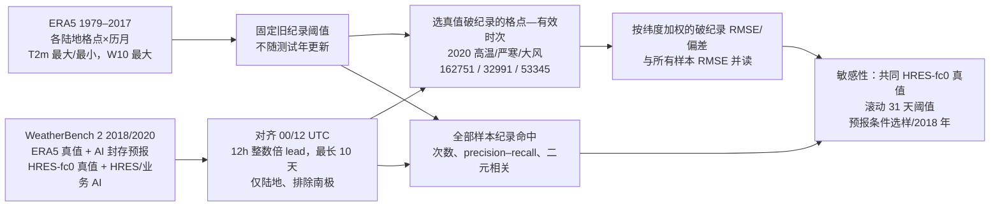

# 破纪录高温、严寒与大风：为什么平均分数领先的 AI 会在历史纪录样本上落后

> Zhongwei Zhang、Erich Fischer、Jakob Zscheischler、Sebastian Engelke，*Physics-based models outperform AI weather forecasts of record-breaking extremes*，*Science Advances* **12**(18), eaec1433，**2026-04-29** 正式发表，DOI [10.1126/sciadv.aec1433](https://doi.org/10.1126/sciadv.aec1433)；[KIT 保存的正式开放 PDF](https://publikationen.bibliothek.kit.edu/1000192852/180384477)、[ETH 开放书目](https://www.research-collection.ethz.ch/entities/publication/a11bce22-eeaf-4194-bbbd-c2d695309594)、[分析代码与数据 Zenodo](https://doi.org/10.5281/zenodo.18929001)。同组 2025-08-21 [arXiv:2508.15724v1](https://arxiv.org/abs/2508.15724) 的早期题名是 *Numerical models outperform AI weather forecasts of record-breaking extremes*，**不是另一篇论文**。本笔记于 2026-09-24 以**正式 PDF 正文/图 1–4/方法**为主，并用原版[arXiv HTML 与图像](https://arxiv.org/html/2508.15724v1)核对图 1 的十天横轴；正式版的独立补充 PDF（图 S1–S21）未完整取得，附图仅按正式正文中的描述转写，不把早期版 25 幅附图与正式版 21 幅混编号。[正式 PDF 页 1、11](https://publikationen.bibliothek.kit.edu/1000192852/180384477)

## 一、问题、主要结论和阅读时的限制

平均格点 RMSE 对常见天气敏感，极端事件却很稀有；只看“第十天全球气温 RMSE”不能回答是否提前报出某个地区前所未见的酷热或大风。这篇**不训练任何新天气模型**，而是构造一个比“测试年 P95/P99”更严格的评测集：测试值须超过**1979–2017 历史记录**中同一格点、同一历月的最大值，或低于最低值。然后比较 GraphCast、Pangu-Weather、FuXi 与 ECMWF IFS 的 HRES；另用 HRES-fc0 初值的 GraphCast/Pangu 业务型变体做敏感性核验。主图最长到**第 10 天**，因此归中期评测目录，但**没有第 11–15 天**的结果。[引言、图 1、方法](https://publikationen.bibliothek.kit.edu/1000192852/180384477)

作者发现，三类 AI 模型在全年**全部**陆地样本的平均 T2m/W10 误差常优于 HRES；把验证集合限制为“破纪录高温、严寒或大风”的真值样本后，HRES 在**几乎所有**时效上通常更好。尤其在短 lead 差距大，过 5 天仍多由 HRES 领先，但差距缩小。AI 对纪录**幅度**和**发生次数**均趋于低估，超过旧纪录越多，偏差越大；HRES 也有弱点（例如短 lead 高温纪录次数略多、强风可轻度低估），不能写成物理模式零误差或所有场景完胜。[结果、图 1–3](https://publikationen.bibliothek.kit.edu/1000192852/180384477)

必须同时保留一个作者表述中的**证据边界**：用 1979–2017 定义纪录，确实超出了 Pangu/FuXi 和 2018 GraphCast 的已述训练区间，但**2020 GraphCast 版据本文 §Methods 已训练至 2019**；因此一个 2020 值打破 1979–2017 纪录，未必打破 1979–2019 的模型训练范围。进一步，GraphCast operational 又在 **2016–2021 HRES-fc0** 上微调过，2020 评测年落在该微调时期内。后者是版别/资料期重叠，不证明作者发生了直接的样本泄漏或该模式实际记忆了 2020 事件，但**不能把全部 2020 业务版评测称为严格封存的模型外推试验**。这是依据论文自身时间表作出的阅读判断，和作者的物理解释应区分。[方法“Models and data”](https://publikationen.bibliothek.kit.edu/1000192852/180384477)

## 二、底座与数据链：本文没有新的训练/微调

| 系统或数据 | 本文实际使用的来源、资料期与处理 | 对比较的影响 |
| --- | --- | --- |
| **GraphCast 非业务型** | WeatherBench 2 封存预报：**2018** 样本来自 ERA5 **1979–2017** 训练版；**2020** 样本来自 ERA5 **1979–2019** 训练版。本文只读取其预报，不修改 GNN 结构、权重、损失或 optimizer。 | 两年并非严格同一 checkpoint；固定 1979–2017 阈值对 2020 版不必然是其训练外纪录。 |
| **Pangu-Weather 与 FuXi 非业务型** | WeatherBench 2 封存预报；论文说明两者以 ERA5 **1979–2017** 训练与验证。FuXi 封存预报只具 **2020**，2018 敏感性图没有 FuXi。 | 本评测不是 FuXi 系列任一新模型的训练论文；不能把 FuXi-ENS/FuXi-S2S 的 15/42 天技巧倒填这里。 |
| **GraphCast operational / Pangu operational** | GraphCast operational 先在 **HRES-fc0 2016–2021** 微调；Pangu operational 在业务初值设置下**无额外微调**。本文只评测已经产生的输出，未做新增微调。 | 业务版用 HRES-fc0 对照/选纪录；与非业务 ERA5 初值和 ERA5 真值的主比较分开报告。原底座微调的 LR、batch、冻结范围本文未列，不能猜填。 |
| **IFS HRES 与 HRES-fc0** | ECMWF 当年业务确定性高分辨率预报，WeatherBench 2 封存；HRES 的 `lead=0` 分析场用作 HRES/业务型 AI 的比较真值。 | HRES 原生约 0.1°、ERA5 约 0.25°，不同资料的真值极端出现次数差很大；不是只换模型不换真值的纯控制试验。 |
| **ERA5 训练期纪录与测试真值** | 从 **1979–2017** ERA5 的每日 **00/06/12/18 UTC** 时次，在每个 **0.25° 陆地格点×历月×变量** 取最大 T2m、最小 T2m、最大 10m 风速。测试年 2018 或 2020 对应 ERA5 `00/12 UTC` 真值，选择超过固定旧纪录者。 | 纪录阈值是**局地、逐月的历史最大/最小**，不是整年统一 P99，也不是当年第一次破纪录才计一次。纪录线不随 2018/2020 的新纪录更新。 |

分析只考虑 ERA5 陆地比例 **>50%** 的网格，排除南纬 **60° 以南南极区域**，留下 **244,450 个陆地点**。一场热浪会使相邻多个格点、多个时次各成一条“纪录格点—时次”，所以 162,751 条**不是 162,751 个统计独立灾害**。主结果用 `00/12 UTC` 起报和 **12h 的整数倍时效**：一方面公开 AI 回报只有这些起报；另一方面 ERA5 在 `00/12 UTC` 的同化窗口为约 `−3/+9h`，HRES-fc0 为 `−3/+3h`，作者认为这种资料窗口差异本身不会帮 HRES。附图另看 06/18 UTC 对应的 6、18 小时等时效，结论大体相同。论文未公开逐格点缺测插值/站点 QC，因为这里主要使用已封存的再分析/预报网格，不应自行加入不存在的资料处理步骤。[方法“Models and data”、“A benchmark dataset”](https://publikationen.bibliothek.kit.edu/1000192852/180384477)

上图据[正式正文 §Results/Methods 与图 1–4](https://publikationen.bibliothek.kit.edu/1000192852/180384477)原创重绘。这里的“业务 AI”不是本研究当场微调出来的新模型；**模型训练流程、架构参数和优化超参**属于各底座论文，本评测只说明底座的历史训练资料期、业务变体有无已发生的微调，不含新训练的 batch/LR/GPU 时间，也没有可填的本篇训练超参。

## 三、纪录如何定义、分数如何算

对高温/大风，在格点 `s`、历月 `m` 上定义阈值 `r(s,m)=max_{1979–2017, 属于 m} x(s,t)`；严寒将最大改为最小。2020 的某个 `00/12 UTC` 有效时次，只要真值越过对应旧阈值，该格点—有效时次就进入同类纪录集合。2018/2020 的纪录都相对**固定**训练期阈值，2018 年打破旧纪录后，2020 年不会把阈值更新为 2018 新纪录。这样的选集被作者称为单变量意义上的 OOD：至少一个局地变量落在训练期单变量范围之外，**不等同已经验证高维初始状态落在训练集凸包之外**。[方法式 1–2、图 4](https://publikationen.bibliothek.kit.edu/1000192852/180384477)

2020 ERA5 真值在这套定义下有 **162,751 高温、32,991 严寒、53,345 大风纪录**。若换业务版/HRES-fc0 真值，相应计数变为 **170,136、109,155、338,235**；特别是冷与风数量大幅增加，论文指出可能与原生分辨率更高有关。因此不能把两组三个计数直接相减，说某系统多报了几十万灾害；它们首先是**两种真值场的样本集合**。再改为同一历日 ±15 天的 **31 天滚动窗口**，2020 ERA5 的高温/严寒样本分别降为 **90,471/18,054**，约 70% 同时打破逐月纪录，方向性结果仍相似。大风的滚动窗口计数正文未在同段给出，不填造。[方法、图 S18–S19 的正文描述](https://publikationen.bibliothek.kit.edu/1000192852/180384477)

给定 lead `τ`，论文先找出“**在验证时刻真值破纪录**”的 `(格点 s, 起报 t₀)` 对，然后用纬度面积权 `ω_s` 对这些样本的 `(预报−真值)²` 求加权平均、开方。这是**只在真极端条件下的 RMSE**；同时报全部样本 RMSE，防止只挑一种稀有条件而诱导预报偏极端的 *forecaster's dilemma*。95% 阴影主要由加权平方误差的渐近正态/Delta method 构建，作者报告 1000 次非参数 bootstrap 得到相近区间，但论文没有证明所有格点—时次互相独立；同一事件空间/时间重复计数可能使常规区间过窄，需事件聚类重估。论文另设两种敏感性：(1) 对业务型 GraphCast/Pangu 与 HRES 统一用 **HRES-fc0** 作真值和选集；(2) 只取**GraphCast operational 与 HRES 两者都预报会破纪录**的时空对，减弱按观测选样的困境，但样本随之缩小。这些不是同一主统计随便改分母，而是回答不同评测偏差。[方法式 3–4、置信区间段、Forecaster's dilemma 段](https://publikationen.bibliothek.kit.edu/1000192852/180384477)

纪录是否会发生又是另一个任务：在**全部候选格点—时次**上，将模式与真值都转成是否越过对应记录的二值，统计报出纪录数、真正例、漏报、precision/recall 和二元指标相关。对确定性输出画 PR 曲线时，作者以**同一 gain 参数 × 该格点/月份/lead/模式在 2020 的预报标准差**给预报加偏移，gain 从 **−1.5 至 +1.5** 扫描；该变化是**事后阈值扫描**，不是给模型增加概率预测能力，也不是训练中调的损失。标准差从同一个 2020 测试预报样本估算，故 PR 曲线在当年有评测期内标度估计；要做实时/跨年外推，应固定在独立历史期估计，不能直接把曲线当业务校准结果。[图 3、方法“Precision and recall curves”](https://publikationen.bibliothek.kit.edu/1000192852/180384477)

## 四、图表与性能：平均优势在破纪录子集反转

| 正式原文证据 | 经核对的具体结果 | 必须保留的限定 |
| --- | --- | --- |
| **图 1A–B：2020 纪录空间分布** | 高温纪录多见于北半球中高纬及若干西部大陆；原文统计高温/严寒/风 **162,751/32,991/53,345** 个格点—时次。 | 南美、东南亚、海陆交界与澳洲在 `00/12 UTC` 主样本里很少或没有记录，地图不是全球各区等概率抽样。 |
| **图 1C、F：全部事件 RMSE，至 10 天** | 除 Pangu 的 T2m 例外，AI 在**多数 lead** 的普通气温平均误差小于 HRES；W10 则各 AI 几乎全 lead 优于 HRES。 | 这是 ERA5 对 AI、HRES-fc0 对 HRES 的典型分真值比较；并非所有系统在一个统一真值下的绝对排行榜。 |
| **图 1D、E、G：真破纪录样本 RMSE，至 10 天** | 高温、严寒和风的子集上，HRES 在**几乎所有 lead** 更低；短 lead 优势最大，5 天后缩小。 | “几乎”不能转写成每一条曲线、每一个 lead 都胜。图内没有逐 lead 数值表，本文不从线宽或色条伪造三位小数。 |
| **图 2A–G：纪录超越幅度** | 在第 **2 天**及其他补图 lead，AI 的高温偏低、严寒偏暖、风极值偏弱，超越旧纪录越多，平均偏差和 RMSE 近似增加；HRES 热/风也有轻度弱幅偏差，但较小。 | 图 2 表示与样本选择相关的经验关系，不能单独证明“网络有硬阈值”或哪个架构部件造成；文中的“soft cap”是解释性比喻。 |
| **图 3A–I：次数、PR 与二元相关** | AI 报出的纪录数少于 ERA5 纪录数，真阳性少/漏报多；HRES 对 HRES-fc0 的报数较接近，其 PR 曲线、2 天二元相关通常优于 GraphCast。Pangu 的计数曲线呈锯齿，与 6h/24h 两套模型切换有关。 | 比较各模型报数时必须匹配对应真值；PR 曲线扫描 gain，不是原始模型天然输出的完整概率分布。HRES 短 lead 高温纪录有轻微超报。 |
| **图 4：纪录与 OOD 定义** | 展示一个格点 2020 年温度/风速序列相对训练期逐月旧极值，并用二维示例说明“任一变量破其边缘纪录”比单看多数常见样本更严格。 | 只是在**指定单变量、格点、月份**上的超训练极值；不能推广成所有高维气象状态都在训练流形外。 |
| **正式正文引用的图 S2/S5–S9/S18–S21** | 2018 另年、每格点每月只选最大超越、统一 HRES-fc0、06/18 UTC、预报条件选样及 31 天窗口等检查大体维持 HRES 对旧版 AI 的纪录优势。 | 正式补充 PDF 仅确认包含 **S1–S21**，本次未逐图取得；本行只依据正式正文明确叙述，不转写未看到的附图坐标/数值。 |

[图 1–4、§Results/Methods](https://publikationen.bibliothek.kit.edu/1000192852/180384477)。图 1 的“第十天”由[原版可视图横轴](https://arxiv.org/html/2508.15724v1)直接核对；正式 PDF 文字也讨论 5 天之后与 7 天之后的走势，但并未在正文另列逐天数值表。上表是**带口径的结果转述**，不是跨数据集的定量性能大排名。

## 五、局限、与另一篇第十天极端评测的关系

**1. 真值与分辨率。**非业务 AI 对 ERA5、HRES/业务 AI 对 HRES-fc0，原分辨率约 **0.25°/0.1°**；论文用业务版共同 HRES-fc0 做敏感性，方向仍相似，但不同样本计数说明“破纪录”的构造强烈依赖真值/分辨率。若评估实际伤害，还需要真站点、雷达/风暴观测；本研究没有这些资料。**2. 空间时间依赖。**一场事件可占很多格点与时次，样本数大不等于灾害事件数大；置信区间和“2018/2020 两年稳健”需对同一事件、跨年和不同年代业务系统再考。**3. 范围。**只比三种较早代确定性 AI、温度与地面风、两年、陆地且除南极，不包含极端降水、AIFS/GenCast/新集合、最新业务版本和 11–15 天。**4. 机制未实验证实。**“物理方程外推而 AI 只插值”是作者给出的合理解释，但本文没有给相同架构增加物理约束或专门极端样本再训练的因果消融；不能将此结论写成所有未来神经模型必然无法报破纪录。[Discussion](https://publikationen.bibliothek.kit.edu/1000192852/180384477)

与本库 [Olivetti–Messori 2024 的 10 天评测](81-olivetti-messori-extremes-2024.md)看似冲突，实际筛选问题不同。Olivetti–Messori 在 **2020 年 ERA5 1.5°** 上取区域/格点的 **P5/P95、P1/P99** 等尾部，主文是 IFS 初值的 Pangu/GraphCast 与 IFS 的近共同协议，GraphCast 在某些真极端条件下仍可优于 IFS；本篇在 **0.25° 陆地**上要求超越**1979–2017 各地各月历史绝对极值**，而且主比较对 AI/HRES 使用各自 ERA5/HRES-fc0 真值。百分位尾部与历史新纪录的稀有度、空间样本构成和真值尺度均不同，所以两个结论可以同时成立；也都不能单独回答 2026 现行业务 AI 对未来纪录事件的可靠性。[本篇 §Methods；Olivetti–Messori 正式论文](https://gmd.copernicus.org/articles/17/7915/2024/)

复验应锁定 WeatherBench 2 的具体模式版本、起报与真值，按本文 `land>50%/纬度>−60°` 重建 1979–2017 旧纪录，分别得到 2020 三类样本计数；再给所有系统**同一 0.25°或 1.5°真值及统一起报版别**的附加实验，对单个灾害事件聚类统计置信区间，并把 GraphCast operational 的 2020 微调期重叠标成不可用的严格留出验证。作者[Zenodo 复现代码](https://doi.org/10.5281/zenodo.18929001)公开的是评测分析，而不是任何新训练的气象模型权重；“本篇训练/微调参数”为**不适用**，不是遗漏。[数据代码声明、Methods](https://publikationen.bibliothek.kit.edu/1000192852/180384477)

[返回首页](../../README.md) · [返回总表](../../气象大模型_中期预报论文追踪.md)
