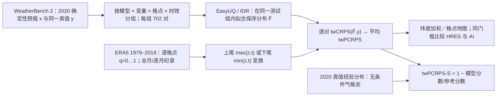

# 84｜Weighted Potential CRPS：用概率信息量重评 AI 与物理模式的极端天气预报

> Tobias Biegert、Sam Allen、Annika Alber、Sebastian Lerch，*Towards Fair Comparisons of AI- and Physics-Based Weather Models for Extreme Events via the Weighted Potential CRPS*，[arXiv:2606.21170v1](https://arxiv.org/abs/2606.21170)，**2026-06-19** 首发；[开放全文及附录](https://arxiv.org/html/2606.21170v1)，[作者复现代码](https://github.com/tobiasbiegert/weighted-pcrps)。阅读核对：2026-09-24。**证据层级为 v1 预印本**，本文没有训练新的天气模型，也没有证明可实时运行的 AI 概率集合已经战胜 IFS ENS；研究贡献是确定性预报的极端事件评估方法和基准比较。

## 核心问题与结论先行

按“极端确实发生”的样本筛选后计算 RMSE，会奖励更常报极端的系统，出现 *forecaster's dilemma*。AI 模型常因平方误差训练而削弱振幅，但较大的 AI 预报值仍可能可靠地指示“真值更大”。本文将确定性预报经 **EasyUQ/保序分布回归**转为概率分布，再用侧重极端阈值的 `twCRPS` 打分，定义 `twPCRPS`；它问的是“预报数值的排序可携带多少经最优映射后可提取的信息”，而非原始振幅是否准确。[引言与方法](https://arxiv.org/html/2606.21170v1)

在 WeatherBench 2 的 2020 年、最长第 **10 天**的共同 ERA5 核验中，GraphCast、Pangu-Weather、FuXi 多数设置的潜在极端信息量优于 HRES，长时效 FuXi 尤为明显；但风、降水没有处处一致的赢家，且第十天不少格点相对**季节性**气候态反而负技巧。对 1979–2019 纪录上限的结果不同于 [#83 Zhang 等的原始纪录条件 RMSE](83-record-breaking-extremes-zhang-2026.md)，并不构成直接推翻。[结果与附图 15–19](https://arxiv.org/html/2606.21170v1)

## 数据、预处理和公平比较口径

| 环节 | 本文实际设置 | 影响 |
| --- | --- | --- |
| 时次 | WeatherBench 2，2020-01-01 至 12-16，`00/12 UTC`，**351×2=702** 个起报 | 每个格点/变量/lead 的 EasyUQ 都用这 702 对预报—真值；评估全年不是独立的训练外检验。 |
| 时效 | **1、3、5、7、10 天** | 直接相关于中期前段与第十天；没有第 11–15 天结果。 |
| 空间 | 四种预报及验证资料统一到全球 **1.5°、240×121=29,040** 格点；全球汇总用 WeatherBench 2 纬度权重 | 每变量/lead 约 `702×29,040 ≈ 2,038 万` 格点—时次配对，**不是约 600 万**；原文 §2 的“约 6 million”与其给出的乘法不符，故保留该算术冲突，不自行替作者修正样本口径。 |
| 变量 | T2M（K）、WS10（m/s）、MSLP（Pa）、24h 累积降水 TP24hr（m） | T2M/MSLP 看高、低尾；风/降水只看高尾。Pangu 在该数据集中**没有降水**。 |
| 真值 | 主图全部统一 **ERA5**；附图 19 改为统一 **业务 IFS analysis** | 后者仅比较 HRES、GC-IFS、PW-IFS；FuXi 无该初值变体，IFS 分析亦无所需 TP24hr，因此二者不出现于该附图。两类分析/再分析本身都有观测与模式误差。 |
| 极端阈值 | ERA5 **1979-01-01–2019-12-31**，逐格点计算全月份分位数 `q=0,0.01,…,1`；另按历月算每月纪录 | 阈值资料与 2020 样本分离。`q=1` 全年历史最大值和“历月纪录”是两种不同阈值；不能把图 2 的月纪录当成全年纪录。 |

上述 **约 2,038 万** 是从论文明列的 702 次和 29,040 格相乘得到的审读计算；作者正文却写“约 6 million forecast-observation pairs”，尚不能从公开正文判定是否另有未写出的过滤/抽样，因此这是复现时须核对的数据口径问题，不把计算冲突当作已澄清的论文事实。[数据 §2](https://arxiv.org/html/2606.21170v1)

底座资料与输入：HRES 是 2020 年业务 00/12 UTC 确定性积分，原生约 0.1°/137 层、到 10 天；GraphCast 原训练用 ERA5 **1979–2019**、0.25°/37 层，6h 自回归；Pangu 原训练 ERA5 **1979–2017**、0.25°/13 层，级联 1/3/6/24h 模型；FuXi 原训练约 39 年 ERA5、0.25°/13 层，以三个分别针对 **0–5/5–10/10–15 天**微调的 U-Transformer 子模型接力。主文用 GC-ERA5、PW-ERA5 和 FuXi/HRES；IFS 初值 GraphCast/Pangu 只在附图 19 使用。以上是**被评测模型的已知背景**，作者在本研究中**未重训、未微调、未调整它们的结构或权重**；不能凭底座论文的超参填写本研究的训练参数。[预报数据 §2.2](https://arxiv.org/html/2606.21170v1)

## 方法与“训练／微调”究竟是什么

*原创方法流程重绘，非论文原图；尤其注意测试真值 `y` 同时进入 EasyUQ 拟合与最终评分。*

每个分组以确定性数值 `x_i` 为单一协变量、ERA5 真值 `y_i` 为目标。EasyUQ 用保序分布回归（IDR）求离散加权经验 CDF `F̂_i`：若 `x_i≤x_j`，要求 `F̂_i` 在一阶随机序下不大于 `F̂_j`，并在此约束下**最小化同组平均 CRPS**；其支撑点来自样本内观察到的 `y`。附录称可用相邻违序合并类算法实现，**没有学习率、epoch、网络参数、微调层数等神经网络训练设置**。这是统计后处理，而且是**用测试期真值作样本内最优拟合**；它为“信息含量上限”构造评估量，不是部署前用历史资料训练、随后盲测 2020 的业务流程。[§3.1 与附录 B](https://arxiv.org/html/2606.21170v1)

普通 `CRPS(F,y)=∫[F(z)−1{y≤z}]²dz`，PCRPS 是对 `F̂` 的这个分数。极端评估把积分限制在 `z>t`（低尾为 `z<t`），亦即 `twCRPS_t(F,y)=∫_t^∞[F(z)−1{y≤z}]²dz`；可理解为把预测分布和观测做 `max(z,t)` 变换再算 CRPS，低尾用 `min(z,t)`。定义 `twPCRPS_t(x,y)=twCRPS_t(F̂,y)`，**越低越好**。评分涵盖所有时次，并以权重聚焦尾部，而非仅在已发生纪录的时次筛样；因而保留了极端事件概率预报的正规评分性质。[§3.1–3.2](https://arxiv.org/html/2606.21170v1)

相对无条件经验气候态的 `twPCRPS-S=1−平均 twPCRPS/平均参考 twCRPS` 越高越好，分母是同组 `y` 的经验分布。由于 EasyUQ 直接在同组测试真值上选最优保序分布，**相对无条件经验气候态的技巧理论上不为负**；这并不能证明可部署模型有业务技巧。作者另用 WeatherBench 2 的**季节变化 ERA5 气候态**重新比较，此时可为负。[§3、附图 15](https://arxiv.org/html/2606.21170v1)

## 原论文图表与定量结果审读

原文没有提供可逐模型/lead 抄写的主文数值表；下列为**表 1 精确数字**及图示的方向性结论，不对曲线读数作虚假精度转写。[表 1、图 1–5、附图 15–20](https://arxiv.org/html/2606.21170v1)

| 2020 年突破逐月历史纪录的 ERA5 格点—时次 | MSLP | T2M | WS10 | TP24hr |
| --- | ---: | ---: | ---: | ---: |
| 月最高纪录突破次数 | **13,603** | **28,490** | **7,320** | **14,417** |
| 出现过最高纪录突破的格点占比 | 18.07% | 33.74% | 19.19% | 27.16% |
| 月最低纪录突破次数 | **7,595** | **3,500** | 不评估 | 不评估 |
| 出现过最低纪录突破的格点占比 | 15.26% | 7.31% | 不评估 | 不评估 |

这些是**事件次数与涉及格点比例**，分母不同，不能用次数/29,040 反推同一个“发生率”。表 1 说明热极端更常打破月纪录，不能把四变量样本视为同量级、同难度。[表 1](https://arxiv.org/html/2606.21170v1)

| 图 | 可核验的模型性能内容 | 必须一起读的反例／限定 |
| --- | --- | --- |
| 图 1 | 从普通到高阈值 `twPCRPS-S`，模型名次总体稳定；大部分设置 AI 潜在信息量高于 HRES，尤其较长 lead 的 FuXi。 | T2M 的极高阈值相对无条件气候态优势反而下降；图展示的是样本内潜在分数。 |
| 图 2（月纪录） | 逐月纪录阈值、ERA5 共同真值，FuXi 在长 lead 高低温尤优；与 HRES/其他 AI 的差异比一般阈值更明显。 | 不是原始预报的纪录强度误差，不可改写为“AI 直接预测到了更多纪录”。 |
| 图 3–4（格点） | FuXi 在 99% 上尾，短 lead 多地有潜在技巧，随 lead 拉长下降；长 lead 的月纪录温度/MSLP，多数格点 FuXi 得分较低。 | 风/降水无一致赢家。图 4 只标最小分数，没有显著性；灰区亦可能是各模型都为零的并列。 |
| 图 5、附图 20 | GraphCast→GenCast、HRES→IFS ENS 的潜在分数与真实集合 `twCRPS` 在格点×lead 上正相关；附图 20 第十天各变量/阈值相关系数均 **>0.97**。 | 相关≠等值或跨系统优劣；没有在**同一个实际集合技巧表**里证明 GenCast 比 IFS ENS 好。 |
| 附图 15–16 | 换季节性气候态后 FuXi **第十天四变量许多格点负技巧**；成对 bootstrap 的 5% 格点比较显示 >5d FuXi 在温度/MSLP 的很多温带格点显著最优。 | ≤5d 很少有模型对所有其他模型显著最优；风/降水通常无显著第一。逐格点多重比较没有直接校正。 |
| 附图 17–19 | 全年纪录结论方向大体相同，但月纪录下 FuXi 的长 lead 大幅优势**不再明显**；统一 IFS analysis 后，GC-IFS/PW-IFS 的可用变量对 HRES 仍多有优势。 | 附图 19 无 FuXi、无降水，不能把其共同真值复核扩展到这两项。 |

## 与 #81、#83 的“矛盾”怎么读

[#81 Olivetti–Messori](81-olivetti-messori-extremes-2024.md) 以 2020 当期的 5%/1% 尾部筛选、原始 RMSE 及 QQ 检查振幅；[#83 Zhang 等](83-record-breaking-extremes-zhang-2026.md) 以 1979–2017 的逐格点逐月旧纪录筛出真极端，然后看原始预报值的纪录条件 RMSE、强度和发生频率。本文不只改变了事件定义（历史到 **2019**、全月/逐月两套门槛、**1.5° 全球**而非 0.25° 陆地），还改变了估计目标：**先用测试真值最优校准，再用对所有时次计算的尾部加权正规评分衡量排序/区分信息**。因此“原始 AI 预报振幅偏弱”和“AI 输出顺序仍含更多潜在尾部信息”完全可能同时成立。[§3.3、讨论](https://arxiv.org/html/2606.21170v1)

作者指出 #83 原协议的 AI 预报与 HRES 用了不同分析真值；本文用统一 ERA5，附录又对可用模型用统一 IFS analysis。然而不同分析场本身都不是无误差独立观测；共同真值减少比较偏差，不消除真值误差。把“潜在”改写成“AI 已业务领先 IFS ENS”也超出证据：虽然潜在分数与对应集合分数相关，作者仍把**实际概率 AI 集合 vs 物理集合的直接尾部比较**列为后续工作。[§2.1、§5、附图 19–20](https://arxiv.org/html/2606.21170v1)

## 局限、复现实验和阅读结论

1. **样本内拟合/信息泄漏是指标设计而非疏漏**：2020 的 `y` 同时用于拟合 `F̂` 和打分，所以公平比较的是“同约束下的潜在信息”，不是外推到 2021 或真实业务的校准误差。建议另行使用 2018–2019 拟合、2020 留出评估，同时报告实际 `twCRPS`、可靠性/尾部校准和常规 RMSE；但那将是**另一个估计目标**。
2. **格点/变量/lead 单独拟合**：不能评估热浪空间连贯性、持续时间、风雨复合事件，亦不能把一维 `twPCRPS` 当高影响事件完整评分。[讨论](https://arxiv.org/html/2606.21170v1)
3. **尺度与对照问题**：1.5° 会稀释局地极端；2020 只有一年且极端基率很低。无条件气候态基线较弱；附图 15 的第十天负技巧是必须保留的负结果。图 16 做大量逐格点成对检验但未直接多重校正，空间相关还会改变有效样本量。[附录 C](https://arxiv.org/html/2606.21170v1)
4. **数据口径待复现核对**：正文同时写 `702×29,040` 和“约 6 million”；乘积是约 2,038 万。应读作者[代码](https://github.com/tobiasbiegert/weighted-pcrps)核对是否做掩膜/分块；在核对前不依据“6 million”推断具体抽样。
5. **结论的最窄可靠表述**：在这一套样本内最优单变量尾部评分和共同 ERA5 真值下，AI 确定性输出往往保留高于 HRES 的极端辨识信息；这为进一步开发概率化/校准方法提供依据，但不是第 11–15 天性能、实际集合胜负或极端强度已经准确的证据。

## 来源与核验范围

- [arXiv v1 摘要、日期、作者](https://arxiv.org/abs/2606.21170)；[HTML 正文和附录](https://arxiv.org/html/2606.21170v1)，本笔记按 §1–5、表 1、图 1–5、附图 13–20 的正文/图注逐项核对。
- [作者代码仓库](https://github.com/tobiasbiegert/weighted-pcrps)供后续逐脚本核查；本次**未独立运行**或审计代码，故上文 6 million 的冲突仍列为待核验。
- 论文图像未直接复制；Mermaid 图为据方法文字原创重绘。表 1 数值逐项引用；其他性能只描述原文可证实的方向与限制，不伪造逐 lead 精确分数。
