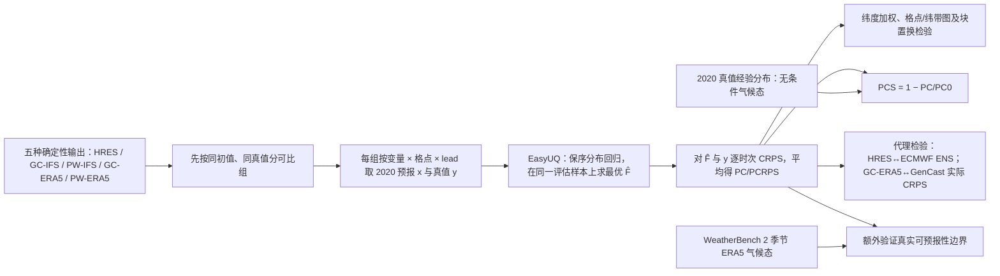

# 85｜Potential CRPS：GraphCast、Pangu 与 HRES 的公平概率信息量比较

> Tilmann Gneiting、Tobias Biegert、Kristof Kraus、Eva-Maria Walz、Alexander I. Jordan、Sebastian Lerch，*Probabilistic Measures Afford Fair Comparisons of AIWP and NWP Model Output*。2025-06-04 [arXiv:2506.03744v1](https://arxiv.org/abs/2506.03744) 首发，[预印本全文](https://arxiv.org/html/2506.03744v1)；2026-01-12 在线发表于 *Artificial Intelligence for the Earth Systems* **5(1):e250054**，[正式期刊正文/DOI 10.1175/AIES-D-25-0054.1](https://journals.ametsoc.org/view/journals/aies/5/1/AIES-D-25-0054.1.xml)；[作者复现代码](https://github.com/tobiasbiegert/potential-crps)。2026-09-25 复核：正式期刊**可检索正文及图 1–9 的图注**，但出版社对直接下载返回 403，未取得完整排版 PDF/逐图像素和表格图片。以下以正式版图号、正文明确数值与新加的 GenCast 对照为准；合成表 1–2 的逐格数字仍明确据 arXiv v1，不臆称正式表格图片已逐项比对。预印本称 `PC/PCS`，正式版改称 `PCRPS/PCRPS-S`，是同一潜在评分方法的不同版本术语。

## 问题、贡献与最重要的解释边界

用 RMSE 比较神经网络和数值天气预报有先验不对称性：AI 可直接优化同类损失，而数值积分系统的目标并非特定 RMSE；把 AI 与未经后处理的 NWP 单值直接比，也未体现实际数值预报的概率后处理。作者提出对各家**同样地、事后**以 EasyUQ/保序分布回归将单值预报转成概率 CDF，取该 CDF 的测试样本内平均 CRPS 为潜在评分 `PC`（正式版 `PCRPS`）。数值越小，说明原始单值输出中可在保序约束下提取的概率预测信息越多；它不惩罚可单调修正的系统性振幅偏差，也不等于业务产品的实时技巧。[预印本引言/§2](https://arxiv.org/html/2506.03744v1)

在 WeatherBench 2 的 2020 年 1/3/5/7/10 天比较，统一 IFS 分析真值和 IFS 初值的 GraphCast operational 对三变量全时效的潜在评分都优于 Pangu operational 与 HRES；Pangu 对 MSLP、WS10 通常比 HRES 好，但 T2M 不如 HRES。若混用 ERA5 初值版本与 IFS 初值版本，尤其 T2M 结论会受真值/初值选择影响。正式版新增 **GraphCast-ERA5 潜在评分与真实 GenCast 集合 CRPS** 对照；这验证代理分数与已存在的集合系统接近，**不等于 GraphCast 的所有概率实现都与 GenCast 等价**。T2M/WS10 对季节性气候态约 **7–10 天**已近可预报性边界；文章没有 11–15 天评测。[正式版 §3–4、图 4–9](https://journals.ametsoc.org/view/journals/aies/5/1/AIES-D-25-0054.1.xml)

## 资料与预处理：先把“同一个真值”讲清楚

| 组件 | 实际协议 | 对结论的影响 |
| --- | --- | --- |
| WeatherBench 1 回顾 | 2017–2018，**5.625°**、850hPa 温度、**3 天**；HRES/T63/T42、CNN、线性回归、持续性，按格点求 PCRPS 再按纬带展示 | 正式图 2 说明旧代 AI 在该基准明显落后于物理模式；不是 2020 GraphCast 的训练消融。 |
| WeatherBench 2 主试验 | **2020 全年，366×2=732** 次 `00/12 UTC` 起报，全球 **1.5°、240×121=29,040 格**；lead **1/3/5/7/10 天** | 每个变量×格点×lead 对 732 个时次分别拟合/打分；与后续 [#84](84-weighted-pcrps-extremes.md) 为保证四变量齐全而用 351×2=702 次的口径不同。 |
| 单变量 | 海平面气压 MSLP（Pa）、2m 温度 T2M（K）、10m 风速 WS10（m/s） | **无降水、无空间场联合评分**；三种物理量的 PC 有不同单位，跨变量不可直接比较分值。 |
| 同初值主比较 | HRES、GC-IFS、PW-IFS，共用业务 IFS 分析为初值与核验真值 | 正式图 4 尽量隔离初值来源差异；这是最可靠的三方相对比较。 |
| 真值/初值敏感性 | 另外比较 GC-ERA5、PW-ERA5 与 HRES，在 ERA5 和 IFS analysis 两种统一真值下各自评分；纬度加权汇总 | 正式图 5–7 显示 T2M 的 HRES 排名会因分析真值/初值而变，不能简单合并版别或把两种真值的 PCRPS-S 当绝对同一尺。 |
| 基线 | 样本内**无条件**经验气候态；另以 WeatherBench 2 **季节变化 ERA5 气候态**检验（无对应 IFS 气候态数据） | 无条件基线过弱，会把季节差异误当可预报信号；正式图 5 和图 8 的季节基线更关键。 |
| 真实集合代理检验 | IFS 初值 HRES 的 PCRPS 对 ECMWF ENS CRPS；ERA5 初值 GC-ERA5 的 PCRPS 对 ERA5 初值 GenCast CRPS，均用 2020 年、1.5° 和同类分析真值 | 正式图 **1、9** 对照实际集合；GenCast 在此是**外部集合产品**，不是本文新训练的 GraphCast 微调模型。 |

ERA5 分析的同化窗可伸到实际起报时刻以后，不是实时可用产品；这可能让 ERA5 初始化版本在 ERA5 真值下占便宜。IFS 分析和 ERA5 均为模式—观测融合产物，并非无误差独立观测。正式版图 3 还增列 **WeatherBench 2 的 2020 年 3 天 850hPa 温度**与 WeatherBench 1 图 2 对照：这是混合初值的历史进步示意，不能用来替代图 4 严格同初值的地表变量比较。[正式版 §3a–b、图 2–4](https://journals.ametsoc.org/view/journals/aies/5/1/AIES-D-25-0054.1.xml)

## 模型结构、后处理拟合与参数

*依据正式版 §2–3 自行重绘的评估架构，非复制论文图；图中 `PC/PCS` 沿用预印本简称，正式版为 `PCRPS/PCRPS-S`。作者没有训练一个新天气预报网络；因此本研究的“训练流程”指统计评分拟合，原 GraphCast/Pangu/HRES/GenCast 的神经网络优化器、批量大小、学习率、冻结层数或新微调均**不适用／本文未报告**。*

EasyUQ 以单值 `x_i` 为输入，寻找 `F̂_i` 使同组平均 `CRPS(F̂_i,y_i)` 最小，同时要求 `x_i≤x_j` 时所有分位数 `qα(F̂_i)≤qα(F̂_j)`。求解有解析形式，可用 PAV 类保序算法，论文给约 **O(n log n)** 的拟合成本；计算最终 PCRPS 最坏还要 **O(n²)**。每个格点、变量、lead 单独算，模型间**统一算法与约束**，没有神经网络学习率/epoch/超参搜索。原文给出 `CRPS(F,y)=∫(F(z)−1{y≤z})²dz`，`PCRPS=(1/n)Σ CRPS(F̂_i,y_i)`；基线 `PCRPS0=(1/(2n²))Σ_iΣ_j |y_i−y_j|`，`PCRPS-S=1−PCRPS/PCRPS0`。样本内保序最优导致 `PCRPS≤PCRPS0`、`PCRPS-S∈[0,1]`；它在严格单调变换 `x→g(x)` 后不变，在完美非降关系下 `PCRPS=0`。但正式图 8 对**季节气候态**的技巧是另一个分母，**允许负值**；不能用样本内无条件 `PCRPS-S≥0` 掩盖真实季节基线负技巧。[正式版 §2a–b、§3b、图 8 注释](https://journals.ametsoc.org/view/journals/aies/5/1/AIES-D-25-0054.1.xml)

**样本内拟合的关键限制**：2020 核验真值既被用于求 `F̂`，又进入 CRPS；作者有意构造一个 *potential* 指标，而不是预先用 2019 资料训练 EasyUQ、盲测 2020 的可部署后处理器。把 `PCS≥0` 当成模型对现实业务气候态一定有技巧是错误的。对实际运营，仍需独立历史训练/未来留出检验、概率校准及完整空间—时间一致性。[§2、§4](https://arxiv.org/html/2506.03744v1)

## 性能表、图示与反例

预印本 **表 1** 是 10,000 对合成 Gamma 天气状态的模型评分示例：`W∼U(0,10)`，`Y|W` 服从形状参数 `√W`、尺度参数 `min(max(W,1),6)` 的 Gamma 分布。四个输出分别是状态 `W`、条件均值、条件中位数、条件 0.90 分位数，彼此为严格递增变换；下表逐数抄录 **arXiv v1 表 1**，正式版可检索正文保留相同演示设计，但正式表格图片未逐格取得。[正式版 §2c](https://journals.ametsoc.org/view/journals/aies/5/1/AIES-D-25-0054.1.xml)、[预印本表 1](https://arxiv.org/html/2506.03744v1)

| 合成输出 | RMSE | MAE | 0.90 分位损失 | PC（预印本；越低越好） | ACC | CPA | PCS |
| --- | ---: | ---: | ---: | ---: | ---: | ---: | ---: |
| 天气状态 W | 10.00 | 6.21 | 5.27 | **3.52** | .641 | **.878** | **.324** |
| 条件均值 | **7.58** | 5.09 | 2.58 | **3.52** | .648 | **.878** | **.324** |
| 条件中位数 | 7.75 | **5.00** | 3.08 | **3.52** | .648 | **.878** | **.324** |
| 条件 90% 分位数 | 12.46 | 9.79 | **1.43** | **3.52** | .647 | **.878** | **.324** |

平方误差选条件均值，绝对误差选中位数，分位损失选对应分位数；但四条输出顺序携带同一信息，PC/PCS 因而完全相同。若把真值改成 `y²`，**arXiv v1 表 2**给四输出的 PC 都为 **118**、PCS 都为 **.212**，而 RMSE 可变成 **442/438/439/432**；PC 会随真值变换改变，但对预报值的严格递增变换不变，不能误记为“双侧变换都不变”。这是合成示例，**不是 GraphCast 实测成绩**。[预印本表 1–2](https://arxiv.org/html/2506.03744v1)

| 正式版图 | 可核验的实测结果 | 必须保留的边界或负证据 |
| --- | --- | --- |
| **图 1：HRES/ECMWF ENS 代理** | 2020 年同 IFS 真值，在 1.5° 格点分别对 MSLP/T2M/WS10 和五个 lead 比较 HRES 的 PCRPS 与业务 ENS 实际 CRPS，散点高度贴近对角线。 | **第 1 天代理略乐观，第 7/10 天偏悲观**；一张相关散点图不是两个系统逐点或极端值技巧相等的证明。 |
| **图 2：WeatherBench 1** | 2017–2018 的 5.625°、850hPa T、3 天，物理 HRES/T63/T42 在 PCRPS/PCRPS-S 下仍强于老式 CNN/LR。 | 不代表 2020 GraphCast/Pangu，也不等于地表变量十天评分。 |
| **图 3：WeatherBench 2 上层温度** | 2020 年 3 天 850hPa T，GC-ERA5、PW-ERA5 对 ERA5 真值在 RMSE、PCRPS、ACC、PCRPS-S、CPA 全部胜 HRES；另列持续性和季节 ERA5 气候态。 | HRES 用 IFS 初值、两 AI 用 ERA5 初值；这幅跨代展示**不是**严格同初值因果比较。 |
| **图 4：IFS 同口径地表变量** | 三变量五个 lead，**GC-IFS 的 PCRPS 全部最低**；PW-IFS 对 MSLP、WS10 通常胜 HRES。T2M 的 1 天 PCRPS 约 **0.20 K**，第十天小于 **1 K**。 | 对 T2M，**HRES 优于 PW-IFS**；不能写成 Pangu 全变量领先。 |
| **图 5：混合初值/两套真值** | 固定 ERA5 或 IFS 分析作共同真值后，分别对 HRES、GC-ERA5、PW-ERA5 算纬度加权 PCRPS；MSLP/WS10 顺序较稳，T2M 相对 HRES 的名次依真值而变。上排另列季节 ERA5 气候态，下排因资料不含 IFS 季节气候态只能列无条件基线。 | 不能跨不同真值的数值直接比大小；无条件气候态并非可靠的实际季节基准。 |
| **图 6：格点显著性** | 比较图 5 的差异，每格点对 12h 连续评分差做长度 `2k` 的随机符号**块置换 1000 次**，`k` 为 lead 天数；MSLP/WS10 支持 GC>PW>HRES。 | T2M 很多格点没有显著赢家；论文的一侧 p 值和逐格点多重检验风险不能忽略。 |
| **图 7：同模型初值切换** | 同一模型比较 ERA5 与 IFS 初值版：ERA5 真值通常有利于 ERA5 初值；IFS 真值的短 lead T2M 多有利 IFS 初值，但 GC 第 10 天、PW 第 5 天可逆转。正式正文跨 30 组的**最大**同模型不同初值/对应真值 PCRPS-S 差是 **PW 的第 1 天 WS10：IFS .768 对 ERA5 .784**；其余 29 组差 **≤.010**。 | 旧笔记误写“PW 第一天 T2M .843/.865、余 ≤.018”，不符合正式版；数值接近也不消除初值与真值混杂。 |
| **图 8：季节气候态基线** | GC-ERA5 的地表变量 PCRPS 对 WeatherBench 2 **季节性 ERA5 气候态**，MSLP 在部分地区尤其热带第十天后可能仍有技巧。 | T2M、WS10 多在 **7–10 天**触及可预报界限；与样本内无条件 `PCRPS-S` 不同，本图季节基准下可有**负技巧**。 |
| **图 9：GC-ERA5/GenCast 代理** | 正式版新增：2020、1.5°、ERA5 真值下，GC-ERA5 的 PCRPS 与 ERA5 初值 **GenCast 集合真实 CRPS**散点在三变量/五 lead 比图 1 更贴近对角线、相关更高。 | 同样第 1 天略乐观、第 7/10 天偏悲观；GraphCast 和 GenCast 不是同一模型的“微调前后”，仅凭代理相关**不能**断言 GenCast 或 GC 在所有天气现象全面优于 IFS ENS。 |

正式图 5 的比较不是“所有 AI 使用不同真值各自打分”，而是在同一行固定一种统一真值，再做跨模型比较；图 4 则进一步固定共同业务分析初值。附录算法把按时间排序的 732 个成对逐起报评分差分成长度 `2k` 的块，对每块随机翻转符号，并轮换块边界偏移，给 1000 次置换的一侧 p 值；这是为相邻滚动预报的相关性设保护，而非把 732 次起报视作彼此独立。[正式版 §3b、附录 Algorithm 1](https://journals.ametsoc.org/view/journals/aies/5/1/AIES-D-25-0054.1.xml)

## 与 #84 极端加权扩展的关系及复现建议

本文评估**一般**预报的单变量潜在 CRPS；[#84 Biegert 等](84-weighted-pcrps-extremes.md)把同一 EasyUQ 输出放进上/下尾阈值加权 CRPS，并新加入 FuXi、降水、历月及全年纪录问题，所以是**独立论文与新实验**，非本篇的另一个版本。两篇均必须区别样本内潜在信息与业务部署表现，且数据窗口不同：本篇 WB2 全年 732 次，#84 为可用组合截到 12 月 16 日 702 次。[#84 原文](https://arxiv.org/html/2606.21170v1)

复现时应固定每个模型的 checkpoint/初值版别、ERA5 或 IFS 真值、1.5° 插值及纬度权重；按格点×变量×lead 独立运行 EasyUQ/PC，再以独立季节气候态与真实 ENS CRPS 作外部对照。若目标是“哪个模型可实际上线”，还需在过去年份拟合、未来年份评分，并检验降水、极端、空间连贯性和多变量物理一致性——这些都不是本文已完成的实验。[§4](https://arxiv.org/html/2506.03744v1)

## 核验来源与未取得材料

- [AMS 正式期刊正文/DOI](https://journals.ametsoc.org/view/journals/aies/5/1/AIES-D-25-0054.1.xml)：核对发表日期、§2–4 可检索正文、图 **1–9** 图注和附录块置换算法；出版社直连返回 403，未取得排版 PDF、逐图原像素和表格图片，故没有按图读取未印出的数值。
- [arXiv v1 全文](https://arxiv.org/html/2506.03744v1)：作为版本历史、合成表 1–2 的数字核对源；旧图 1–7 **不能**冒充正式版图 1–9，正式版新增的 WB2 T850 和 GenCast 对照须看正式正文。本笔记的 Mermaid 为原创重绘，不转发论文图片。
- [作者代码](https://github.com/tobiasbiegert/potential-crps)：供实际复现；本次没有运行作者脚本，因此没有声称独立重复出图中分数。
