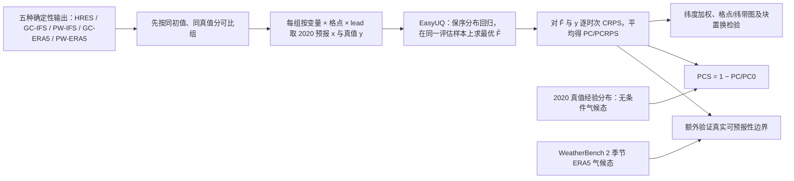

# 85｜Potential CRPS：GraphCast、Pangu 与 HRES 的公平概率信息量比较

> Tilmann Gneiting、Tobias Biegert、Kristof Kraus、Eva-Maria Walz、Alexander I. Jordan、Sebastian Lerch，*Probabilistic Measures Afford Fair Comparisons of AIWP and NWP Model Output*。2025-06-04 [arXiv:2506.03744v1](https://arxiv.org/abs/2506.03744) 首发，[开放全文](https://arxiv.org/html/2506.03744v1)；2026-01-12 在线发表于 *Artificial Intelligence for the Earth Systems* **5(1):e250054**，[正式期刊页/DOI 10.1175/AIES-D-25-0054.1](https://doi.org/10.1175/AIES-D-25-0054.1)；[作者复现代码](https://github.com/tobiasbiegert/potential-crps)。阅读日期：2026-09-24。**正文/表 1–2/图 1–7 的详细数字按可访问的 arXiv v1 核对；正式期刊页面可核对书目、摘要及部分图文，但全文访问受限，不能声称两版图表逐项一致。**预印本简称 `PC/PCS`，正式期刊及后续论文常写 `PCRPS/PCRPS-S`；本笔记保留各版术语对应关系。

## 问题、贡献与最重要的解释边界

用 RMSE 比较神经网络和数值天气预报有先验不对称性：AI 可直接优化同类损失，而数值积分系统的目标并非特定 RMSE；把 AI 与未经后处理的 NWP 单值直接比，也未体现实际数值预报的概率后处理。作者提出对各家**同样地、事后**以 EasyUQ/保序分布回归将单值预报转成概率 CDF，取该 CDF 的测试样本内平均 CRPS 为潜在评分 `PC`（正式版 `PCRPS`）。数值越小，说明原始单值输出中可在保序约束下提取的概率预测信息越多；它不惩罚可单调修正的系统性振幅偏差，也不等于业务产品的实时技巧。[预印本引言/§2](https://arxiv.org/html/2506.03744v1)

在 WeatherBench 2 的 2020 年 1/3/5/7/10 天比较，统一 IFS 分析真值和 IFS 初值的 GraphCast operational 对三变量全时效的潜在评分都优于 Pangu operational 与 HRES；Pangu 对 MSLP、WS10 通常比 HRES 好，但 T2M 不如 HRES。若混用 ERA5 初值版本与 IFS 初值版本，尤其 T2M 结论会受真值/初值选择影响。**第十天 T2M/WS10 对季节性气候态已近可预报性边界**；文章没有 11–15 天评测。[§3.2、图 2–6](https://arxiv.org/html/2506.03744v1)

## 资料与预处理：先把“同一个真值”讲清楚

| 组件 | 实际协议 | 对结论的影响 |
| --- | --- | --- |
| WeatherBench 1 回顾 | 2017–2018，850hPa 温度，**3 天**；HRES/T63/T42、CNN、线性回归、持续性，按格点求 PC 再按纬带展示 | 图 1 说明旧代 AI 在该基准明显落后于物理模式；不是 2020 GraphCast 的训练消融。 |
| WeatherBench 2 主试验 | **2020 全年，366×2=732** 次 `00/12 UTC` 起报，全球 **1.5°、240×121=29,040 格**；lead **1/3/5/7/10 天** | 每个变量×格点×lead 对 732 个时次分别拟合/打分；与后续 [#84](84-weighted-pcrps-extremes.md) 为保证四变量齐全而用 351×2=702 次的口径不同。 |
| 单变量 | 海平面气压 MSLP（Pa）、2m 温度 T2M（K）、10m 风速 WS10（m/s） | **无降水、无空间场联合评分**；三种物理量的 PC 有不同单位，跨变量不可直接比较分值。 |
| 同初值主比较 | HRES、GC-IFS、PW-IFS，共用业务 IFS 分析为初值与核验真值 | 图 2 尽量隔离初值来源差异；这是最可靠的三方相对比较。 |
| 真值/初值敏感性 | 另外比较 GC-ERA5、PW-ERA5 与 HRES，在 ERA5 和 IFS analysis 两种统一真值下各自评分；纬度加权汇总 | 图 3–5 显示 T2M 的 HRES 排名会因分析真值/初值而变，不能简单合并版别或把两种真值的 PCS 当绝对同一尺。 |
| 基线 | 样本内**无条件**经验气候态；另以 WeatherBench 2 **季节变化 ERA5 气候态**检验（无对应 IFS 气候态数据） | 无条件基线过弱，会把季节差异误当可预报信号；图 6 的季节基线更关键。 |

ERA5 分析的同化窗可伸到实际起报时刻以后，不是实时可用产品；这可能让 ERA5 初始化版本在 ERA5 真值下占便宜。IFS 分析和 ERA5 均为模式—观测融合产物，并非无误差独立观测。[§3.2、图 3–5](https://arxiv.org/html/2506.03744v1)

## 模型结构、后处理拟合与参数

*依据 §2–3 自行重绘的评估架构，非复制论文图。作者没有训练一个新天气预报网络；因此本研究的“训练流程”指统计评分拟合，原 GraphCast/Pangu/HRES 的神经网络优化器、批量大小、学习率、冻结层数或新微调均**不适用／本文未报告**。*

EasyUQ 以单值 `x_i` 为输入，寻找 `F̂_i` 使同组平均 `CRPS(F̂_i,y_i)` 最小，同时要求 `x_i≤x_j` 时所有分位数 `qα(F̂_i)≤qα(F̂_j)`。求解有解析形式，可用 PAV 类保序算法，论文给约 **O(n log n)** 的拟合成本；计算最终 PC 最坏还要 **O(n²)**。每个格点、变量、lead 单独算，模型间**统一算法与约束**，没有神经网络学习率/epoch/超参搜索。原文给出 `CRPS(F,y)=∫(F(z)−1{y≤z})²dz`，`PC=(1/n)Σ CRPS(F̂_i,y_i)`；基线 `PC0=(1/(2n²))Σ_iΣ_j |y_i−y_j|`，`PCS=1−PC/PC0`。样本内保序最优导致 `PC≤PC0`、`PCS∈[0,1]`；它在严格单调变换 `x→g(x)` 后不变，在完美非降关系下 `PC=0`。[§2.1–2.2](https://arxiv.org/html/2506.03744v1)

**样本内拟合的关键限制**：2020 核验真值既被用于求 `F̂`，又进入 CRPS；作者有意构造一个 *potential* 指标，而不是预先用 2019 资料训练 EasyUQ、盲测 2020 的可部署后处理器。把 `PCS≥0` 当成模型对现实业务气候态一定有技巧是错误的。对实际运营，仍需独立历史训练/未来留出检验、概率校准及完整空间—时间一致性。[§2、§4](https://arxiv.org/html/2506.03744v1)

## 性能表、图示与反例

原文 **表 1** 是 10,000 对合成 Gamma 天气状态的模型评分示例：四个输出分别是状态 `W`、条件均值、条件中位数、条件 0.90 分位数，彼此为严格递增变换；下表完整抄录该表，说明“公平”在此具体指什么。[§2.3、表 1](https://arxiv.org/html/2506.03744v1)

| 合成输出 | RMSE | MAE | 0.90 分位损失 | PC（越低越好） | ACC | CPA | PCS |
| --- | ---: | ---: | ---: | ---: | ---: | ---: | ---: |
| 天气状态 W | 10.00 | 6.21 | 5.27 | **3.52** | .641 | **.878** | **.324** |
| 条件均值 | **7.58** | 5.09 | 2.58 | **3.52** | .648 | **.878** | **.324** |
| 条件中位数 | 7.75 | **5.00** | 3.08 | **3.52** | .648 | **.878** | **.324** |
| 条件 90% 分位数 | 12.46 | 9.79 | **1.43** | **3.52** | .647 | **.878** | **.324** |

平方误差选条件均值，绝对误差选中位数，分位损失选对应分位数；但四条输出顺序携带同一信息，PC/PCS 因而完全相同。若把真值改成 `y²`，原文**表 2**给四输出的 PC 都为 **118**、PCS 都为 **.212**，而 RMSE 可变成 **442/438/439/432**；PC 会随真值变换改变，但对预报值的严格递增变换不变，不能误记为“双侧变换都不变”。这是合成示例，**不是 GraphCast 实测成绩**。[表 1–2](https://arxiv.org/html/2506.03744v1)

| 原文图 | 可核验的实测结果 | 必须保留的边界或负证据 |
| --- | --- | --- |
| 图 1（WeatherBench 1） | 2017–2018 850hPa T、3 天，物理 HRES/T63/T42 在 PC/PCS 下仍显著强于老式 CNN/LR。 | 不代表 2020 GraphCast/Pangu，也不等于 10 天评分。 |
| 图 2（IFS 同口径） | 三变量五个 lead，**GC-IFS 的 PC 全部最低**；PW-IFS 对 MSLP、WS10 通常胜 HRES。T2M 的 1 天 PC 约 **0.20 K**，第十天小于 **1 K**。 | 对 T2M，**HRES 优于 PW-IFS**；不能写成 Pangu 全变量领先。 |
| 图 3–5（真值/初值） | MSLP、WS10 的总体排名对 ERA5/IFS 真值较稳；同一模型在 ERA5 真值下常是 ERA5 初值版本更优。 | T2M 涉及 HRES 的名次取决于真值/lead，很多格点差异不显著。最大同模型不同初值/对应真值 PCS 差是 PW 第 1 天 T2M **.843 对 .865**，余 29 组差均 ≤.018；这不消除初值混杂。 |
| 图 4（显著性） | 每格点对 12h 连续评分差用长 `2k` 的块置换，`k` 为 lead 天数、随机块 **1,000** 次；MSLP/WS10 更支持 GC>PW>HRES。 | T2M 很多格点没有显著赢家；逐格点的相关性和多重检验仍应考虑。 |
| 图 6（较强基线） | GC-ERA5 相对**季节性 ERA5 气候态**：MSLP 许多地区第十天仍有技巧。 | T2M、WS10 的多数格点可预报性界限约 **7–10 天**；无条件 PCS 的非负保证不能覆盖这个负证据。 |
| 图 7（真实集合校验） | HRES 的 PC 与业务 ECMWF ENS 的真实平均 CRPS 在三变量、五个 lead 的格点散点上高度相关且大致接近对角线。 | **第 1 天 PC 略乐观；第 7/10 天偏悲观**，并非逐点等价；不能凭该相关性断言 GraphCast 的真实概率产品超越 IFS ENS。 |

图 3 的比较不是“所有 AI 使用不同真值各自打分”，而是在一幅图内固定一种统一真值，再做跨模型比较；图 2 则进一步固定共同业务分析初值。统计显著性块长随 lead 变化，是为了顾及相邻滚动预报的相关性，而不是随机把 732 次起报视作独立样本。[§3.2](https://arxiv.org/html/2506.03744v1)

## 与 #84 极端加权扩展的关系及复现建议

本文评估**一般**预报的单变量潜在 CRPS；[#84 Biegert 等](84-weighted-pcrps-extremes.md)把同一 EasyUQ 输出放进上/下尾阈值加权 CRPS，并新加入 FuXi、降水、历月及全年纪录问题，所以是**独立论文与新实验**，非本篇的另一个版本。两篇均必须区别样本内潜在信息与业务部署表现，且数据窗口不同：本篇 WB2 全年 732 次，#84 为可用组合截到 12 月 16 日 702 次。[#84 原文](https://arxiv.org/html/2606.21170v1)

复现时应固定每个模型的 checkpoint/初值版别、ERA5 或 IFS 真值、1.5° 插值及纬度权重；按格点×变量×lead 独立运行 EasyUQ/PC，再以独立季节气候态与真实 ENS CRPS 作外部对照。若目标是“哪个模型可实际上线”，还需在过去年份拟合、未来年份评分，并检验降水、极端、空间连贯性和多变量物理一致性——这些都不是本文已完成的实验。[§4](https://arxiv.org/html/2506.03744v1)

## 核验来源与未取得材料

- [arXiv v1 全文](https://arxiv.org/html/2506.03744v1)：§1–4、表 1–2、图 1–7 的正文与图注逐项核对；本笔记的 Mermaid 为原创重绘，不转发论文图片。
- [AMS 正式期刊页/DOI](https://doi.org/10.1175/AIES-D-25-0054.1)：核对正式发表书目与在线日期。该页面的全文目前未能逐页读取；正式版若新增图表、改题内术语或修订数字，应后续再核，不把预印本内容冒称为期刊全文。
- [作者代码](https://github.com/tobiasbiegert/potential-crps)：供实际复现；本次没有运行作者脚本，因此没有声称独立重复出图中分数。
