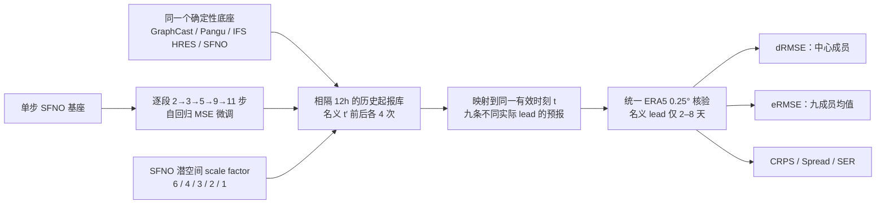

# 87｜滞后集合：AI 天气模型的实用概率基准与 SFNO 多步微调代价

> Noah D. Brenowitz、Yair Cohen、Jaideep Pathak、Ankur Mahesh、Boris Bonev、Thorsten Kurth、Dale R. Durran、Peter Harrington、Michael S. Pritchard，*A Practical Probabilistic Benchmark for AI Weather Models*。2024-01-27 [arXiv:2401.15305v1](https://arxiv.org/abs/2401.15305) 首发，2024-11-12 [v2 全文及附录](https://arxiv.org/html/2401.15305v2)；2025-04-08 发表于 *Geophysical Research Letters* **52(7):e2024GL113656**，[正式开放全文/DOI 10.1029/2024GL113656](https://agupubs.onlinelibrary.wiley.com/doi/full/10.1029/2024GL113656)。[NVIDIA earth2mip 评估代码](https://github.com/NVIDIA/earth2mip)。阅读日期：2026-09-24。**正式正文逐节核对；独立出版社补充 PDF 访问受限，补充公式和表 1 使用 arXiv v2 HTML 附录核对，不声称两种补充文件逐页一致。**同一预印本及正式论文只计一篇。

## 一句话抓住问题，但不能停在一句话

GraphCast 的单值 RMSE 优于 Pangu-Weather 和 IFS HRES，是否意味着其概率天气预报也更好？作者设计**居中滞后集合**（lagged ensemble forecast，LEF）：把同一确定性模型在相邻起报时刻的历史预报，截到共同有效时刻，当作九个成员。这样 GraphCast、Pangu、IFS HRES、SFNO 共享一套集合形成方式，可以比较各模型的底座，而不把扩散采样、初值扰动或后处理差异混入主效应。[正式论文 §1–2](https://agupubs.onlinelibrary.wiley.com/doi/full/10.1029/2024GL113656)

论文的最关键反差是：GraphCast 的确定性 RMSE 优势，在 LEF 的集合均值 RMSE 和 CRPS 中几乎消失；Pangu 的 Z500 CRPS 在不少时效还略低。作者随后真正在 SFNO 上做自回归多步微调消融：单值 RMSE 随训练滚动步数明显下降，集合离散度却塌缩，概率评分改善远小。**这不是证明 GraphCast 的业务集合或 Pangu 的原生集合谁优；LEF 是离线基准，本身不是实时可运行的集合。**[正式论文 §3.1–3.3](https://agupubs.onlinelibrary.wiley.com/doi/full/10.1029/2024GL113656)

## 研究设计和模型结构

设 `x(t,t′)` 表示从 `t′` 起报、在共同验证时刻 `t` 的确定性预报。以名义起报 `t′` 为中心、间隔 `h=12h`，对 `m=-4,...,4` 构造 `x_m(t,t′)=x(t,t′−mh)`，成员数 `R=2M+1=9`。因此最早和最晚真实起报分别相对名义起报前后 **48h**；不同成员在同一有效时刻具有不同实际 lead。若名义 lead 为 5 天，这九条预报实际约来自 3–7 天 lead，故含较短 lead 的有利成员，LEF CRPS 往往比真正同刻初值的 IFS ENS 乐观。最晚起报发生在名义时刻之后，这在实时情境里尚未存在；**不能把它解释为可上线的九成员 10 天集合**。原确定性预报最长 10 天，但完整居中 LEF 的共同名义 lead 只在**第 2–8 天**可评。[正式论文 §2、图 1](https://agupubs.onlinelibrary.wiley.com/doi/full/10.1029/2024GL113656)

*根据正文 §2–3 自行重绘，非转载原图。上图的 SFNO 微调实验和 scale-factor 消融为两类对照，不表示每个 scale factor 都依次接受相同五段微调；这一交叉训练矩阵原文没有完整给出。*

IFS HRES 是数值预报基线；GraphCast、Pangu-Weather、SFNO 是 AI 底座。LEF **不训练**这些基线，也不改变原 checkpoint；本文新训练与微调的是 SFNO 消融序列。作者提供 earth2mip 的分布式滞后集合评分例程，可读磁盘档案或在线推理。Pangu 的公开模型以 3h、6h 和 24h 时间步组合，其中 36h 可由一次 24h 加两次 6h 组成；每个滞后成员都按同一时步策略做确定性积分。[正式论文 §2–3；arXiv v2 附录 A.3](https://arxiv.org/html/2401.15305v2)

## 数据来源、预处理和可比性

| 环节 | 原文实际设置 | 解释与限制 |
| --- | --- | --- |
| 真值与训练资料 | **ERA5 0.25°** 再分析；本研究所有 AI 底座使用 ERA5 作训练资料，ERA5 同时作为主评估真值。 | 统一真值与网格有助于公平比较，但 ERA5 是含物理模式和观测同化的分析，不是独立观测。 |
| 回报起报 | **2018-01-02 00Z 至 2018-10-29 12Z，每 12h** 一次；各确定性轨迹最长 10 天。 | 2018 年在所比 AI 模型训练集以外；样本仅约十个月，不能自动外推到所有年份、极端事件及完整季节。 |
| 共同变量与空间汇总 | 主图比较 **Z500**（500 hPa 位势高度）、**T850**（850 hPa 温度）；附图亦含 10m zonal wind 等通道。全球格点按 `cos(latitude)` 面积加权，再汇总时次。 | 不能把两变量的结论写成降水、台风或全部 15 天技巧。 |
| 业务参考 | IFS HRES 的确定性归档组成 IFS LEF；另取 ECMWF **真正运营 ENS** 核查代理基准相关性。 | HRES 与 ENS 分辨率和配置不完全相同；ENS **不是**所有 AI 模型的同构对手。 |
| 统一但未完全消除的差异 | 不同 AI 底座与 IFS 初值分析体系、原训练损失、有效空间分辨率不同。本文保留原模型的预处理与时步策略，再统一验证。 | 初值质量、低于地面的压力层外推值和将更高分辨率结果直接对 ERA5 0.25° 评分的影响没有被彻底剥离；作者明确承认这些限制。 |

可在复现中把各家统一重网格到最粗共同分辨率，并在低于地面的压力层做一致掩码；原论文指出这是更严格的选择，但**本文没有按这一理想协议完全重算**。不要把“使用同一 ERA5 真值”扩大为“完全同初值、同分辨率”。[正式论文 §2；arXiv v2 附录 A.2–A.4](https://agupubs.onlinelibrary.wiley.com/doi/full/10.1029/2024GL113656)

## 训练、微调和参数：哪一步是真正新训练

SFNO 用球面频谱神经算子在球面场上学习逐 **6h** 状态变换；内部 scale factor 控制输入被下采样到多粗的潜表示，值越大有效空间分辨率越低。arXiv 附表将所引用的通用 FCN-SFNO 记为约 **829M 参数**、0.25°、MSE；这是**模型家族对照表**，本文没有明说每个 scale-factor/微调检查点都恰为同一参数量，不能把 829M 冒称所有消融模型的逐个参数统计。[arXiv v2 附录 A.3、表 1](https://arxiv.org/html/2401.15305v2)

| 阶段 | 训练输入、目标与滚动 | 已公开优化日程 | 未公开或不可误推 |
| --- | --- | --- | --- |
| 单步基座 | ERA5 分析场输入，预测下一 **6h**；单步 MSE；一个 6h rollout 上下文。 | **80 epoch**。 | 正文未列明确训练年份分割、变量归一化、batch、初始 LR、优化器细项、硬件时间，也未在本文给每变量损失权重。 |
| 两步微调 | 从同一已训练基座继续；第一遍输出回送作为第二遍输入，**6h 与 12h 两个误差累计**后优化。 | 较小学习率，**20 epoch**。 | “较小”未给绝对 LR、缩小倍率或冻结层；不能代填。 |
| 后续逐段微调 | 顺序把损失内自回归展开改为 **3、5、9、11 步**，约覆盖 18h、30h、54h、66h 的未来状态；作者在正文把最后 11 步称为达到约 **3 天**的训练上下文。 | 每次增量 **6 epoch**；11 步权重此前以 “FourCastNet v2-small” 对外发布。 | 正文同时把 11 次 6h 步长概称 3 天，严格乘法是 66h；此处按论文阶段命名，不擅自补齐 72h 第十二步。各阶段具体 LR、batch、是否冻结模块未披露。 |
| 有效分辨率消融 | 另外训练 scale factor **6/4/3/2/1** 的 SFNO；第一层下采样比例越低，潜空间越细。 | 每个模型使用 **64×NVIDIA A100**；五种顺序训练耗时 **6.9/7.1/7.1/8/89 小时**。 | 不能仅由训练时间推断 FLOPs、参数量或各模型相同 checkpoint 微调阶段；原文未给完整超参数矩阵。 |

这里的“微调”确指更新 SFNO 权重，不是测试时概率校准：第 2 步使用基座预测值作为自回归输入并将两个 lead 的 MSE 累加反传；再把较长展开长度纳入后续阶段。没有证据显示 GraphCast 或 Pangu **在本文被重新微调**。多步训练为何可能减少离散度？在 MSE 下，远期最优单值倾向条件均值，变得平滑；这是作者提出并通过 SFNO 消融支持的机制，但不是从所有模型上得到的严格因果证明。[正式论文 §3.3–3.4](https://agupubs.onlinelibrary.wiley.com/doi/full/10.1029/2024GL113656)

## 指标、公式与“小集合”陷阱

把九成员均值写为 `x̄`、ERA5 真值为 `y`。`dRMSE` 是居中 `m=0` 单成员与 `y` 的均方根误差；`eRMSE` 是 `x̄` 的均方根误差；`Spread` 是以 `R−1` 分母的成员样本标准差。评分先对空间按纬度面积加权、并在回报时次平均。CRPS 同时衡量可靠性/误差与集合散度，越低越好；SER 用 `sqrt((R+1)/R)×Spread/eRMSE` 作小成员数修正。[arXiv v2 附录 A.4](https://arxiv.org/html/2401.15305v2)

| 量 | 本文实现中值得核对的数学口径 | 容易犯的错 |
| --- | --- | --- |
| 图 2 公平/无偏 CRPS | 成员到真值距离均值，减去成对成员距离项；后者分母为 **`2R(R−1)`**。 | 若改用经验 CDF 常见分母 `2R²`，对小集合会有不同偏差。 |
| 图 3 SFNO 消融 CRPS | 作者图注明确改用常见**有偏**公式，成员两两距离项分母 **`2R²`**。 | 图 2 与图 3 数字或细小差异**不能**当成同口径直接比较。 |
| eRMSE | 使用通常的九成员均值 RMSE；作者指出有限集合下偏向离散度不足的模型。 | 集合均值越平滑并不证明成员物理真实性、概率可靠性同时提升。 |
| Spread 与 SER | Spread 用 `R−1`；SER 小样本修正为 `sqrt(10/9)`。 | 经典 1:1 spread–error 关系要求成员与真值可交换，滞后成员因起报时间不同**不满足**；不能机械宣布 `SER<1` 即正式业务集合“不校准”。 |

作者为简化、保持无可调后处理参数，给九成员**等权**；短 lead 实际可给较近起报更高权重，但那会引入另一套拟合问题。`M=4` 选择带一定任意性；附图 A1/A2 说明主要相对结论对 `M=1` 到 `4` 有一定稳健性，不意味着集合大小完全无关。[正式论文 §2；arXiv v2 附录 A.4–A.6](https://arxiv.org/html/2401.15305v2)

## 图表逐项解读：真实证据与不能擅造的数字

原文主结果以**曲线和散点**呈现，未给全部日 lead 的完整机器可读数值表。下表摘录可直接核验的定性方向与论文明确数值；不从图像反推伪精确分数。[正式论文图 1–4](https://agupubs.onlinelibrary.wiley.com/doi/full/10.1029/2024GL113656)

| 原图 | 看到什么 | 不能据此声称什么 |
| --- | --- | --- |
| 图 1a：LEF 结构 | 不同起报轨迹在共同有效时刻逐渐分离，九成员均值比单条轨迹更平滑。示意 Lorenz-63 真值用 `ρ=28,σ=10,β=8/3`，模型轨迹将 `ρ` 改为 **28.14** 制造模型误差。 | Lorenz 仅解释概念，参数和图像不是全球气象预测模型的物理参数。 |
| 图 1b：IFS LEF 对 IFS ENS | **名义第 5 天** Z500 全球 CRPS 散点有较强正相关，日际好坏随 ENS 同向；LEF 平均分数更好/偏乐观，因为含较短 lead 成员。 | 不能说 LEF 数值已替代真实 ENS，也不能把 LEF 的九成员发布为实时 ENS。 |
| 图 2：GraphCast、Pangu、IFS HRES | Z500 与 T850：GraphCast `dRMSE` 明显好且优势随 lead 增大；`eRMSE`、CRPS 三家近乎打平，Pangu 的 Z500 CRPS 在很多 lead 最低；GraphCast LEF spread 较小。**集合分数有效区间仅第 2–8 天。** | “GraphCast 概率集合领先”与“Pangu 所有变量概率显著领先”都不成立；主图也没第 10–15 天 LEF 分数。 |
| 图 3：SFNO 多步微调 | T850 中展开步数越长，`dRMSE` 明显下降；`eRMSE` 和 CRPS 改善小得多，spread 相对 eRMSE 下滑。图 3 CRPS 为**有偏公式**。 | 不能仅以单值 RMSE 改善宣称概率校准/极端幅度一起改善，也不宜把图 3 数值与图 2 公平 CRPS 直接相减。 |
| 图 4a–d：微调和 spread | 多个场的 SER 随更长自回归微调下降，SFNO 的长步模型相对 IFS LEF 变得更少离散。 | LEF 成员并非可交换；此图支持相对方向，不提供正式 ENS 的绝对校准判定。 |
| 图 4e–h：潜分辨率 | scale factor 从 6 降低、潜空间更精细时，多个场的 spread/SER 增大；作者承认评分没有因此显著提升。 | **不**能直接宣布 scale factor=1 最优：其训练时间从 **6.9h（factor 6）至 89h（factor 1）**，计算代价大，且技能提升尚不显著。 |

图 2 还从两个角度提醒公平性：IFS HRES 以实时 analysis 初始化，ERA5 核验场在起报之后同化更多资料，所以 2 天前的 IFS 误差受分析差异影响；作者因而不把 LEF 第 2 天之前画入主评分。图 1 的代理验证又利用 IFS 自己的 LEF 与 ENS，避免仅凭理论猜测 LEF 是否反映日际概率技巧。[正式论文 §3.1–3.2](https://agupubs.onlinelibrary.wiley.com/doi/full/10.1029/2024GL113656)

## 与其他模型、时间尺度及复现的关系

arXiv 附表 1 汇总旧代 DLWP、FCN-SFNO、GraphCast、Pangu、FuXi、Keisler、FengWu 的架构、参数、损失和自回归训练，但这些**不是本文为七个模型做的新训练实验**。FuXi 的 0–14 天级联和 Pangu 的多时间步交织作为训练策略背景出现，不能因被引用就在本篇结果表里给它们捏造 LEF 排名。本文方法是中期**第 2–8 天概率基准**，与仓库 [#85 的潜在 CRPS](85-potential-crps-fair-weather-comparison.md)不同：#85 对同一测试年度的单值排序做样本内最优分布拟合，衡量“可提取信息”；本篇完全用历史确定性轨迹组成有缺陷但廉价的伪集合，衡量统一集合化后的实际 spread/CRPS。两者都不是对新上线原生生成式集合的直接替代。[arXiv v2 附录 A.3；正式论文 §4](https://arxiv.org/html/2401.15305v2)

若复现，应固定全部模型 checkpoint 和初值分析、ERA5 版本、0.25° 共同核验网格、2018 起报日历、`h=12h/M=4`、可用 lead 2–8 天以及图 2/图 3 的两种 CRPS 分母；先复现 IFS LEF–ENS 第 5 天 Z500 散点，再算各模型 Z500/T850 四指标，最后对 SFNO 逐阶段检查点做同样评分。要回答真实业务问题，还必须与**仅用过去初值**构成的可实时集合、原生生成模型、独立观测极端/降水、时间外年份和不同分辨率公平协议并列检验。这是后续实验建议，不是本文已经完成的结果。

## 来源与未核验项

- [GRL 正式开放正文](https://agupubs.onlinelibrary.wiley.com/doi/full/10.1029/2024GL113656)：作者、在线发布日期、§1–4、图 1–4 的正文与图注、SFNO 的 80/20/6 epoch 训练、64 A100 和五种时长已核对。
- [arXiv v2 HTML 附录](https://arxiv.org/html/2401.15305v2)：A.1–A.6 的 Lorenz 参数、对照模型表、Pangu 时间步、CRPS/SER 公式与集合大小敏感性；出版社独立补充 PDF 本次访问受限，故没有逐页声称二者一致。
- [earth2mip 源码](https://github.com/NVIDIA/earth2mip)：论文所指的开源评分框架。本次只核对论文中的公开链接，**没有运行训练、推理或重新算出图中曲线**；图表解读为原文证据而非本仓库独立复现实测。
